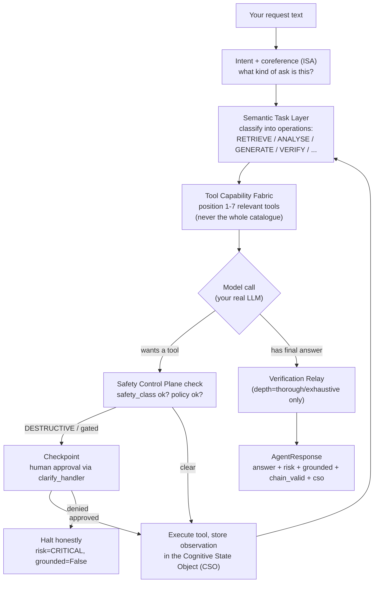

# CRP Cheatsheet — Everything You Need on One Page

**Context Relay Protocol (CRP)** turns any LLM — especially small, local
models — into a governed, tool-using agent. This is the practical reference:
every class, every method, when to reach for it, and copy-pasteable code.
For the "why," see [README.md](README.md) and [site-docs/why-crp.md](site-docs/why-crp.md).
For deep dives, see [`docs/CRPv6_Agent_SDK_Usage_Guide.md`](docs/CRPv6_Agent_SDK_Usage_Guide.md).

> Verified against the running package (not aspirational) — every snippet on
> this page was executed against a real LLM (LM Studio, `meta-llama-3.1-8b-instruct`)
> while writing it.

**Elevator pitch:** you already have code that calls an LLM. CRP sits between
that call and the model. It doesn't touch what the model says — it manages
*everything around* the call: what facts/history the model sees this turn
(so you don't have to manually stuff a growing prompt), which tools it's
allowed to use for this specific step (not your whole tool catalogue every
time), whether a risky action needs a human's sign-off before it runs, and an
honest report — grounded or not, tampered or not, complete or not — for
every single response. Nothing here is "trust me." Every claim on this page
maps to a real class or method you can call and inspect yourself.

---

## 0. The agentic loop, in one picture

When you call `agent.run("...")`, this is what actually happens — no step
is hidden, and you can inspect every one of them on the returned `AgentResponse`:



This is the same loop whether you call it through `crp.Agent` (declarative,
§5) or the lower-level `client.dispatch_positioned()` (§4.4). `crp.Agent` is
`dispatch_positioned()` plus session/provider bookkeeping you'd otherwise
write yourself.

---

## 1. Install

```bash
pip install crprotocol
# Optional extras this cheatsheet uses:
pip install requests beautifulsoup4   # real web search in Template 2
pip install crprotocol[full]          # NLP extraction, ML models, everything
```

No infrastructure, no server, no Docker. `import crp` and you're running.

---

## 2. The three ways to use CRP — pick the shallowest that solves your problem

| You want... | Use | Effort |
|---|---|---|
| Drop-in governance on an existing LLM call | `crp.Client()` / `crp.SDKClient()` | 3 lines |
| Ingest docs + ask grounded questions | `client.ingest()` + `client.ask()` | 5 lines |
| An agent that calls tools, remembers state, streams, and is safe | `crp.Agent()` | ~10 lines |

---

## 3. Level 0 — `crp.Client()`: the raw protocol engine

**Elevator pitch:** the thinnest possible layer over the protocol. `crp.Client`
is literally an alias for `CRPOrchestrator` — the same engine everything else
in this document is built on. Reach for this when you want `dispatch()`/
`ingest()` exactly as the spec defines them, with nothing smoothed over.

```python
import crp

client = crp.Client()   # auto-detects OPENAI_API_KEY / ANTHROPIC_API_KEY / a local LM Studio or Ollama server
output, report = client.dispatch(
    system_prompt="You are a helpful assistant.",
    task_input="Summarise this document: ...",
)
print(output)                    # raw LLM output, unmodified (Axiom 9 — see README's Output Guarantee)
print(report.quality_tier)       # "S" | "A" | "B" | "C" | "D"
```

**When to use:** you already call an LLM directly and just want context
management, extraction, and quality reporting — no tools, no multi-step
reasoning, no proxies, no fluent API.

> ### ⚠️ `crp.Client` vs `crp.SDKClient` — two different classes, not two levels of one class
>
> This trips people up, so it's called out explicitly: **`crp.Client` and
> `crp.SDKClient` are NOT the same class with different feature levels.**
> They are two genuinely separate implementations that happen to sit next to
> each other in the public API:
>
> | | `crp.Client` | `crp.SDKClient` |
> |---|---|---|
> | Real class | `crp.core.orchestrator.CRPOrchestrator` | `crp.sdk.client.CRPClient` |
> | Design | The protocol engine itself (SPEC-001 primitives) | A progressive-disclosure wrapper *around* an orchestrator instance (SPEC-032) |
> | Core methods | `.dispatch(system_prompt=, task_input=)`, `.ingest(raw_text, source_label=)`, `.session` | `.complete()`, `.ask()`, `.stream()`, `.ingest(path)`, `.dispatch_positioned()`, `.conversation()`, `.make_agent()`, 30+ `.<namespace>` proxies (§4.3) |
> | `ingest()` signature | `ingest(raw_text: str, source_label: str \| None)` — text you already have | `ingest(path: str \| list[str])` — reads local file(s)/directory from disk |
> | When to use | You want the literal protocol primitives, or you're building your own wrapper | You want a friendlier, batteries-included client (recommended default for new code) |
>
> If you only remember one thing: **`crp.SDKClient()` is almost always what
> you want for new application code.** `crp.Client()` is the raw engine it's
> built on.

---

## 4. Level 1 — `crp.SDKClient()`: the progressive-disclosure client

**Elevator pitch:** one object, four levels of depth, pay only for what you
use. Start with `.complete()` (Level 0 behaviour, friendlier response object)
and grow into `.ask()` (grounded, source-attributed), `.tool()`/
`.dispatch_positioned()` (tool-mediated), and 30+ `.<namespace>` proxies that
expose literally every subsystem in `crp/` without you having to know its
import path. You never need to "migrate" to a bigger class — the same
`client` object grows with you.

```python
import crp

client = crp.SDKClient()
client.ingest("./docs/")                       # extraction only, no LLM call, ~7ms/doc
answer = client.ask("Write a complete deployment guide", depth="thorough")

print(answer.text)
print(answer.quality)      # S | A | B | C | D
print(answer.sources)      # [{title, doc_id, used_facts}, ...]
print(answer.crp.risk)     # LOW | MEDIUM | HIGH | CRITICAL
```

**When to use:** RAG over your own documents, with quality/risk reporting
built in — no tool-calling agent loop needed. Also the right starting point
if you're not sure yet whether you'll need tools later (§4.4 grows into that
without swapping classes).

### 4.1 Full `CRPClient` method reference

Every public method on `crp.SDKClient()`, grouped by the level it belongs to:

| Method | Level | What it does |
|---|---|---|
| `client.complete(prompt, system=...)` | 0 | Single-turn governed completion → `CRPCompletionResponse` (`.text`, `.crp`, `.finish_reason`, `.usage`) |
| `client.stream(prompt, system=...)` | 0 | Generator of `StreamEvent`s (`token`/`extraction`/`continuation`/`window_complete`/`done`/`error`) — see §5.8 for live-verified output |
| `client.ingest(path)` | 1 | Ingest a file, directory, or list of paths — see §4.2 |
| `client.ask(question, depth=...)` | 1 | Grounded, multi-turn, source-attributed query → `CRPAskResponse` |
| `client.tool(fn)` | 2 | Decorator — register a plain function as a callable tool |
| `client.call_tool(name, *args)` | 2 | Invoke a registered tool directly (bypassing the model) |
| `client.dispatch_positioned(request, ...)` | 2 | Run the full positioned tool-loop directly (what `crp.Agent` is built on) → `PositionedResult` |
| `client.conversation(**defaults)` | 2 | Start a `_Conversation` helper that threads `prior_cso` across `.say()` calls automatically |
| `client.make_agent(tools=, policy=, ...)` | 2→Agent | Return a `crp.Agent` pre-bound to this client's provider/config — the bridge into §5 |
| `client.derive_profile(messages, tools=)` | — | Infer an `ApplicationProfile` from an existing message/tool history (e.g. migrating a LangChain app) |
| `client.configure(**kwargs)` | — | Runtime config overrides (Layer 5 of the 5-layer config hierarchy) |
| `client.session()` | — | Live view of the current session: `id`, `fact_count`, `window_count`, `status` |
| `client.save_config(path)` / `client.config_hash()` | — | Persist/fingerprint the effective unified config |
| `client.reset()` / `client.close()` | — | Reset session state / release resources; also usable as a context manager (`with crp.SDKClient() as client:`) |

### 4.2 Ingestion & storage — file, directory, URL, "anything"

**Elevator pitch:** CRP's extraction pipeline works on *text you hand it* —
it never fetches network resources for you. "Ingest from a URL" means "you
fetch the URL, CRP ingests the text," not "CRP has a built-in web fetcher."
Being upfront about this boundary: there is no `client.ingest("https://...")`
magic today.

```python
# File or directory (client.ingest resolves paths and reads them for you)
client.ingest("./report.pdf.txt")     # single file
client.ingest("./docs/")              # every file in a directory, recursively
client.ingest(["./a.md", "./b.md"])   # explicit list

# URL — fetch it yourself, then hand CRP the text (this is the honest pattern;
# there is no automatic URL fetcher inside client.ingest())
import requests
html_or_text = requests.get("https://example.com/article").text
client.orchestrator.ingest(html_or_text, source_label="https://example.com/article")

# "Anything else" — a database row, an API response, a scraped PDF, log lines —
# the underlying primitive is the same one client.ingest() calls per file:
# ANY string + a label. This is the real ingestion contract:
#   client.orchestrator.ingest(raw_text: str, source_label: str | None = None)
```

Both paths land in the same place — the Contextual Knowledge Fabric (CKF) —
and are available to every subsequent `.ask()`/`.dispatch_positioned()`/
`agent.run()` call in the session, with no LLM call spent on ingestion itself
(~7ms/doc, extraction-only). Inspect what's actually stored:

```python
client.knowledge.location                # where facts came from, by source (property)
client.storage.overview()                # backend summary (in-memory/SQLite/Redis/S3 — SPEC-038)
client.ckf.health()                      # graph health snapshot (fact/edge counts, community info)
```

**If you need real web search inside an agent's tool loop** (not just
one-off ingestion), that's a *tool*, not ingestion — see the research
template's `search_web` tool (§9) for a live example using a real public API.

### 4.3 Namespace proxies — every subsystem, one dot away

**Elevator pitch:** `crp/` has ~25 submodules and hundreds of classes. You
should never need to memorize import paths to reach them. Every proxy below
returns a live, ready-to-use object bound to your client's current
orchestrator — no separate imports, no wiring.

| Proxy | Exposes |
|---|---|
| `client.safety` | Safety Control Plane — registry, tune, checkpoints (SPEC-033/034) |
| `client.ckf` | Contextual Knowledge Fabric — graph walk, pattern query, community detection (SPEC-009/025) |
| `client.cso` | Cognitive State Object accessors (SPEC-030) |
| `client.provenance` | Decision Provenance Engine — fabrication/hallucination/contradiction scoring (SPEC-005) |
| `client.reasoning` | Meta-learning scaffolds, CQS detector, cross-window validator |
| `client.activation` | Activation-mode detection (SPEC-017) |
| `client.agent` | Multi-agent safety budget + cross-agent chain tools (SPEC-012) |
| `client.events` | The protocol event bus (subscribe to any pipeline stage) |
| `client.providers` | LLM provider registration (SPEC-008) |
| `client.extract` | The 6-stage graduated extraction pipeline directly |
| `client.gateway` | CRP Gateway helpers (SPEC-016) |
| `client.headers` | The CRP HTTP header surface (SPEC-002) |
| `client.observability` | Audit, metrics, telemetry |
| `client.policy` | The safety policy engine (SPEC-006) |
| `client.scan` | CRP Scan helpers (SPEC-013/036/039) |
| `client.comply` | CRP Comply helpers (SPEC-040/042/047/048) |
| `client.orchestrator` | The live `CRPOrchestrator` instance directly — every public orchestrator method |
| `client.modules` | Dynamic mirror of the entire `crp` package (`client.modules.envelope.cdr.cdr_rank(...)`) |
| `client.core` / `.continuation` / `.envelope` / `.state` / `.security` / `.resources` / `.advanced` / `.cli` / `.errors` | Direct access to each subsystem family without manual imports |
| `client.storage` / `.knowledge` / `.audit` / `.compliance` | Visibility API (SPEC-038) — see §4.2 |

Use these when a template or your own code needs something the high-level
methods don't surface — e.g. `client.safety.control_plane().get_surface_map()`
to print every active safety control, or `client.audit.verify()` to check
HMAC audit-chain integrity directly (returns `(valid: bool, broken_at_sequence: int)`).

---

## 5. Level 2 — `crp.Agent`: the declarative agent SDK

**Elevator pitch:** this is what most people mean when they say "AI agent" —
something that can look things up, take actions, remember what it did, and
know when to stop and ask a human. `crp.Agent` is CRP's answer to "I don't
want to hand-write a tool-calling while-loop, a retry policy, a safety gate,
and a memory-threading scheme for every agent I build." You declare *what*
(tools, policy, model); the protocol owns *how* (the loop in §0).

This is the core of CRP v6. **Declare tools + policy + model. The loop is
the protocol's** — you never write a tool-calling while-loop yourself.

```python
import crp

def get_weather(city: str) -> dict:
    """Return the current weather for a city."""
    return {"city": city, "temp": 22, "condition": "sunny"}

agent = crp.Agent(model="local/llama3.1", tools=[get_weather])
result = agent.run("What's the weather in Sydney?")

print(result.answer)              # the final natural-language answer
print(result.crp.risk)            # LOW | MEDIUM | HIGH | CRITICAL
print(result.how_it_was_built)    # e.g. "retrieve → transform"
```

### 5.1 Full `Agent(...)` constructor reference

```python
agent = crp.Agent(
    model=None,                # "local/llama3.1" shortcut, or None if provider= is set
    provider=None,             # a real LLMProvider (see §6) — takes precedence over model=
    tools=None,                # list of callables / dicts / CapabilityDescriptor (§5.2)
    policy=None,                # Policy or PolicyContext (§5.4)
    system="You are a helpful agent.",
    profile=None,               # "frontier" | "capable-local" | "small-local" (§5.3)
    depth="auto",                # "quick" | "standard" | "thorough" | "exhaustive" (§5.5)
    max_operations=12,           # hard cap on operations per run (loop guard)
    temperature=0.2,
    max_tokens=1024,
    max_continuation_windows=1,   # >1 lets long-form ops span multiple windows
    safety="balanced",            # safety profile name or override dict
    intent_classifier=None,       # custom IntentClassifier (defaults to ManagedIntentClassifier)
    oversight_required=None,      # set[SafetyClass] gated behind human approval (§5.6) — NEW
    clarify_handler=None,         # resolves oversight/clarification requests (§5.6) — NEW
)
```

### 5.2 Tools — three ways to declare one

**Elevator pitch:** a "tool" is just a Python function the model can ask the
protocol to run on its behalf (a weather lookup, a database query, a
network action). CRP needs three things to use one safely: a schema (what
arguments it takes), an implementation (what actually runs), and a safety
class (how carefully to treat it). Which of the three ways below you use
depends only on whether the defaults CRP infers are good enough.

**Decision guide — which of the 3 forms do I need?**

| Your situation | Use | Why |
|---|---|---|
| A normal read-only/side-effect-free function; type hints + docstring describe it well | **Plain callable** | Schema + implementation both inferred automatically — zero extra ceremony |
| The action is destructive/mutating/network-sensitive and must be gated or classified explicitly | **Dict with `impl` + `cost_profile`** | The *only* form that carries both a real implementation AND a non-default `safety_class` (§5.6) |
| You're building your own Tool Capability Fabric registry, or need fields the other two forms don't expose (data residency, explicit domain tags, etc.) | **`CapabilityDescriptor`** | Lowest-level form; full control, most boilerplate |

**Plain callable** (the common case — schema + implementation inferred from the signature/docstring):

```python
def convert_temp(celsius: float) -> str:
    """Convert Celsius to Fahrenheit."""
    return f"{celsius}°C is {celsius * 9/5 + 32:.1f}°F"

agent = crp.Agent(provider=provider, tools=[convert_temp])
```

**Dict with an explicit safety class + a real implementation** — the only
way to attach BOTH a real `impl` and a non-default `safety_class` (e.g. to
gate a destructive action — see §5.6):

```python
def _quarantine_host(ip: str, reason: str) -> dict:
    return {"status": "quarantined", "ip": ip}

quarantine_tool = {
    "capability_id": "quarantine_host",
    "description": "Isolate a host from the network. IRREVERSIBLE.",
    "impl": _quarantine_host,
    "input_schema": {
        "type": "object",
        "properties": {"ip": {"type": "string"}, "reason": {"type": "string"}},
        "required": ["ip", "reason"],
    },
    "cost_profile": {"safety_class": "destructive"},   # read-only | mutating | destructive | network | human-oversight
}
```

**`CapabilityDescriptor`** — the lowest-level form (used internally; reach
for this only if you're building your own Tool Capability Fabric registry).

> ⚠️ A dict or `CapabilityDescriptor` WITHOUT `"impl"` registers the tool for
> selection but with no implementation — the agent will select it but never
> actually execute it ("selection-only mode"). Always include `"impl"` for a
> tool you want to actually run.

### 5.3 Capability profiles — how many tools the model sees per step

| Profile | Max tools per step | Use for |
|---|---|---|
| `"frontier"` | 7 | GPT-4o, Claude, large cloud models |
| `"capable-local"` | 4 | 7-8B local models (Llama 3.1 8B, Qwen2.5 7B) |
| `"small-local"` | 2 | ≤4B local models |

This is **positioning, not injection** — the model never sees your whole
tool catalogue, only the 1-7 tools the protocol decided are relevant to the
current step.

### 5.4 Policy

```python
from crp.agent_sdk.policy import Policy

policy = Policy.balanced()                       # default: warn on HIGH, halt on CRITICAL
policy = Policy.strict()                          # halt on HIGH, require grounding ≥0.8
policy = Policy.permissive()                       # halt only on CRITICAL
policy = Policy.grounded(threshold=0.7)            # custom grounding floor

# Builder methods (chainable):
policy = (
    Policy.balanced()
    .block("dangerous_tool")            # blocklist by capability_id
    .allow_only("get_weather", "search")  # allowlist — nothing else is selectable
    .domain("security")                  # restrict to capabilities tagged this domain
    .scope("10.0.0.0/24")                 # authorised_scope for invocation targets
    .clarify(0.3)                          # ambiguity threshold to trigger CLARIFY
)

agent = crp.Agent(provider=provider, tools=[...], policy=policy)
```

### 5.5 Depth — how hard the agent thinks

| Depth | What it enables |
|---|---|
| `"quick"` | Minimal positioning, fastest |
| `"standard"` | Default balance |
| `"thorough"` | **Enables the Verification Relay** (VR) — grounding/step checks run automatically; inspect via `result.verification` |
| `"exhaustive"` | Maximum verification + deepest positioning |

```python
agent = crp.Agent(provider=provider, tools=[...], depth="thorough")
result = agent.run("...")
print(result.verification)
# {'stage': 'dpe_14_verification', 'verification_ratio': 1.0, 'checked': 0,
#  'invalid': 0, 'repairs': 0, 'tier_cap': None, 'risk_floor': 'LOW', 'labels': []}
```

### 5.6 Human-in-the-loop oversight — gate a destructive action at call time

**Elevator pitch:** a "checkpoint" is not an abstract safety concept here —
it's one concrete moment: the agent has decided it wants to call a specific
tool with specific arguments, that tool is tagged with a safety class you've
said requires a human, and the agent **stops and calls your Python function**
with the exact request before the tool ever executes. Your function returns
approve/deny/edit; the agent obeys it. That's the entire mechanism — no
hidden queue, no separate service required (though you can wire one in).

**This is a real, runnable example, not a snippet fragment** — the exact
pattern below (word for word) is what runs in
[`examples/templates/security_analyst_agent.py`](examples/templates/security_analyst_agent.py),
which you can run right now against your own local model:

```bash
cd examples/templates && python security_analyst_agent.py            # analyst APPROVES
cd examples/templates && CRP_DEMO_DENY=1 python security_analyst_agent.py   # analyst DENIES — shows the halt path
```

**Want to see it in a browser instead of a terminal?**
[`examples/crp_demos/checkpoint_console.py`](examples/crp_demos/checkpoint_console.py)
runs this exact same scenario behind a live web UI — a real Approve/Deny
button that submits an HTTP POST which unblocks the actual Python thread
running the agent (no `input()`, no replay, no simulated delay):

```bash
python examples/crp_demos/checkpoint_console.py    # open http://127.0.0.1:8782, click "Start Run"
```

Live-verified both ways in a real browser against LM Studio: clicking
**Approve** streams `TOOL_CALL_START/ARGS/END/RESULT` and the real
`_quarantine_host_impl()` executes (visible in the server's own console log);
clicking **Deny** streams a `RUN_ERROR` event and the tool never runs — no
`[ACTION]` line appears anywhere in the server log for that run.

Walking through exactly what happens, step by step:

1. **You tag the risky tool.** `quarantine_host_tool` is declared as a
   dict (§5.2, form 2) with `"cost_profile": {"safety_class": "destructive"}`
   — this is the ONLY thing that marks it as requiring oversight; nothing
   else in the tool's schema does.
2. **You tell the agent which safety classes need a human.**
   `oversight_required={SafetyClass.DESTRUCTIVE}` — any tool call tagged
   `DESTRUCTIVE` will halt for approval; `READ_ONLY`/`NETWORK` calls
   (`lookup_cve`, `check_threat_intel`) never do.
3. **You provide the resolver function.** `clarify_handler=soc_approval_handler`
   — called with a `ClarificationRequest` (`.reason`, `.question`, `.context`)
   at the exact moment the model tries to invoke `quarantine_host`, *before*
   `_quarantine_host_impl()` runs.
4. **The model asks for the action.** `agent.run("The threat intel score for
   10.0.0.15 is 92/100 malicious. Quarantine it.")` — the model selects the
   `quarantine_host` capability.
5. **The protocol intercepts it, not the model.** The Safety Control Plane
   sees `safety_class="destructive"` is in `oversight_required` and halts
   the loop right there — the model never "chooses" to skip the check, it
   isn't given the option.
6. **Your function is called synchronously.** `soc_approval_handler(request)`
   prints the exact prompt an analyst would see and returns a
   `ClarificationResolution`.
7. **The agent obeys the resolution.** Approve → `_quarantine_host_impl()`
   actually runs and its real return value becomes the tool observation.
   Deny → the tool never executes; the run halts with
   `result.halted=True`, `result.crp.risk="CRITICAL"`,
   `result.crp.grounded=False` — never a fabricated "done" answer.

The code, copy-pasteable and identical to the template:

```python
from crp.tools.descriptor import SafetyClass
from crp.security.clarify import ClarificationAction, ClarificationRequest, ClarificationResolution

def _quarantine_host_impl(ip: str, reason: str) -> dict:
    print(f"[ACTION] Host {ip} isolated. Reason: {reason}")
    return {"status": "quarantined", "ip": ip, "reason": reason}

quarantine_host_tool = {
    "capability_id": "quarantine_host",
    "description": "Isolate a host from the network. IRREVERSIBLE without manual network re-admission.",
    "impl": _quarantine_host_impl,
    "input_schema": {
        "type": "object",
        "properties": {"ip": {"type": "string"}, "reason": {"type": "string"}},
        "required": ["ip", "reason"],
    },
    "cost_profile": {"safety_class": "destructive"},
}

def soc_approval_handler(request: ClarificationRequest) -> ClarificationResolution:
    print(f"🛑 APPROVAL REQUIRED\n  Reason: {request.reason}\n  Question: {request.question}")
    decision = input("Approve? y/n: ")
    if decision == "y":
        return ClarificationResolution(ClarificationAction.ANSWER, answer="approve", reviewer="soc-analyst")
    return ClarificationResolution(ClarificationAction.ABORT, answer="denied", reviewer="soc-analyst")

agent = crp.Agent(
    provider=provider,
    tools=[lookup_cve, check_threat_intel, quarantine_host_tool],
    oversight_required={SafetyClass.DESTRUCTIVE},
    clarify_handler=soc_approval_handler,
)
result = agent.run("The threat intel score for 10.0.0.15 is 92/100 malicious. Quarantine it.")
# APPROVE path → result.halted=False, quarantine_host_tool's real impl ran
# DENY path    → result.halted=True, risk="CRITICAL", grounded=False, nothing executed
```

**In production**, `clarify_handler` is where you'd wire a Slack approval
button, a PagerDuty page, or a web console's Approve/Deny endpoint instead of
a blocking `input()` call — the function signature is the same either way;
only what happens inside it changes.

Safety classes: `SafetyClass.READ_ONLY` (default) · `MUTATING` · `DESTRUCTIVE`
· `NETWORK` · `HUMAN_OVERSIGHT`.

### 5.7 Memory / state relay across turns (CSO)

The **Cognitive State Object (CSO)** is what makes multi-turn agents coherent
— it carries established facts, tool observations, and decisions forward
without you re-stating them.

```python
turn1 = agent.run("What's the weather in Sydney?")
turn2 = agent.run("Convert that to Fahrenheit.", prior_cso=turn1.cso)   # "that" resolves via coreference
turn3 = agent.run("What have I asked about so far?", prior_cso=turn2.cso)

print(len(turn3.cso.established_facts))   # grows across the conversation
```

**Do NOT** pass `prior_cso=` across genuinely *independent* cases (e.g. two
unrelated support tickets) — reuse it only for a real continuation of the
same task. Note also that an `Agent` instance's ISA-level turn history
(used for intent classification and coreference) is **not** reset by
`prior_cso=None` — for fully independent cases, construct a fresh `Agent`.

### 5.8 Streaming — `run_stream()` and `run_tel()`

**Elevator pitch:** two different streaming needs, two different methods.
`run_stream()` is for a simple "show tokens as they arrive" UI. `run_tel()`
is for building a real observability/debugging surface — it emits the
*entire* governance event sequence (reasoning, tool calls, quality, HMAC
provenance) in the AG-UI wire format, live, as the run happens — not just
after the fact. Live-verified end-to-end against a real LM Studio model
(see repo memory / `docs/CRPv6_Agent_SDK_Usage_Guide.md` for a captured
transcript): a real 2-turn session produces a clean, single, correlated
event stream with no duplicate or out-of-order events.

```python
# Simple incremental events:
for event in agent.run_stream("Explain CRP."):
    print(event.kind, event.detail)

# Full AG-UI + governance event stream (for building a UI / CLI dashboard):
for ev in agent.run_tel("What's the weather in London?", prior_cso=turn1.cso):
    print(ev.type.value, ev.payload)
# RUN_STARTED, CUSTOM(crp.intent), REASONING_CONTENT, STEP_STARTED,
# TEXT_MESSAGE_CONTENT, TOOL_CALL_START/ARGS/END, TOOL_CALL_RESULT,
# STEP_FINISHED, CUSTOM(crp.quality), STATE_DELTA, CUSTOM(crp.run_complete),
# STATE_SNAPSHOT, CUSTOM(crp.provenance — HMAC chain), RUN_FINISHED
```

### 5.9 `AgentResponse` — every field

**Elevator pitch:** every `agent.run()` call returns exactly one
`AgentResponse` — this is the single object you inspect to answer "what did
it do, can I trust it, and what happened along the way?" without digging
through logs. Think of it as the receipt for the entire loop in §0: the
answer text, PLUS a governance verdict, PLUS everything needed to explain
or replay the decision.

| Field | Type | Meaning |
|---|---|---|
| `.answer` / `.text` | `str` | Final natural-language answer |
| `.cso` | `CognitiveStateObject` | Pass to the next turn's `prior_cso=` |
| `.operations` | `list[str]` | e.g. `["retrieve", "transform"]` |
| `.how_it_was_built` | `str` | `"retrieve → transform"` |
| `.halted` | `bool` | `True` if the run stopped early (oversight denial, policy violation, provider failure) |
| `.crp.risk` | `str` | `LOW \| MEDIUM \| HIGH \| CRITICAL` |
| `.crp.grounded` | `bool` | Whether the run completed without halting |
| `.crp.chain_valid` | `bool` | HMAC audit-chain integrity |
| `.sources` | `list[dict]` | Tool observations surfaced as sources |
| `.verification` | `dict \| None` | Set when `depth="thorough"`/`"exhaustive"` (§5.5) |
| `.intent` | `dict` | ISA speech-act/intent classification for this turn |
| `.open_questions` | `list[str]` | Carried in the CSO |
| `.complete` | `bool` | Finished without halting and goal fully integrated |

---

## 6. Providers — point at any LLM

```python
from crp.providers.openai import OpenAIAdapter        # OpenAI + any OpenAI-compatible server
from crp.providers.anthropic import AnthropicAdapter
from crp.providers.ollama import OllamaAdapter
from crp.providers.custom import CustomProvider         # wrap anything in 3 lines

# Cloud
provider = OpenAIAdapter(model="gpt-4o-mini")                          # reads OPENAI_API_KEY
provider = AnthropicAdapter(model="claude-3-5-haiku-20241022")         # reads ANTHROPIC_API_KEY

# Local — LM Studio / vLLM / any OpenAI-compatible server
provider = OpenAIAdapter(model="meta-llama-3.1-8b-instruct", base_url="http://localhost:1234/v1", api_key="lm-studio")

# Local — Ollama
provider = OllamaAdapter(model="llama3.1", base_url="http://localhost:11434")

# Anything else
provider = CustomProvider(
    generate_fn=lambda messages, **kw: ("response text", "stop"),
    count_tokens_fn=lambda text: len(text) // 4,
    context_size=128_000,
)
```

> ⚠️ The class names are **`OpenAIAdapter`**, **`AnthropicAdapter`**,
> **`OllamaAdapter`** — not `OpenAIProvider`/`AnthropicProvider`/`OllamaProvider`.
> These import from `crp.providers.openai` / `.anthropic` / `.ollama`, not
> `..._provider` modules.

### Auto-detect the best available provider (used by every template in `examples/templates/`)

```python
# examples/templates/_shared.py — copy this pattern into your own project
import os, urllib.request

def resolve_provider(default_model="meta-llama-3.1-8b-instruct"):
    if _reachable("http://localhost:1234/v1/models"):
        from crp.providers.openai import OpenAIAdapter
        return OpenAIAdapter(model=os.environ.get("CRP_LMSTUDIO_MODEL", default_model),
                              base_url="http://localhost:1234/v1", api_key="lm-studio")
    if os.environ.get("OPENAI_API_KEY"):
        from crp.providers.openai import OpenAIAdapter
        return OpenAIAdapter(model="gpt-4o-mini")
    # ... Anthropic, Ollama, then raise a clear error
```

---

## 7. Local / small-model gotchas CRP already handles for you

| Problem | What CRP does |
|---|---|
| LM Studio loads a model at a smaller context than its family max | `OpenAIAdapter` probes the server's native `/api/v0/models` for `loaded_context_length` — never guesses from a static table |
| A local model emits OpenAI-style `{"name":..., "parameters":...}` instead of CRP's `{"capability_id":..., "arguments":...}` | `parse_tool_call` normalizes both shapes |
| A model ignores "answer in prose, not JSON" | The synthesis step retries once with a stronger instruction, then falls back to a deterministic bullet-list of facts — you will **never** see raw JSON as a final answer |
| A provider call genuinely fails mid-run | The run halts honestly (`risk=CRITICAL`, `grounded=False`) instead of silently reporting success on empty output |
| Total context overflow across a long tool chain | `guard_prompt_budget()` trims the oldest carried-forward state, never the current task frame |

---

## 8. Full protocol surface — where to find each capability

| Capability | Module | Spec |
|---|---|---|
| Agent SDK (`crp.Agent`) | `crp.agent_sdk` | SPEC-059 |
| Policy | `crp.agent_sdk.policy` | SPEC-059 §4 |
| Tool Capability Fabric | `crp.tools.capability_fabric` | SPEC-050 |
| Positioned loop (low-level) | `crp.stl.positioned` | SPEC-049/050 |
| Cognitive State Object | `crp.state.cso` | SPEC-030 |
| Intent + coreference (ISA) | `crp.isa` | SPEC-052 |
| Clarification protocol | `crp.clr` / `crp.security.clarify` | SPEC-053/033 |
| Verification Relay | `crp.vr` | SPEC-049 |
| Transparency stream (TEL) | `crp.tel` | SPEC-056 |
| Structured decoding | `crp.gateway.structured_decoder` / `gbnf.py` | SPEC-054 |
| Quality-tier routing | `crp.qsr` | SPEC-050 |
| Epistemic profiles (semantic entropy) | `crp.ep` | SPEC-055 |
| Bi-temporal knowledge | `crp.btf` | SPEC-057 |
| Predictive positioning | `crp.pp` | SPEC-051 |
| Gateway (OpenAI-compatible endpoint) | `crp.gateway` | SPEC-016 |
| Safety Control Plane | `crp.security.control_plane` | SPEC-033/034 |
| HMAC audit chain | `crp.provenance.window_chain` | SPEC-011 |

---

## 9. Where to go next

- **3 flagship templates** — [`examples/templates/`](examples/templates/README.md) (security analyst, research assistant, daily assistant)
- **Live proof scripts** — [`examples/crp_demos/`](examples/crp_demos/README.md) (raw LLM vs. CRP, same model, same task)
- **Full spec index** — [`specification/`](specification/) and [`SPECS_5_06_2026_CRP_v4/specs/`](SPECS_5_06_2026_CRP_v4/specs/)
- **Public docs site** — [crprotocol.io](https://crprotocol.io)
