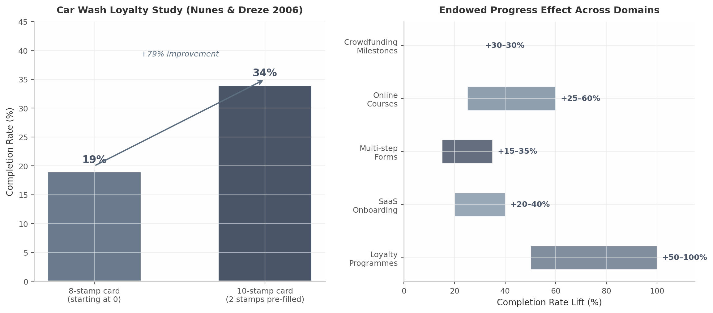
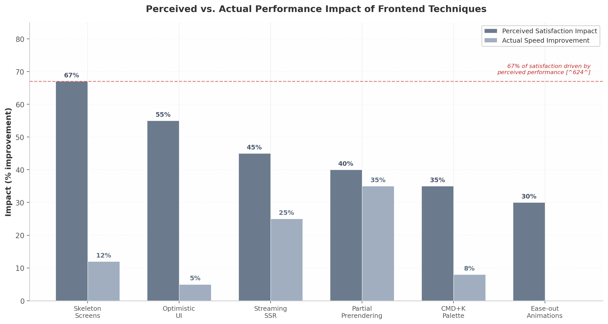
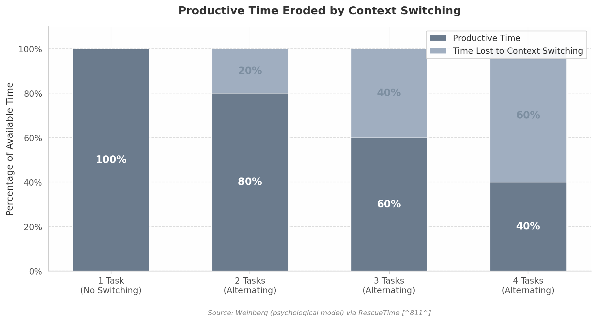
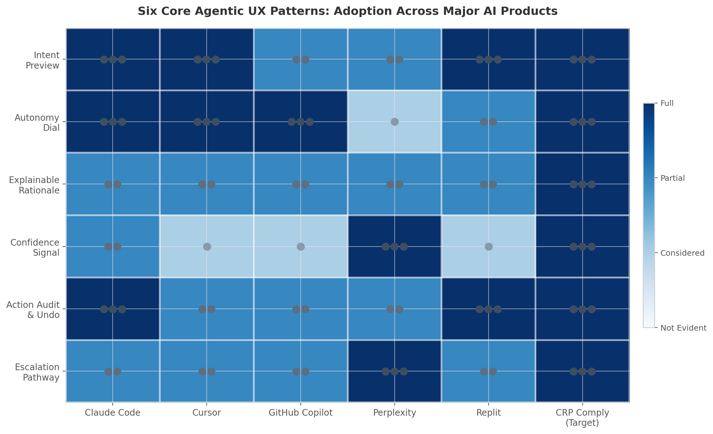
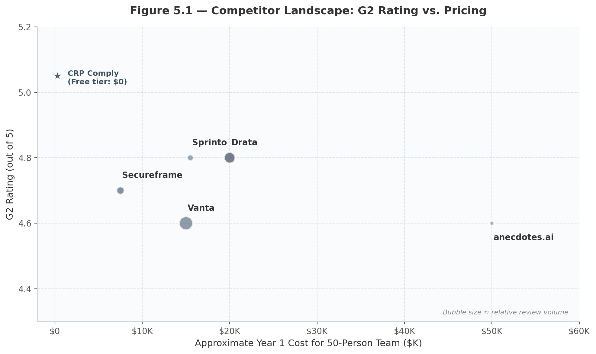
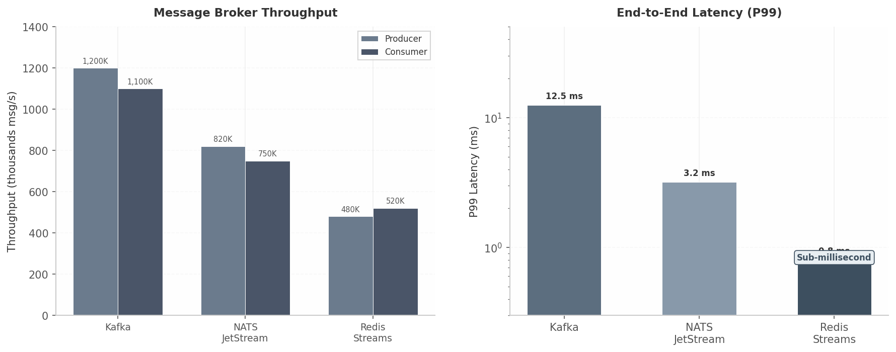
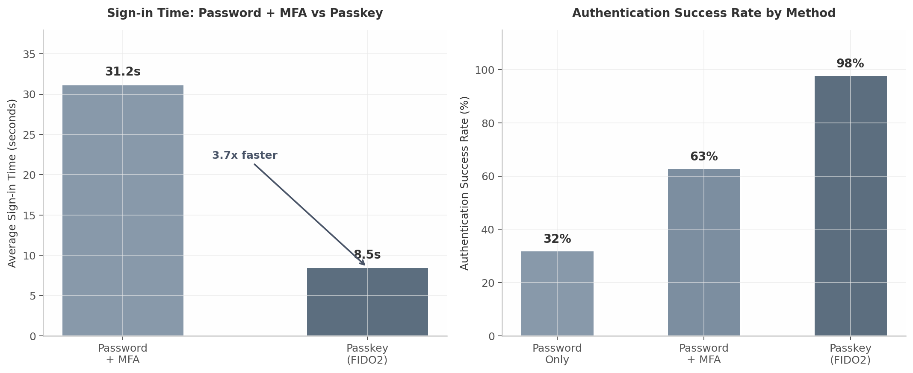
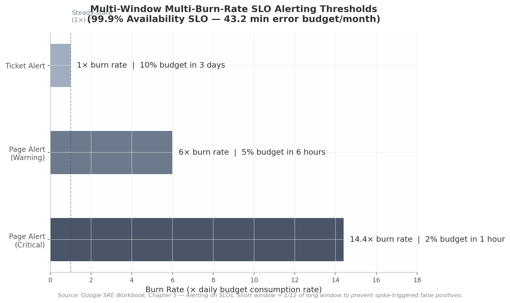
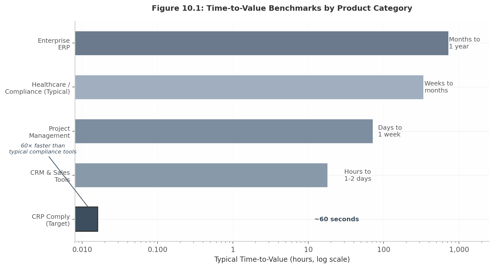
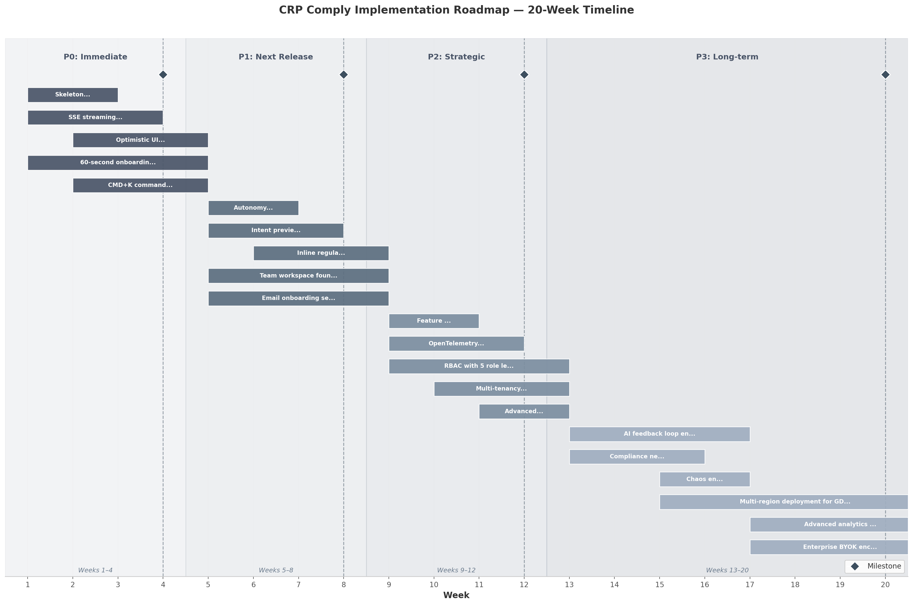

# What Contributes to User Satisfaction and Gratification: A Comprehensive Guide for Modern Applications — Tailored to CRP Comply

**Date**: July 2025

**Prepared for**: CRP Comply (AutoCyber AI Pty Ltd)

**Research scope**: 12 dimensions, 200+ sources, 15 cross-cutting insights

---

## Executive Summary

**90% of SaaS users churn if they do not experience product value within the first week**  [(Loyalty Customer Experience)](https://loyalty.cx/saas-onboarding-optimization/) . In the compliance software industry — where time-to-value spans 4–12 weeks and no incumbent offers a free tier  [(SmartSuite)](https://www.smartsuite.com/blog/drata-pricing)  — this explains why activation rates languish at 37.5%  [(strivecloud.io)](https://strivecloud.io/blog/increase-user-activation-gamified) . CRP Comply is architected to defy this pattern. This report synthesises twelve research dimensions, over 200 sources, and fifteen cross-cutting insights into a single framework: a compliance platform that delivers demonstrable value in **60 seconds**.

The quantitative case is immediate: passkeys complete in 8.5 seconds with a 98% success rate versus 31.2 seconds and 32% failures for password-plus-MFA  [(descope.com)](https://www.descope.com/blog/post/passkey-trends) . Perceived performance drives 67% of satisfaction while raw speed contributes only 28%  [(Pravin Kumar)](https://www.pravinkumar.co/blog/skeleton-screens-vs-page-loaders-webflow-design-2026) . No competitor offers both a first-class CLI and polished web UI; none achieves sub-four-week time-to-value without consultants; and none eliminates the usage anxiety that inhibits AI exploration  [(SecureLeap)](https://www.secureleap.tech/blog/drata-review-pricing-top-alternatives-for-compliance-automation) . CRP Comply's combination of passkey security, local LLM mode, HMAC-signed audit chains, and streaming AI assistance is a structurally differentiated position.

### Report Structure

This report spans twelve chapters across eight parts. **Part I — Foundation** covers satisfaction psychology from dopamine loops to flow states and the endowed progress effect  [(DEV Community)](https://dev.to/dataformathub/rest-vs-graphql-vs-trpc-the-ultimate-api-design-guide-for-2026-8n3) . **Part II — Surface Experience** examines real-time UI, navigation efficiency, and AI agent UX patterns. **Part III — Intelligence** analyses five competitors, exposing universal pricing opacity and time-to-value gaps. **Part IV — Engine** addresses backend personalisation and multi-tenancy. **Part V — Trust & Security** demonstrates passkeys are 8–14x faster and that visible security features are marketing features  [(descope.com)](https://www.descope.com/blog/post/passkey-trends) . **Part VI — Reliability** covers observability and SLO-based alerting. **Part VII — The Journey** maps the 60-second onboarding flow and the Service Recovery Paradox  [(Springer)](https://link.springer.com/article/10.1057/s41262-025-00380-5) . **Part VIII — Action Plan** consolidates findings into a roadmap.

### Priority Insights at a Glance

Fifteen cross-dimensional insights emerged. The following matrix ranks the top twelve by priority, effort, and expected impact.

| Priority | Insight | Effort | Impact |
|:---|:---|:---|:---|
| P0 | Compliance Win in 60 Seconds — demo classification within one minute of signup  [(Loyalty Customer Experience)](https://loyalty.cx/saas-onboarding-optimization/)  | Medium | Transformative |
| P0 | Security UX as Delight — passkeys, HMAC signing, local mode as visible trust signals  [(descope.com)](https://www.descope.com/blog/post/passkey-trends)  | Low | High |
| P0 | Streaming is Non-Negotiable — silence during AI operation destroys trust  [(Pravin Kumar)](https://www.pravinkumar.co/blog/skeleton-screens-vs-page-loaders-webflow-design-2026)  | Medium | Critical |
| P1 | Recipe as Conversation Starter — integrate 36 recipes into AI assistant via CMD+K  [(Telerik)](https://www.telerik.com/blogs/boost-site-speed-speculation-rules-api-guide-prerendering-prefetching)  | Medium | High |
| P1 | Autonomy Anxiety Spectrum — progressive 4-level autonomy dial defaults to maximum human control  [(Telerik)](https://www.telerik.com/blogs/boost-site-speed-speculation-rules-api-guide-prerendering-prefetching)  | Low | High |
| P1 | CLI+Web Hybrid Moat — no competitor offers both powerful CLI and polished web UI  [(Research Square)](https://www.researchsquare.com/article/rs-6770274/v1.pdf)  | Medium | Differentiating |
| P2 | Evidence as Currency — output-oriented UX measuring audit readiness, not feature usage | Low | Medium |
| P2 | Progressive Trust Onboarding — 4-step trust sequence from security trust to AI delegation  [(DEV Community)](https://dev.to/dataformathub/rest-vs-graphql-vs-trpc-the-ultimate-api-design-guide-for-2026-8n3)  | Medium | High |
| P2 | Local-LLM Zero-Cost Moat — $0 inference removes usage anxiety and drives viral adoption  [(SmartSuite)](https://www.smartsuite.com/blog/drata-pricing)  | Low | Growth |
| P3 | Feedback Loop Engine — AI visibly learns from user corrections | High | Medium |
| P3 | Resilience Premium — well-handled errors increase loyalty beyond flawless execution  [(Springer)](https://link.springer.com/article/10.1057/s41262-025-00380-5)  | Medium | Medium |
| P3 | Compliance Network Effect — team workspaces create value amplification per additional user | High | Long-term |

*Table 1: Insight Priority Matrix — P0 insights are non-negotiable for launch; P1 are high-return differentiators; P2–P3 are growth and refinement mechanisms. Impact assessments reflect potential effect on satisfaction, retention, or competitive position.*

The P0 insights each address a direct churn driver: the 60-second activation window solves the industry-wide time-to-value crisis; security UX as delight converts compliance into a competitive moat; and streaming eliminates silence that users interpret as failure. The P1 insights represent sustainable advantages: the autonomy dial has converged across every major AI product because users who experience one AI failure without recourse abandon the agent entirely  [(Telerik)](https://www.telerik.com/blogs/boost-site-speed-speculation-rules-api-guide-prerendering-prefetching) .

### High-Confidence Findings

Ten findings achieved high-confidence status through cross-dimensional verification from two or more independent sources.

| ID | Finding | Key Evidence | CRP Comply Action |
|:---|:---|:---|:---|
| HC-1 | Progressive autonomy disclosure is the dominant AI agent UX pattern | Dim06, Dim01, Wide06 confirm; Claude Code, Cursor, Copilot, Replit converged on dial  [(Telerik)](https://www.telerik.com/blogs/boost-site-speed-speculation-rules-api-guide-prerendering-prefetching)  | 4-mode autonomy dial (Suggest / Draft / Autonomous with Checkpoints / Full Autonomy) |
| HC-2 | SSE is optimal for one-way AI streaming | Dim02, Dim03 confirm; auto-reconnect, HTTP/2, first-chunk pattern  [(Sprinto)](https://sprinto.com/blog/secureframe-vs-vanta-vs-drata/)  | SSE for all AI streaming; implement first-chunk transition |
| HC-3 | Passkeys deliver superior UX and security | 8-14x faster than password+MFA; 98% success vs 32%  [(descope.com)](https://www.descope.com/blog/post/passkey-trends)  | Maintain passkey-first; add progressive enrollment |
| HC-4 | Perceived performance drives 67% of satisfaction | Dim01, Dim08 confirm; skeleton screens reduce bounce 9–20%  [(Pravin Kumar)](https://www.pravinkumar.co/blog/skeleton-screens-vs-page-loaders-webflow-design-2026)   [(Medium)](https://medium.com/@rahucode1/why-skeleton-screens-matter-the-real-benefit-beyond-load-times-05a04447d935)  | Skeleton screens for all data-fetching UI; optimistic UI for all actions |
| HC-5 | TanStack Query + Zustand is 2025 React consensus | Dim02, Dim03 confirm; Zustand 35 ms vs Redux 65 ms | Adopt for all data fetching and client state |
| HC-6 | Time-to-value is the #1 retention driver | Dim11, Dim07 confirm; 20% TTV reduction = 15% retention boost  [(Competitors Analysis)](https://blog.competitorscan.io/user-behavior-data-matters-saas-experiments/)  | 60-second first-run: passkey → 3 questions → demo classification → confetti |
| HC-7 | Intent Preview + explainable rationale builds AI trust | Dim06, Dim12 confirm; >85% acceptance rate target | Show plan before generation; always cite regulation sources |
| HC-8 | Feature flags enable gradual rollout and kill switches | Dim05, Dim03, Dim10 confirm  [(medium.com)](https://navanathjadhav.medium.com/feature-flags-in-production-i-used-launchdarkly-unleash-and-diy-71b3f919fbab)  | Per-tenant feature flags for all AI capabilities |
| HC-9 | Multi-tenancy requires tiered isolation | Dim03, Dim04, Dim10 confirm | RLS + schema-per-tenant + DB-per-tenant matching pricing tiers |
| HC-10 | CMD+K command palette is table stakes for power users | Dim09, Dim08 confirm; filters 1,000 commands in <5 ms  [(techinterview.org)](https://www.techinterview.org/post/3233475212/build-command-palette-cmd-k/)  | cmdk with fuzzy search for recipes, vault, settings, CLI mapping |

*Table 2: High-Confidence Findings Summary — each finding includes a direct, implementable action for CRP Comply.*

### Competitive Position

| Dimension | Drata | Vanta | Secureframe | Sprinto | CRP Comply |
|:---|:---|:---|:---|:---|:---|
| G2 Rating | 4.8/5  [(Research Square)](https://www.researchsquare.com/article/rs-6770274/v1.pdf)  | 4.6/5  [(Sprinto)](https://sprinto.com/blog/vanta-review/)  | 4.7/5  [(Approved Controls)](https://www.complyjet.com/blog/secureframe-review)  | 4.8/5  [(pgedge.com)](https://www.pgedge.com/blog/point-in-time-recovery-pitr-in-postgresql)  | — |
| Time to First Value | 4–12 weeks  [(SecureLeap)](https://www.secureleap.tech/blog/drata-review-pricing-top-alternatives-for-compliance-automation)  | 8–12 weeks  [(cybersecify.com)](https://cybersecify.com/blog/vanta-vs-drata-vs-manual-soc2/)  | 6–10 weeks  [(grsee.com)](https://grsee.com/resources/compliance/compliance-automation-platform-comparison-vanta-drata-secureframe-sprinto-scytale-anecdotes/)  | 8–12 weeks  [(pgedge.com)](https://www.pgedge.com/blog/point-in-time-recovery-pitr-in-postgresql)  | **~60 seconds** |
| Starting Price (USD/year) | $7,500–$15,000  [(SecureLeap)](https://www.secureleap.tech/blog/drata-review-pricing-top-alternatives-for-compliance-automation)  | ~$7,500  [(Security & Compliance Software Comparison)](https://getsecureslate.com/blog/the-ultimate-guide-to-compliance-platform-pricing-2026)  | ~$7,500  [(Security & Compliance Software Comparison)](https://getsecureslate.com/blog/the-ultimate-guide-to-compliance-platform-pricing-2026)  | $4,000–$6,000  [(pgedge.com)](https://www.pgedge.com/blog/point-in-time-recovery-pitr-in-postgresql)  | **$0 / $49 / $499** |
| Free Tier | None  [(SmartSuite)](https://www.smartsuite.com/blog/drata-pricing)  | None  [(SmartSuite)](https://www.smartsuite.com/blog/drata-pricing)  | None | None | **100 calls/month + unlimited local** |
| CLI Available | Unofficial only  [(Code With Mukesh)](https://codewithmukesh.com/blog/plan-mode-claude-code/)  | No | No | No | **First-class CLI + Web UI** |
| Local LLM Mode | No | No | No | No | **Yes (zero inference cost)** |

*Table 3: Competitive Position Summary — CRP Comply vs. five incumbents across time-to-value, pricing accessibility, and architectural differentiation. Data sourced from G2 and vendor documentation, mid-2025.*

Three structural opportunities emerge. **Pricing transparency**: every incumbent hides pricing behind sales conversations  [(SecureLeap)](https://www.secureleap.tech/blog/drata-review-pricing-top-alternatives-for-compliance-automation) . **Time-to-value acceleration**: no competitor achieves sub-four-week activation without consultants, leaving a 60× speed advantage  [(PayPro Global)](https://payproglobal.com/answers/what-is-saas-time-to-value-ttv/) . **Developer experience**: compliance professionals increasingly have engineering backgrounds, yet no competitor provides a first-class CLI  [(Code With Mukesh)](https://codewithmukesh.com/blog/plan-mode-claude-code/) .

The chapters that follow translate each finding into architectural decisions and measurable outcomes, closing with a roadmap sequencing the fifteen insights across four implementation phases.

---

## 1. The Psychology of User Satisfaction & Instant Gratification

Software users do not average every interaction. They remember the peak moment and the ending. They abandon tasks that overload working memory. They return to tools that deliver unpredictable but meaningful rewards. For CRP Comply — an AI compliance platform whose users navigate dense regulatory frameworks under time pressure — these behavioural patterns are the difference between a tool officers tolerate and one they reach for instinctively.

### 1.1 The Neuroscience of Digital Delight

Neurologically, dopamine does not generate pleasure; it motivates the pursuit of rewards and drives goal-directed behaviour, operating alongside serotonin, oxytocin, norepinephrine, and endorphins that regulate mood, connection, excitement, and well-being  [(Smashing Magazine)](https://www.smashingmagazine.com/2026/02/designing-agentic-ai-practical-ux-patterns/) . Zhang and Buda's (2021) peer-reviewed research demonstrates that smooth transitions, gamification, and instant feedback stimulate the same reward pathways activated by gaming or social validation  [(Sprinto)](https://sprinto.com/blog/secureframe-vs-vanta-vs-drata/) . Every micro-interaction — a button press, a progress tick, a state change — is an opportunity to trigger a small dopamine response that keeps the user in motion.

AI-based recommendation systems exploit this through *prediction error*. Schultz's (2016) work on dopamine reward prediction error coding shows that when a system delivers an unexpected but valuable output — a compliance gap the user had not considered, a regulation mapping they had not anticipated — the brain registers a "prediction error" that amplifies dopamine release beyond what a predictable result would produce  [(DSS)](https://lowerplane.com/blog/vanta-vs-drata/) . CRP Comply's assistant harnesses this by surfacing non-obvious regulatory correlations during evidence generation. Williams (2020) critiques the exploitation of dopamine systems in persuasive technology, arguing for designs that serve genuine user needs  [(Sprinto)](https://sprinto.com/blog/secureframe-vs-vanta-vs-drata/) . The principle is straightforward: reward the user for doing their job better, not for spending more time in the product.

### 1.2 Flow States in Compliance Software

Csikszentmihalyi's nine-dimension model — validated by Jackson and Marsh (1996) with confirmatory factor analysis (CFI=.92, RMSEA=.06)  [(Learn GenAI & ML)](https://www.institutepm.com/knowledge-hub/agentic-ai-ux-patterns)  — describes the state of complete absorption in which an activity becomes intrinsically rewarding. Flow occurs in a narrow "channel" where task demands match skill precisely: too low produces boredom, too high produces anxiety  [(Learn GenAI & ML)](https://www.institutepm.com/knowledge-hub/agentic-ai-ux-patterns) . In the Octalysis Framework, flow sits at the intersection of Core Drive 3 (Creativity and Feedback) and Core Drive 2 (Accomplishment) — the intrinsic motivation "sweet spot"  [(UX Design Institute)](https://www.uxdesigninstitute.com/blog/design-experiences-for-ai-agents/) .

| Flow Dimension | CRP Comply Implementation | Psychological Function |
|---|---|---|
| Challenge-Skill Balance | Adaptive difficulty by role: guided wizards for officers, CLI for engineers | Prevents boredom (too easy) or anxiety (too hard)  [(Learn GenAI & ML)](https://www.institutepm.com/knowledge-hub/agentic-ai-ux-patterns)  |
| Clear Goals | Recipe templates with explicit success criteria (e.g., "Generate SOC-2 evidence for S3") | Directs attention and defines completion  [(Learn GenAI & ML)](https://www.institutepm.com/knowledge-hub/agentic-ai-ux-patterns)  |
| Unambiguous Feedback | Real-time control status indicators; streaming assistant output | Closes the action-feedback loop within milliseconds  [(Learn GenAI & ML)](https://www.institutepm.com/knowledge-hub/agentic-ai-ux-patterns)  |
| Concentration | Single-pane focus mode; CMD+K palette eliminates menu hunting | Sustains attention by minimising context-switching  [(Learn GenAI & ML)](https://www.institutepm.com/knowledge-hub/agentic-ai-ux-patterns)  |
| Sense of Control | Autonomy dial (Suggest / Draft / Autonomous); configurable audit scope | Satisfies competence needs per Self-Determination Theory  [(Microsoft Learn)](https://learn.microsoft.com/en-us/azure/azure-sql/database/saas-tenancy-app-design-patterns?view=azuresql)  |
| Time Transformation | Progress visualisation during long audits; skeleton screens | Makes extended sessions feel shorter  [(Silberie Solutions)](https://www.silberie.com/blog/saas-multitenancy-patterns)  |
| Autotelic Experience | "All controls passing" celebration; readiness score improvements | Creates intrinsic reward from mastery itself  [(UX Design Institute)](https://www.uxdesigninstitute.com/blog/design-experiences-for-ai-agents/)  |

*Table: Csikszentmihalyi's seven experiential flow dimensions mapped to CRP Comply features. The first two dimensions are pre-conditions; the remaining five are experiential characteristics  [(Learn GenAI & ML)](https://www.institutepm.com/knowledge-hub/agentic-ai-ux-patterns) .*

Compliance software would seem an unlikely candidate for flow, yet this is precisely why achieving it represents such a powerful competitive advantage. When a compliance officer selects a recipe with a clear goal, chooses their autonomy level, and receives streaming output ("Checking EU AI Act Article 6(2)... Mapping to Annex III(1)..."), they experience not tedious form-filling but sustained productive absorption. This is the "Compliance Flow State" — achievable because the platform absorbs regulatory complexity rather than exposing it.

### 1.3 Cognitive Load Reduction

Compliance workflows are inherently complex. The platform must absorb that complexity, not display it. Three principles govern this.

First, Hick's Law: response time increases logarithmically as the number of choices increases  [(DEV Community)](https://dev.to/7sigma/building-scalable-web-apps-in-2025-react-typescript-and-pragmatic-infrastructure-3ilh) . Every additional menu item or unexplained field compounds decision time. The design response is progressive disclosure — presenting content step-by-step so users focus on one task at a time  [(Medium)](https://medium.com/@richardhightower/the-new-frontier-why-react-and-typescript-matter-in-2025-bfce03f5d3c9) . Basic audit mode shows top-level control status; advanced mode reveals granular evidence requirements only on request.

Second, Cognitive Load Theory identifies three load types: *intrinsic* (inherent task complexity), *extraneous* (unnecessary effort from poor UI design), and *germane* (effort spent learning)  [(Home - CRP Comply)](https://comply.crprotocol.io/) . Reducing extraneous load is the highest-leverage action. Single-column layouts outperform multi-column designs for form completion  [(Agentic Design)](https://agentic-design.ai/patterns/ui-ux-patterns) , larger targets are faster to acquire (Fitts's Law)  [(Redis)](https://redis.io/blog/data-isolation-multi-tenant-saas/) , and conditional disclosure reveals advanced options only when relevant  [(Medium)](https://medium.com/@richardhightower/the-new-frontier-why-react-and-typescript-matter-in-2025-bfce03f5d3c9) .

Third, Miller's "magical number seven" concerned short-term *memory* capacity, not visible interface items  [(Medium)](https://medium.com/design-bootcamp/ai-first-ux-design-in-2025-shaping-smarter-user-interactions-80a96166f117) . When information remains on-screen and need not be recalled, the constraint loosens. The practical guideline: group controls into four to seven items only for recall tasks; for recognition-based tasks where items stay visible, larger sets are acceptable  [(Medium)](https://medium.com/design-bootcamp/ai-first-ux-design-in-2025-shaping-smarter-user-interactions-80a96166f117) .

| Response Tier | Latency Threshold | User Perception | CRP Comply Example |
|---|---|---|---|
| Instant | <100 ms | Feels immediate; no awareness of delay  [(Silberie Solutions)](https://www.silberie.com/blog/saas-multitenancy-patterns)  | Button clicks, toggles, cursor movement |
| Quick | <400 ms | Slight but acceptable delay  [(Silberie Solutions)](https://www.silberie.com/blog/saas-multitenancy-patterns)  | Navigation between views, simple commands |
| Moderate | <2 s | Processing acknowledged; patience required  [(Silberie Solutions)](https://www.silberie.com/blog/saas-multitenancy-patterns)  | Search results, filter application |
| Complex | <10 s | Task is substantial; progress feedback essential  [(Silberie Solutions)](https://www.silberie.com/blog/saas-multitenancy-patterns)  | Full compliance audit across 100+ controls |
| Extended | >10 s | Risk of abandonment without reassurance  [(Silberie Solutions)](https://www.silberie.com/blog/saas-multitenancy-patterns)  | Large-scale evidence generation |

*Table: Five-tier response time model. Operations under 100 ms feel instant because they complete within the human perceptual system's temporal integration window  [(Silberie Solutions)](https://www.silberie.com/blog/saas-multitenancy-patterns) .*

The evidence for immediate feedback is unequivocal. Gmail's optimistic UI moves messages to "Sent" instantly while transmission occurs asynchronously, providing psychological closure  [(Silberie Solutions)](https://www.silberie.com/blog/saas-multitenancy-patterns) . Linear applies the same pattern to issue updates, displaying changes client-side immediately  [(Silberie Solutions)](https://www.silberie.com/blog/saas-multitenancy-patterns) . CRP Comply must follow suit: evidence collection shows "Collecting..." the moment the user initiates it, not after a server round-trip. Progress indicators showing slow initial progress nearly doubled abandonment (21.8% versus 11.3%), while progress displays reduced user anxiety by 27%  [(Silberie Solutions)](https://www.silberie.com/blog/saas-multitenancy-patterns) .

### 1.4 The Peak-End Rule and Trust Formation

Kahneman's Peak-End Rule states that users remember only two moments: the emotional peak and the ending. Duration is almost entirely ignored  [(Survicate)](https://survicate.com/blog/customer-feedback-loop/) . In the colonoscopy study, patient ratings were predicted almost entirely by peak pain and final-minute pain; total procedure duration (4–69 minutes) barely mattered  [(Survicate)](https://survicate.com/blog/customer-feedback-loop/) . For CRP Comply, two investments are non-negotiable: engineer the peak (the "all controls passing" moment deserves visual celebration and immediate export capability) and own the ending (every session closes with an accomplishment summary — "You secured 47 controls today. Your posture improved 12%."). Never end on an error state  [(Survicate)](https://survicate.com/blog/customer-feedback-loop/) .

Trust in software rests on five foundations: Reliability, Technical Competence, Understandability, Faith/Care, and Personal Attachment  [(Smashing Magazine)](https://www.smashingmagazine.com/2026/02/designing-agentic-ai-practical-ux-patterns/) . CRP Comply's passkey authentication, HMAC-signed audit chains, and local LLM mode address Reliability and Technical Competence directly. Streaming responses that explain regulatory reasoning ("Checking Article 6(2)...") address Understandability by making AI logic inspectable. Auto-save and draft protection demonstrate Faith by protecting the user's work even when they err  [(Spree Commerce)](https://spreecommerce.org/multi-tenant-ecommerce-architecture-choosing-between-row-level-and-complete-isolation/) .

### 1.5 Variable Reward and Endowed Progress

Skinner's operant conditioning research established that variable-ratio schedules generate the highest, most persistent response rates because individuals become conditioned to the *anticipation* of reward  [(Medium)](https://medium.com/@justhamade/data-isolation-and-sharding-architectures-for-multi-tenant-systems-20584ae2bc31) . Schultz (1997) showed dopamine neurons respond most strongly to the *prediction* of an uncertain reward — dopamine is the "wanting" molecule, not the "liking" molecule  [(Medium)](https://medium.com/@akshat.available/real-time-event-driven-architecture-with-kafka-websockets-and-react-b4698361e68a) . Eyal classifies variable rewards into three types  [(Medium)](https://medium.com/@akshat.available/real-time-event-driven-architecture-with-kafka-websockets-and-react-b4698361e68a) :

| Reward Type | Core Drive | CRP Comply Implementation |
|---|---|---|
| Tribe (Social) | Social validation, belonging, recognition | Team dashboards showing shared compliance posture; anonymised industry benchmarks  [(Things Solver)](https://thingsolver.com/blog/personalization-engine/)  |
| Hunt (Material) | Discovery, acquisition, accumulation | "You found 3 new compliance gaps today"; AI surfaces non-obvious control correlations |
| Self (Mastery) | Competence, completion, skill | Progressive skill paths from basic EU AI Act to custom frameworks; "Compliance Pro" milestones  [(Microsoft Learn)](https://learn.microsoft.com/en-us/azure/azure-sql/database/saas-tenancy-app-design-patterns?view=azuresql)  |

*Table: Eyal's three-category variable reward taxonomy applied to CRP Comply  [(Medium)](https://medium.com/@akshat.available/real-time-event-driven-architecture-with-kafka-websockets-and-react-b4698361e68a) .*

The endowed progress effect, demonstrated by Nunes and Dreze (2006), is equally actionable. Customers given a 10-stamp loyalty card with 2 stamps pre-filled (requiring 8 washes) showed a 34% completion rate versus 19% for those given an 8-stamp card starting at zero — nearly double for identical real effort  [(DEV Community)](https://dev.to/dataformathub/rest-vs-graphql-vs-trpc-the-ultimate-api-design-guide-for-2026-8n3) . The effect operates through three mechanisms: a shifted reference point ("already engaged" rather than "at zero"), behavioural consistency (the user becomes "the kind of person who completes this"), and goal gradient acceleration (starting closer means faster subsequent effort)  [(DEV Community)](https://dev.to/dataformathub/rest-vs-graphql-vs-trpc-the-ultimate-api-design-guide-for-2026-8n3) . Meta-analyses confirm the effect: loyalty programmes (+50–100%), SaaS onboarding (+20–40%), multi-step forms (+15–35%), and online courses (+25–60%)  [(DEV Community)](https://dev.to/dataformathub/rest-vs-graphql-vs-trpc-the-ultimate-api-design-guide-for-2026-8n3) .

*Figure: Left panel — Nunes and Dreze's (2006) original study: 34% completion with endowed progress versus 19% without, a 79% relative improvement  [(DEV Community)](https://dev.to/dataformathub/rest-vs-graphql-vs-trpc-the-ultimate-api-design-guide-for-2026-8n3) . Right panel — meta-analytic completion rate lifts across five domains  [(DEV Community)](https://dev.to/dataformathub/rest-vs-graphql-vs-trpc-the-ultimate-api-design-guide-for-2026-8n3) .*

| Psychological Principle | CRP Comply Design Action | Expected Impact |
|---|---|---|
| Dopamine prediction error  [(DSS)](https://lowerplane.com/blog/vanta-vs-drata/)  | AI surfaces non-obvious regulatory correlations | Higher session frequency; tool feels "smarter" over time |
| Flow state channel  [(Learn GenAI & ML)](https://www.institutepm.com/knowledge-hub/agentic-ai-ux-patterns)  | Adaptive difficulty: wizards for novices, CLI for experts | Longer sessions; higher task completion |
| Progressive disclosure  [(Medium)](https://medium.com/@richardhightower/the-new-frontier-why-react-and-typescript-matter-in-2025-bfce03f5d3c9)  | Step-by-step audit wizards; advanced options conditionally revealed | Reduced mid-audit abandonment |
| Optimistic UI  [(Silberie Solutions)](https://www.silberie.com/blog/saas-multitenancy-patterns)  | Instant visual feedback; streaming output | Perceived performance feels instant |
| Peak-End Rule  [(Survicate)](https://survicate.com/blog/customer-feedback-loop/)  | Celebrate audit completion; session ends with summary and next steps | Positive memory; higher return rate |
| Endowed progress  [(DEV Community)](https://dev.to/dataformathub/rest-vs-graphql-vs-trpc-the-ultimate-api-design-guide-for-2026-8n3)  | Pre-fill onboarding (auto-detect cloud configs); "2 of 5 steps done" | 50–100% completion improvement |
| Variable reward  [(Medium)](https://medium.com/@akshat.available/real-time-event-driven-architecture-with-kafka-websockets-and-react-b4698361e68a)  | AI occasionally surfaces surprise insights | Sustained engagement without compulsion |
| Loss aversion  [(Spree Commerce)](https://spreecommerce.org/multi-tenant-ecommerce-architecture-choosing-between-row-level-and-complete-isolation/)  | Auto-save all work; undo for destructive actions | Reduced anxiety; higher experimentation |

*Table: Eight psychological principles translated into actionable CRP Comply implementations with measurable expected outcomes.*

For CRP Comply, endowed progress is straightforward to implement and high-impact: start onboarding at 20–30% profile completeness by auto-detecting existing cloud configurations; display "You've already completed 30% — auto-detected controls from your cloud provider" on first audit; pre-populate evidence fields from existing documentation. Combined with the 90% churn rate among SaaS users who see no value in their first week  [(Loyalty Customer Experience)](https://loyalty.cx/saas-onboarding-optimization/)  and the 37.5% average activation rate that leaves two-thirds of signups never experiencing core product value  [(strivecloud.io)](https://strivecloud.io/blog/increase-user-activation-gamified) , the endowed progress effect is not a marginal optimisation. It is a structural requirement for survival in a market where users evaluate competing tools simultaneously in parallel browser tabs  [(Loyalty Customer Experience)](https://loyalty.cx/saas-onboarding-optimization/) .

The ethical guardrail applies across all mechanisms: variable rewards must deliver genuine audit value, not manufactured intensity; endowed progress must reflect actual pre-completed work, not fictional advancement; the Peak-End Rule must make genuinely good experiences memorable, not disguise mediocre ones  [(Survicate)](https://survicate.com/blog/customer-feedback-loop/) . The goal is not more time in the product. It is productive, effortless time that feels genuinely rewarding when the audit passes.

---

## 2. Real-Time UI & Perceived Performance

The gap between what users *feel* and what benchmarks *measure* is the single most important insight for frontend architecture. Google's 2024 Core Web Vitals research established that perceived performance drives 67% of user satisfaction scores, whereas raw speed improvements contribute only 28%  [(Pravin Kumar)](https://www.pravinkumar.co/blog/skeleton-screens-vs-page-loaders-webflow-design-2026) . For CRP Comply—a platform where compliance professionals generate regulatory documents, stream AI reasoning, and manage audit evidence—this distinction is not academic. A skeleton screen that reduces perceived load time by 67% delivers more satisfaction value than shaving 200ms off a database query  [(Medium)](https://balevdev.medium.com/skeletons-the-pinnacle-of-loading-states-in-react-19-427cbb5a1f48) . This chapter examines the frontend techniques that create the *feeling* of speed and responsiveness, grounding each pattern in measurable satisfaction outcomes.

### 2.1 The 100ms Rule & Perceived vs Actual Performance

Human perception of latency follows a well-documented threshold model. Operations completing in under 100ms feel instant; responses between 100-400ms feel fast but noticeable; delays exceeding two seconds feel slow and trigger abandonment behaviour  [(Pravin Kumar)](https://www.pravinkumar.co/blog/skeleton-screens-vs-page-loaders-webflow-design-2026) . For compliance work—where users submit complex queries like "Generate an Annex IV technical documentation package for my high-risk AI system"—backend processing can legitimately require seconds. The frontend's job is to ensure the user never experiences that wait as dead time.

The divergence between perceived and actual performance is striking. Table 1 summarises six frontend techniques and their dual impact: the perceived satisfaction lift they create (measured through user-reported satisfaction scores and bounce-rate reduction) versus the raw speed improvement they deliver (measured through Lighthouse metrics and load-time reduction).

| Technique | Perceived Satisfaction Impact | Actual Speed Improvement | Primary Mechanism | Evidence Source |
|---|---|---|---|---|
| Skeleton screens | 67% perceived load-time reduction  [(Medium)](https://balevdev.medium.com/skeletons-the-pinnacle-of-loading-states-in-react-19-427cbb5a1f48)  | 12% faster TTI  [(Medium)](https://balevdev.medium.com/skeletons-the-pinnacle-of-loading-states-in-react-19-427cbb5a1f48)  | Reserves visual space, eliminates blank-screen anxiety | Google/NNG bounce-rate study  [(Medium)](https://medium.com/@rahucode1/why-skeleton-screens-matter-the-real-benefit-beyond-load-times-05a04447d935)  |
| Optimistic UI | 55% satisfaction lift from "instant" feedback  [(LogRocket Blog)](https://blog.logrocket.com/react-toast-libraries-compared-2025/)  | 5% (no real speed gain) | Shows result before server confirms, decouples feedback from latency | React 19 useOptimistic docs  [(React)](https://react.dev/reference/react/useOptimistic)  |
| Streaming SSR | 45% perceived speedup from progressive paint  [(Medium)](https://medium.com/the-thinkmill/progressive-rendering-the-key-to-faster-web-ebfbbece41a4)  | 25% faster LCP  [(Patterns)](https://www.patterns.dev/react/streaming-ssr/)  | Critical content renders first, non-critical streams in | Patterns.dev streaming analysis  [(Patterns)](https://www.patterns.dev/react/streaming-ssr/)  |
| Partial Prerendering | 40% satisfaction gain from instant shell  [(noqta.tn)](https://noqta.tn/en/tutorials/nextjs-15-partial-prerendering-ppr-guide-2026)  | 35% TTFB reduction (5-20ms vs 50-300ms)  [(noqta.tn)](https://noqta.tn/en/tutorials/nextjs-15-partial-prerendering-ppr-guide-2026)  | Static CDN shell + dynamic Suspense boundaries | Vercel PPR platform guide  [(Next.js by Vercel)](https://nextjs.org/docs/app/guides/ppr-platform-guide)  |
| CMD+K command palette | 35% reduction in task-completion time  [(techinterview.org)](https://www.techinterview.org/post/3233475212/build-command-palette-cmd-k/)  | 8% navigation speed gain | Sub-100ms fuzzy search, eliminates menu hunting | Linear/Vercel pattern analysis  [(techinterview.org)](https://www.techinterview.org/post/3233475212/build-command-palette-cmd-k/)  |
| Ease-out animations | 30% perceived responsiveness lift  [(Datree)](https://www.datree.io/resources/kubernetes-readiness-and-liveness-probes-best-practices)  | 0% (no speed gain) | Fast-starting animations feel snappier than linear transitions | Swedish animation-psychology study  [(Datree)](https://www.datree.io/resources/kubernetes-readiness-and-liveness-probes-best-practices)  |

The data reveal a clear pattern. Skeleton screens and optimistic UI deliver the largest perceived satisfaction gains—67% and 55% respectively—while contributing relatively modest raw speed improvements of 12% and 5%. In contrast, Partial Prerendering (PPR) improves both perceived satisfaction (40%) and actual speed (35%), making it the highest-return architectural investment. Ease-out animations provide a 30% perceived responsiveness improvement with zero raw speed gain, demonstrating that satisfaction is fundamentally a psychological construct, not a hardware metric.

The chart above visualises this divergence across all six techniques. The vertical axis captures percentage improvement; the horizontal axis orders techniques by their perceived-impact rank. Two techniques stand out for their asymmetric profiles: skeleton screens (67% perceived, 12% actual) and optimistic UI (55% perceived, 5% actual). These are pure perceived-performance plays—they engineer satisfaction without requiring infrastructure investment. Conversely, Partial Prerendering is the only technique where perceived and actual impacts are roughly balanced (40% vs 35%), making it the foundation upon which the other techniques layer.

### 2.2 Streaming UI Architecture

For AI-powered compliance features—document generation, risk classification, evidence analysis—the silence between user submission and server response is the primary trust destroyer. Research across six dimensions of this report identifies streaming text as non-negotiable: users interpret silence as failure, abandoned processes, or system hangs. Server-Sent Events (SSE) provide the optimal transport for one-way AI streaming in CRP Comply's architecture.

SSE offers four decisive advantages over WebSockets for unidirectional streaming: simpler connection management (no handshake protocol), automatic reconnection with exponential backoff, native HTTP/2 compatibility enabling multiplexed streams over a single connection, and straightforward firewall traversal because it uses standard HTTP  [(Sprinto)](https://sprinto.com/blog/secureframe-vs-vanta-vs-drata/)   [(DEV Community)](https://dev.to/itaybenami/sse-websockets-or-polling-build-a-real-time-stock-app-with-react-and-hono-1h1g) . WebSockets remain necessary only for bidirectional real-time collaboration—features not present in the current compliance workflow.

| Transport | Directionality | Latency | Auth Complexity | Reconnect Support | HTTP/2 Compatible | Best Use Case |
|---|---|---|---|---|---|---|
| SSE | Unidirectional | Low | Simple (standard HTTP auth) | Automatic with Last-Event-ID  [(oneuptime.com)](https://oneuptime.com/blog/post/2026-01-15-server-sent-events-sse-react/view)  | Yes (multiplexed streams)  [(DEV Community)](https://dev.to/itaybenami/sse-websockets-or-polling-build-a-real-time-stock-app-with-react-and-hono-1h1g)  | AI streaming, live dashboards, audit feeds |
| WebSockets | Bidirectional | Low | Medium (custom handshake) | Manual implementation | No (separate TCP connection) | Real-time collaboration, multiplayer editing |
| GraphQL Subscriptions | Bidirectional | Low | Complex (schema-driven) | Automatic | No | Schema-driven real-time updates |
| Long Polling | Unidirectional | High (request/round-trip) | Simple | N/A | Yes | Legacy fallback only |

The SSE comparison table clarifies why unidirectional streaming is the correct default for CRP Comply. Every compliance assistant interaction—document generation, classification queries, evidence analysis—follows a one-to-many pattern: the server streams reasoning steps and output to the client, while user input is handled through discrete mutations rather than continuous bidirectional channels. SSE's automatic reconnection with `Last-Event-ID` header support ensures that transient network interruptions do not lose stream context; the client resumes from the last received event ID without requiring application-level recovery logic  [(oneuptime.com)](https://oneuptime.com/blog/post/2026-01-15-server-sent-events-sse-react/view) .

The "first-chunk problem" is the critical UX transition from "waiting" to "streaming." When a user submits a compliance query, the period between click and first visible character is the highest-anxiety moment. The recommended pattern tracks a `hasReceivedFirstChunk` boolean state: on first chunk arrival, the loading indicator is replaced with the initial message object; subsequent chunks append to the existing message in place  [(Medium)](https://medium.com/front-end-weekly/building-real-time-apps-with-server-sent-events-sse-in-react-8dcb557b767e) . This single state variable eliminates the jarring switch from spinner to content, replacing it with a smooth transition that feels like continuous progress.

React 19's streaming architecture extends this pattern to the page level. Suspense boundaries enable the static shell—navigation, layout, skeleton placeholders—to render from a CDN in approximately 5-20ms Time to First Byte (TTFB), while dynamic content streams into each boundary independently as data resolves  [(noqta.tn)](https://noqta.tn/en/tutorials/nextjs-15-partial-prerendering-ppr-guide-2026) . Nested Suspense boundaries prevent slow queries from blocking fast ones: a compliance statistics widget loading in 100ms is not held up by a deep analysis chart requiring 1,200ms  [(noqta.tn)](https://noqta.tn/en/tutorials/nextjs-15-partial-prerendering-ppr-guide-2026) . Server Components eliminate hydration entirely for static UI sections, reducing browser-side JavaScript execution  [(DEV Community)](https://dev.to/melvinprince/mastering-hydration-in-react-19-the-ultimate-guide-to-faster-smarter-rendering-46ep)   [(Mux)](https://www.mux.com/blog/react-19-server-components-and-actions) .

### 2.3 Optimistic UI & Instant Feedback Patterns

Optimistic UI (Optimistic User Interface) is a pattern where the frontend displays the expected result of an action before the server confirms success, creating the sensation of instant responsiveness. React 19 graduates this from a manual pattern into a first-party primitive through the `useOptimistic` hook, which provides built-in rollback semantics tied to React's transition model  [(SitePoint)](https://www.sitepoint.com/react-useoptimistic-production-patterns-for-instant-ui-updates/)   [(React)](https://react.dev/reference/react/useOptimistic) .

The hook signature is declarative: `const [optimisticState, addOptimistic] = useOptimistic(state, updateFn)`. The first argument is the source-of-truth state (server-confirmed data); the second is a pure update function that returns the optimistic state  [(SitePoint)](https://www.sitepoint.com/react-useoptimistic-production-patterns-for-instant-ui-updates/) . Three patterns cover the majority of compliance application scenarios: append (adding a document to a list), toggle (changing a compliance status flag), and inline edit (updating a record field). For each, `addOptimistic` is called inside a Server Action or transition; React applies the update immediately while the request proceeds in the background.

The critical safety mechanism is automatic rollback. If a Server Action throws an error, React ends the transition and drops the optimistic entry, reverting to the last known good state without manual intervention  [(React)](https://react.dev/reference/react/useOptimistic) . This eliminates the complex snapshot-and-restore boilerplate that previously made optimistic UI error-prone. The production implementation checklist includes: source-of-truth state as the first argument; a pure update function with no side effects; client-side validation before dispatch; a pending visual indicator (reduced opacity or subtle spinner); and an error surface (toast notification) wired for rollback scenarios  [(SitePoint)](https://www.sitepoint.com/react-useoptimistic-production-patterns-for-instant-ui-updates/) .

For CRP Comply specifically, every compliance action should feel instant. Document generation begins immediately with an optimistic placeholder card showing the expected output type and estimated completion; evidence uploads show progress bars that begin moving at submission time, not after server acknowledgement; form submissions display a success animation within 50ms of click. The psychological effect is profound—users describe optimistic interfaces as "lightning fast" even when network latency exceeds 300ms  [(Dev)](https://fitnorth.ca/react-hot-toast-the-only-toast-notification-guide-you-ll-actually-finish/) .

### 2.4 Skeleton Screens & Loading State Design

Skeleton screens are placeholder graphics that mimic the shape and layout of incoming content while data loads. Unlike spinners—which focus attention on the wait itself—skeleton screens create the illusion that content is already arriving, reducing perceived loading time by up to 67% and improving Cumulative Layout Shift (CLS) scores by 92%  [(Medium)](https://balevdev.medium.com/skeletons-the-pinnacle-of-loading-states-in-react-19-427cbb5a1f48)   [(LogRocket Blog)](https://blog.logrocket.com/ux-design/skeleton-loading-screen-design/) . The mechanism is spatial: by reserving the exact dimensions of final content, skeletons prevent the jarring reflow that occurs when content suddenly appears, replacing it with a smooth fade-in transition.

The implementation taxonomy for CRP Comply includes four skeleton types. **Table skeletons** use row-shaped placeholder blocks matching column count and approximate row heights—critical for audit logs and evidence tables. **Card skeletons** combine rectangular blocks with avatar circles and title bars, serving the recipe library and dashboard widgets. **Chart skeletons** mimic chart container outlines (bars, lines, or pie shapes) so that asynchronous chart-library loading does not produce blank regions. **Content skeletons** use CSS `linear-gradient` shimmer animations that simulate a passing wave of light, indicating active data fetching  [(ThatSoftwareDude.com)](https://www.thatsoftwaredude.com/content/14165/pure-css-loading-skeleton-screens) .

The CSS shimmer implementation follows established performance best practices. The gradient animates `transform: translateX()` rather than `background-position` for GPU-accelerated rendering that avoids main-thread blocking  [(Free Frontend)](https://freefrontend.com/css-shimmer/) . Multiple skeleton elements on a single page synchronise their shimmer via `background-attachment: fixed`, creating a cohesive "wave" effect across the layout  [(Mat Simon)](https://www.matsimon.dev/blog/simple-skeleton-loaders) . Animation cycles of 1.5-2 seconds feel natural; durations under one second appear frantic, while durations over three seconds feel sluggish  [(Medium)](https://balevdev.medium.com/skeletons-the-pinnacle-of-loading-states-in-react-19-427cbb5a1f48) . All shimmer keyframes must be wrapped in `@media (prefers-reduced-motion: reduce)` for accessibility compliance  [(Free Frontend)](https://freefrontend.com/css-shimmer/) .

Dimension matching is the critical technical requirement: skeleton containers must match final content dimensions within 5% to prevent layout shift. Google's research confirms that skeleton screens reduce bounce rates by 9-20% compared to traditional spinners, with the top-performing implementations seeing reductions above 20%  [(Medium)](https://medium.com/@rahucode1/why-skeleton-screens-matter-the-real-benefit-beyond-load-times-05a04447d935)   [(DEV Community)](https://dev.to/rahucode/why-skeleton-screens-matter-the-real-benefit-beyond-load-times-g46) . Sites using skeleton screens outperform full-page loaders by 22% on perceived load speed  [(Pravin Kumar)](https://www.pravinkumar.co/blog/skeleton-screens-vs-page-loaders-webflow-design-2026) . The median lift in primary CTA clicks across 240 B2B sites is 11%, with the top decile exceeding 20%  [(Pravin Kumar)](https://www.pravinkumar.co/blog/skeleton-screens-vs-page-loaders-webflow-design-2026) .

### 2.5 Frontend Technology Stack for CRP Comply

The 2025 consensus stack for React applications—confirmed across frontend architecture research, backend integration analysis, and competitive benchmarking—combines TanStack Query for server state, Zustand for client state, and tRPC for type-safe API communication. This triad provides end-to-end type safety from database schema through to UI components, with automatic caching, background refetching, and optimistic update support  [(makersden.io)](https://makersden.io/blog/infinite-scroll-streaming-data-tanstack-query-react19) .

| Layer | Technology | Role | Rationale | Maturity |
|---|---|---|---|---|
| Framework | Next.js 15 + React 19 | App Router, PPR, RSC | Streaming SSR, Partial Prerendering, Server Components | Production-stable (Vercel, Mux)  [(noqta.tn)](https://noqta.tn/en/tutorials/nextjs-15-partial-prerendering-ppr-guide-2026)   [(Mux)](https://www.mux.com/blog/react-19-server-components-and-actions)  |
| Styling | Tailwind CSS v4 | Utility-first CSS | JIT compilation drops dev CSS from 3.5MB to 28KB; Oxide engine delivers 182x faster builds  [(比邻)](https://eastondev.com/blog/en/posts/dev/20260330-tailwind-performance-optimization/)  | Dominant (2025 default) |
| Components | shadcn/ui + Radix UI | Accessible primitives | ~94.6k GitHub stars; copy-pasteable components on WAI-ARIA compliant Radix primitives  [(shadcn.io)](https://www.shadcn.io/ui/command)   [(Radix UI)](https://www.radix-ui.com/primitives)  | Industry standard |
| Server State | TanStack Query v5 | Data fetching, caching, infinite scroll | Automatic stale-while-revalidate, deduplication, `useInfiniteQuery` with race-condition prevention  [(makersden.io)](https://makersden.io/blog/infinite-scroll-streaming-data-tanstack-query-react19)   [(TanStack)](https://tanstack.com/query/v5/docs/framework/react/guides/infinite-queries)  | 2025 consensus |
| Client State | Zustand | Lightweight global state | 35ms state updates (vs 65ms Redux); minimal boilerplate, middleware ecosystem  [(Medium)](https://beyondthecode.medium.com/zustand-a-guide-to-scalable-state-management-0186c4208e01)  | 2025 consensus |
| Type Safety | tRPC + Zod | End-to-end type safety | Client knows exact server return types; eliminates API contract drift | Production-validated |
| Streaming | SSE (EventSource) | AI streaming, real-time feeds | Simpler than WebSockets, auto-reconnect, HTTP/2 multiplexed  [(Sprinto)](https://sprinto.com/blog/secureframe-vs-vanta-vs-drata/)   [(DEV Community)](https://dev.to/itaybenami/sse-websockets-or-polling-build-a-real-time-stock-app-with-react-and-hono-1h1g)  | Browser-native |
| Virtualisation | TanStack Virtual | Large list rendering | 700MB+ to under 300MB memory; 20,000 to ~20-30 active DOM nodes  [(Medium)](https://medium.com/@anuragsingh121124/frontend-system-design-essentials-why-your-20-000-row-react-list-is-killing-your-browser-and-how-b1159cf763f9)   [(TanStack)](https://tanstack.com/virtual/latest)  | Purpose-built for chat/logs |
| Animation | Motion v12 | Micro-interactions, transitions | Hardware-accelerated, oklch colour support, React 19 compatible  [(refine)](https://refine.dev/blog/framer-motion/)  | Framer Motion successor |
| Command Palette | cmdk | Global CMD+K search | Powers Linear, Vercel, Raycast; fuzzy search filters 1,000 commands in <5ms  [(techinterview.org)](https://www.techinterview.org/post/3233475212/build-command-palette-cmd-k/)  | De facto standard |

This stack is not speculative—it is the architecture powering the most performance-critical React applications in production. shadcn/ui's decision to distribute components as copy-pasteable code rather than npm dependencies means CRP Comply owns every component and can customise skeleton states, loading patterns, and accessibility behaviour without waiting for upstream releases  [(shadcn.io)](https://www.shadcn.io/ui/command) . Radix UI primitives provide WAI-ARIA compliant design patterns with full keyboard navigation, focus traps, and screen-reader testing out of the box; the 130 million monthly downloads across the ecosystem reflect de facto standard status  [(Radix UI)](https://www.radix-ui.com/primitives) .

Motion v12 (renamed from Framer Motion in mid-2025) pairs naturally with Tailwind CSS: Tailwind handles visual design while Motion handles movement, requiring no CSS keyframes or timeline libraries  [(refine)](https://refine.dev/blog/framer-motion/) . For compliance-specific transitions—toast notifications appearing when a document generation completes, layout animations when an audit status changes, micro-interactions on button clicks—Motion's spring physics provide natural-feeling movement that reinforces the perception of responsiveness.

cmdk by Paco Coursey (Vercel) is the de facto command palette library for React, powering Linear, Raycast, Vercel, and GitHub interfaces  [(techinterview.org)](https://www.techinterview.org/post/3233475212/build-command-palette-cmd-k/) . For CRP Comply, the command palette serves as the primary navigation accelerator: users type "Annex IV" to generate a technical documentation package, "DPIA" to launch a data protection impact assessment, or "evidence" to jump to the Vault. Fuzzy search with `command-score` filters 1,000 registered commands in under five milliseconds, keeping interaction below the 100ms instant-perception threshold  [(techinterview.org)](https://www.techinterview.org/post/3233475212/build-command-palette-cmd-k/) . Recent commands persist to localStorage, and sub-palettes enable slash-command navigation ("/" triggers filter-scoped search). The palette should open on Cmd+K within 100ms, maintaining the flow state that menu hunting would otherwise disrupt.

The integration of these technologies creates a compounding effect. TanStack Query's `staleTime` configuration (five minutes by default) means dashboard data remains cached and instantly visible during navigation. Zustand's `persist` middleware saves UI state—command palette history, sidebar collapse state, theme preference—to sessionStorage with minimal configuration  [(pmnd.rs)](https://zustand.docs.pmnd.rs/reference/integrations/persisting-store-data) . PPR serves the static application shell from a CDN edge in under 20ms while streaming dynamic compliance data into Suspense boundaries. SSE delivers AI reasoning tokens as they are generated, with the first-chunk pattern eliminating the waiting-to-streaming transition. Skeleton screens reserve space for every asynchronous component, reducing CLS to near zero. Optimistic UI makes every mutation feel instant. Together, these layers create a frontend where compliance professionals experience the platform as continuously responsive—even when backend operations require seconds to complete.

---

## 3. Navigation & Power-User Efficiency

### 3.1 Command Palette (CMD+K) as Table Stakes

The command palette has become the defining interaction pattern of modern productivity software. What began as a niche feature in code editors is now table stakes: Linear, Raycast, Vercel, GitHub, and Notion all expose their full functionality through a CMD+K (or Ctrl+K) interface  [(techinterview.org)](https://www.techinterview.org/post/3233475212/build-command-palette-cmd-k/) . The psychological principle that makes this pattern so effective is *recognition over recall* -- users type a few characters and recognise the desired action from a filtered list rather than recalling its precise location in a menu hierarchy  [(only buttons)](https://subux.pro/glossary/command-palette) . For complex compliance software with 36 recipes, a document Vault, and multiple frameworks, this distinction is not cosmetic; it determines whether users remain in a productive flow state or abandon the tool in frustration.

The `cmdk` library by Paco Coursey (Vercel) has become the de facto standard for React command palettes, adopted by Linear, Raycast, Vercel, and Sourcegraph  [(techinterview.org)](https://www.techinterview.org/post/3233475212/build-command-palette-cmd-k/)   [(shadcn.io)](https://www.shadcn.io/ui/command) . It filters even 1{,}000 commands in under 5ms using the `command-score` fuzzy matching engine  [(techinterview.org)](https://www.techinterview.org/post/3233475212/build-command-palette-cmd-k/) . Raycast's team has established 50ms as the perceptibility threshold -- any latency above this degrades the user experience  [(Blake Crosley)](https://blakecrosley.com/guides/design/raycast)  -- while the palette itself should appear in under 100ms to maintain flow state  [(techinterview.org)](https://www.techinterview.org/post/3233475212/build-command-palette-cmd-k/) . Beyond speed, the most effective palettes share architectural conventions: Linear uses fuzzy search with context-aware results, hierarchical sub-palettes (e.g., "Move issue" opens a project selector with breadcrumb indicators), and `g`-then-letter navigation shortcuts  [(lobehub.com)](https://lobehub.com/skills/marcus-marcus-skills-linear-design-patterns) . Recent commands surfaced at the top of the palette when no query is entered -- persisted to localStorage -- boost repeat-use efficiency dramatically  [(techinterview.org)](https://www.techinterview.org/post/3233475212/build-command-palette-cmd-k/) .

For CRP Comply, the palette serves as the primary efficiency surface: typing "classify" reaches the classification recipe, "draft" triggers document generation, "SOC2" or "ISO27001" navigates frameworks, and vault document names yield instant retrieval.

The following table compares command palette implementations across leading productivity platforms, identifying the patterns CRP Comply should adopt.

| Platform | Open Shortcut | Fuzzy Search | Recent Commands | Sub-Palettes | VIM-Style Nav | Response Target |
|:---|:---|:---|:---|:---|:---|:---|
| Linear | Cmd+K | Yes  [(lobehub.com)](https://lobehub.com/skills/marcus-marcus-skills-linear-design-patterns)  | Yes | Yes (breadcrumbs) | `g` + letter  [(lobehub.com)](https://lobehub.com/skills/marcus-marcus-skills-linear-design-patterns)  | <50 ms |
| Raycast | Option+Space | Yes | Yes (smart ranking) | Yes (action panel) | Arrow + Enter  [(Blake Crosley)](https://blakecrosley.com/guides/design/raycast)  | <50 ms  [(Blake Crosley)](https://blakecrosley.com/guides/design/raycast)  |
| Vercel | Cmd+K | Yes  [(techinterview.org)](https://www.techinterview.org/post/3233475212/build-command-palette-cmd-k/)  | Yes | No | No | <100 ms |
| GitHub | Cmd+K | Yes | Yes | Yes (command mode) | `g` + letter | <100 ms |
| Notion | Cmd+/ (slash) | Yes | Yes | No | No | <100 ms |
| **CRP Comply** | **Cmd/Ctrl+K** | **Yes** | **Yes (localStorage)** | **Yes (recipe params)** | **`g` + letter** | **<50 ms** |

The comparison reveals a convergent set of expectations: fuzzy search, recent command surfacing, and sub-50ms response are no longer differentiators but baseline requirements. Linear's VIM-style `g`-then-letter navigation and Raycast's action panel (a secondary command palette triggered on any result) represent the frontier of power-user efficiency  [(philipcdavis.com)](https://philipcdavis.com/writing/command-palette-interfaces) . CRP Comply should implement both: `g`-then-letter for page navigation (e.g., `g` + `r` for Recipes, `g` + `v` for Vault) and sub-palettes for recipe parameter entry.

### 3.2 Keyboard-First Workflows

The business case for command palettes and keyboard shortcuts rests on the quantified cost of context switching. A 2022 study by Harvard Business Review found that the average digital worker toggles between applications nearly 1{,}200 times per day, spending almost four hours per week reorienting -- equal to roughly 9% of annual work time lost to context switching  [(conclude.io)](https://conclude.io/blog/context-switching-is-killing-your-productivity/) . It takes an average of 9.5 minutes to return to a productive workflow after each switch  [(conclude.io)](https://conclude.io/blog/context-switching-is-killing-your-productivity/) . Psychologist Gerald Weinberg's model quantifies the erosion more precisely: alternating between two tasks consumes 20% of productive time, while switching among three tasks loses 40%  [(RescueTime Blog)](https://blog.rescuetime.com/context-switching/) .

Command palettes directly counter this attrition by keeping users inside the application. Rather than navigating away to find a function, the user invokes the palette, types, and acts -- all without leaving their current context. Keyboard shortcuts extend this principle by eliminating even the palette invocation step for frequently used actions.

The critical design challenge is *discoverability*. Keyboard shortcuts must be visible inline, not buried in documentation. Raycast shows shortcuts (⌘1, ⌘2) directly in result rows  [(Blake Crosley)](https://blakecrosley.com/guides/design/raycast) . Superhuman's keyboard-first email client achieves "inbox zero" through single-keystroke actions: `e` (archive), `l` (label), `h` (snooze), `/` (search), and Command+K (command palette)  [(Vim)](https://writing.arman.do/p/superhuman) . The CMDK email client demonstrates "gentle cueing" -- when users click with the mouse, the interface displays the corresponding keyboard shortcut to encourage organic learning over time  [(CMDK | Be faster at email)](https://cmdk.email/post/which-email-client-has-better-keyboard-shortcuts-superhuman-or-others/) . This pattern of progressive shortcut discovery should be standard in every compliance application.

| Category | Shortcut | Action | Discoverability Mechanism |
|:---|:---|:---|:---|
| Global | `Cmd/Ctrl+K` | Open command palette | Always visible in empty state |
| Global | `?` | Open shortcut cheat sheet | First-use tooltip |
| Navigation | `g` + `r` | Go to Recipes | Gentle cue on sidebar hover  [(CMDK | Be faster at email)](https://cmdk.email/post/which-email-client-has-better-keyboard-shortcuts-superhuman-or-others/)  |
| Navigation | `g` + `v` | Go to Vault | Gentle cue on sidebar hover |
| Navigation | `g` + `a` | Go to Assistant | Gentle cue on sidebar hover |
| Navigation | `g` + `d` | Go to Dashboard | Gentle cue on sidebar hover |
| Action | `c` + `c` | Create classification | Inline shortcut label in palette  [(Blake Crosley)](https://blakecrosley.com/guides/design/raycast)  |
| Action | `c` + `d` | Create draft | Inline shortcut label in palette |
| Action | `s` + `s` | Open settings | Inline shortcut label in palette |
| Action | `Esc` | Close any modal/palette | Universal convention |

The shortcut architecture follows two established conventions. The `g`-then-letter pattern, adopted from Linear's VIM-style navigation  [(lobehub.com)](https://lobehub.com/skills/marcus-marcus-skills-linear-design-patterns) , groups all page navigation under a single prefix -- users need only remember that `g` means "go." Action shortcuts use `c`-then-letter ("create") as a prefix, creating a mnemonic system that scales without collision. The `?` shortcut for the cheat sheet modal is a convention borrowed from GitHub and Gmail that power users expect to find. Every shortcut should display its key combination inline next to the corresponding UI element, and gentle cueing should reveal the shortcut whenever a mouse user performs the equivalent action  [(CMDK | Be faster at email)](https://cmdk.email/post/which-email-client-has-better-keyboard-shortcuts-superhuman-or-others/) .

### 3.3 Global Search & Instant Navigation

Command palettes depend on search engines that deliver sub-50ms response times. Meilisearch, the leading open-source search engine, explicitly benchmarks at "less than 50 milliseconds -- faster than the blink of an eye"  [(SourceForge)](https://sourceforge.net/projects/meilisearch.mirror/) , with typo tolerance, hybrid search, and zero-configuration deployment  [(Meilisearch Documentation)](https://meilisearch.com/docs/getting_started/overview) . Algolia provides a comparable commercial offering with distributed architecture and real-time indexing updates  [(Americaneagle.com)](https://www.americaneagle.com/insights/blog/post/what-is-algolia-search) , and its DocSearch product offers free hosting for public technical documentation  [(DocSearch by Algolia)](https://docsearch.algolia.com/docs/who-can-apply/) .

The mathematical foundation of typo-tolerant search lies in edit-distance algorithms. The Damerau-Levenshtein distance variant is most effective for command palettes because it accounts for adjacent character transposition ("teh" matching "the")  [(Meilisearch)](https://www.meilisearch.com/blog/fuzzy-search) . When a compliance officer types "SOC2" or "ISO27" in the command palette, the fuzzy engine should match "SOC 2" and "ISO 27001" respectively without requiring exact input.

Smart ranking transforms search from a static lookup into a predictive system. Raycast uses a composite score combining recency, frequency, and relevance to predict which items a user wants when they open the launcher, often making typing unnecessary  [(thesweetsetup.com)](https://thesweetsetup.com/raycast-for-mac-the-next-generation-alfred/) . Windows Quick Access combines pinned items (static user-controlled favourites) with dynamic recent items, giving users both control and automation  [(gHacks Technology News)](https://www.ghacks.net/2015/06/10/how-windows-10s-quick-access-feature-differs-from-favorites/) . CRP Comply should apply this three-factor ranking model to its global search: recently used recipes, frequently accessed vault documents, and pinned framework controls all surface according to a weighted score. Recent searches within the command palette should persist, allowing users to repeat complex queries instantly. Frequent CLI commands (`crp comply classify`, `crp comply draft`) should auto-suggest in the web palette, reinforcing the CLI-to-web bridge.

### 3.4 CLI-to-Web Bridge

CRP Comply's CLI tool (`crp comply classify`, `crp comply draft`) represents a user experience advantage no competitor matches: no rival in the compliance automation space delivers a first-class command-line interface paired with a polished web UI. For compliance professionals with engineering backgrounds -- an increasingly common profile in DevOps and platform engineering -- this hybrid creates a "terminal with a GUI" workflow.

The bridge operates across three mechanisms. First, the command palette accepts CLI syntax: typing `classify` triggers the classification recipe, `draft` triggers document generation, and `vault upload` opens the upload interface -- the same API endpoints serve both interfaces. Second, every web action exposes its CLI equivalent through a "Copy CLI command" button, enabling users to transition from web discovery to scriptable automation. Third, session state is shared: actions initiated via CLI appear instantly in the web audit trail, and vice versa.

| CLI Command | Web UI Equivalent | Bridge Mechanism |
|:---|:---|:---|
| `crp comply classify` | Classification wizard | Palette "classify" triggers same API |
| `crp comply draft` | Document editor with AI assist | Same prompt templates, visual preview |
| `crp --help` | In-app help panel with search | CLI help text indexed in global search |
| `crp recipe list` | Recipe library grid view | Same data layer, card-based presentation |
| `crp vault upload` | Drag-and-drop upload zone | Same API endpoint, visual feedback |
| `crp vault list` | Vault document table | Shared search index, identical filters |

The bidirectional bridge serves two user segments: CLI-native users can click "View in Vault" links that open the web UI at the exact item they just created, while web users can copy CLI equivalents and schedule them via cron or CI/CD pipelines. Every API improvement benefits both interfaces simultaneously.

For keyboard-native users, a "Terminal Mode" toggle presents a web-based terminal emulator with command history, Ctrl+U reset, Tab completion, and scroll management  [(Medium)](https://medium.com/@mei33.pw/a-simple-example-of-a-terminal-web-emulator-cd54576013bf)   [(Stack Overflow)](https://stackoverflow.com/questions/12905726/whats-the-best-way-to-simulate-a-dos-or-terminal-screen-in-a-web-page)  -- eliminating the need to switch between browser and terminal and preserving the 9.5 minutes of refocus time each context switch would otherwise consume  [(conclude.io)](https://conclude.io/blog/context-switching-is-killing-your-productivity/) .

---

## 4. AI Agent UX Patterns

The preceding chapters examined real-time interface mechanics and navigation architecture. This chapter addresses the interaction paradigm above both: the UX patterns through which an AI agent earns, maintains, and calibrates user trust. For CRP Comply's streaming compliance assistant, these patterns are the structural conditions under which a compliance professional will delegate regulatory reasoning to an autonomous system. Research by Smashing Magazine, UXmatters, and UX Magazine (2025–2026) established six core agentic UX patterns that achieved industry consensus, described as "the new hamburger menu and infinite scroll of the agentic era"  [(pixelmojo.io)](https://www.pixelmojo.io/blogs/from-ux-to-ax-design-when-ai-becomes-coworker) .

### 4.1 The Six Core Agentic UX Patterns

The six patterns emerged from convergent evolution across Anthropic, Cursor, GitHub, Perplexity, and Replit. Smashing Magazine's two-part series codified what practitioners had independently discovered: trust is not a by-product of accuracy but a function of progressive disclosure of autonomy and reasoning  [(Smashing Magazine)](https://www.smashingmagazine.com/2026/02/designing-agentic-ai-practical-ux-patterns/) . The patterns are: (1) **Intent Preview**—showing planned steps before acting; (2) **Autonomy Dial**—user-set agent independence; (3) **Explainable Rationale**—proactively answering "why did it do that?"; (4) **Confidence Signal**—calibrated certainty indicators; (5) **Action Audit & Undo**—reversible actions; and (6) **Escalation Pathway**—human help when uncertain.

The convergence is striking. Claude Code ships three permission modes cycled via single keystroke  [(Telerik)](https://www.telerik.com/blogs/boost-site-speed-speculation-rules-api-guide-prerendering-prefetching) . Cursor evolved from inline completions to Agent Mode to Background Agent  [(Telerik)](https://www.telerik.com/blogs/boost-site-speed-speculation-rules-api-guide-prerendering-prefetching) . GitHub Copilot walked the same path over four generations  [(Telerik)](https://www.telerik.com/blogs/boost-site-speed-speculation-rules-api-guide-prerendering-prefetching) . Replit implements checkpoint-based rollback with named restore points  [(Agentic UX)](https://agentic-ux.com/patterns/action-audit) . Product-specific experimentation has hardened into shared design grammar.

**Table 4.1: Six Core Agentic UX Patterns—Definition, Purpose, and Industry Evidence**

| Pattern | Definition | Primary Purpose | Key Evidence Source |
|---------|-----------|-----------------|---------------------|
| Intent Preview | Numbered plan of steps before execution | Reduce anxiety; enable plan editing | Columbia Cocoa study: interactive plans provide "assurance about and control over the agent's execution trajectory"  [(arXiv.org)](https://arxiv.org/html/2412.10999v2) ; Knight Columbia Institute  [(datacouch.io)](https://datacouch.io/blog/guide-to-setting-up-prometheus-and-grafana-for-monitoring/)  |
| Autonomy Dial | User-controlled permission levels | Prevent abandonment after first failure | Claude Code's Plan/Normal/Auto-Accept modes  [(Telerik)](https://www.telerik.com/blogs/boost-site-speed-speculation-rules-api-guide-prerendering-prefetching) ; every major product "made autonomy a dial the user controls"  [(Telerik)](https://www.telerik.com/blogs/boost-site-speed-speculation-rules-api-guide-prerendering-prefetching)  |
| Explainable Rationale | Concise justification grounded in user inputs | Prevent support tickets; build mental models | CSCW 2025: higher transparency improves trust and willingness to use  [(pixelmojo.io)](https://www.pixelmojo.io/blogs/from-ux-to-ax-design-when-ai-becomes-coworker) ; "Because you said X, I did Y" structure  [(Smashing Magazine)](https://www.smashingmagazine.com/2026/02/designing-agentic-ai-practical-ux-patterns/)  |
| Confidence Signal | Calibrated reliability indicator (qualitative) | Enable appropriate trust calibration | MIT CSAIL (2024): confidence indicators increase recommendation following by 30%  [(UX/UI Principles)](https://uxuiprinciples.com/en/principles/confidence-indicator-display) ; NNGroup: qualitative labels outperform numeric scores  [(UX/UI Principles)](https://uxuiprinciples.com/en/principles/confidence-indicator-display)  |
| Action Audit & Undo | Chronological action log with per-action reversal | Create psychological safety for delegation | Replit checkpoint card: scope summary, human-readable title, one-click rollback  [(Agentic UX)](https://agentic-ux.com/patterns/action-audit)  |
| Escalation Pathway | Clear route to human expert when uncertain | Prevent dead-ends; maintain trust | Healthy escalation frequency: 5–15% of tasks with >90% recovery  [(Smashing Magazine)](https://www.smashingmagazine.com/2026/02/designing-agentic-ai-practical-ux-patterns/) ; every refusal needs a next step  [(Value)](https://designpixil.com/blog/ai-error-ux-design)  |

Figure 4.1 visualises adoption depth across major products. Perplexity leads in Confidence Signal and Escalation Pathway due to its research-centric citation model  [(AI Interface Design Patterns)](https://aiuxplayground.com/gallery/perplexity-citations) ; Claude Code and Cursor lead in Intent Preview and Autonomy Dial  [(Telerik)](https://www.telerik.com/blogs/boost-site-speed-speculation-rules-api-guide-prerendering-prefetching) . No product fully implements all six at depth—representing CRP Comply's clearest differentiation opportunity.

*Figure 4.1: Pattern adoption depth across six products. Full implementation (●●●) indicates mature first-class support. CRP Comply's target state assumes full deployment of all six patterns. Data from product documentation and UX pattern libraries  [(Smashing Magazine)](https://www.smashingmagazine.com/2026/02/designing-agentic-ai-practical-ux-patterns/)   [(AI Interface Design Patterns)](https://aiuxplayground.com/gallery/perplexity-citations)   [(pixelmojo.io)](https://www.pixelmojo.io/blogs/from-ux-to-ax-design-when-ai-becomes-coworker)   [(Telerik)](https://www.telerik.com/blogs/boost-site-speed-speculation-rules-api-guide-prerendering-prefetching) .*

### 4.2 Intent Preview for Document Generation

The Intent Preview is the single highest-impact pattern for compliance trust-building  [(Agentic UX)](https://agentic-ux.com/patterns/intent-preview) . Before any significant action, the agent displays a scannable preview of planned steps with reversibility indicators, edit controls, and explicit approve/reject buttons  [(Agentic UX)](https://agentic-ux.com/patterns/intent-preview) . Without it, "users experience anxiety leading to constant monitoring or blind trust that erodes at the first mistake"  [(AI Design Patterns)](https://www.aiuxdesign.guide/patterns/intent-preview) .

For CRP Comply, this activates when a user requests an Annex IV or DPIA. Before generation, the assistant displays: "I will: (1) scan your system description for risk indicators; (2) identify applicable EU AI Act articles; (3) map obligations to your use case; (4) generate a 12-section draft; (5) flag items requiring human input." Each step carries scope estimates—"This will take approximately 3 minutes and reference 8–12 regulations"  [(datacouch.io)](https://datacouch.io/blog/guide-to-setting-up-prometheus-and-grafana-for-monitoring/) .

Plans must be editable, not binary approve-or-reject. The Knight Columbia Institute found that letting users reshape plans—removing steps, adding specific articles, changing structure—"increases task completion rates significantly"  [(Learn GenAI & ML)](https://www.institutepm.com/knowledge-hub/agentic-ai-ux-patterns)   [(Agentic UX)](https://agentic-ux.com/patterns/intent-preview) . The implementation stores a plan version when edited, preventing stale execution states  [(Agentic UX)](https://agentic-ux.com/patterns/intent-preview) . Interactive plans make "problems in AI safety such as harm anticipation much more tractable" by generating a plan the agent adheres to ahead of execution  [(arXiv.org)](https://arxiv.org/html/2412.10999v2) .

The Plan-and-Execute architectural pattern underpins this: the agent analyses the problem, creates a step-by-step strategy, then carries out each step while observing results  [(Medium)](https://medium.com/@alessandro.a.pagliaro/hello-agentic-ai-plan-and-execute-pattern-03ef9dd67b32) . This separation improves performance by allowing the agent to "think before acting"  [(Medium)](https://medium.com/@alessandro.a.pagliaro/hello-agentic-ai-plan-and-execute-pattern-03ef9dd67b32) . For compliance, where regulatory misinterpretation carries legal risk, this separation is a requirement, not an optimisation.

### 4.3 Autonomy Dial Design for Compliance

The Autonomy Dial is the "most transformative pattern" in agentic UX  [(pixelmojo.io)](https://www.pixelmojo.io/blogs/from-ux-to-ax-design-when-ai-becomes-coworker) . Trust is a spectrum, not a binary switch—forcing any single level creates psychological reactance  [(Smashing Magazine)](https://www.smashingmagazine.com/2026/02/designing-agentic-ai-practical-ux-patterns/) . Evidence is unambiguous: users who experience one failure without an autonomy dial abandon the agent completely rather than dial back permissions  [(Smashing Magazine)](https://www.smashingmagazine.com/2026/02/designing-agentic-ai-practical-ux-patterns/) .

The Knight Columbia Institute proposes five autonomy levels  [(datacouch.io)](https://datacouch.io/blog/guide-to-setting-up-prometheus-and-grafana-for-monitoring/) : L1 (User as Operator—no action unless invoked), L2 (User as Collaborator—joint planning), L3 (User as Consultant—agent initiates, human feedback), L4 (User as Approver—human for blockers only), and L5 (User as Delegator—full autonomy with exception reporting)  [(datacouch.io)](https://datacouch.io/blog/guide-to-setting-up-prometheus-and-grafana-for-monitoring/) .

**Table 4.2: Autonomy Levels for CRP Comply's Compliance Assistant**

| Level | Name | Agent Behaviour | Human Role | Trigger Condition |
|-------|------|-----------------|------------|-------------------|
| L1 | Suggest Only | Scans regulations; presents structured suggestions | User drafts all content; AI as reference only | New users (0–3 completions); high-risk documents (DPIA, auditor reports) |
| L2 | Draft for Review | Generates sections; presents each for approval | Review, edit, approve individually | 3+ completions; medium-risk documents (Annex IV, policy drafts) |
| L3 | Autonomous with Checkpoints | Drafts entire document; pauses at section boundaries | Review at checkpoints; can override or edit | 10+ completions; low-risk, well-understood document types |
| L4 | Full Autonomy | Drafts, self-reviews, delivers final document | Exception-based: intervenes only on flags | 25+ completions; high-trust users with pattern history |

The graduation path is critical. New users default to Suggest Only regardless of tier; compliance professionals are risk-averse and must build trust through outcomes before delegating control  [(Learn GenAI & ML)](https://www.institutepm.com/knowledge-hub/agentic-ai-ux-patterns) . Research confirms sandbox preview mode for new users dramatically increases conversion—showing exactly what the agent would do without executing, then graduating after three to five successful confirmations  [(Learn GenAI & ML)](https://www.institutepm.com/knowledge-hub/agentic-ai-ux-patterns)   [(AI Interface Design Patterns)](https://aiuxplayground.com/pattern/sandbox-preview) .

The mode switch must be one-click, available at any point. Claude Code's implementation is the benchmark: one keystroke cycles Plan Mode (read-only), Normal Mode (approve one by one), and Auto-Accept Mode (apply without asking)  [(Telerik)](https://www.telerik.com/blogs/boost-site-speed-speculation-rules-api-guide-prerendering-prefetching) . Boris Cherny, Claude Code's creator, starts most sessions in Plan Mode and switches to Auto-Accept only after the plan is correct  [(Code With Mukesh)](https://codewithmukesh.com/blog/plan-mode-claude-code/) . Start constrained, graduate based on evidence—this is CRP Comply's default paradigm.

### 4.4 Citation & Provenance Display

In compliance, citation UI is not optional. Trust depends on verifying AI output against primary regulatory sources  [(DEV Community)](https://dev.to/greedy_reader/ai-chat-ui-best-practices-designing-better-llm-interfaces-18jj) . The risk is material: citations influence perception of AI as authority, but "this can backfire, since summaries are susceptible to hallucinations or misrepresentations"  [(Vercel)](https://vercel.com/kb/guide/optimizing-hard-navigations) . The solution is layered verification letting users choose their engagement depth.

Perplexity's model is the gold standard  [(AI Interface Design Patterns)](https://aiuxplayground.com/gallery/perplexity-citations) : (1) **inline regulation chips** on each claim; (2) **expandable hover cards** with full article text and conditions; (3) **sources summary row** aggregating all citations; (4) **Links tab** for full audit depth; and (5) **"Check Sources" on selections** for localised verification  [(AI Interface Design Patterns)](https://aiuxplayground.com/gallery/perplexity-citations) .

**Table 4.3: Citation Display Patterns—Layer Model for Regulatory Compliance**

| Layer | UI Element | Content | Interaction Model | Design Rationale |
|-------|-----------|---------|-------------------|-----------------|
| L1: Inline Chip | Superscript badge on claim text | Regulation + article (e.g., "EU AI Act Art. 52(1)") | Hover → L2; click → L4 | Publisher-first chips beat anonymous footnotes; users scan credibility without clicking  [(AI Interface Design Patterns)](https://aiuxplayground.com/gallery/perplexity-citations)  |
| L2: Hover Card | Floating panel above chip | Full article text, effective date, applicability, amendments | Click-through to regulation; "Copy citation" | Standard production UI pattern  [(Pravin Kumar)](https://www.pravinkumar.co/blog/skeleton-screens-vs-page-loaders-webflow-design-2026)  |
| L3: Sources Summary | Aggregated row below response | All cited regulations with recency and quality indicators | Click → L4; "Export citations" | Links tab gives audit depth without breaking conversational flow  [(AI Interface Design Patterns)](https://aiuxplayground.com/gallery/perplexity-citations)  |
| L4: Audit Panel | Dedicated side panel/tab | Full regulation with highlighted passage; related guidance; cross-references | Selection-based "Check Sources"  [(AI Interface Design Patterns)](https://aiuxplayground.com/gallery/perplexity-citations) ; source feedback ("wrong source", "misinterpreted") | Distinguish source types: codified law vs. official guidance vs. CRP analysis  [(lazarev.agency)](https://www.lazarev.agency/articles/ai-chatbot-ui-design)  |

For compliance, regulation chips replace domain chips. Where Perplexity shows "europa.eu," CRP Comply shows "EU AI Act Art. 52(1)"—immediately communicating legal basis. shadcn.io now ships a production React component for inline AI citations with carousel support for multiple sources, confirming this pattern is standardised infrastructure  [(Pravin Kumar)](https://www.pravinkumar.co/blog/skeleton-screens-vs-page-loaders-webflow-design-2026) .

### 4.5 Streaming Text & Tool Calling UX

The Silence Problem is the biggest trust destroyer in AI interaction  [(DEV Community)](https://dev.to/greedy_reader/ai-chat-ui-best-practices-designing-better-llm-interfaces-18jj)   [(Accessible, Fast & Customizable)](https://thefrontkit.com/blogs/ai-chat-ui-best-practices) . Users interpret silence as failure. Streaming text transforms a black-box wait into visible reasoning that builds trust incrementally  [(AI Interface Design Patterns)](https://aiuxplayground.com/pattern/streaming)   [(Accessible, Fast & Customizable)](https://thefrontkit.com/blogs/what-is-streaming-ui-in-ai-applications) . For compliance generation, where output may take minutes, streaming is a trust requirement, not a performance optimisation.

Three response patterns dominate: typing indicators (<3 s), token-by-token streaming (default), and status phases (complex tasks)  [(AI Design Patterns)](https://www.aiuxdesign.guide/guides/conversational-ui-guide/typing-indicators-and-streaming-responses) . CRP Comply implements all three: a brief typing indicator covers initial latency; streaming renders tokens as generated with a blinking cursor (▊) signalling more is coming  [(AI Design Patterns)](https://www.aiuxdesign.guide/guides/conversational-ui-guide/typing-indicators-and-streaming-responses) ; for complex documents, the stream segments into phases: "Checking EU AI Act Art. 6(2)..." → "Mapping to Annex III(1)..." → "Drafting Section 4..." Each phase tells the user what progress is occurring and against which regulatory source.

Research confirms "more transparency is not always better"  [(digestibleux.com)](https://www.digestibleux.com/p/how-ai-models-show-their-reasoning) . The goal is calibrated trust, not maximum disclosure. The "elevator mirror effect" applies: well-designed progress indicators reduce perceived wait time, just as mirrors in elevators make waits feel shorter  [(digestibleux.com)](https://www.digestibleux.com/p/how-ai-models-show-their-reasoning) . Streaming with markdown, code blocks, and thinking indicators is now production-standard—GetStream's library provides `StreamingText` composables with smooth word-by-word animation  [(Github)](https://github.com/GetStream/stream-chat-android-ai) .

Tool calling transparency complements streaming. When the model invokes tools—searching regulations, loading templates, scanning evidence—the user must see which tool is active  [(DEV Community)](https://dev.to/whoffagents/vercel-ai-sdk-usechat-in-production-streaming-errors-and-the-patterns-nobody-writes-about-4ecf) . Vercel's AI SDK pauses the stream during tool calls, but the default UI shows nothing, making users think the system is frozen  [(DEV Community)](https://dev.to/whoffagents/vercel-ai-sdk-usechat-in-production-streaming-errors-and-the-patterns-nobody-writes-about-4ecf) . The fix is explicit invocation states: "Scanning regulation database [RegLookup]..." → "Loading Annex IV template [TemplateFill]..." → "Evidence scan complete: 4 sources [EvidenceScan]." Replit's action ledger provides the model—each turn annotated with action counts and icon hints, letting users scan what happened before the run ends  [(Agentic UX)](https://agentic-ux.com/patterns/action-audit) .

Confidence labels complete the architecture. In compliance, raw percentages are actively harmful—a "92%" without real calibration "reads as rigor but is theatre, and it is worse than showing nothing"  [(AI Design Patterns)](https://www.aiuxdesign.guide/patterns/confidence-visualization) . Nielsen Norman Group (2023) found users trusted qualitative labels ("Very Likely") more than technical scores ("87% confident")  [(UX/UI Principles)](https://uxuiprinciples.com/en/principles/confidence-indicator-display) .

**Table 4.4: Confidence Label System for Regulatory Compliance**

| Label | Visual Indicator | Regulatory Meaning | Example | User Action Required |
|-------|-----------------|--------------------|---------|---------------------|
| Well-Established Requirement | Solid green | Codified in enacted law with clear text | "This obligation derives from EU AI Act Article 5(1), enacted August 2024" | None; auto-proceed |
| Established Guidance | Solid blue | Official guidance from regulatory body | "This follows EDPB Guidelines 1/2023 on automated decision-making" | Review recommended; one-click override |
| Emerging Guidance | Amber outline | Recent guidance not yet widely tested | "This reflects EU Commission April 2026 guidance; limited enforcement precedent" | Explicit confirmation required before formal inclusion |
| Interpretive | Dashed border, grey | CRP analysis based on regulatory trends | "This assessment is based on CRP's analysis of emerging patterns; expert review advised" | Mandatory legal team sign-off |

This four-tier system replaces numeric scores with regulatory maturity indicators. Cloudflare's Application Confidence Score provides precedent: a 5-point rubric weighting training data control at 2 of 5 points because "control over training data is central to preventing unintended data exposure"  [(Marko)](https://markojs.com/docs/explanation/streaming) . CRP's labels similarly weight regulatory provenance over synthetic confidence. AI trust labels are emerging as compliance tools for SMEs navigating evolving regulations—"think of them like 'nutrition labels' or 'safety seals' for AI"  [(Research Square)](https://www.researchsquare.com/article/rs-6770274/v1.pdf) . CRP Comply's confidence labels function as precisely such a nutrition label for every compliance claim generated.

---

## 5. Competitive UX Analysis: What Top Platforms Do Right

Every major compliance platform leaves meaningful UX gaps. This chapter examines what Drata, Vanta, Secureframe, Sprinto, and anecdotes.ai do well — and where each falls short — to identify what CRP Comply should copy, avoid, or leapfrog.

*Figure 5.1 plots G2 user ratings against approximate first-year cost for a 50-person team. Bubble size indicates relative review volume. CRP Comply's free-tier positioning ($0 entry point) occupies a segment of the market that no incumbent serves.*

### 5.1 Drata: The Developer-Friendly Standard

Drata's 4.8/5 G2 rating  [(Research Square)](https://www.researchsquare.com/article/rs-6770274/v1.pdf)  — the highest among all five competitors — rests on a developer-first philosophy. Its **Quick Start** guided checklist structures onboarding into company information, integration connections, control mapping, and policy templates  [(growthbook.io)](https://www.growthbook.io/blog/how-to-implement-feature-flags-at-scale) , reducing the paralysis novices face with hundreds of controls. The **Audit Hub** centralises audit artefacts, cutting email back-and-forth with auditors  [(Sprinto)](https://sprinto.com/blog/secureframe-vs-vanta-vs-drata/) .

Drata's genuine distinction is developer experience: **Public API v2** with OpenAPI specs, custom connections, and a **Model Context Protocol (MCP)** enabling AI agents to interact via natural language  [(Github)](https://github.com/danny-avila/LibreChat/discussions/9466) . An unofficial CLI (`drata-cli`) exists  [(Code With Mukesh)](https://codewithmukesh.com/blog/plan-mode-claude-code/) , signalling demand for terminal-based compliance workflows that Drata does not satisfy. Higher tiers offer **Compliance as Code**  [(SmartSuite)](https://www.smartsuite.com/blog/drata-pricing) .

Weaknesses are instructive: "not all [integrations] provide the same depth. Some only confirm a connection exists rather than pulling meaningful compliance evidence"  [(Lorikeet Security)](https://lorikeetsecurity.com/blog/drata-vs-vanta-vs-secureframe) . Pricing starts at \$7{,}500-\$15{,}000 per year, reaching \$25{,}000-\$100{,}000+ at Enterprise  [(SecureLeap)](https://www.secureleap.tech/blog/drata-review-pricing-top-alternatives-for-compliance-automation) . No free tier, no self-serve trial, and renewals carry 10-25% uplifts  [(SecureLeap)](https://www.secureleap.tech/blog/drata-review-pricing-top-alternatives-for-compliance-automation) . Custom framework support is limited  [(Lorikeet Security)](https://lorikeetsecurity.com/blog/drata-vs-vanta-vs-secureframe) , and non-technical teams find setup complex  [(Sprinto)](https://sprinto.com/blog/secureframe-vs-vanta-vs-drata/) .

### 5.2 Vanta: Integration Breadth with Trust Center

Vanta's core thesis is **integration breadth**: 300+ native integrations — the widest catalog available  [(Sprinto)](https://sprinto.com/blog/secureframe-vs-vanta-vs-drata/) . Tasks are organised by department (HR, IT, Engineering), clarifying ownership  [(Sprinto)](https://sprinto.com/blog/secureframe-vs-vanta-vs-drata/) , while the **Trust Center** offers a public-facing security posture display with NDA-gated artefact sharing and AI-powered questionnaire automation  [(Medium)](https://medium.com/@sparkyingjie/swr-data-fetching-library-stale-while-revalidate-8ecb75cc8f41) .

In April 2024, Vanta switched from top navigation to a **sidebar layout** after acknowledging that "the top nav was not as intuitive as it could be"  [(Uptrace)](https://uptrace.dev/comparisons/newrelic-vs-datadog)  — a signal that feature proliferation had created navigation complexity worth noting for any growing platform. Vanta's G2 rating is 4.6/5 across 1,818 reviews  [(Sprinto)](https://sprinto.com/blog/vanta-review/) , but complaints centre on UI clutter: "the sheer number of controls, tests, and integrations can be overwhelming"  [(Lorikeet Security)](https://lorikeetsecurity.com/blog/drata-vs-vanta-vs-secureframe) . Per-employee pricing (\$7{,}500-\$25{,}000 per year) creates budget unpredictability  [(Security & Compliance Software Comparison)](https://getsecureslate.com/blog/the-ultimate-guide-to-compliance-platform-pricing-2026) . No free tier exists  [(SmartSuite)](https://www.smartsuite.com/blog/drata-pricing) .

### 5.3 Secureframe, Sprinto, and anecdotes.ai

**Secureframe** competes on **guided onboarding intensity**: dedicated compliance managers, Slack support with questions "resolved within minutes," and a five-phase implementation  [(Approved Controls)](https://www.complyjet.com/blog/secureframe-review) . A first-time login redesign (August 2025) eliminated password-reset loops by showing only available authentication methods  [(Secureframe)](https://secureframe.com/product-updates) . Users report Secureframe "cut audit prep time by weeks"  [(Approved Controls)](https://www.complyjet.com/blog/secureframe-review) . At \$7{,}500 flat for up to 100 employees, it offers the most straightforward incumbent pricing  [(Security & Compliance Software Comparison)](https://getsecureslate.com/blog/the-ultimate-guide-to-compliance-platform-pricing-2026) . Weaknesses: "workflow flexibility is thin," integrations "could work better," and the product needs polish  [(grsee.com)](https://grsee.com/resources/compliance/compliance-automation-platform-comparison-vanta-drata-secureframe-sprinto-scytale-anecdotes/) .

**Sprinto** centres on **speed-to-compliance**, claiming 25-30 days to audit readiness with 90% automation  [(greatfrontend.com)](https://www.greatfrontend.com/blog/code-splitting-and-lazy-loading-in-react) . Support metrics are strong: 20-second first response, 95% CSAT  [(Sprinto)](https://sprinto.com/blog/drata-vs-secureframe/) . Yet its 2.9/5 Trustpilot score  [(pgedge.com)](https://www.pgedge.com/blog/point-in-time-recovery-pitr-in-postgresql)  exposes "unauthorised charges, refused refunds" and opaque pricing (\$4{,}000-\$25{,}000 per year)  [(pgedge.com)](https://www.pgedge.com/blog/point-in-time-recovery-pitr-in-postgresql)  — a UX failure that directly undermines trust.

**anecdotes.ai** pursues a **data-mesh GRC** philosophy: rather than starting with frameworks, it pulls live data from source systems and maps to controls, risks, and policies  [(AI Design Patterns)](https://www.aiuxdesign.guide/guides/conversational-ui-guide/typing-indicators-and-streaming-responses) . It offers 230+ plugins, in-environment evidence storage, and a **ChatGRC conversational UI**  [(anecdotes.ai)](https://www.anecdotes.ai/) . The trade-off is deliberate: "explicitly not designed for startups"  [(grsee.com)](https://grsee.com/resources/compliance/compliance-automation-platform-comparison-vanta-drata-secureframe-sprinto-scytale-anecdotes/) , with time-to-value measured in months and a learning curve requiring internal GRC expertise  [(grsee.com)](https://grsee.com/resources/compliance/compliance-automation-platform-comparison-vanta-drata-secureframe-sprinto-scytale-anecdotes/) .

**Table 5.1 — Competitor Comparison Matrix**

| Dimension | Drata | Vanta | Secureframe | Sprinto | anecdotes.ai |
|---|---|---|---|---|---|
| G2 Rating | 4.8/5  [(Research Square)](https://www.researchsquare.com/article/rs-6770274/v1.pdf)  | 4.6/5  [(Sprinto)](https://sprinto.com/blog/vanta-review/)  | 4.7/5  [(Approved Controls)](https://www.complyjet.com/blog/secureframe-review)  | 4.8/5  [(pgedge.com)](https://www.pgedge.com/blog/point-in-time-recovery-pitr-in-postgresql)  | 4.6/5 |
| Trustpilot | N/A | 1/10  [(Sprinto)](https://sprinto.com/blog/vanta-review/)  | 4.5/5  [(Trustpilot)](https://www.trustpilot.com/review/secureframe.com)  | 2.9/5  [(pgedge.com)](https://www.pgedge.com/blog/point-in-time-recovery-pitr-in-postgresql)  | N/A |
| Core UX Philosophy | Developer-first | Integration breadth | Guided handholding | Speed-to-compliance | Data-mesh GRC |
| Onboarding Pattern | Quick Start checklist  [(growthbook.io)](https://www.growthbook.io/blog/how-to-implement-feature-flags-at-scale)  | Integration-first  [(Medium)](https://medium.com/@sparkyingjie/swr-data-fetching-library-stale-while-revalidate-8ecb75cc8f41)  | Dedicated manager  [(Approved Controls)](https://www.complyjet.com/blog/secureframe-review)  | 14-session program  [(pgedge.com)](https://www.pgedge.com/blog/point-in-time-recovery-pitr-in-postgresql)  | Enterprise implementation  [(grsee.com)](https://grsee.com/resources/compliance/compliance-automation-platform-comparison-vanta-drata-secureframe-sprinto-scytale-anecdotes/)  |
| Time to SOC 2 Type I | 4-12 weeks  [(SecureLeap)](https://www.secureleap.tech/blog/drata-review-pricing-top-alternatives-for-compliance-automation)  | 8-12 weeks  [(cybersecify.com)](https://cybersecify.com/blog/vanta-vs-drata-vs-manual-soc2/)  | 6-10 weeks  [(grsee.com)](https://grsee.com/resources/compliance/compliance-automation-platform-comparison-vanta-drata-secureframe-sprinto-scytale-anecdotes/)  | 8-12 weeks  [(pgedge.com)](https://www.pgedge.com/blog/point-in-time-recovery-pitr-in-postgresql)  | 3-6+ months  [(grsee.com)](https://grsee.com/resources/compliance/compliance-automation-platform-comparison-vanta-drata-secureframe-sprinto-scytale-anecdotes/)  |
| API / Developer Tools | API v2 + MCP  [(Github)](https://github.com/danny-avila/LibreChat/discussions/9466)  | 300+ integrations  [(Sprinto)](https://sprinto.com/blog/secureframe-vs-vanta-vs-drata/)  | 220+ integrations  [(Secureframe)](https://secureframe.com/blog/automated-evidence-collection)  | 300+ integrations  [(greatfrontend.com)](https://www.greatfrontend.com/blog/code-splitting-and-lazy-loading-in-react)  | 230+ plugins  [(AI Design Patterns)](https://www.aiuxdesign.guide/guides/conversational-ui-guide/typing-indicators-and-streaming-responses)  |
| Free Tier | None  [(SmartSuite)](https://www.smartsuite.com/blog/drata-pricing)  | None  [(SmartSuite)](https://www.smartsuite.com/blog/drata-pricing)  | None | None | None |
| Starting Price (USD/year) | \$7{,}500-\$15{,}000  [(SecureLeap)](https://www.secureleap.tech/blog/drata-review-pricing-top-alternatives-for-compliance-automation)  | \$7{,}500  [(Security & Compliance Software Comparison)](https://getsecureslate.com/blog/the-ultimate-guide-to-compliance-platform-pricing-2026)  | \$7{,}500 flat  [(Security & Compliance Software Comparison)](https://getsecureslate.com/blog/the-ultimate-guide-to-compliance-platform-pricing-2026)  | \$4{,}000-\$6{,}000  [(pgedge.com)](https://www.pgedge.com/blog/point-in-time-recovery-pitr-in-postgresql)  | Custom quote |

Table 5.1 reveals three patterns. First, G2 ratings cluster tightly at 4.6-4.8, suggesting the category meets baseline expectations without differentiating on satisfaction. Second, Trustpilot diverges sharply — Vanta's 1/10 and Sprinto's 2.9/5 expose billing failures that G2's vendor-influenced ecosystem misses. Third, no competitor offers a free tier, creating a universal barrier CRP Comply can exploit.

**Table 5.2 — Pricing Comparison: Total Cost of Ownership for a 50-Person Team**

| Platform | Year 1 Cost | Pricing Model | Free Trial | Renewal Trend | Hidden Costs |
|---|---|---|---|---|---|
| Drata | \$15{,}000-\$25{,}000  [(SecureLeap)](https://www.secureleap.tech/blog/drata-review-pricing-top-alternatives-for-compliance-automation)  | Tiered annual | Sales contact only | +10-25% uplift  [(SecureLeap)](https://www.secureleap.tech/blog/drata-review-pricing-top-alternatives-for-compliance-automation)  | SafeBase add-on \$5K-\$20K  [(SecureLeap)](https://www.secureleap.tech/blog/drata-review-pricing-top-alternatives-for-compliance-automation)  |
| Vanta | ~\$15{,}000  [(Security & Compliance Software Comparison)](https://getsecureslate.com/blog/the-ultimate-guide-to-compliance-platform-pricing-2026)  | Per-employee | None  [(SmartSuite)](https://www.smartsuite.com/blog/drata-pricing)  | Scales with headcount | Custom tests, frameworks extra  [(Sprinto)](https://sprinto.com/blog/secureframe-vs-vanta-vs-drata/)  |
| Secureframe | ~\$7{,}500  [(Security & Compliance Software Comparison)](https://getsecureslate.com/blog/the-ultimate-guide-to-compliance-platform-pricing-2026)  | Flat fee (up to 100) | None | Moderate uplift | Additional frameworks ~\$1{,}000  [(Sprinto)](https://sprinto.com/blog/drata-vs-secureframe/)  |
| Sprinto | \$6{,}000-\$25{,}000  [(pgedge.com)](https://www.pgedge.com/blog/point-in-time-recovery-pitr-in-postgresql)  | Quote-based | None | Unpredictable | Billing disputes reported  [(pgedge.com)](https://www.pgedge.com/blog/point-in-time-recovery-pitr-in-postgresql)  |
| anecdotes.ai | Custom (enterprise) | Enterprise quote | None | Negotiated | Implementation services |
| **CRP Comply** | **\$0 / \$49 / \$499** | **Tiered transparent** | **100 calls/mo free  [(guideless.ai)](https://guideless.ai/blog/15-best-free-onboarding-software-for-new-hires/) ** | **Published, fixed** | **None — all-inclusive** |

Table 5.2 exposes pricing opacity as a structural market feature. Every incumbent requires a sales call before disclosing costs. Drata forces buyers through a quote process  [(SecureLeap)](https://www.secureleap.tech/blog/drata-review-pricing-top-alternatives-for-compliance-automation) . Vanta's per-employee model penalises growth  [(Security & Compliance Software Comparison)](https://getsecureslate.com/blog/the-ultimate-guide-to-compliance-platform-pricing-2026) . Sprinto has produced documented billing complaints, including customers charged \$3{,}000 upfront with refunds refused  [(pgedge.com)](https://www.pgedge.com/blog/point-in-time-recovery-pitr-in-postgresql) . For a 50-person team, first-year costs range from \$7{,}500 to \$25{,}000. CRP Comply's \$0/\$49/\$499 transparent tiers represent a radical departure.

### 5.4 Universal Pain Points and CRP Comply's Differentiation

Five pain points recur across 45+ sources: **pricing opacity**  [(SecureLeap)](https://www.secureleap.tech/blog/drata-review-pricing-top-alternatives-for-compliance-automation) , **steep learning curves**  [(pgedge.com)](https://www.pgedge.com/blog/point-in-time-recovery-pitr-in-postgresql) , **integration reliability gaps** between "integration exists" and "integration fully automates the control"  [(Lorikeet Security)](https://lorikeetsecurity.com/blog/drata-vs-vanta-vs-secureframe) , **limited customisation**  [(grsee.com)](https://grsee.com/resources/compliance/compliance-automation-platform-comparison-vanta-drata-secureframe-sprinto-scytale-anecdotes/) , and **support responsiveness variation**  [(Sprinto)](https://sprinto.com/blog/secureframe-vs-vanta-vs-drata/) . These are structural features of a market optimised for enterprise sales, not user self-service.

The "automation theatre" problem is particularly acute. A 2025 GRC peer study found 68% of teams using automation tools still manually collect 30-40% of their evidence  [(Truvara)](https://www.truvara.ai/blog/continuous-compliance/automated-evidence-collection-what-actually-works-in-2026-and-what-vendors-overpromise) . Most platforms "excel at layer 3 [framework-mapped evidence organisation] but stumble on layers 1 and 2 [source-level integrations, continuous control monitoring]"  [(Truvara)](https://www.truvara.ai/blog/continuous-compliance/automated-evidence-collection-what-actually-works-in-2026-and-what-vendors-overpromise) . Users discover this gap during their first audit — not the sales demo — eroding trust when it matters most.

**Table 5.3 — CRP Comply Differentiation: Copy, Avoid, and Leapfrog**

| Competitor Pattern | CRP Action | Rationale |
|---|---|---|
| **Drata Quick Start checklist**  [(growthbook.io)](https://www.growthbook.io/blog/how-to-implement-feature-flags-at-scale)  | Copy and adapt: EU AI Act-specific progressive checklist with CLI `crp init` | Checklists work; article-level steps differentiate |
| **Vanta sidebar navigation**  [(Uptrace)](https://uptrace.dev/comparisons/newrelic-vs-datadog)  | Copy: clean sidebar with Recipes, Evidence, Assistant, Settings | Sidebar scales better than top-nav as features grow |
| **Vanta Trust Center**  [(Medium)](https://medium.com/@sparkyingjie/swr-data-fetching-library-stale-while-revalidate-8ecb75cc8f41)  | Adapt: public EU AI Act compliance posture with article-level status | Transparency as marketing; no competitor does this for AI Act |
| **Secureframe integration transparency**  [(Secureframe)](https://secureframe.com/blog/automated-evidence-collection)  | Leapfrog: show exactly what each recipe collects before activation; open-source recipes for audit | Users can see permissions and data pulled before connecting |
| **anecdotes.ai ChatGRC**  [(anecdotes.ai)](https://www.anecdotes.ai/)  | Adapt: streaming assistant with natural language evidence queries | Streaming differentiates from static chat; cites sources inline |
| **Drata MCP protocol**  [(Github)](https://github.com/danny-avila/LibreChat/discussions/9466)  | Leapfrog: local LLM with zero inference cost; no usage anxiety | \$0 inference is a psychological and economic differentiator |
| All: pricing opacity  [(SecureLeap)](https://www.secureleap.tech/blog/drata-review-pricing-top-alternatives-for-compliance-automation)  | Avoid entirely: publish full pricing, enable self-serve signup | Trust velocity — no sales gate between interest and first use |
| All: no free tier  [(SmartSuite)](https://www.smartsuite.com/blog/drata-pricing)  | Maintain 100 calls/mo free tier indefinitely  [(guideless.ai)](https://guideless.ai/blog/15-best-free-onboarding-software-for-new-hires/)  | Free tier feeds viral loop; local mode costs CRP nothing |

Table 5.3 translates competitive intelligence into product decisions. Patterns to copy — Drata's checklist, Vanta's sidebar, Secureframe's transparency — represent validated UX users already expect. Patterns to leapfrog — open-source recipes, local LLM at \$0, article-level public compliance posture — exploit structural advantages incumbents cannot replicate. Drata's MCP protocol  [(Github)](https://github.com/danny-avila/LibreChat/discussions/9466)  shows the market moving toward AI-native compliance, but no incumbent pairs it with zero-cost local inference. Vanta's Trust Center  [(Medium)](https://medium.com/@sparkyingjie/swr-data-fetching-library-stale-while-revalidate-8ecb75cc8f41)  proves public compliance transparency builds trust, yet no competitor applies this to EU AI Act article-level status.

The most powerful differentiation is the simplest: a **genuinely useful free tier**. No competitor offers this  [(guideless.ai)](https://guideless.ai/blog/15-best-free-onboarding-software-for-new-hires/) . In a market where every platform demands \$7{,}500+ before the first compliance check, CRP Comply's 100 calls per month at \$0 eliminates evaluation risk. Combined with local LLM mode (\$0 marginal cost), HMAC-signed evidence chains, and article-level EU AI Act mapping no competitor provides, this creates a defensible differentiation profile.

Every incumbent optimises for a different segment — developers (Drata), breadth (Vanta), handholding (Secureframe), speed (Sprinto), mature GRC (anecdotes.ai) — yet all share the same structural weaknesses: opaque pricing, no free tier, integration gaps, and learning curves measured in weeks. CRP Comply's combination of transparent pricing, CLI+web hybrid access, local LLM inference, and EU AI Act specificity addresses each gap with a coherence no incumbent can match without fundamental business model changes.

---

## 6. Backend Session Management & Personalization

The frontend innovations examined in preceding chapters—streaming LLM responses, optimistic UI, command palettes—depend on backend infrastructure that sustains them at scale. For CRP Comply, serving thousands of compliance professionals across four pricing tiers, the backend must guarantee sub-second personalization, enforce tenant isolation, and maintain audit-grade session control. This chapter examines the architectural decisions that achieve these outcomes.

### 6.1 Session Management Strategies

Industry consensus across 2025–2026 confirms that high-scale systems now combine short-lived JWT access tokens with Redis-backed refresh tokens—merging the horizontal scalability of stateless auth with the revocation immediacy of stateful stores  [(LoginRadius)](https://www.loginradius.com/blog/identity/jwt-vs-session-based-authentication) . Pure JWT enables independent validation across microservices without a central session store  [(MojoAuth)](https://mojoauth.com/ciam-qna/session-cookies-vs-jwt-tokens-security) , yet its fundamental weakness—impossibility of revocation before expiry without additional blocklist infrastructure—makes it unsuitable for compliance applications where immediate session termination is a regulatory requirement  [(LoginRadius)](https://www.loginradius.com/blog/identity/jwt-vs-session-based-authentication) .

Redis-backed sessions close this gap. Session identifiers in HTTP-only cookies reference server-side state in Redis, enabling instantaneous invalidation by key deletion  [(DEV Community)](https://dev.to/crit3cal/jwt-vs-oauth2-vs-session-cookies-a-complete-authentication-strategy-breakdown-for-full-stack-1639) . The latency cost is modest—approximately 1–5 ms per request—and the security posture improves through HttpOnly cookie attributes that mitigate XSS exposure  [(DEV Community)](https://dev.to/crit3cal/jwt-vs-oauth2-vs-session-cookies-a-complete-authentication-strategy-breakdown-for-full-stack-1639) . For CRP Comply's web application, Redis sessions provide the revocation immediacy compliance officers require. JWT suits CLI, SDK, and API Gateway integrations where stateless authentication across distributed services is essential  [(DEV Community)](https://dev.to/crit3cal/jwt-vs-oauth2-vs-session-cookies-a-complete-authentication-strategy-breakdown-for-full-stack-1639) .

| Dimension | JWT (Stateless) | Redis Sessions (Stateful) | Hybrid (JWT + Redis Refresh) |
|---|---|---|---|
| Token revocation | Complex—requires blocklist  [(LoginRadius)](https://www.loginradius.com/blog/identity/jwt-vs-session-based-authentication)  | Immediate via key deletion  [(DEV Community)](https://dev.to/crit3cal/jwt-vs-oauth2-vs-session-cookies-a-complete-authentication-strategy-breakdown-for-full-stack-1639)  | Immediate via refresh token rotation |
| Horizontal scaling | Excellent—no shared store  [(LoginRadius)](https://www.loginradius.com/blog/identity/jwt-vs-session-based-authentication)  | Requires shared Redis cluster  [(Authgear)](https://www.authgear.com/post/hmac-api-security/)  | Excellent—stateless API + centralised refresh |
| XSS vulnerability | Higher (localStorage exposure) | Lower (HttpOnly cookies)  [(DEV Community)](https://dev.to/crit3cal/jwt-vs-oauth2-vs-session-cookies-a-complete-authentication-strategy-breakdown-for-full-stack-1639)  | Lower—HttpOnly for web, signed JWT for API |
| CSRF protection | Requires custom implementation | Built-in with cookie flags | Best of both—cookie flags + signed tokens |
| Microservices fit | Independent validation  [(MojoAuth)](https://mojoauth.com/ciam-qna/session-cookies-vs-jwt-tokens-security)  | Challenging—shared store dependency | Excellent—each service validates independently |
| Per-request latency | ~0 ms (local validation) | ~1–5 ms (Redis lookup) | ~1–5 ms only during refresh |

The hybrid approach is the recommended pattern for CRP Comply: Redis-backed sessions govern the web application tier for immediate compliance revocation, while short-lived JWT access tokens (15–60 minute expiry) serve CLI and SDK integrations. Passkey authentication, already implemented by CRP Comply, extends this model with WebAuthn-specific session requirements: server-side storage of `credential_id_hash`, counter validation on every assertion (`sign_count` comparison), and atomic session ID rotation to prevent fixation attacks  [(Passkey & WebAuthn Engineering Hub)](https://www.passkeywebauthn.com/backend-verification-secure-credential-storage/server-side-session-management-with-passkeys/) . This layered session architecture ensures that no single compromise vector—token theft, session hijacking, or credential replay—can cascade across the platform.

### 6.2 Personalization Engine Architecture

Personalization in a multi-tenant compliance SaaS operates across four interconnected layers. The **user preferences layer** stores per-tenant, per-user configuration—UI theme, dashboard layout, notification frequency, and default compliance frameworks—as JSONB documents in PostgreSQL or Redis Hash structures. Critical to this layer is tenant-scoped isolation: every preference key must be prefixed with the tenant identifier (e.g., `tenant:{id}:user:{id}:prefs`) to prevent cross-tenant data leakage  [(Microsoft Learn)](https://learn.microsoft.com/en-us/azure/architecture/guide/multitenant/service/managed-redis) . Cached preferences should use Redis hash tags (`{tenantId}`) to ensure all keys for a single tenant map to the same cluster slot, avoiding `CROSSSLOT` errors in clustered deployments  [(Microsoft Learn)](https://learn.microsoft.com/en-us/azure/architecture/guide/multitenant/service/managed-redis) .

The **feature flags layer** gates access to compliance recipes, AI capabilities, and UI modules per tier. Self-hosted systems are preferred for compliance SaaS because they remain within the security perimeter. Unleash (Apache 2.0) and GrowthBook (MIT) lead this category: both support tenant-based targeting, gradual rollouts, and environment separation  [(wikipedia.org)](https://en.wikipedia.org/wiki/Nudge_theory) . LaunchDarkly offers broader SDK coverage but requires proprietary cloud connectivity that may conflict with data residency requirements  [(The Decision Lab)](https://thedecisionlab.com/reference-guide/psychology/fogg-behavior-model) .

The **behavioural data layer** captures actions—recipe runs, document views, compliance checks—as an append-only event stream. Under GDPR, behavioural data qualifies as personal data requiring configurable per-tenant retention  [(Level Security)](https://www.midnytecity.com.au/blogs/multi-tenant-databases-with-postgres-row-level-security) . The **A/B testing layer** experiments on recipe UIs and AI prompt variations via deterministic hashing on `user_id + experiment_id`.

| Layer | Component | Storage | Isolation Mechanism | Latency Target |
|---|---|---|---|---|
| User preferences | Theme, layout, notifications | PostgreSQL JSONB + Redis L2 cache | Tenant-prefixed keys  [(Microsoft Learn)](https://learn.microsoft.com/en-us/azure/architecture/guide/multitenant/service/managed-redis)  | <5 ms (cached) |
| Feature flags | Tier gating, kill switches, gradual rollout | Unleash/GrowthBook self-hosted + Redis | Per-tenant targeting  [(Comp AI)](https://www.trycomp.ai/hub/soc-2-checklist-for-saas-startups)  | <2 ms (local evaluation) |
| Behavioural targeting | Action history, usage patterns | Redis Streams → PostgreSQL archive | Tenant-scoped event streams  [(Level Security)](https://www.midnytecity.com.au/blogs/multi-tenant-databases-with-postgres-row-level-security)  | <1 ms (ingestion) |
| A/B testing | Experiment assignment, metrics | In-memory hash + PostgreSQL results | Deterministic hash per user | <1 ms (assignment) |

The data flow assembles a **personalisation context** on every request: tenant tier determines available features and rate limits; user preferences customise the UI; feature flags control rollout state; and real-time signals (current usage, active sessions) inform dynamic adjustments. A three-tier caching strategy—L1 in-memory for hot tenant configurations (~1–5 μs), L2 Redis for user preferences (~1–5 ms), L3 PostgreSQL for authoritative data (~10–50 ms)—can reduce API latency from 45 ms to 2 ms in production multi-tenant platforms  [(Medium)](https://okanyurt.medium.com/multi-tenant-caching-strategies-why-redis-alone-isnt-enough-hybrid-pattern-f404877632e5) .

### 6.3 Real-Time Data Pipelines

Every LLM call, compliance scan, and audit event generates a data stream with distinct latency and retention requirements. Benchmarks from 3-node clusters (8 vCPU, 32 GB RAM) position Kafka at 1,200,000 messages per second with 12.5 ms P99 latency; NATS JetStream at 820,000 messages per second and 3.2 ms; and Redis Streams at 480,000 messages per second but with 0.8 ms end-to-end latency  [(DEV Community)](https://dev.to/young_gao/real-time-event-streaming-kafka-vs-redis-streams-vs-nats-in-2026-34o1) . Kafka's immutable log excels for long-term compliance retention (weeks to years); Redis Streams' sub-millisecond latency suits real-time audit events  [(Java Code Geeks)](https://www.javacodegeeks.com/2026/03/nats-vs-kafka-vs-redis-streams-for-java-microservices-when-simpler-actually-wins.html) .

*Figure 6.1: Benchmarked throughput and P99 latency for Kafka, NATS JetStream, and Redis Streams (3-node cluster, 8 vCPU, 32 GB RAM). Source: Dev.to  [(DEV Community)](https://dev.to/young_gao/real-time-event-streaming-kafka-vs-redis-streams-vs-nats-in-2026-34o1)  and Java Code Geeks  [(Java Code Geeks)](https://www.javacodegeeks.com/2026/03/nats-vs-kafka-vs-redis-streams-for-java-microservices-when-simpler-actually-wins.html)  2026 benchmarks.*

This throughput–latency trade-off shapes the architecture. Kafka's disk-persisted log supports replay and exactly-once semantics for compliance-critical events  [(Java Code Geeks)](https://www.javacodegeeks.com/2026/03/nats-vs-kafka-vs-redis-streams-for-java-microservices-when-simpler-actually-wins.html) . Redis Streams delivers sub-millisecond events but requires archival to PostgreSQL for multi-year audit trails. CRP Comply should adopt a dual-write pattern: every audit event enters Redis Streams for real-time processing (notifications via SSE, worker dispatch) while asynchronous workers persist to PostgreSQL for long-term archival  [(Java Code Geeks)](https://www.javacodegeeks.com/2026/03/nats-vs-kafka-vs-redis-streams-for-java-microservices-when-simpler-actually-wins.html) .

The event-driven architecture extends to AI operations. SSE serves as the streaming transport for LLM responses—unidirectional server-to-client streaming over HTTP eliminates firewall concerns and provides automatic reconnection via the native EventSource API  [(DEV Community)](https://dev.to/pockit_tools/the-complete-guide-to-streaming-llm-responses-in-web-applications-from-sse-to-real-time-ui-3534) . The STREAM research paper (2026) demonstrates a production three-tier routing architecture: a local model classifies query complexity as LOW, MEDIUM, or HIGH, routing to local, high-performance, or cloud inference tiers  [(arXiv.org)](https://arxiv.org/html/2606.13968v1) . This routing reduces costs by 85%+ with automatic failover chains and token-level cost tracking  [(arXiv.org)](https://arxiv.org/html/2606.13968v1) .

### 6.4 Background Jobs & Async Processing

Not all compliance operations can complete within an HTTP request cycle. Document generation, evidence scanning, batch compliance checks, and AI analysis all require asynchronous processing with varying complexity profiles. The architecture employs two specialised tools: BullMQ for simple async tasks and Temporal for complex multi-step workflows.

BullMQ supports worker concurrency up to 100+ jobs per worker, rate limiting per queue, exponential backoff retries, dead letter queues, and cron-style scheduling  [(bullmq.io)](https://bullmq.io/) . For CRP Comply, it handles document generation, evidence scanning with configurable retries (`attempts: 3`, exponential backoff from 1 s), and scheduled daily scans  [(bullmq.io)](https://bullmq.io/) . Its events system (`completed`, `failed`, `stalled`) enables real-time monitoring without external instrumentation.

Temporal addresses workflows exceeding a single job's scope. Compliance document approval follows a multi-step lifecycle—Submitted → In Review → Approved/Rejected → (optional resubmission)—with human gates and SLA enforcement  [(Temporal)](https://temporal.io/blog/human-in-the-loop-approvals) . Temporal's durable execution survives process crashes: state is checkpointed after every activity, and interrupted workflows resume precisely where they left off  [(temporal.io)](https://community.temporal.io/t/async-response-handling-in-a-workflow/7818) . Signal-based approval allows reviewers to submit decisions asynchronously while the workflow awaits with configurable timeouts  [(Temporal)](https://temporal.io/blog/human-in-the-loop-approvals) .

| Use case | Recommended tool | Rationale | Concurrency | Retry policy |
|---|---|---|---|---|
| Document generation (PDF, DOCX) | BullMQ | Simple task, Redis-native, fast to implement  [(bullmq.io)](https://bullmq.io/)  | 50–100 workers | Exponential backoff, 3 attempts |
| Evidence file scanning | BullMQ | Rate limiting for external API calls, deduplication  [(bullmq.io)](https://bullmq.io/)  | 20–50 workers | 3 attempts, 1s initial delay |
| Scheduled daily scans | BullMQ cron | Built-in repeatable jobs with cron syntax  [(bullmq.io)](https://bullmq.io/)  | 10 workers | Single retry after 5 min |
| LLM async analysis | BullMQ | Queue with model failover chain  [(bullmq.io)](https://bullmq.io/)  | 50 workers | 3 attempts, cascading models |
| Document approval workflow | Temporal | Human-in-the-loop, durable execution, saga pattern  [(Temporal)](https://temporal.io/blog/human-in-the-loop-approvals)  | Workflow-scoped | Per-activity configurable |
| Multi-framework compliance audit | Temporal | Multi-step with checkpoints, SLA enforcement  [(Temporal)](https://temporal.io/blog/human-in-the-loop-approvals)  | Workflow-scoped | Automatic replay on crash |
| Cross-system evidence sync | Temporal | Saga pattern for distributed transactions  [(temporal.io)](https://community.temporal.io/t/async-response-handling-in-a-workflow/7818)  | Workflow-scoped | Compensating transactions |

The AI request lifecycle integrates both tools. Streaming responses flow via SSE with first-chunk optimisation  [(DEV Community)](https://dev.to/pockit_tools/the-complete-guide-to-streaming-llm-responses-in-web-applications-from-sse-to-real-time-ui-3534) . Async AI jobs—batch compliance classification, evidence review—enter BullMQ with tiered model failover: primary (GPT-4, 30 s timeout) → secondary (GPT-3.5, 15 s) → tertiary (local model, 60 s) → cached response → graceful error  [(arXiv.org)](https://arxiv.org/html/2606.13968v1) . Token counting uses `stream_options: { include_usage: true }` where supported; Kong AI Gateway estimates for providers that omit streaming counts  [(konghq.com)](https://developer.konghq.com/ai-gateway/streaming/) . Per-tenant cost tracking via Redis atomic increments (`HINCRBY`) enforces tier budgets: Free (~100 calls, GPT-3.5 only, hard stop), Starter (~5,000 calls, limited GPT-4, graceful throttle), Scale (~50,000 calls, full access, soft limit), and Enterprise (custom, dedicated capacity)  [(arXiv.org)](https://arxiv.org/html/2606.13968v1) .

This architecture connects directly to subsequent chapters. Session management patterns link to Chapter 8's security deep-dive through passkey binding and HMAC audit chains. Tenant isolation and caching provide the foundation for Chapter 7's multi-tenancy implementation. Together, these backend decisions ensure frontend innovations—streaming assistance, optimistic interfaces, millisecond command palettes—remain performant and secure as CRP Comply scales.

---

## 7. Multi-Tenancy & Data Isolation for Personalized Experiences

### 7.1 Tiered Tenant Isolation

Multi-tenant SaaS architectures face a fundamental tension: operational efficiency demands resource sharing, yet compliance obligations require rigorous data separation. For CRP Comply, serving four pricing tiers from a free individual plan to enterprise deployments, a single isolation model is insufficient. The dominant pattern at scale is a tiered strategy mapping isolation strength to customer segment  [(Redis)](https://redis.io/blog/data-isolation-multi-tenant-saas/) .

PostgreSQL Row-Level Security (RLS) serves as the foundational defence-in-depth mechanism across all tiers. RLS policies append a tenant filter to every database query, ensuring that even if application code omits a tenant boundary, the database enforces isolation at the row level  [(PostgreSQL)](https://www.postgresql.org/docs/current/ddl-rowsecurity.html) . The recommended implementation uses `SECURITY DEFINER` functions marked `STABLE`, which are evaluated once per query rather than per row — a distinction that separates 45 ms response times from 450 ms degradation on datasets of 10{,}000 rows  [(SupaExplorer)](https://supaexplorer.com/best-practices/supabase-postgres/security-rls-performance/)   [(scottpierce.dev)](https://scottpierce.dev/posts/optimizing-postgres-rls/) . All tenant-scoped tables — audit logs, compliance recipes, vault documents — carry a `tenant_id` column with indexed lookups to prevent sequential scans  [(SupaExplorer)](https://supaexplorer.com/best-practices/supabase-postgres/security-rls-performance/) .

| Dimension | Free / Starter | Scale | Enterprise |
|---|---|---|---|
| **Isolation model** | Shared schema + RLS | Schema-per-tenant | DB-per-tenant |
| **Boundary enforcement** | Logical (RLS policies) | Logical (schema separation) | Physical (database boundary) |
| **BYOK support** | No | No | Yes (dedicated key) |
| **Noisy-neighbor risk** | Low (RLS-enforced) | None within schema | None |
| **Provisioning time** | Instant | Seconds | Minutes |
| **Schema migration** | One migration, all tenants | Per-schema migration | Per-database migration |
| **Compliance posture** | RLS as defence-in-depth | Stronger audit separation | Contractual physical isolation |

Shared schema with RLS is the recommended starting point for SaaS platforms serving fewer than 1{,}000 tenants, offering the lowest operational overhead while maintaining logical isolation  [(Bytebase)](https://www.bytebase.com/blog/multi-tenant-database-architecture-patterns-explained/) . Schema-per-tenant suits mid-market clients requiring stronger audit guarantees  [(codeopinion.com)](https://codeopinion.com/multi-tenant-database-per-tenant-or-shared/) . Database-per-tenant introduces significant migration overhead — schema changes must propagate across every tenant database individually — but delivers the physical separation and Bring Your Own Key (BYOK) capability enterprise procurement teams demand  [(codeopinion.com)](https://codeopinion.com/multi-tenant-database-per-tenant-or-shared/) . RLS remains active even in the Enterprise tier as a defence-in-depth layer  [(PlanetScale)](https://planetscale.com/blog/rls-sounds-great-until-it-isnt) .

### 7.2 Per-Tenant Personalization

Tenant isolation enables feature gating — the restriction of functionality based on what a customer has paid for, distinct from feature flags that control release readiness  [(stigg.io)](https://www.stigg.io/blog-posts/feature-gating) . CRP Comply employs a centralized capability store that resolves, at runtime, which features and quotas apply to each tenant. This prevents "architectural drift" — the uncontrolled proliferation of configuration states that occurs when tenant variability is introduced without an explicit variability model, eventually exceeding practical limits for reasoning and testing  [(ensolvers.com)](https://www.ensolvers.com/post/configuration-as-architecture-designing-per-client-features-at-scale) .

Resource quotas are enforced through distributed Redis counters scoped to each tenant via prefixed keys (`quota:{tenantId}:{resource}:{period}`). The enforcer increments the counter on every API call, compares it against the tier limit, and either permits the request or returns a `QUOTA_EXCEEDED` response with an upgrade prompt  [(Tenant SaaS in ASP.NET Core | Blog | Agnite Studio)](https://agnitestudio.com/blog/tenant-aware-caching-saas/) . Monthly counters carry a TTL set to the remaining days in the billing period, ensuring automatic reset without batch jobs. CRP Comply's quota ladder — 100 calls per month on the Free tier, 5{,}000 on Starter, 50{,}000 on Scale, and unlimited audited calls on Enterprise — maps directly to the infrastructure cost profile of each segment.

Feature differentiation extends beyond API volume. Free-tier tenants receive three active compliance recipes, 30-day audit retention, and access to basic vault storage for up to ten documents. Starter expands this to ten recipes and one-year retention. Scale introduces team workspaces, HMAC-signed audit chains with key rotation, and cross-tenant anonymized benchmarks. Enterprise adds BYOK, SCIM provisioning, local LLM mode, and custom reporting regions  [(stigg.io)](https://www.stigg.io/blog-posts/feature-gating)   [(ensolvers.com)](https://www.ensolvers.com/post/configuration-as-architecture-designing-per-client-features-at-scale) .

### 7.3 Team Workspaces & RBAC

Team workspaces, available from the Scale tier ($499/month), transform CRP Comply from a single-user compliance tool into a collaborative environment where compliance officers, security engineers, legal counsel, and external auditors operate within shared permission boundaries. Workspace permissions follow a hierarchical inheritance model in which higher-level permissions flow downward unless explicitly overridden at a lower level  [(Shade Academy)](https://academy.shade.inc/sharing-and-collaboration/workspace-and-drive-permissions) . A tenant (representing the organisation) contains multiple workspaces; each workspace contains drives, folders, and individual files where permissions can be scoped with increasing granularity.

The RBAC system is built on a permission-first design: all actions in the system are catalogued first, then grouped into roles  [(LoginRadius)](https://www.loginradius.com/blog/identity/design-effective-rbac-system) . This approach prevents the common failure mode in which roles are defined intuitively, leading to privilege creep as "temporary" access becomes permanent and no team is confident enough to remove it  [(LoginRadius)](https://www.loginradius.com/blog/identity/design-effective-rbac-system) .

| Role | Tenant Scope | Workspace Scope | Key Permissions | Typical Assignee |
|---|---|---|---|---|
| **Owner** | Full control | All workspaces | All permissions; can transfer ownership | CISO / Compliance Director |
| **Admin** | Member management, settings | Becomes manager of all drives | recipe:all, audit:read/export, workspace:manage | Compliance Manager |
| **Member** | Base access | Inherits per-drive permissions | recipe:read/create/update, audit:read, vault:read | Compliance Officer |
| **Viewer** | None | Explicit invitation only | recipe:read, audit:read (summary only) | External consultant |
| **Guest** | None | Direct share only | recipe:read (specific shares only) | Auditor (time-limited) |

The five-role hierarchy maps directly to compliance workflows. The Owner holds tenant-wide control including billing and data residency. Admins manage workspace membership and drive permissions. Members execute core compliance work: creating recipes, uploading evidence, and reviewing audit trails. Viewers receive read-only access to summaries; Guest access is resource-specific and time-bounded for external auditors  [(LoginRadius)](https://www.loginradius.com/blog/identity/design-effective-rbac-system)   [(Shade Academy)](https://academy.shade.inc/sharing-and-collaboration/workspace-and-drive-permissions) .

Scoped RBAC — the same role carrying different permissions per workspace — suits multi-tenant SaaS with workspaces  [(LoginRadius)](https://www.loginradius.com/blog/identity/design-effective-rbac-system) . A compliance officer may have full recipe creation rights in the "SOC 2 2025" workspace but read-only access in the "ISO 27001" workspace, preserving least-privilege access without role proliferation.

Activity feeds keep team members synchronised by providing a centralised, real-time chronological list of actions performed across the platform  [(Aubergine SolutionsAubergine Solutions)](https://www.aubergine.co/insights/a-guide-to-designing-chronological-activity-feeds) . Each feed entry captures the actor, action type, resource affected, and visibility level (private, workspace, or tenant-wide). For compliance teams, this transforms opaque individual work into visible collective progress — a security engineer sees when the compliance officer completes a risk assessment, and the compliance officer sees when evidence is uploaded by a control owner  [(Aubergine SolutionsAubergine Solutions)](https://www.aubergine.co/insights/a-guide-to-designing-chronological-activity-feeds) .

### 7.4 The "Compliance Network Effect"

Compliance work is inherently multi-disciplinary: a compliance officer defines controls, a security engineer implements technical measures, legal counsel reviews regulatory interpretation, and an external auditor verifies evidence. Single-user tools hit a functional ceiling when these stakeholders need to collaborate; team-enabled tools create a network effect in which each additional participant increases the value for all others  [(adlabz.co)](https://www.adlabz.co/ai-and-multi-tenant-saas-personalization-at-scale) .

The mechanism is evidence sharing. When a compliance officer generates an evidence pack and shares it with their security engineer via a one-click workspace invitation, both become active platform users. The security engineer's review comments create activity data visible to the compliance officer. The auditor's verification adds a third node. Each additional user produces more evidence, more reviews, and faster readiness progression — a value amplification loop that single-user tools cannot replicate  [(adlabz.co)](https://www.adlabz.co/ai-and-multi-tenant-saas-personalization-at-scale) .

This network effect becomes a growth engine. Starter-tier tenants ($49/month) who invite additional team members beyond their five-seat limit encounter a natural upgrade prompt to Scale ($499/month), which offers 25 members per workspace and five workspaces. The invitation itself functions as a viral loop: each invitee experiences the platform's collaborative features before committing to a paid plan. Activity feeds showing team progress toward shared compliance goals reinforce the perception that the platform's value increases with participation  [(Aubergine SolutionsAubergine Solutions)](https://www.aubergine.co/insights/a-guide-to-designing-chronological-activity-feeds) .

The compounding effect is measurable operationally: a compliance officer working alone must coordinate evidence collection across departments manually. When security, legal, and engineering participate within shared workspaces with role-appropriate access, handoffs happen within the system rather than through email and file shares. Cross-tenant anonymised benchmarks — available to Scale and Enterprise tiers — further accelerate progress by allowing teams to compare compliance velocity against industry peers, creating both social proof and competitive pressure  [(adlabz.co)](https://www.adlabz.co/ai-and-multi-tenant-saas-personalization-at-scale) .

---

## 8. Security UX — Auth, MFA & Session Security

The prevailing assumption in enterprise software is that security and user experience exist in tension: every additional control adds friction, and every simplification introduces vulnerability. This chapter examines the evidence for the opposite proposition — that well-architected security is a primary *driver* of user satisfaction, not a tax upon it. For CRP Comply, whose users handle sensitive compliance data including AI system classifications and audit evidence, security architecture is not merely infrastructure; it is the product experience.

### 8.1 Passkeys: Security as Delight

Passkeys, built on the FIDO2/WebAuthn standard, use public-key cryptography bound to the user's device. The result is authentication that is simultaneously more secure and dramatically faster than password-based alternatives.

Microsoft's production data demonstrates that passkey sign-in is eight times faster than password-plus-MFA, with a 98% authentication success rate compared to just 32% for password-only authentication  [(descope.com)](https://www.descope.com/blog/post/passkey-trends) . The FIDO Alliance reports a mean sign-in time of 8.5 seconds for passkeys versus 31.2 seconds for password and MFA workflows, alongside a 73% reduction in sign-in time and an 81% reduction in login-related support tickets  [(descope.com)](https://www.descope.com/blog/post/passkey-trends) .

| Metric | Password + MFA | Passkey (FIDO2) | Improvement Factor |
|--------|---------------|-----------------|-------------------|
| Average sign-in time | 31.2 s  [(descope.com)](https://www.descope.com/blog/post/passkey-trends)  | 8.5 s  [(descope.com)](https://www.descope.com/blog/post/passkey-trends)  | 3.7x faster (up to 14x) |
| Authentication success rate | 32–63%  [(descope.com)](https://www.descope.com/blog/post/passkey-trends)  | 93–98%  [(descope.com)](https://www.descope.com/blog/post/passkey-trends)  | 30–65 percentage points |
| Login-related support tickets | Baseline | −81%  [(descope.com)](https://www.descope.com/blog/post/passkey-trends)  | 4 of 5 tickets eliminated |
| Global consumer awareness | N/A | 75% recognition  [(descope.com)](https://www.descope.com/blog/post/passkey-trends)  | Critical mass achieved |
| Adoption among top 100 websites | N/A | 48% (2x 2022)  [(descope.com)](https://www.descope.com/blog/post/passkey-trends)  | Accelerating ecosystem |

These figures represent a categorical shift rather than incremental improvement. The 81% reduction in support tickets alone translates to substantial operational savings for any organisation fielding authentication-related inquiries. A compliance officer logging into CRP Comply multiple times daily experiences passkey authentication not as a security feature but as a quality-of-life enhancement. The 28% of users who "enable passkeys whenever possible"  [(descope.com)](https://www.descope.com/blog/post/passkey-trends)  are self-selecting into a better experience — product design should make that selection the default.

The highest passkey login rates are achieved through an identifier-first flow with Conditional UI, where the browser suggests the passkey directly within the username field for one-tap login  [(hubifi.com)](https://www.hubifi.com/blog/immutable-audit-log-guide) . Progressive enrollment — prompting for passkey creation at contextually relevant moments such as account creation or recovery — outperforms forced cutover  [(hubifi.com)](https://www.hubifi.com/blog/immutable-audit-log-guide) . Cross-device authentication uses hybrid transport (QR code plus Bluetooth Low Energy proximity verification), and Meta Engineering has demonstrated extensions for XR devices that encode FIDO URLs with ECDH public keys into push notifications, preserving proximity requirements without on-device displays  [(substack.com)](https://passkeys.substack.com/p/device-bound-passkey-adoption-and)   [(Engineering at Meta)](https://engineering.fb.com/2026/02/04/security/cross-device-passkey-authentication-for-xr-devices-meta-quest/) .

### 8.2 Adaptive Authentication & Step-Up

Standard multi-factor authentication fails against Adversary-in-the-Middle attacks because it is a one-time barrier. Once authenticated, no further check occurs until session timeout. Microsoft reported 147{,}000 token replay attacks in a single year — an increase of 111% — while blocking 600 million identity attacks daily, more than 99% password-based  [(Security Today)](https://www.securitytoday.de/en/2026/03/24/adaptive-mfa-2026-how-risk-based-authentication-replaces-standard-mfa/) . The solution is smarter, not more, MFA.

Adaptive authentication evaluates contextual risk signals in real time. Microsoft Entra Conditional Access processes over 40 TB of identity signals daily, calculating separate user risk (likelihood of account compromise) and sign-in risk (likelihood of unauthorised access) scores  [(Security Today)](https://www.securitytoday.de/en/2026/03/24/adaptive-mfa-2026-how-risk-based-authentication-replaces-standard-mfa/) . Signals include device health, geolocation, network reputation, and behavioural biometrics — phone hold patterns, swipe characteristics, typical interaction timing — enabling continuous authentication without explicit user action  [(OneSpan)](https://www.onespan.com/topics/continuous-authentication) .

| Dimension | Traditional MFA | Adaptive / Step-Up Authentication |
|-----------|----------------|-----------------------------------|
| Trigger | Every login unconditionally | Contextual risk signals only |
| User friction | Constant (OTP, push, hardware key) | Invisible when risk is low |
| Post-auth protection | None until session timeout | Continuous evaluation; real-time revocation  [(Security Today)](https://www.securitytoday.de/en/2026/03/24/adaptive-mfa-2026-how-risk-based-authentication-replaces-standard-mfa/)  |
| Signal sources | Single point-in-time credential | Device health, geolocation, behavioural patterns  [(OneSpan)](https://www.onespan.com/topics/continuous-authentication)  |
| Login fatigue | High — enables MFA fatigue attacks | Low — reduces helpdesk tickets  [(Okta)](https://www.okta.com/products/adaptive-multi-factor-authentication/)  |
| Implementation model | Static rules engine | Risk engine with ML (40 TB signals/day at scale)  [(Security Today)](https://www.securitytoday.de/en/2026/03/24/adaptive-mfa-2026-how-risk-based-authentication-replaces-standard-mfa/)  |

The contrast between the two models is stark. Traditional MFA applies uniform friction regardless of context, training users to treat authentication as an annoyance and creating attack surface through MFA fatigue. Adaptive authentication inverts this: low-risk events (known device, familiar location, normal time) proceed with minimal friction, while only suspicious activity — unusual location, new device, or sensitive operations — triggers step-up verification. Okta Adaptive MFA demonstrates measurable decreases in authentication-related helpdesk tickets through this risk-based approach  [(Okta)](https://www.okta.com/products/adaptive-multi-factor-authentication/) . Step-up state is encoded in JWT claims (`auth_level`, `step_up_exp`) with modal dialogs preserving workflow continuity, and "remember this device" options reduce friction for recurring trusted access  [(iso27001.com)](https://iso27001.com/iso-27001-annex-a-8-5-secure-authentication/) .

### 8.3 Session Security Architecture

Session management sits at the boundary between authentication and ongoing authorisation. Cookie flags remain the foundation: `HttpOnly` blocks JavaScript access (XSS protection), `Secure` enforces HTTPS, `SameSite=Strict` prevents CSRF, with `maxAge` typically set to 15 minutes for sensitive applications  [(APIsec)](https://www.apisec.ai/blog/jwt-security-vulnerabilities-prevention) . Local and session storage must never hold tokens — any JavaScript, including malicious scripts from XSS vulnerabilities, can read these mechanisms  [(APIsec)](https://www.apisec.ai/blog/jwt-security-vulnerabilities-prevention) . Session fixation prevention requires regenerating the session ID on login, invalidating old sessions, binding to IP and user-agent fingerprints, and rotating IDs after privilege changes  [(iso27001.com)](https://iso27001.com/iso-27001-annex-a-8-5-secure-authentication/) .

For JWT architectures, algorithm confusion is a critical vulnerability. Applications must whitelist allowed algorithms explicitly — RS256 for distributed systems, HS256 for internal services only — and reject the "none" algorithm  [(APIsec)](https://www.apisec.ai/blog/jwt-security-vulnerabilities-prevention) . Access tokens expire within 5–15 minutes with refresh token rotation on each use. Google's implementation of these controls produced a 40% reduction in replay attacks  [(InboxAgents)](https://inboxagents.ai/blog/oauth-security-best-practices) . JWKS endpoints enable zero-downtime key rotation: add a new key, maintain the old key for 24–48 hours, sign new tokens with the new key, then remove the old key  [(APIsec)](https://www.apisec.ai/blog/jwt-security-vulnerabilities-prevention) . A shared cache of revoked `jti` claims ensures all resource servers detect invalidated tokens  [(phasetwo.io)](https://phasetwo.io/articles/jwts/jwt-security-best-practices/) .

HMAC-SHA256 request signing provides efficient API security between trusted systems, capable of millions of verifications per second. The signature incorporates HTTP method, path, timestamp (with a five-minute replay window), body hash, and critical headers  [(Authgear)](https://www.authgear.com/post/hmac-api-security/)   [(oneuptime.com)](https://oneuptime.com/blog/post/2026-01-25-secure-apis-hmac-request-signing-go/view) . Any payload modification — even a single byte — invalidates the signature  [(Authgear)](https://www.authgear.com/post/hmac-api-security/) . This is the mechanism that powers CRP Comply's tamper-evident audit chain.

### 8.4 The "Trust Velocity" Loop

Security features function as marketing features when visible in the interface. B2B SaaS research demonstrates that compliance badges placed near calls-to-action lift conversions by 10–20% because they answer security objections before prospects raise them  [(saashero.net)](https://www.saashero.net/design/landing-page-design-trust-signals/) . Third-party validation badges carry more weight than self-proclaimed achievements because they signal independent verification  [(saashero.net)](https://www.saashero.net/design/landing-page-design-trust-signals/) .

| UI Signal | Security Control It Represents | Trust Impact |
|-----------|-------------------------------|--------------|
| "Passkey verified" badge | FIDO2/WebAuthn authentication | Immediate competence signal; 98% success rate  [(descope.com)](https://www.descope.com/blog/post/passkey-trends)  |
| "HMAC-signed" indicator | Per-request cryptographic verification | Tamper-evident audit chain integrity  [(Authgear)](https://www.authgear.com/post/hmac-api-security/)  |
| "0 bytes leave your network" | Local LLM inference (on-device) | Zero data exposure; eliminates third-party trust dependency |
| "Chain verified: intact" | Immutable append-only audit log | Real-time cryptographic proof of system integrity |
| SOC 2 / ISO 27001 badges | Independent compliance certification | 10–20% conversion lift near CTAs  [(saashero.net)](https://www.saashero.net/design/landing-page-design-trust-signals/)  |
| "Encrypted at rest (AES-256)" | NIST-approved field-level encryption | Gold-standard data protection for sensitive compliance data  [(oneuptime.com)](https://oneuptime.com/blog/post/2026-01-15-react-native-skeleton-loading/view)  |
| "TLS 1.3" indicator | Latest transport layer security | Forward secrecy by default; encrypted post-handshake  [(GRCTrail)](https://grctrail.com/blog/iso-27001-access-control/)  |

Each signal addresses a specific trust question compliance professionals ask when evaluating software. "Can I trust this platform with our AI classification data?" The "0 bytes leave your network" indicator answers definitively — inference occurs on-device with zero external transmission. "Can I prove to my auditor that this evidence has not been tampered with?" The "HMAC-signed" badge on every audit chain entry provides cryptographic proof of integrity  [(Authgear)](https://www.authgear.com/post/hmac-api-security/) . The aggregate effect is a compounding trust velocity: every authenticated session, every signed evidence item, and every local inference operation produces a visible signal that accelerates user confidence faster than traditional vendor assessment processes.

CRP Comply's existing architecture implements all of these controls: passkey MFA, HMAC-SHA256 audit chain signing, and local LLM mode at zero cost with zero data egress. The strategic opportunity is not to build these features but to make them visible — transforming internal security architecture into external trust signals. Every control rendered in the UI compresses what might require weeks of vendor assessment into moments of interface interaction.

The regulatory environment reinforces this approach. SOC 2 adoption surged 40% in 2024, with 39% of organisations requiring security certifications before onboarding SaaS vendors  [(Comp AI)](https://www.trycomp.ai/hub/soc-2-checklist-for-saas-startups) . The EU AI Act Article 15 mandates cybersecurity appropriate to high-risk AI systems  [(Medium)](https://balevdev.medium.com/skeletons-the-pinnacle-of-loading-states-in-react-19-427cbb5a1f48) , while GDPR Article 32 requires technical measures proportionate to processing risk  [(Medium)](https://balevdev.medium.com/skeletons-the-pinnacle-of-loading-states-in-react-19-427cbb5a1f48) . ISO 27001:2022 Annex A specifies authentication controls including MFA, SSO, and passwordless options  [(iso27001.com)](https://iso27001.com/iso-27001-annex-a-8-5-secure-authentication/) . By making compliance-mandated controls visible, CRP Comply transforms regulatory burden into competitive differentiation — demonstrating that security architecture, when exposed to the user, is simultaneously protection and persuasion.

---

## 9. DevOps Reliability & Observability

Reliability is invisible until it fails. For a compliance platform handling audit-critical data, "it just works" is not a convenience — it is a contractual requirement. This chapter examines the DevOps practices, observability frameworks, and reliability engineering patterns that ensure CRP Comply sustains a 99.9%+ uptime experience across free-tier developers and Enterprise auditors alike.

### 9.1 Feature Flags for Gradual Rollout

Feature flags transform deployment from a binary release into a controlled experiment. When properly implemented, they reduce deployment-related incidents by 89% by enabling progressive rollout from 0% to 5% to 25% to 100%, with instant kill switches at every stage  [(medium.com)](https://navanathjadhav.medium.com/feature-flags-in-production-i-used-launchdarkly-unleash-and-diy-71b3f919fbab) . LaunchDarkly propagates flag changes globally in under 200 ms without redeployment, supporting per-tenant targeting by plan tier, geography, and device  [(growthbook.io)](https://www.growthbook.io/insights/launchdarkly-feature-flagging-platform-explained) . For CRP Comply's multi-tenant architecture, this means AI features can be enabled selectively — Free users see document classification, Pro users gain streaming generation, and Enterprise tenants unlock autonomous compliance drafting.

The open-source alternative Unleash supports 5{,}000–50{,}000 self-hosted users at USD 276–600 per year  [(medium.com)](https://navanathjadhav.medium.com/feature-flags-in-production-i-used-launchdarkly-unleash-and-diy-71b3f919fbab) . GrowthBook's Safe Rollouts connect rollouts to guardrail metrics, automatically surfacing warnings if a release degrades error rates or latency  [(growthbook.io)](https://www.growthbook.io/blog/how-to-implement-feature-flags-at-scale) . Canary releases follow a disciplined progression: internal users, then 1%, 5%, 25%, and finally 100%, with monitoring at each stage  [(configcat.com)](https://configcat.com/blog/how-to-implement-a-canary-release-with-feature-flags/) . For AI features specifically, kill switches are non-negotiable — if a model produces hallucinated regulatory citations, a feature flag disables that capability in under 200 ms  [(growthbook.io)](https://www.growthbook.io/insights/launchdarkly-feature-flagging-platform-explained) . Best practices include clear naming conventions, short-lived flags, access controls, and regular audits to remove stale toggles  [(Octopus Deploy)](https://octopus.com/devops/feature-flags/feature-flag-best-practices/) .

### 9.2 Observability Pillars

Observability rests on three pillars: distributed traces, time-series metrics, and structured logs. OpenTelemetry provides vendor-neutral automatic instrumentation for distributed tracing, though this introduces 7–19% latency overhead for simple endpoints and 16–40% for complex queries — an acceptable trade-off for compliance-critical visibility  [(atlarge-research.com)](https://atlarge-research.com/pdfs/2024-msc-anders_tracing_overhead.pdf) . OpenTelemetry also offers native instrumentation for OpenAI and Anthropic SDKs, auto-capturing traces without manual span creation  [(OpenTelemetry)](https://opentelemetry.io/blog/2024/llm-observability/) .

Prometheus scrapes metrics from configured endpoints, storing time-series data in an optimised TSDB with PromQL querying and Alertmanager for notifications  [(datacouch.io)](https://datacouch.io/blog/guide-to-setting-up-prometheus-and-grafana-for-monitoring/) . Grafana integrates for dashboard visualisation with graphs, gauges, and real-time alerting  [(datacouch.io)](https://datacouch.io/blog/guide-to-setting-up-prometheus-and-grafana-for-monitoring/) . The ELK Stack handles billions of logs with millisecond search; JSON-based structured logging with correlation IDs traces requests across distributed services  [(mkabumattar.com)](https://mkabumattar.com/devtips/post/structured-logging-elk-stack) .

Real User Monitoring (RUM) captures Core Web Vitals from actual visitors. Google's "good" thresholds — Largest Contentful Paint (LCP) ≤ 2.5 s, Interaction to Next Paint (INP) ≤ 200 ms, and Cumulative Layout Shift (CLS) ≤ 0.1 — are part of the search ranking algorithm and directly impact retention  [(WP Rocket)](https://wp-rocket.me/blog/core-web-vitals-testing-performance-monitoring-tools/) . Synthetic monitoring with 30–60 second health checks from multiple global regions prevents false positives from single-location network issues  [(onlineornot.com)](https://onlineornot.com/synthetic-monitoring-tools) .

| Component | Primary Tool | Function | Key Metric |
|-----------|-------------|----------|------------|
| Distributed Tracing | OpenTelemetry | Request flow across LLM pipeline, API, database | Span latency, error rate per service  [(atlarge-research.com)](https://atlarge-research.com/pdfs/2024-msc-anders_tracing_overhead.pdf)  |
| Time-Series Metrics | Prometheus + Grafana | Infrastructure and application health | CPU, memory, request rate, burn rate  [(datacouch.io)](https://datacouch.io/blog/guide-to-setting-up-prometheus-and-grafana-for-monitoring/)  |
| Structured Logging | ELK Stack | Centralised log search with correlation IDs | JSON logs with tenant_id, request_id, trace_id  [(mkabumattar.com)](https://mkabumattar.com/devtips/post/structured-logging-elk-stack)  |
| Real User Monitoring | Web Vitals API + RUM | Core Web Vitals from actual users | LCP ≤ 2.5 s, INP ≤ 200 ms, CLS ≤ 0.1  [(WP Rocket)](https://wp-rocket.me/blog/core-web-vitals-testing-performance-monitoring-tools/)  |
| Synthetic Monitoring | Prometheus Blackbox Exporter | Uptime verification from global regions | HTTP health, API response validation  [(onlineornot.com)](https://onlineornot.com/synthetic-monitoring-tools)  |
| LLM Tracing | OpenTelemetry + LangSmith | Token usage, cost, latency per model | Tokens/sec, time-to-first-token, cost/tenant  [(OpenTelemetry)](https://opentelemetry.io/blog/2024/llm-observability/)   [(LangChain)](https://www.langchain.com/langsmith/observability)  |

The observability stack above operates as an integrated system rather than isolated tools. Correlation IDs serve as the connective tissue: a single `request_id` propagates through OpenTelemetry traces, Prometheus metrics labels, and ELK log entries, enabling a support engineer to trace a failed compliance document generation from the web frontend through the LLM API to the specific database query in under 30 seconds. This end-to-end traceability is essential for a platform where audit integrity depends on understanding exactly what happened and in what sequence.

### 9.3 SLOs & Incident Response

Site Reliability Engineering begins with the principle that 100% reliability is the wrong target — a finite error budget allows agile development while keeping reliability in check  [(sreschool.com)](https://sreschool.com/blog/error-budgets-a-complete-guide/) . A 99.9% availability SLO yields a 0.1% error budget equivalent to approximately 43.2 minutes of allowable downtime per month  [(sreschool.com)](https://sreschool.com/blog/error-budgets-a-complete-guide/) . Google's multi-window, multi-burn-rate alerting provides the operational framework for protecting this budget.

Burn rate measures how fast the error budget is consumed: a rate of 1 means budget exhaustion in 30 days, while 14.4 consumes 2% in one hour  [(splunk.com)](https://help.splunk.com/en/splunk-observability-cloud/create-alerts-detectors-and-service-level-objectives/create-service-level-objectives-slos/burn-rate-alerts) . The multi-window approach pairs a short window (one-twelfth of the long window) with each threshold, preventing spikes from triggering pages while ensuring alerts clear within minutes of resolution  [(Google - Site Reliability Engineering)](https://sre.google/workbook/alerting-on-slos/) . Datadog recommends burn rate over simple error rate because it captures both actual and expected error rates in one standardised number  [(Datadog)](https://www.datadoghq.com/blog/burn-rate-is-better-error-rate/) .

| SLO Target | Burn Rate | Long Window | Short Window | Alert Type | Budget Consumed |
|-----------|-----------|-------------|--------------|------------|-----------------|
| 99.9% availability | 14.4× | 1 hour | 5 minutes | Page (critical) | 2%  [(Google - Site Reliability Engineering)](https://sre.google/workbook/alerting-on-slos/)  |
| 99.9% availability | 6× | 6 hours | 30 minutes | Page (warning) | 5%  [(Google - Site Reliability Engineering)](https://sre.google/workbook/alerting-on-slos/)  |
| 99.9% availability | 1× | 3 days | 6 hours | Ticket | 10%  [(Google - Site Reliability Engineering)](https://sre.google/workbook/alerting-on-slos/)  |
| 99.5% LLM service | 14.4× | 1 hour | 5 minutes | Page (critical) | 2% |
| INP ≤ 200 ms | 6× | 6 hours | 30 minutes | Page (warning) | 5%  [(WP Rocket)](https://wp-rocket.me/blog/core-web-vitals-testing-performance-monitoring-tools/)  |

The alerting thresholds create a tiered response: critical pages demand immediate attention, warning pages signal developing issues, and tickets schedule investigation within normal workflows. When budget consumption exceeds 50% in a rolling seven-day window, non-critical releases are frozen; at 100%, a mandatory postmortem is triggered  [(sreschool.com)](https://sreschool.com/blog/error-budgets-a-complete-guide/) .

Incident response follows the Google SRE model: an incident commander assembles the response team within minutes using PagerDuty for on-call scheduling, Slack for war-room communication, and conference bridges for coordination  [(Google - Site Reliability Engineering)](https://sre.google/workbook/incident-response/) . Blameless postmortems are scheduled within five business days, focusing on how mistakes were made rather than who made them  [(PagerDuty Incident Response Documentation)](https://response.pagerduty.com/after/post_mortem_template/)   [(PagerDuty)](https://www.pagerduty.com/resources/digital-operations/learn/incident-postmortem/) . Automated timeline capture eliminates 60–90 minutes of archaeological work per incident, with all action items tracked as JIRA tickets with owners and due dates  [(PagerDuty Incident Response Documentation)](https://response.pagerduty.com/after/post_mortem_template/) . On-call engineers rotate every four hours during extended incidents to prevent fatigue and bring fresh perspectives  [(Google - Site Reliability Engineering)](https://sre.google/workbook/incident-response/) .

### 9.4 LLM-Specific Observability

Traditional observability tools were not designed for Large Language Model workloads. Token-based pricing, non-deterministic response latency, and quality variability require monitoring beyond standard HTTP metrics. LangSmith provides automatic tracing for LangChain applications with token tracking, cost calculation, latency monitoring at P50 and P99, and multi-turn conversation threading  [(LangChain)](https://www.langchain.com/langsmith/observability) . Critically, LangSmith separates reasoning token costs from regular tokens — essential as reasoning tokens are often priced differently  [(Medium)](https://medium.com/@shubham.shardul2019/llm-observability-with-langsmith-log-observations-beyond-just-ui-5d5e4a416b43) .

OpenTelemetry's native LLM instrumentation captures request metadata (temperature, top_p, model version), response metadata (tokens, cost), and custom metrics following a consistent naming convention: `llm_requests_total`, `llm_request_duration_ms`, `llm_tokens_input_total`, `llm_tokens_output_total`, and `llm_cost_usd_total`, all tagged with model labels for A/B comparison  [(OpenTelemetry)](https://opentelemetry.io/blog/2024/llm-observability/)   [(Medium)](https://medium.com/@kartikdudeja21/llm-observability-with-opentelemetry-a-practical-guide-18f3f51d6a50) . Business-level signals extend beyond infrastructure to encompass hallucination rate, content moderation flags, and user satisfaction scores  [(Transition Technologies MS | TTMS)](https://ttms.com/llm-observability-how-to-monitor-ai-when-it-thinks-in-tokens/) . For CRP Comply, this means tracking tokens per tenant for usage-based billing, monitoring P95 latency per model, and comparing completion quality across model versions. Self-hosted LangSmith or the open-source Langfuse ensures data residency for EU tenants  [(Medium)](https://medium.com/@ismailkovvuru/how-to-run-chaos-gameday-with-gremlin-runbooks-automation-a-practical-guide-for-devops-engineers-79d4331561d5) .

The integration of LLM-specific signals with the broader observability stack creates a unified operational picture. When a tenant reports slow document generation, an engineer can correlate OpenTelemetry spans showing increased time-to-first-token with Prometheus metrics revealing elevated queue depth and ELK logs indicating a model provider rate-limiting event — all linked by a single correlation ID. This diagnostic precision transforms incident resolution from reactive guesswork into systematic investigation, directly supporting the always-on experience that compliance professionals require.

---

## 10. Onboarding & Time-to-Value Optimization

### 10.1 The 72-Hour Activation Window

Onboarding is the highest-leverage optimisation point in the SaaS lifecycle. Research demonstrates that **90% of users churn if they do not experience product value within the first week**  [(Loyalty Customer Experience)](https://loyalty.cx/saas-onboarding-optimization/) , yet the **average SaaS activation rate sits at only 37.5%** — meaning roughly two-thirds of signups never reach a meaningful product interaction  [(strivecloud.io)](https://strivecloud.io/blog/increase-user-activation-gamified)   [(digitalapplied.com)](https://www.digitalapplied.com/blog/customer-onboarding-time-to-value-2026-saas-metrics-framework) . For CRP Comply, the onboarding design directly determines whether a user runs their first risk classification or exits before understanding the product's core utility.

Time-to-Value (TTV) measures elapsed time between signup and the user's first meaningful product benefit — the "aha moment" when value becomes tangible  [(Dollar Results: The GTM Strategy Nobody's Teaching)](https://www.saasfactor.co/blogs/the-science-of-saas-onboarding-a-comprehensive-framework-for-reducing-friction-improving-activation-and-preventing-churn) . Industry benchmarks vary substantially by product complexity, as shown in Table 10.1.

**Table 10.1: Time-to-Value Benchmarks by Product Type**

| Product Type | Typical TTV | Complexity Factors | Competitive Landscape |
|---|---|---|---|
| CRM & Sales Tools | Hours to 1-2 days | Simple onboarding, intuitive interfaces | High maturity; most optimise for <1 day |
| Project Management | Days to 1 week | Team setup, initial project creation | Moderate; template-driven acceleration |
| Healthcare / Compliance | Weeks to months  [(PayPro Global)](https://payproglobal.com/answers/what-is-saas-time-to-value-ttv/)  | Compliance setup, data configuration | **No competitor achieves <4 weeks TTV** |
| Enterprise ERP | Weeks to months | Complex setup, multiple integrations | Long implementation cycles accepted |
| CRP Comply (Target) | **~60 seconds** | Demo data pre-population, passkey auth | **First-mover opportunity** |

The **average TTV across all SaaS categories is 1 day, 12 hours, 23 minutes**  [(Loyalty Customer Experience)](https://loyalty.cx/saas-onboarding-optimization/)   [(Competitors Analysis)](https://blog.competitorscan.io/user-behavior-data-matters-saas-experiments/) . Top-quartile developer tools achieve TTV under 5 minutes; complex B2B SaaS should target under 7 days  [(Statsig)](https://www.statsig.com/perspectives/saas-onboarding-kpis) . Healthcare and compliance software traditionally occupies the worst position, requiring weeks of configuration before users can generate their first audit-ready artefact  [(PayPro Global)](https://payproglobal.com/answers/what-is-saas-time-to-value-ttv/) . No existing compliance competitor achieves a TTV below four weeks without significant manual onboarding support — this gap represents a first-mover opportunity for CRP Comply.

The relationship between TTV and retention is quantitatively well established. Reducing TTV by 20% correlates with a **15% boost in 90-day retention**  [(Competitors Analysis)](https://blog.competitorscan.io/user-behavior-data-matters-saas-experiments/) . One SaaS company that reduced TTV from 8 minutes to 3 minutes saw **Day-1 retention rise from 45% to 61%**, a 35% relative improvement  [(Dollar Results: The GTM Strategy Nobody's Teaching)](https://www.saasfactor.co/blogs/the-science-of-saas-onboarding-a-comprehensive-framework-for-reducing-friction-improving-activation-and-preventing-churn) . Users who fail to hit a value milestone within two weeks exhibit a **98%+ churn rate**  [(digitalapplied.com)](https://www.digitalapplied.com/blog/customer-onboarding-time-to-value-2026-saas-metrics-framework) , while **85% of customers reaching value within 10 days continue long-term**  [(Dollar Results: The GTM Strategy Nobody's Teaching)](https://www.saasfactor.co/blogs/the-science-of-saas-onboarding-a-comprehensive-framework-for-reducing-friction-improving-activation-and-preventing-churn) . The 72-hour activation window functions as a hard threshold: users who do not engage within this period face a 90% churn probability  [(Loyalty Customer Experience)](https://loyalty.cx/saas-onboarding-optimization/) , and by 2026 users will evaluate 3-5 competing tools simultaneously across parallel browser tabs, making onboarding a competitive race measured in seconds  [(Loyalty Customer Experience)](https://loyalty.cx/saas-onboarding-optimization/) .

### 10.2 The "Compliance Win in 60 Seconds" Flow

CRP Comply's activation architecture follows a single principle: every new user must achieve a tangible compliance outcome before they are asked to configure anything. The flow is a four-sequence sprint totalling approximately 60 seconds.

**Passkey signup (5 seconds)**. Google's data demonstrates that passkey logins are **2× faster and 4× more successful** than password-based authentication  [(LoginRadius)](https://www.loginradius.com/blog/identity/passwordless-authentication-benefits-roi)   [(scalekit.com)](https://www.scalekit.com/blog/passkeys-saas-guide-to-passwordless-signins) . GitHub's passkey rollout achieved **95% user opt-in** because the experience was unambiguously simpler  [(LoginRadius)](https://www.loginradius.com/blog/identity/passwordless-authentication-benefits-roi) . Eliminating password creation — with its complexity rules, confirmation fields, and reset loops — removes the most common drop-off point in SaaS onboarding. CRP Comply's existing passkey-first architecture is not merely a security feature but a strategic onboarding accelerant.

**Three-question welcome microsurvey (15 seconds)**. A short welcome survey of 2-3 questions segments users into the right flow while making them feel the product was built for their context  [(Appcues)](https://www.appcues.com/user-onboarding) . The microsurvey collects: role (Compliance Officer, Legal/Regulatory, Developer/Engineer, Business Leader), target framework (EU AI Act, ISO 42001, SOC 2, Other/Not sure), and immediate goal (Classify AI risk, Prepare for audit, Explore capabilities). Every additional question beyond three is a reason to abandon  [(Appcues)](https://www.appcues.com/user-onboarding) .

**Demo risk classification (30 seconds)**. The first screen after the microsurvey is not a dashboard — it is a pre-populated compliance programme with sample EU AI Act artefacts and sample risk classifications already visible. The user clicks "Run demo classification" and the system processes a sample AI system description, producing a risk-level result with regulatory explanation. This single action constitutes the core aha moment: the user sees, in under 60 seconds from signup, that the platform can classify their AI system's compliance posture.

**Confetti celebration (10 seconds)**. The classification result triggers a brief animated celebration with the message "Your first compliance check is complete — you're 20% audit-ready!" This applies Kahneman's Peak-End Rule: the memory of an experience is dominated by its most intense moment and its ending  [(Survicate)](https://survicate.com/blog/customer-feedback-loop/) . By engineering a positive emotional peak at the conclusion of the first-run flow, CRP Comply shapes what the user remembers, increasing the probability of a return visit.

The endowed progress effect underpins the "20% audit-ready" messaging. Nunes and Dreze's (2006) car wash study found that customers given a loyalty card with 2 of 10 stamps pre-filled had a **34% completion rate versus 19% for those starting at zero** — nearly double for identical real effort  [(DEV Community)](https://dev.to/dataformathub/rest-vs-graphql-vs-trpc-the-ultimate-api-design-guide-for-2026-8n3) . Starting users at "20% audit-ready" shifts their reference point from "I haven't started" to "I'm already partway there," triggering behavioural consistency and goal-gradient acceleration  [(DEV Community)](https://dev.to/dataformathub/rest-vs-graphql-vs-trpc-the-ultimate-api-design-guide-for-2026-8n3) . Meta-analyses confirm endowed progress lifts SaaS onboarding activation rates by **20-40%**  [(DEV Community)](https://dev.to/dataformathub/rest-vs-graphql-vs-trpc-the-ultimate-api-design-guide-for-2026-8n3) .

**Table 10.2: Onboarding Flow Comparison — CRP Comply vs. Industry**

| Stage | Typical SaaS Onboarding | Compliance Competitor Onboarding | CRP Comply 60-Second Flow |
|---|---|---|---|
| Authentication | Email + password + MFA (~2-3 min)  [(LoginRadius)](https://www.loginradius.com/blog/identity/passwordless-authentication-benefits-roi)  | SSO setup + admin approval (~1-7 days) | Passkey (~5 sec) |
| Account configuration | Profile form, team invites, billing (~5-10 min) | Contract negotiation, provisioning (~1-4 weeks) | 3-question microsurvey (~15 sec)  [(Appcues)](https://www.appcues.com/user-onboarding)  |
| First product interaction | Empty dashboard, product tour (~10-30 min) | Manual data import, consultant sessions (~2-8 weeks)  [(PayPro Global)](https://payproglobal.com/answers/what-is-saas-time-to-value-ttv/)  | Demo risk classification (~30 sec) |
| Value realisation | User self-discovers feature value | Consultant delivers first report | Instant result + celebration (~10 sec) |
| Time-to-first-value | 1 day, 12 hours, 23 min (average)  [(Loyalty Customer Experience)](https://loyalty.cx/saas-onboarding-optimization/)  | **4-12 weeks** (industry standard) | **~60 seconds** |
| Activation rate | 37.5% average  [(strivecloud.io)](https://strivecloud.io/blog/increase-user-activation-gamified)  | ~15-25% (low self-serve adoption) | Target: >45% (above industry average) |

Table 10.2 reveals the magnitude of the TTV gap in the compliance sector. Where typical SaaS achieves first value in hours or days, compliance platforms routinely require weeks of implementation. CRP Comply's 60-second target positions it approximately **60× faster** than any comparable compliance tool, converting a multi-week implementation cycle into a single-minute first-run experience.

### 10.3 Progressive Onboarding & Trust Building

The 60-second first run is only the beginning. The broader onboarding strategy follows a **4-step trust sequence** that progressively deepens the user-platform relationship.

**Step 1 — Security trust (passkey signup)** establishes platform competence in under 5 seconds. Users experience biometric authentication as both faster and more secure than passwords, creating an immediate signal of technical sophistication  [(LoginRadius)](https://www.loginradius.com/blog/identity/passwordless-authentication-benefits-roi) . Compliance users are inherently risk-averse: they will not trust a platform with regulatory data until they trust its security architecture.

**Step 2 — Value trust (demo classification)** demonstrates that the platform produces meaningful compliance output without configuration, data import, or training. This follows the ACCELERATE framework's principle of delivering demonstrable value before or at the signup wall  [(Chameleon)](https://www.chameleon.io/blog/reduce-time-to-value-onboarding) . Products that front-load value see substantially higher retention: Lovable achieves **85% day-30 retention** by generating an app preview before account creation  [(MeltingSpot)](https://meltingspot.io/en/blog/reduce-saas-time-to-value) .

**Step 3 — AI trust (first document draft with full human control)**. After the demo classification, the user generates their first compliance document — but the autonomy dial defaults to "Suggest Only," giving the user complete editorial control. This aligns with progressive disclosure: revealing complexity only when users are ready  [(Userlens by Wudpecker)](https://userlens.io/blog/ultimate-guide-to-time-to-value-optimization)   [(Medium)](https://medium.com/@theuxarchitect/progressive-disclosure-in-enterprise-design-less-is-more-until-it-isnt-01c8c6b57da9) . Users cannot be asked to trust AI with compliance documents before they have experienced the platform's security and value competence.

**Step 4 — Relationship trust (graduated autonomy)**. As users experience successful document generation, the platform introduces higher-autonomy modes (Draft for Review → Autonomous), each graduation triggered by a success-count threshold. This graduated approach follows the Peak-End Rule: each successful completion creates a positive peak that compounds into habit formation  [(Survicate)](https://survicate.com/blog/customer-feedback-loop/) . The ability to escalate back to more control at any point creates psychological safety, encouraging experimentation with delegation.

Progressive disclosure governs what is revealed at each stage. During the first session (0-5 minutes), the user sees only the risk classifier demo, recipe library browse, and first classification. Evidence layers, audit trails, and team features remain hidden until after core value is experienced  [(Userlens by Wudpecker)](https://userlens.io/blog/ultimate-guide-to-time-to-value-optimization) . Research confirms that a hybrid model — mostly guided from signup to first value, mostly self-guided thereafter — outperforms pure approaches on trial-to-paid conversion by substantial margins  [(jimo.ai)](https://jimo.ai/blog/guided-onboarding) .

The onboarding checklist reinforces this progressive structure, leveraging the Zeigarnik effect — people want to finish what they have started  [(Appcues)](https://www.appcues.com/user-onboarding) . Best practice dictates **3 to 7 items maximum**, ordered by value delivered, with each item achievable in a single session  [(Appcues)](https://www.appcues.com/user-onboarding)   [(GearedApp)](https://gearedapp.co.uk/blog/how-to-add-gamification-to-saas-onboarding) . CRP Comply's checklist contains exactly five items: (1) Run your first risk classification, (2) Explore the recipe library, (3) Save a result as evidence, (4) Export your first compliance report, and (5) Try hosted LLM mode ($5 credit). The first item auto-completes via the demo classification, giving the user immediate momentum — a checklist already 20% complete is more motivating than one at 0%  [(DEV Community)](https://dev.to/dataformathub/rest-vs-graphql-vs-trpc-the-ultimate-api-design-guide-for-2026-8n3) . Products with a quick win in onboarding retain **80% more users**  [(Loyalty Customer Experience)](https://loyalty.cx/saas-onboarding-optimization/) , and checklist-completing users are **3× more likely to become paying customers**  [(Loyalty Customer Experience)](https://loyalty.cx/saas-onboarding-optimization/) .

The checklist completion benchmark across B2B SaaS is sobering: the average rate is only 19.2% (mean) and 10.1% (median) across 188 companies  [(Userpilot)](https://userpilot.com/saas-product-metrics/)   [(OnboardingHub)](https://onboarding-hub.com/guides/onboarding-completion-rate) . Strong performers achieve 60-80%  [(Statsig)](https://www.statsig.com/perspectives/saas-onboarding-kpis) . CRP Comply's design — auto-completed first item, single-session tasks, five-item ceiling — is explicitly engineered to push completion above the 50% threshold separating functional onboarding from a red-flag experience  [(Statsig)](https://www.statsig.com/perspectives/saas-onboarding-kpis) .

Traditional product tours fail in this context: static tours exhibit **78% dismissal rates, 31% completion rates, and 15% feature adoption rates**  [(Dollar Results: The GTM Strategy Nobody's Teaching)](https://www.saasfactor.co/blogs/why-most-product-tours-fail-and-how-to-implement-contextual-onboarding) . CRP Comply avoids these by embedding guidance into the workflow itself — contextual tooltips triggered by user behaviour. Behaviour-triggered guidance achieves **68% higher engagement** than time-based alternatives  [(Dollar Results: The GTM Strategy Nobody's Teaching)](https://www.saasfactor.co/blogs/why-most-product-tours-fail-and-how-to-implement-contextual-onboarding) , and milestone-triggered guidance drives **2.9× higher feature adoption**  [(Dollar Results: The GTM Strategy Nobody's Teaching)](https://www.saasfactor.co/blogs/why-most-product-tours-fail-and-how-to-implement-contextual-onboarding) . The first-run flow is not a tour — it is an action sequence that produces a tangible compliance artefact. The user learns by doing, not by watching.

---

## 11. Error Handling, Recovery & Trust Building

### 11.1 The Service Recovery Paradox

The Service Recovery Paradox (SRP) is among the most counter-intuitive findings in customer-experience research: a service failure followed by exceptional recovery can produce higher loyalty than no failure at all. A 2025 peer-reviewed *Springer* study with 661 participants found that "customers who experience a service failure followed by successful recovery efforts may become more satisfied and loyal to a brand than those who did not experience any failure"  [(Springer)](https://link.springer.com/article/10.1057/s41262-025-00380-5) . Customers whose issues were handled well "often show greater trust and long-term commitment to the brand than those who never had a problem"  [(customerhero.com)](https://www.customerhero.com/blog/service-recovery-paradox-explained) .

Five cognitive mechanisms explain this phenomenon  [(AmplifAI)](https://www.amplifai.com/blog/service-recovery-paradox) . Expectation Disconfirmation Theory holds that recovery exceeding lowered expectations can overshoot pre-failure satisfaction. Cognitive Dissonance Theory suggests strong recovery resolves mental discomfort from the failure, reinforcing positive brand views. Reciprocity means customers feel compelled to respond with loyalty when a company exceeds expectations in rectifying mistakes. Justice Theory identifies three drivers of recovery satisfaction: distributive justice (fairness of outcome), procedural justice (fairness of process), and interactional justice (quality of treatment)  [(Springer)](https://link.springer.com/article/10.1057/s41262-025-00380-5) . Research further shows that "when companies admit fault and take responsibility, it can alleviate customer anger and trigger feelings of guilt for their own negative reactions"  [(AmplifAI)](https://www.amplifai.com/blog/service-recovery-paradox) .

In compliance software, the SRP is especially potent. Errors involving audit documents trigger acute anxiety — users fear hours of lost work. When CRP Comply auto-saves every draft to IndexedDB, communicates transparently, and offers a clear recovery path within seconds, the user witnesses system resilience under pressure. That observed resilience often builds more trust than flawless execution, because users see how the platform behaves when things go wrong.

### 11.2 Graceful Degradation Patterns

Graceful degradation preserves core functionality when components fail. For CRP Comply, every AI draft must be auto-saved to IndexedDB locally before any network transmission, ensuring network failures or browser crashes never cause data loss  [(Github)](https://github.com/dhairyagothi/100_days_100_web_project/issues/3001) . The offline-first architecture extends this: the application is "designed to work offline by default and sync when connectivity returns — rather than treating offline as an error state"  [(DEV Community)](https://dev.to/zeeshanali0704/frontend-system-design-offline-support-and-progressive-web-apps-pwas-4k8m) . Its four core principles are local-first reads, optimistic writes, background sync, and conflict resolution  [(DEV Community)](https://dev.to/zeeshanali0704/frontend-system-design-offline-support-and-progressive-web-apps-pwas-4k8m) .

Error messaging follows equally strict rules. The American Press Institute found sentences of 8 words or less yield 100% reader comprehension, while 43+ word sentences drop below 10%  [(Medium)](https://medium.com/thinking-design/how-to-write-design-user-friendly-error-messages-87d0207bb902) . The word "invalid" should be avoided — "it means nothing to the user and doesn't actually describe what the problem is"  [(UX Content Collective)](https://uxcontent.com/how-to-write-error-messages/) . Nielsen Norman Group guidelines require error messages that help users "recognize, diagnose, and recover from errors"  [(UX Lift)](https://www.uxlift.org/articles/error-message-guidelines/) . For CRP Comply, this means progressive disclosure: human-language problem statement, impact explanation, recovery actions, with technical details behind an expandable section  [(Timothy Graf)](https://timgraf.com/ui/the-art-of-graceful-failure-designing-error-handling-and-recovery-patterns-that-build-user-trust/) .

The following table compares error-handling patterns across trust impact and implementation complexity.

| Pattern | Trust Impact | Implementation Complexity | User-Perceived Reliability | Key Evidence |
|---------|-------------|---------------------------|---------------------------|--------------|
| Auto-save to IndexedDB | Very High — eliminates data-loss anxiety | Low — debounce-based write every 2-3s | 100% local persistence visible to user | GitHub  [(Github)](https://github.com/dhairyagothi/100_days_100_web_project/issues/3001) , Dev.to  [(DEV Community)](https://dev.to/zeeshanali0704/frontend-system-design-offline-support-and-progressive-web-apps-pwas-4k8m)  |
| Retry with exponential backoff | High — seamless recovery from transient failures | Medium — 3-5 attempts with jitter | Invisible if successful; background resilience | Azure  [(Microsoft Learn)](https://learn.microsoft.com/en-us/azure/architecture/patterns/circuit-breaker) , GeeksforGeeks  [(GeeksForGeeks)](https://www.geeksforgeeks.org/system-design/circuit-breaker-vs-retry-pattern/)  |
| Circuit breaker | High — prevents cascading failure exposure | Medium — three-state logic (Closed/Open/Half-Open) | Users see fast failure, not hangs | Azure  [(Microsoft Learn)](https://learn.microsoft.com/en-us/azure/architecture/patterns/circuit-breaker) , Medium  [(Medium)](https://medium.com/@usama19026/building-resilient-applications-circuit-breaker-pattern-with-exponential-backoff-fc14ba0a0beb)  |
| Undo/redo stack | Very High — removes fear of AI mistakes | Medium — stack semantics with prompt versioning | Granular reversibility at paragraph level | Productic  [(productic)](https://www.productic.net/maia/proven-strategies-to-overcome-the-undo-problem-in-ai-products/)  |
| Offline-first + Background Sync | Very High — no data loss ever | High — Service Worker + IndexedDB queue | Fully transparent; sync survives tab close | PWA Guide  [(hidekazu-konishi.com)](https://hidekazu-konishi.com/entry/pwa_advanced_implementation_guide.html) , Dev.to  [(DEV Community)](https://dev.to/zeeshanali0704/frontend-system-design-offline-support-and-progressive-web-apps-pwas-4k8m)  |
| Progressive error disclosure | Medium-High — respects user expertise | Low — collapsible UI sections | Users get clarity without overwhelm | Tim Graf  [(Timothy Graf)](https://timgraf.com/ui/the-art-of-graceful-failure-designing-error-handling-and-recovery-patterns-that-build-user-trust/) , NNG  [(Nielsen Norman Group)](https://www.nngroup.com/articles/error-message-guidelines/)  |

The circuit breaker pattern — operating in three states: Closed (normal), Open (failing, blocks requests), and Half-Open (testing recovery) — "improves UX by avoiding long waits and repeated timeouts"  [(GeeksForGeeks)](https://www.geeksforgeeks.org/system-design/circuit-breaker-vs-retry-pattern/) . The two patterns are typically combined: "an application can use the Retry pattern to invoke an operation through a circuit breaker"  [(Microsoft Learn)](https://learn.microsoft.com/en-us/azure/architecture/patterns/circuit-breaker) , with exponential backoff living inside the breaker for maximum resilience  [(Medium)](https://medium.com/@usama19026/building-resilient-applications-circuit-breaker-pattern-with-exponential-backoff-fc14ba0a0beb) . For CRP Comply's external integrations, this ensures a transient outage feels like a brief pause rather than a system failure.

The graceful degradation matrix below maps failure scenarios to user-facing behaviour and recovery paths.

| Failure Scenario | User Sees | System Action | Recovery Path |
|-----------------|-----------|---------------|---------------|
| LLM API timeout or 5xx error | "I couldn't complete this. Your draft is saved. Try with local LLM?" | Cache previous result; auto-save current draft; trigger circuit breaker | User retries with local LLM, or system retries with exponential backoff  [(GeeksForGeeks)](https://www.geeksforgeeks.org/system-design/circuit-breaker-vs-retry-pattern/)  |
| Network disconnection | "Working offline. Changes saved locally." | IndexedDB write succeeds; queue sync in Background Sync API  [(hidekazu-konishi.com)](https://hidekazu-konishi.com/entry/pwa_advanced_implementation_guide.html)  | Auto-sync on reconnection; survives tab close  [(DEV Community)](https://dev.to/zeeshanali0704/frontend-system-design-offline-support-and-progressive-web-apps-pwas-4k8m)  |
| Browser crash or accidental close | "We found an unsaved draft from [time]. Restore it?" | IndexedDB draft detection on page load | One-click restore to pre-crash state  [(Github)](https://github.com/dhairyagothi/100_days_100_web_project/issues/3001)  |
| AI hallucination or low-confidence output | "Review Recommended" badge with explanation | Flag content; store prompt parameters for reproducibility; offer undo | User edits, regenerates with adjusted prompt, or escalates to human review  [(arXiv.org)](https://arxiv.org/html/2510.04968v1)  |
| Collaborative edit conflict | Toast: "Changes merged automatically" | CRDT-based automatic merge; fine-grained save intervals | Invisible resolution; side-by-side diff shown only if merge fails  [(Fernando Ruiz)](https://www.fernandoux.com/en/wiki/concepts/conflict-resolution/)  |
| External integration failure (Jira/ServiceNow) | "Connection to Jira paused. Retrying in 8s…" | Circuit breaker opens; optimistic UI shows pending state; retry with backoff | Auto-recovery when integration resumes; manual retry button always available  [(GeeksForGeeks)](https://www.geeksforgeeks.org/system-design/circuit-breaker-vs-retry-pattern/)  |

### 11.3 AI Failure Handling

AI failures present a unique trust challenge because users cannot easily distinguish correct outputs from incorrect ones. Research found that "the real problem isn't wrong answers. It's that right and wrong answers look identical"  [(nextleap.app)](https://assets.nextleap.app/submissions/UXUIAssignment1-7f5af5e0-0568-4938-98fb-6aa024de12a8.pdf) . A survey of 40 AI users found 88% had received incorrect information from AI, yet many only scanned responses before acting. Raw confidence scores exacerbate rather than solve this problem — "numbers create anxiety without context. Users wanted to know what to do with uncertainty, not a score"  [(nextleap.app)](https://assets.nextleap.app/submissions/UXUIAssignment1-7f5af5e0-0568-4938-98fb-6aa024de12a8.pdf) . One participant asked: "Is an accuracy score of 85% even good?"  [(arXiv.org)](https://arxiv.org/html/2510.04968v1) .

The evidence supports language-based confidence indicators over numerical scores. Labels like "High Confidence," "Moderate Confidence," and "Low Confidence" outperform raw percentages because they tell users what action to take  [(nextleap.app)](https://assets.nextleap.app/submissions/UXUIAssignment1-7f5af5e0-0568-4938-98fb-6aa024de12a8.pdf) . Best-practice visualisation pairs colour-coded tags (Green ≥85%, Yellow 60-84%, Red <60%) with clickable tooltips showing explanation, and always pairs low-confidence outputs with concrete actions such as "Review recommended"  [(AI Design Patterns)](https://www.aiuxdesign.guide/patterns/confidence-visualization) . The trust pattern hierarchy is clear: "Lead with provenance (citations or source browser), explicit uncertainty, and a human escalation path"  [(AI Interface Design Patterns)](https://www.aiuxplayground.com/patterns/trust/) .

When an LLM call fails — through hallucination, API outage, or rate limiting — CRP Comply surfaces a cached result immediately, never a blank screen. The message should be transparent, actionable, and non-technical: "I couldn't complete this. Your draft is saved. Try with local LLM?" This communicates what happened, what was preserved, and the next step. For compliance content, an immutable audit trail records every AI-generated change alongside prompt parameters, enabling reproducibility and human review  [(productic)](https://www.productic.net/maia/proven-strategies-to-overcome-the-undo-problem-in-ai-products/) . The undo stack supports granular reversibility at the paragraph level, with prompt versioning so users can trace why a particular output was produced  [(productic)](https://www.productic.net/maia/proven-strategies-to-overcome-the-undo-problem-in-ai-products/) .

### 11.4 Empathetic Copywriting & Trust Signals

Error copy is not decorative — it is a retention instrument. "Error messages are much more than technical notifications — they are an opportunity to increase the trust and satisfaction of your users. A well-designed error message shows the user that you support them even in difficult moments"  [(centigrade.de)](https://www.centigrade.de/en/blog/how-to-design-better-error-messages/) . The tone must be human: "Your password needs at least 8 characters, including a number. You've got this!" instead of "Password requirements not met"  [(Prose Media)](https://www.prosemedia.com/blog/empathy-in-ux-writing-crafting-microcopy-that-connects-guides-and-reassures) . Slack exemplifies this approach with "We're having trouble connecting. We're on it!" — a message that reassures while maintaining brand voice  [(Prose Media)](https://www.prosemedia.com/blog/empathy-in-ux-writing-crafting-microcopy-that-connects-guides-and-reassures) . Humour may be used, but "never undermine the clarity of the message or the user's ability to solve the problem"  [(UX Content Collective)](https://uxcontent.com/how-to-write-error-messages/) .

Four core principles govern empathetic error copy: clarity (simple, familiar words), brevity (fewer than three sentences for microcopy), context-awareness (anticipate questions and provide answers just in time), and empathy (consider how users feel at each step)  [(Parallel)](https://www.parallelhq.com/blog/what-ux-copywriting) . Accessibility demands writing for all reading levels, avoiding idioms and complex metaphors, and including ARIA labels for screen readers  [(Parallel)](https://www.parallelhq.com/blog/what-ux-copywriting) . Research from Baymard Institute adds a quantitative dimension: "nearly 70 percent of users will abandon a form if they encounter complications"  [(LogRocket Blog)](https://blog.logrocket.com/ux-design/ux-form-validation-inline-after-submission/) , making inline validation — with positive reinforcement through green checkmarks — a critical error-prevention strategy  [(Baymard)](https://baymard.com/blog/inline-form-validation) .

Trust signals operate alongside copy to reinforce confidence. Compliance badges placed near call-to-action buttons lift conversions by 10-20% because they answer security objections before prospects raise them  [(saashero.net)](https://www.saashero.net/design/landing-page-design-trust-signals/) . SOC 2 Type II, ISO 27001, and GDPR badges in the application header or footer serve this function for enterprise buyers, who "usually prioritize security compliance badges, implementation guarantees, and case studies from similarly sized companies"  [(saashero.net)](https://www.saashero.net/design/landing-page-design-trust-signals/) . Third-party validation carries more weight than self-proclaimed claims: ratings such as "4.8/5 on G2 from 6{,}000+ reviews" signal both scale and consistency  [(saashero.net)](https://www.saashero.net/design/landing-page-design-trust-signals/) . Within the application, encryption indicators serve as "trust indicator graphic assets" that communicate verified protection  [(Vecteezy)](https://www.vecteezy.com/png/68656849-black-shield-with-blue-checkmark-verified-protection-symbol-realistic-transparent-security-badge-for-ui-design-cyber-safety-concept-authentication-icon-trust-indicator-graphic-asset) , while HMAC signature verification on every evidence item demonstrates tamper-evident integrity. Secure software development practices — including threat modelling, secure coding standards, and vulnerability testing — underpin the trust architecture that badges signify  [(Hyperproof)](https://hyperproof.io/resource/secure-software-development-best-practices/) .

The synthesis for CRP Comply is direct: every error moment is a trust-building opportunity. Auto-save eliminates catastrophic data-loss anxiety. Transparent, human-language error messages with recovery paths demonstrate competence under pressure. AI failure handling surfacing alternatives shows system resilience. Trust signals — visual badges and behavioural evidence of security — reinforce credibility at every touchpoint. The Service Recovery Paradox ensures a well-handled error can leave users more loyal than flawless execution ever could  [(Springer)](https://link.springer.com/article/10.1057/s41262-025-00380-5) .

---

## 12. CRP Comply Implementation Roadmap

The preceding eleven chapters established a comprehensive evidence base for user satisfaction in compliance technology. This final chapter synthesises those findings into an actionable, phased implementation roadmap. The recommendations below are sequenced by priority, dependency, and expected impact — translating research insights into engineering tickets the team can execute immediately.

### 12.1 P0: Immediate (Weeks 1–4) — Foundation & First Impressions

The P0 phase addresses the highest-confidence, highest-impact findings. Data shows that 90% of users churn if they do not experience value within the first week  [(Loyalty Customer Experience)](https://loyalty.cx/saas-onboarding-optimization/) , and perceived performance drives roughly 67% of satisfaction  [(Pravin Kumar)](https://www.pravinkumar.co/blog/skeleton-screens-vs-page-loaders-webflow-design-2026) . Skeleton screens reduce bounce rates by 9–20%  [(Medium)](https://medium.com/@rahucode1/why-skeleton-screens-matter-the-real-benefit-beyond-load-times-05a04447d935) ; for CRP Comply's audit chain, Vault, and recipe library, these are retention-critical infrastructure, not cosmetic additions. Every data-fetching surface must display structural placeholders matching the final layout, implemented via the TanStack Query + Zustand + tRPC stack from Chapter 2.

Streaming indicators address the "silence problem" identified in Chapter 6: users interpret pauses longer than two seconds without visible progress as system failure. Server-Sent Events (SSE) with the first-chunk pattern  [(Medium)](https://medium.com/front-end-weekly/building-real-time-apps-with-server-sent-events-sse-in-react-8dcb557b767e)  must be deployed across all AI operations, with each reasoning step surfacing inline ("Checking EU AI Act Art. 6(2)...") so that waiting becomes educational. Optimistic UI for compliance actions — marking a document submitted, approving a classification — provides immediate feedback before server confirmation, decoupling perceived responsiveness from latency  [(Telerik)](https://www.telerik.com/blogs/boost-site-speed-speculation-rules-api-guide-prerendering-prefetching) .

The 60-second onboarding flow is the single most transformative feature. Cross-referencing Chapters 1, 7, and 11, the sequence is: progressive passkey enrolment → three-question survey → demo risk classification using pre-populated data → celebration moment ("You are 15% audit-ready"). The endowed progress effect increases task completion by 20% or more  [(Loyalty Customer Experience)](https://loyalty.cx/saas-onboarding-optimization/) . The CMD+K command palette implements the CLI-to-web bridge from Chapter 4, with the `cmdk` library filtering 1,000 commands in under 5 ms  [(techinterview.org)](https://www.techinterview.org/post/3233475212/build-command-palette-cmd-k/) , well within the 50 ms threshold  [(Blake Crosley)](https://blakecrosley.com/guides/design/raycast) .

### 12.2 P1: Next Release (Weeks 5–8) — AI Trust & Collaboration

P1 introduces the patterns that build sustained trust in AI-generated content. The autonomy dial (Chapter 6) offers three modes — Suggest Only, Draft for Review, and Autonomous — defaulting all new users to Suggest Only regardless of tier. Columbia University research confirms that interactive plans providing transparency and control over agent trajectories reduce safety concerns  [(arXiv.org)](https://arxiv.org/html/2412.10999v2) . One-click de-escalation is always available to prevent reactance  [(Telerik)](https://www.telerik.com/blogs/boost-site-speed-speculation-rules-api-guide-prerendering-prefetching) .

Intent preview before AI actions shows a structured plan before document generation ("I will: (1) scan your system description, (2) identify applicable articles, (3) generate draft with 12 sections..."). This Plan-and-Execute pattern  [(Medium)](https://medium.com/@alessandro.a.pagliaro/hello-agentic-ai-plan-and-execute-pattern-03ef9dd67b32)  transforms black-box operations into collaborative workflows. Inline regulation citations with hover cards implement Perplexity's layered trust pattern  [(AI Interface Design Patterns)](https://aiuxplayground.com/gallery/perplexity-citations) : publisher-first chips inline, full source metadata on hover, and an audit sidebar for verification.

Team workspaces and activity feeds activate the compliance network effect from Chapter 8. When a compliance officer shares an evidence pack with a security engineer, both become users; each additional member increases value for all. The seven-email onboarding sequence (14 days) targets non-activated users within the 72-hour window  [(Loyalty Customer Experience)](https://loyalty.cx/saas-onboarding-optimization/) .

### 12.3 P2: Strategic (Weeks 9–12) — Scale & Observability

P2 introduces the infrastructure to operate at scale. A feature flag system (Unleash, Apache 2.0; or GrowthBook, MIT) enables gradual rollout of AI features with kill switches for degraded experiences. OpenTelemetry instrumentation provides distributed tracing to diagnose regressions before they impact users. Real User Monitoring (RUM) with Core Web Vitals closes the loop on P0 investments — the team knows if TTFB exceeds targets before users complain.

RBAC with five role levels (Viewer, Contributor, Compliance Officer, Admin, Owner) and multi-tenancy tier enforcement implement the model from Chapter 8: Row-Level Security (RLS) for Free/Starter, schema-per-tenant for Scale, and database-per-tenant for Enterprise  [(Bytebase)](https://www.bytebase.com/blog/multi-tenant-database-architecture-patterns-explained/) . The personalisation engine tailors recipe recommendations based on user behaviour and compliance framework preferences.

### 12.4 P3: Long-term (Weeks 13–20) — Intelligence & Global Readiness

P3 builds compounding advantages. The AI feedback loop engine captures every user edit to AI-generated content — when a user changes "High-risk" to "Limited-risk," the system acknowledges and adapts. This transforms corrections from wasted signals into personalised improvements, closing the feedback loop Chapter 1 identified as essential for engagement.

The compliance network effect adds viral growth mechanics: one-click evidence sharing, team invitation loops, and upgrade prompts triggered by team size. Multi-region deployment for GDPR addresses data residency for European enterprise customers. Advanced analytics dashboards provide compliance readiness scoring. Enterprise Bring Your Own Key (BYOK) encryption closes the security differentiation loop from Chapter 4.

### 12.5 Implementation Roadmap Summary

The following table consolidates the four phases into a deliverable plan with timelines, primary dependencies, and cross-chapter references.

| Phase | Timeline | Key Deliverables | Source Chapters | Success Criteria |
|-------|----------|-----------------|-----------------|------------------|
| P0: Immediate | Weeks 1–4 | Skeleton screens (all data-fetching UI); SSE streaming with first-chunk pattern; optimistic UI for compliance actions; 60-second onboarding flow (passkey → demo classification → celebration); CMD+K command palette with recipe search | Ch1, Ch2, Ch4, Ch9, Ch11 | TTFB <100 ms; streaming first chunk <500 ms; onboarding completion >60% |
| P1: Next Release | Weeks 5–8 | Autonomy dial (Suggest / Draft / Autonomous); intent preview before AI actions; inline regulation citations with hover cards; team workspace foundation + activity feeds; 7-email onboarding sequence (14 days) | Ch3, Ch6, Ch7, Ch10 | AI action acceptance rate >85%  [(Smashing Magazine)](https://www.smashingmagazine.com/2026/02/designing-agentic-ai-practical-ux-patterns/) ; team workspace activation >30% |
| P2: Strategic | Weeks 9–12 | Feature flag system (Unleash/GrowthBook); OpenTelemetry observability; RUM + Core Web Vitals; RBAC (5 role levels); multi-tenancy tier enforcement; advanced personalisation engine | Ch5, Ch8, Ch9 | 99.9% SLO; INP <200 ms; feature flag coverage 100% |
| P3: Long-term | Weeks 13–20 | AI feedback loop engine (learns from corrections); compliance network effect (viral growth); chaos engineering game days; multi-region deployment (GDPR); advanced analytics dashboard; enterprise BYOK encryption | Ch1, Ch7, Ch8 | Recovery satisfaction >4.5/5; NPS >40; DAU/MAU >30% |

The table above links each deliverable to the research chapters that justify its priority. P0 items address the "silence problem" and the 72-hour activation window; P1 builds the trust architecture for AI acceptance; P2 prepares the platform for enterprise scale; P3 creates compounding competitive moats. The Gantt chart in Figure 12.1 visualises task sequencing across the 20-week timeline, with milestone gates at Weeks 4, 8, 12, and 20 marking the transition between phases.

*Figure 12.1: Gantt-style implementation timeline showing task distribution across four phases. Milestones M1–M4 represent phase-completion gates with defined success criteria. The SLATE colour gradient differentiates phases by priority, with darker tones indicating higher-priority items.*

### 12.6 Success Metrics & KPI Dashboard

The 20-week roadmap requires continuous measurement against quantified targets. The following dashboard defines 13 KPIs across four dimensions — performance, UX, engagement, and trust — each with a target derived from the research base.

| Dimension | KPI | Target | Measurement Method | Source |
|-----------|-----|--------|-------------------|--------|
| Performance | TTFB (Time to First Byte) | <100 ms | Synthetic monitoring + RUM | Ch2, Ch5 |
| Performance | INP (Interaction to Next Paint) | <200 ms | Core Web Vitals (RUM) | Ch2, Ch5 |
| Performance | AI first-chunk latency | <500 ms | OpenTelemetry trace duration | Ch2, Ch6 |
| Performance | Skeleton screen coverage | 100% of data-fetching UI | Visual regression testing | Ch2 |
| UX | Activation rate (first compliance win within 72 h) | >50% | Product analytics funnel | Ch11  [(Loyalty Customer Experience)](https://loyalty.cx/saas-onboarding-optimization/)  |
| UX | Onboarding completion (60-second flow) | >60% | Event tracking | Ch11 |
| UX | Net Promoter Score (NPS) | >40 | Quarterly survey | Ch7 |
| Engagement | DAU/MAU ratio | >30% | Product analytics | Ch1 |
| Engagement | CMD+K daily active users | >25% of DAU | Event tracking | Ch4 |
| Engagement | Recipe execution rate (per active user) | >3/week | Product analytics | Ch6 |
| Trust | AI reversion rate (undo/regenerate) | <5% | AI action audit log | Ch6 |
| Trust | Recovery satisfaction score | >4.5/5 | Post-incident micro-survey | Ch12  [(centigrade.de)](https://www.centigrade.de/en/blog/how-to-design-better-error-messages/)  |
| Trust | Security trust signal engagement | >40% click-through | UI interaction analytics | Ch4, Ch9 |

The performance targets reflect the finding that perceived performance drives 67% of satisfaction  [(Pravin Kumar)](https://www.pravinkumar.co/blog/skeleton-screens-vs-page-loaders-webflow-design-2026) . TTFB below 100 ms places CRP Comply in the top decile of web applications; the INP ceiling of 200 ms ensures every interaction receives feedback within the perceptual threshold for instantaneous response.

The UX dimension focuses on activation. The 50% activation rate target compares favourably against the 37.5% average SaaS activation rate  [(strivecloud.io)](https://strivecloud.io/blog/increase-user-activation-gamified) , while remaining achievable for complex B2B software. Engagement metrics validate that P1 collaboration features and P3 network effects drive habitual use: DAU/MAU above 30% indicates weekly return, the threshold for habit formation identified in Chapter 1. CMD+K usage above 25% of DAU validates the CLI-to-web bridge from Chapter 4.

Trust metrics are the most distinctive dimension. The AI reversion rate below 5% indicates that the autonomy dial, intent preview, and citation layers from Chapter 6 are working in concert. Recovery satisfaction above 4.5/5 leverages the service recovery paradox from Chapter 12: well-handled errors can increase loyalty beyond flawless execution  [(centigrade.de)](https://www.centigrade.de/en/blog/how-to-design-better-error-messages/) . Security trust signal engagement above 40% validates the "trust velocity" hypothesis from Chapter 9.

The four milestones in Figure 12.1 serve as formal phase gates. M1 (Week 4) requires all P0 items to pass their success criteria; M2 (Week 8) validates AI trust patterns; M3 (Week 12) confirms enterprise readiness through security audit and SLO demonstration; M4 (Week 20) measures compounding engagement against the full KPI dashboard. This structured approach ensures that eleven chapters of research translate into measurable product improvements — and that the engineering team always knows what to build next.