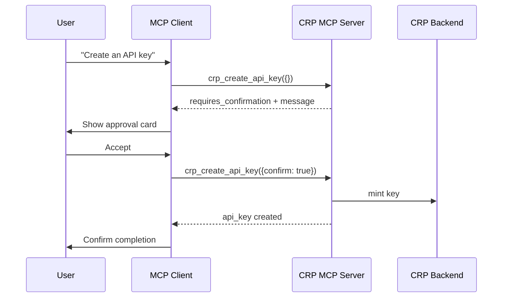
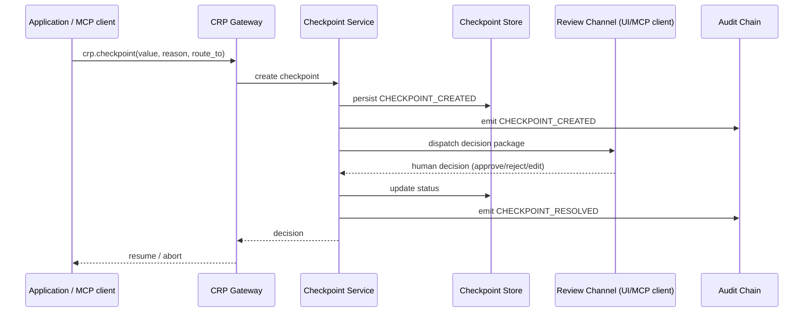

# Setting Up Real CRP Checkpoints

CRP checkpoints are inline, code-level human-in-the-loop gates. This guide explains how to move from the local MCP preview (`crp_safety_checkpoint`) to a production checkpoint system that returns control to the user, surfaces approvals in the MCP client, and optionally notifies the CRP Comply dashboard.

---

## 1. What a checkpoint is

A **checkpoint** pauses an AI-driven decision and **returns control flow to the user**. The user is shown a clear, operational message with **Accept / Reject** (and optionally **Edit**) choices. Execution does not continue until the user responds or a timeout policy applies.

The checkpoint package includes:

* the value or action being gated
* the reasoning chain (CSO decisions)
* evidence / grounded sources
* risk signals (grounding score, hallucination risk, PII flags)
* approve / reject / approve-with-edit buttons

The CRP protocol defines three checkpoint styles:

```python
# Imperative - pause a specific value
approved = crp.checkpoint(decision, reason="...", route_to="...")

# Decorator - guard a function
@crp.checkpoint(reason="...")
def send_email(draft): ...

# Policy-driven - auto-fire on a condition
client.safety.checkpoint_when(condition="risk >= HIGH", route_to="...")
```

Protocol reference: **CRP-SPEC-033 The Safety Control Plane & Inline Human-in-the-Loop**.

---

## 2. The checkpoint returns control flow to the user

The core principle of a CRP checkpoint is that **the AI does not proceed without explicit human approval**. The developer writes:

```python
decision = client.ask("Should we approve this $2M loan application?")

approved = crp.checkpoint(
    decision,
    reason="Loan approvals over $1M require human sign-off",
    route_to="risk-team@company.com",
)

# Execution is BLOCKED here until the human responds.
if approved:
    process_loan()
else:
    reject_loan()
```

### Where the user sees the prompt

| Runtime | User experience |
|---|---|
| **Console / CLI** | A blocking prompt is printed: `Approve this action? [Y/n]` or `Accept / Reject / Edit`. The program waits for stdin. |
| **Web UI (CRP Comply dashboard)** | A modal/toast appears with the decision package and action buttons. |
| **MCP client** | The MCP server returns `requires_confirmation: true`; the client renders an approval card. |
| **Slack / Email / ITSM** | A message card with Approve/Reject links is sent to the configured channel. |

The message must be **operationally clear**: it tells the user exactly what action is pending, why it was gated, and what happens if they accept or reject.

---

## 3. Default review channel: the CRP web console

The default and recommended review channel is the **CRP web console** (`https://comply.crprotocol.io` / self-hosted Comply dashboard). This is *our* user interface — the same place users manage safety policies, scan results, and compliance reports.

Why the CRP UI is the best default:

* **Zero extra integration** — reviewers already authenticate with Clerk.
* **Rich context** — the dashboard can render the full decision package, sources, and risk panel.
* **Tamper-evident audit** — every approve/reject/edit is signed and written to the audit chain (CRP-SPEC-011).
* **Mobile-friendly** — approvers can act from a phone or tablet.

When a checkpoint fires, the reviewer sees:

```text
CHECKPOINT - awaiting your decision
  Reason:     Loan approvals over $1M require human sign-off
  The output: "Recommend approval based on debt-to-income ratio of 0.3..."
  Reasoning:  [CSO decisions with rationale]
  Evidence:   [grounded sources]
  Risk:       MEDIUM (grounding 0.88, 0 fabrications)
  Requested by: loan-service, session crp_sess_7f3a
  ┌─────────────┬─────────┬────────────────────┐
  │   ACCEPT    │ REJECT  │  ACCEPT WITH EDIT  │
  └─────────────┴─────────┴────────────────────┘
```

---

## 4. Checkpoints can be routed anywhere: connector architecture

While the CRP UI is the default, checkpoints are **connector-agnostic**. The same checkpoint can be routed to email, Slack, PagerDuty, ServiceNow, a custom webhook, or any combination.

### 4.1 Proposed connector interface

```python
# crp/comply/checkpoints/connectors/base.py
from abc import ABC, abstractmethod
from dataclasses import dataclass
from typing import Any

@dataclass
class CheckpointPackage:
    checkpoint_id: str
    session_id: str
    reason: str
    value: Any
    reasoning: list[dict]
    evidence: list[dict]
    risk: dict
    route_to: str
    timeout: str
    on_timeout: str

class CheckpointConnector(ABC):
    name: str

    @abstractmethod
    async def dispatch(self, package: CheckpointPackage) -> str:
        """Send the checkpoint to reviewers. Return external ticket ID."""

    @abstractmethod
    async def resolve(self, checkpoint_id: str, decision: str, reviewer: str, note: str | None = None) -> bool:
        """Record a human decision and resume execution."""
```

### 4.2 Connector registry

```python
# crp/comply/checkpoints/registry.py
_CONNECTORS: dict[str, type[CheckpointConnector]] = {}

def register(name: str, connector: type[CheckpointConnector]) -> None:
    _CONNECTORS[name] = connector

def get(name: str) -> CheckpointConnector:
    return _CONNECTORS[name]()

# Built-ins
from .web import WebConsoleConnector
from .mcp_client import MCPClientConnector
from .email import EmailConnector
from .slack import SlackConnector
from .webhook import WebhookConnector
from .servicenow import ServiceNowConnector

register("web", WebConsoleConnector)
register("mcp_client", MCPClientConnector)
register("email", EmailConnector)
register("slack", SlackConnector)
register("webhook", WebhookConnector)
register("servicenow", ServiceNowConnector)
```

### 4.3 Routing configuration example

```yaml
# crp.config.yaml
version: "4.0"
safety:
  checkpoints:
    default_connector: web          # fallback if no route matches
    default_timeout: 1h
    default_on_timeout: reject
    routes:
      - name: high-value-loans
        condition: tool_call == "approve_loan" and amount > 1000000
        connector: web
        route_to: risk-committee@bank.com
        timeout: 4h
        approvers: 2

      - name: public-comms
        condition: tool_call == "send_press_release"
        connector: slack
        route_to: "#legal-comms"
        timeout: 30m

      - name: infra-deployments
        condition: tool_call == "deploy_endpoint"
        connector: servicenow
        route_to: "CHG"
        timeout: 24h
```

### 4.4 Multi-destination routing

A single checkpoint can fan out to multiple connectors:

```yaml
routes:
  - condition: risk >= CRITICAL
    connectors:
      - web
      - slack: "#incidents"
      - email: "ciso@company.com"
    timeout: 15m
    on_timeout: reject
```

The first human resolution wins; duplicate responses are ignored.

---

## 5. MCP server tool approvals

The CRP MCP server uses tool-level human-in-the-loop for state-changing actions. When a tool such as `crp_create_api_key` or `crp_safety_checkpoint` is called without confirmation, the server returns:

```json
{
  "ok": true,
  "requires_confirmation": true,
  "message": "Create Gateway API key: name=mcp-generated-key. This action requires explicit human confirmation. Re-call with confirm=true to proceed."
}
```

### 5.1 The MCP client is the user interface

The **MCP client** (Claude Code, Cursor, IDE, etc.) is the UI that the user sees. The approval prompt must be rendered there.

Because current MCP clients do not implement the `elicitation/create` operation, the server uses the `confirm=true` parameter fallback. The client should:

1. Detect `requires_confirmation: true` in the tool result.
2. Show the user an approval card with **Accept / Reject** buttons.
3. If accepted, re-call the same tool with `confirm=true`.
4. If rejected, stop and report the rejection.



### 5.2 Hosted mode: also notify CRP Comply

When the MCP server is running in **hosted** mode, the approval request should also be sent to the **CRP Comply dashboard** as a notification. This ensures:

* A centralized audit trail even if the MCP client loses state.
* Approvers can act from the CRP web UI if the MCP client does not support interactive approvals.
* Compliance officers can see all pending and resolved tool approvals in one place.

Implementation:

```python
# crp_mcp/server.py inside register_crp_tool()
if result.requires_confirmation:
    await notify_comply(
        tenant_id=identity.org_id,
        type="mcp_tool_approval",
        tool=name,
        args=safe_args,
        action_url=f"https://comply.crprotocol.io/approvals/{approval_id}",
    )
```

The CRP Comply notification includes:

* tool name and arguments (sanitized)
* user/session identity
* reason for approval
* direct link to approve/reject in the CRP UI

### 5.3 Unified model: one approval, two surfaces

The same underlying CRP checkpoint primitive can drive both surfaces:

* **MCP client** gets the immediate, inline approval card.
* **CRP Comply dashboard** gets the persistent notification and audit record.

This is not duplication — it is **defence in depth**. The user can approve in either place; the first resolution is authoritative and the second is ignored.

---

## 6. Who receives the checkpoint

| Target | Use case | Connector |
|---|---|---|
| **End user / operator** | Low-stakes decisions in a consumer app; the person who triggered the AI | `mcp_client`, `web` |
| **Domain expert group** | Loan officers, doctors, lawyers, compliance officers | `web`, `email`, `slack` |
| **Compliance / AI safety team** | High-risk outputs, policy violations, public-facing content | `web`, `slack`, `email` |
| **IT change board** | Infrastructure changes, deployments, production mutations | `servicenow`, `webhook` |
| **On-call engineer** | Critical incidents requiring fast response | `pagerduty`, `slack` |
| **External auditor** | Evidence collection for regulatory review | `webhook` to GRC system |

### Escalation policy

```yaml
safety:
  checkpoints:
    escalation:
      - after: 15m
        connector: slack
        route_to: "#ai-safety"
      - after: 1h
        connector: email
        route_to: ciso@company.com
      - after: 4h
        action: reject   # fail-safe default
```

---

## 7. Backend service architecture

The checkpoint system lives in **CRP Comply** or as a dedicated microservice behind the CRP Gateway.



### Data model

```python
class CheckpointRecord:
    id: str
    tenant_id: str
    session_id: str
    tool_call: str
    condition: str
    reason: str
    value: Any
    reasoning: list[dict]
    evidence: list[dict]
    risk: dict
    connector: str
    route_to: str
    status: "pending" | "approved" | "rejected" | "edited" | "timeout"
    reviewer: str | None
    reviewer_note: str | None
    created_at: datetime
    resolved_at: datetime | None
    signature: str   # HMAC over the record for tamper evidence
```

---

## 8. MCP server integration

Once the backend is wired, `crp_mcp/safety_tools.py` `crp_safety_checkpoint` changes from a preview to a live call:

```python
async def crp_safety_checkpoint(
    ctx: Context,
    trigger: str = "RISK_HIGH",
    message: str = "",
    confirm: bool = False,
) -> str:
    identity = authenticate(ctx)
    if not confirm:
        return ok(requires_confirm(
            "Create human-in-the-loop checkpoint",
            f"trigger={trigger}",
        ))

    require_feature(identity, "comply", "checkpoint")

    checkpoint = await create_checkpoint(
        tenant_id=identity.org_id,
        session_id=get_session_id(ctx),
        trigger=trigger,
        message=message,
        route_to=resolve_route(trigger),
    )

    return ok({
        "checkpoint_id": checkpoint.id,
        "status": checkpoint.status,
        "review_url": checkpoint.review_url,
        "message": "Checkpoint dispatched to the configured review channel.",
    })
```

The MCP tool remains a thin adapter; the real logic lives in the CRP backend.

---

## 9. Security & safety defaults

| Setting | Recommended default | Rationale |
|---|---|---|
| `on_timeout` | `reject` | Fail-safe: never auto-approve a checkpoint |
| `timeout` | `1h` for business hours, `15m` for critical | Balance urgency with human availability |
| `approvers` | `1` default, `2` for high-value/critical | Separation of duties where required |
| `signature` | HMAC-SHA256 on every record | Tamper-evident audit evidence |
| `route_to` validation | Must match configured connector whitelist | Prevents exfiltration to unauthorised channels |
| `retry-after` | `CRP-Safety-Retry-After: oversight-required` | Protocol-compliant pause signal |

---

## 10. Implementation roadmap

| Phase | Deliverable | Effort |
|---|---|---|
| **1** | Web console checkpoint inbox (default UI) | 2–3 weeks |
| **2** | MCP client approval card + `confirm=true` flow | 1–2 weeks |
| **3** | CRP Comply notification integration for hosted MCP | 1 week |
| **4** | Email + Slack connectors | 1–2 weeks |
| **5** | Webhook + PagerDuty connectors | 1 week |
| **6** | ServiceNow / Jira / ITSM connectors | 2 weeks |
| **7** | Escalation policies, multi-approver, audit signing | 2 weeks |
| **8** | Policy language `checkpoint_when` compiler | 3 weeks |

---

## 11. Example: MCP client connector

```python
# crp/comply/checkpoints/connectors/mcp_client.py
from .base import CheckpointConnector, CheckpointPackage

class MCPClientConnector(CheckpointConnector):
    name = "mcp_client"

    async def dispatch(self, package: CheckpointPackage) -> str:
        # The MCP server returns this as the tool result.
        # The client renders the approval UI.
        return package.checkpoint_id

    async def resolve(self, checkpoint_id: str, decision: str, reviewer: str, note: str | None = None) -> bool:
        # Resolution comes from the client's confirm=true re-call.
        return await update_checkpoint_status(checkpoint_id, decision, reviewer, note)
```

---

## 12. Summary

* A **CRP checkpoint returns control flow to the user** with a clear Accept/Reject prompt.
* The **CRP web console is the default review surface** — it is our own UI.
* **MCP client approvals** are surfaced as `requires_confirmation` responses; the client renders the Accept/Reject card and re-calls with `confirm=true`.
* In **hosted mode**, the same approval is also pushed to the **CRP Comply dashboard** as a notification for audit and fallback approval.
* Checkpoints are **routable anywhere** via a pluggable connector system.
* Target markets are regulated/high-stakes domains: finance, healthcare, legal, enterprise SaaS, government.
