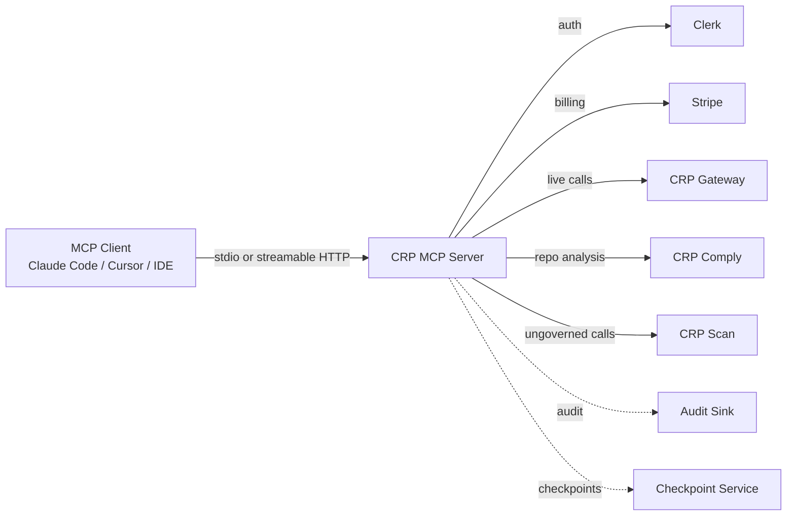

# CRP MCP Server Production Deployment Checklist

This guide takes the hardened CRPv4 MCP server from local development to a production-hosted deployment.

---

## 1. Deployment topology



---

## 2. Environment variables

| Variable | Required | Purpose |
|---|---|---|
| `CRP_MCP_MODE` | yes | `local` or `hosted` |
| `CLERK_ISSUER` | hosted only | Clerk issuer URL |
| `CLERK_AUTHORIZED_PARTIES` | hosted only | Comma-separated allowed client origins |
| `CLERK_SECRET_KEY` | hosted only | Clerk secret for session verification |
| `STRIPE_SECRET_KEY` | hosted only | Stripe secret key (Checkout + plan lookups) |
| `STRIPE_*_PRICE_ID` | hosted only | Price IDs for gateway/comply/scan plans |
| `CRP_GATEWAY_URL` | hosted only | Live Gateway base URL |
| `CRP_COMPLY_BASE_URL` | hosted only | Live Comply base URL |
| `CRP_SCAN_BASE_URL` | hosted only | Live Scan base URL |
| `CRP_HOSTED_API_KEY` | hosted only | Service-to-service API key for backend calls |
| `CRP_PUBLIC_ORIGIN` | hosted only | Public origin used for checkout/callbacks/status URLs |
| `CRP_MCP_ROLE` | optional | Default role: `admin`/`user`/`readonly`/`anonymous` |
| `CRP_MCP_TOOLS_ALLOW` | optional | Whitelist of tool names |
| `CRP_MCP_TOOLS_DENY` | optional | Blacklist of tool names |
| `CRP_MCP_AUDIT_LOG` | recommended | Append-only JSONL audit path |
| `CRP_MCP_CHECKPOINT_LOG` | recommended | Append-only JSONL checkpoint path |
| `CRP_MCP_CHECKPOINT_CONNECTORS` | optional | Comma-separated connector names |
| `CRP_MCP_HOSTED_BYPASS_AUTH` | **never in prod** | Local testing only |
| `PORT` | optional | HTTP port for hosted mode (default `8000`) |

---

## 3. Authentication hardening

✅ Implemented in `crp_mcp/auth.py`:

- `ClerkTokenVerifier` plugs into FastMCP's built-in Bearer auth middleware, so the HTTP transport rejects unauthenticated requests before they reach tool handlers.
- `authenticate(ctx)` extracts Bearer tokens from MCP context headers/meta/state, verifies signature/issuer/audience with `PyJWKClient`, and maps `sub`/`org_id`/`org_role` claims to `Identity`.
- When `CRP_MCP_MODE=hosted` and Clerk env is present, the server auto-enables `auth=AuthSettings(...)` + `token_verifier=ClerkTokenVerifier()`.

Remaining:

1. **Rotate secrets** via your secret manager (Railway variables, AWS Secrets Manager, 1Password, Doppler, etc.).  If any secret was ever printed in a terminal log or shared output, treat it as compromised and rotate it before production.
2. **Disable bypass auth** in production:

   ```bash
   # Confirm it is unset
   [[ -z "$CRP_MCP_HOSTED_BYPASS_AUTH" ]] && echo "OK"
   ```

---

## 4. Authorisation & least privilege

1. Choose the default role per environment:

   ```bash
   # Hosted production: users are least-privileged by default
   CRP_MCP_ROLE=user

   # Admin dashboards only
   CRP_MCP_ROLE=admin
   ```

2. Explicitly allow only the tools an environment needs:

   ```bash
   # A read-only help desk deployment
   CRP_MCP_ROLE=readonly
   CRP_MCP_TOOLS_ALLOW=crp_explain,crp_spec_lookup,crp_compare,crp_quickstart
   ```

3. Deny dangerous tools even for admins if not required:

   ```bash
   CRP_MCP_TOOLS_DENY=crp_deploy_endpoint,crp_benchmark
   ```

4. Verify enforcement:

   ```bash
   CRP_MCP_ROLE=user .venv/Scripts/python - <<'PY'
   import asyncio, json
   from crp_mcp.server import mcp

   async def main():
       content, _ = await mcp.call_tool("crp_create_api_key", {})
       print(json.loads(content[0].text))
   asyncio.run(main())
   PY
   ```

   Expected: `{'ok': False, 'error': 'permission_denied: ...'}`

---

## 5. Audit & compliance

1. Enable the audit log:

   ```bash
   CRP_MCP_AUDIT_LOG=/var/log/crp_mcp/audit.jsonl
   ```

2. Ensure the directory is writable and rotated (logrotate / systemd-journald).
3. Forward to the CRP audit chain in production:

   Set ``CRP_AUDIT_ENDPOINT`` (and optionally ``CRP_AUDIT_API_KEY``).  The
   server will POST each audit record fire-and-forget to
   ``{CRP_AUDIT_ENDPOINT}/events`` so a centralized audit sink can index them.

   ```bash
   CRP_AUDIT_ENDPOINT=https://comply.crprotocol.io/v1/audit
   CRP_AUDIT_API_KEY=crp_audit_...
   ```

4. Retain logs per your compliance regime:

   | Regime | Recommended retention |
   |---|---|
   | EU AI Act Art. 12 | 6 years |
   | ISO 42001 | 3+ years |
   | SOC 2 | 1 year minimum |

---

## 6. Billing & entitlements

✅ Implemented in `crp_mcp/billing.py`:

- `create_checkout_session()` builds Stripe Checkout sessions using price IDs mapped from `STRIPE_*_PRICE_ID` env vars.
- `get_entitlement()` searches Stripe Customers by `metadata:crp_org_id`, enumerates active subscriptions, and maps price IDs to feature lists.
- `require_feature()` raises `upgrade_required:product:feature` when a tool is not on the active plan.

Configure price IDs:

```bash
STRIPE_GATEWAY_DEVELOPER_PRICE_ID=<YOUR_STRIPE_PRICE_ID>
STRIPE_GATEWAY_TEAM_PRICE_ID=<YOUR_STRIPE_PRICE_ID>
STRIPE_COMPLY_STARTER_PRICE_ID=<YOUR_STRIPE_PRICE_ID>
STRIPE_COMPLY_SCALE_PRICE_ID=<YOUR_STRIPE_PRICE_ID>
STRIPE_SCAN_STARTER_PRICE_ID=<YOUR_STRIPE_PRICE_ID>
STRIPE_SCAN_SCALE_PRICE_ID=<YOUR_STRIPE_PRICE_ID>
```

---

## 7. Backend wiring

✅ Implemented in `crp_mcp/backend_client.py`:

| Tool | Backend client | Env vars |
|---|---|---|
| `crp_test_call`, `crp_deploy_endpoint`, `crp_benchmark` | `GatewayClient` | `CRP_GATEWAY_URL`, `CRP_HOSTED_API_KEY` |
| `crp_create_api_key` | `GatewayClient` | `CRP_GATEWAY_URL`, `CRP_HOSTED_API_KEY` |
| `crp_scan_repo`, `crp_scan_status`, `crp_scan_report` | `ScanClient` | `CRP_SCAN_BASE_URL`, `CRP_HOSTED_API_KEY` |
| `crp_comply_repo`, `crp_comply_status`, `crp_comply_diff` | `ComplyClient` | `CRP_COMPLY_BASE_URL`, `CRP_HOSTED_API_KEY` |
| `crp_whoami`, `crp_get_plan` | Clerk + Stripe billing | `CLERK_*`, `STRIPE_*` |

All clients fall back to safe stubs when backend env is missing, so local mode continues to work:

```python
if not hosted_available():
    return ok(not_configured("deploy_endpoint"))
```

Expected backend paths (adjust to your deployed services):

- Gateway: `POST /keys`, `POST /test-call`, `POST /deployments`, `POST /benchmarks`
- Scan: `POST /scans`, `GET /scans/{scan_id}`
- Comply: `POST /analyses`, `GET /analyses/{analysis_id}`, `GET /analyses/{analysis_id}/diff?baseline={baseline_id}`, `POST /checkpoints`

---

## 8. Checkpoints in production

✅ Implemented in `crp_mcp/checkpoint_service.py` + `crp_mcp/connectors/`:

- `crp_safety_checkpoint()` creates a real checkpoint in hosted mode, persists to `CRP_MCP_CHECKPOINT_LOG`, forwards to CRP Comply, and notifies review channels.
- Built-in connectors: `console` (default), `comply`, `webhook`, `slack`, `gmail`, `fcm`, `sms` (Twilio), generic `email` (SMTP).
- Select channels via `CRP_MCP_CHECKPOINT_CONNECTORS=console,slack,gmail,fcm`.

### Recommended free stack

| Connector | Use case | What you need from your side |
|---|---|---|
| **fcm** | Push notifications to users' devices | Firebase project + service-account JSON + device registration tokens |
| **slack** | Team/internal alerts | Slack Incoming Webhook URL |
| **gmail** | User-facing transactional emails | Gmail/Google Workspace address + App Password |

Configuration example:

```bash
CRP_MCP_CHECKPOINT_CONNECTORS=console,slack,gmail,fcm

SLACK_WEBHOOK_URL=<YOUR_SLACK_WEBHOOK_URL>

GMAIL_USER=alerts@crprotocol.io
GMAIL_APP_PASSWORD="xxxx xxxx xxxx xxxx"
GMAIL_TO=team@crprotocol.io,ops@crprotocol.io

FIREBASE_SERVICE_ACCOUNT_JSON='{"type":"service_account","project_id":"..."}'
FIREBASE_PROJECT_ID=your-project-id
FCM_DEVICE_TOKENS=token1,token2
```

### Action items from your side

1. **Firebase / FCM**
   - Create a Firebase project at https://console.firebase.google.com.
   - Go to Project Settings → Service Accounts → Generate new private key.
   - Save the JSON and set `FIREBASE_SERVICE_ACCOUNT_JSON` (or `GOOGLE_APPLICATION_CREDENTIALS` pointing to the file).
   - Get device registration tokens from your client apps and set `FCM_DEVICE_TOKENS`.

2. **Slack**
   - Create an Incoming Webhook for the channel you want at https://api.slack.com/messaging/webhooks.
   - Copy the Webhook URL to `SLACK_WEBHOOK_URL`.

3. **Gmail**
   - Enable 2-Step Verification on the Google account.
   - Generate an App Password at https://myaccount.google.com/apppasswords.
   - Set `GMAIL_USER`, `GMAIL_APP_PASSWORD`, and `GMAIL_TO`.

---

## 9. Infrastructure & runtime

### 9.1 Streamable HTTP mode

```bash
export CRP_MCP_MODE=hosted
export PORT=8000
python -m crp_mcp.server
```

Run behind a TLS-terminating reverse proxy (Caddy, Nginx, Railway).  Do not expose the MCP HTTP port directly to the internet; terminate TLS at the edge and forward plain HTTP to the container.

### 9.2 Health endpoint

The MCP server does not expose a custom `/health`. Use the MCP `ping` request or add a lightweight sidecar.

### 9.3 Logging

* stdout/stderr must go to your log aggregator.
* In stdio mode, stdout is the MCP transport; **never** print to stdout.
* Audit logs go to `CRP_MCP_AUDIT_LOG`.
* When `CRP_AUDIT_ENDPOINT` is configured, audit records are also forwarded to
  the CRP audit sink for centralized indexing and retention.

### 9.4 Secrets management

| Secret | Where |
|---|---|
| `CLERK_SECRET_KEY` | Secret manager |
| `STRIPE_SECRET_KEY` | Secret manager |
| `CRP_HOSTED_API_KEY` | Secret manager |
| `CRP_MCP_AUDIT_LOG` | File path (non-secret) |

Never commit secrets. Validate with:

```bash
grep -R "sk_\|pk_\|secret" crp_mcp/ tests/
```

---

## 10. Monitoring & observability

| Metric | How to collect |
|---|---|
| Tool call volume | Parse `CRP_MCP_AUDIT_LOG` |
| Permission denials | Parse `CRP_MCP_AUDIT_LOG` where `allowed=false` |
| Error rate | Tool results where `ok=false` |
| HITL confirmation rate | Compare `requires_confirmation=true` responses to `confirm=true` follow-ups |
| Checkpoint resolution time | Checkpoint service metrics |
| Latency | Reverse proxy / APM (Datadog, Honeycomb, OpenTelemetry) |
| Audit forwarder lag | Compare `CRP_MCP_AUDIT_LOG` timestamps to arrival time at `CRP_AUDIT_ENDPOINT` |

Recommended alerts:

* Spike in permission denials (possible attack or misconfiguration)
* Checkpoint timeout rate > 5%
* Any `CRP_MCP_HOSTED_BYPASS_AUTH=1` in production

---

## 11. Backup & disaster recovery

| Asset | Backup strategy |
|---|---|
| Audit logs | Append-only, replicated to object storage (S3, R2) |
| Clerk org data | Clerk handles this |
| Gateway/Comply databases | Follow CRP backend runbooks |
| `crp.config.yaml` | Git + config-management tool |

---

## 12. Pre-launch verification matrix

| Check | Command / Action | Pass criteria |
|---|---|---|
| Tests pass | `pytest tests/test_crp_mcp.py tests/test_crp_mcp_coverage.py tests/test_crp_mcp_permissions.py tests/test_sdk_namespaces.py tests/test_crp_mcp_auth.py tests/test_crp_mcp_connectors.py tests/test_crp_mcp_checkpoint.py tests/test_crp_mcp_checkpoint_policy.py tests/test_crp_mcp_billing.py tests/test_crp_mcp_backends.py -q` | 213 passed |
| Lint clean | `ruff check crp_mcp/server.py crp_mcp/types.py crp_mcp/permissions.py crp_mcp/resources.py crp_mcp/checkpoint_service.py crp_mcp/checkpoint_policy.py crp_mcp/safety_tools.py tests/test_crp_mcp_permissions.py tests/test_crp_mcp_coverage.py tests/test_crp_mcp_checkpoint.py tests/test_crp_mcp_checkpoint_policy.py` | no errors |
| Docs build | `DISABLE_MKDOCS_2_WARNING=true python scripts/audit_docs.py` | no findings |
| Bypass auth off | `echo $CRP_MCP_HOSTED_BYPASS_AUTH` | empty |
| Permissions enforced | `CRP_MCP_ROLE=user python -m crp_mcp.server` then call `crp_create_api_key` | permission_denied |
| HITL gate works | call `crp_test_call` without `confirm` | requires_confirmation |
| Audit log writes | set `CRP_MCP_AUDIT_LOG`, call a tool | JSONL line exists |
| Audit forwarder works | set `CRP_AUDIT_ENDPOINT`, call a tool | POST received at endpoint |
| Secrets redacted | inspect audit log | no raw `api_key`/`token` values |
| Hosted mode starts | `CRP_MCP_MODE=hosted ... python -m crp_mcp.server` | no errors |

---

## 13. Go-live runbook

1. **Day -7**: Deploy to staging with Clerk test tenant and Stripe test mode.
2. **Day -3**: Run the verification matrix in staging.
3. **Day -1**: Rotate all secrets; confirm `CRP_MCP_HOSTED_BYPASS_AUTH` is unset.
4. **Day 0**: Deploy to production with `CRP_MCP_ROLE=user` and `CRP_MCP_AUDIT_LOG` enabled.
5. **Day +1**: Monitor permission denials, audit volume, and checkpoint resolution times.
6. **Day +7**: Review first week audit sample for anomalies.

---

## 14. Summary

Production readiness for the CRP MCP server is five layers:

1. **AuthN/AuthZ** — Clerk + role-based permissions + allow/deny lists.
2. **Billing** — Stripe Checkout + entitlement checks.
3. **Backends** — Gateway, Comply, Scan, tenant key service.
4. **Audit & checkpoints** — append-only JSONL, real review channels.
5. **Operations** — TLS, secrets management, monitoring, runbooks.

With these in place, the CRP MCP server is ready for regulated, multi-tenant production use.
