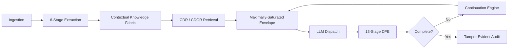

# CRP Capabilities & Benefits

Context Relay Protocol (CRP) is the **agentic positioning layer** for SLM-first AI. It wraps existing LLM calls to give every agent operation its own curated context window and the exact tools it needs — while preserving knowledge, state, and auditability across an unlimited number of windows.

!!! tip "In one sentence"
    CRP selects the right operation for the agent, loads only the 1–3 tools the call needs, extracts atomic facts, stores them in a graph-structured knowledge fabric, and packs the most relevant scored facts into each dedicated window. It continues generation automatically, scores every response for safety and grounding, and emits a tamper-evident audit chain that feeds directly into compliance evidence.

!!! success "Why CRP wins"
    - **Zero in-window overhead.** CRP never puts protocol metadata, memory-management instructions, or function schemas inside the LLM's window - the model receives system prompt + scored facts + task.
    - **O(N) token scaling.** Envelopes scale linearly with task size, avoiding the O(N²) cost explosion of growing native context.
    - **Two-sided provenance.** Every output claim and every input fact is traced to its upstream source kind, signed and tamper-evident.
    - **Automatic compliance evidence.** EU AI Act, ISO 42001, GDPR, NIST AI RMF, AIUC-1, and SOC 2-for-AI control evidence is generated from runtime audit data, not manual documentation.

---

## What CRP does

Instead of dumping documents, tool outputs, history, and instructions into a single shared context, CRP manages the complete context lifecycle as a protocol:



Integration can be as simple as changing one `base_url` or calling `crp.SDKClient()`.

---

## Unbounded context & continuation

| Capability | What it means | Why it matters |
|---|---|---|
| **Automatic continuation** | Detects `finish_reason="length"`, verifies remaining gaps, and dispatches fresh windows until the work is done. | Tasks that exceed output limits finish instead of truncating mid-sentence. Benchmark: **11.8× more content**, **25/30 sections completed** vs. 8/30 without CRP. |
| **Multi-signal completion detection** | Monitors fact flow, structural flow, vocabulary novelty, and structural completion, weighted by content type. | No arbitrary iteration limits and no premature termination of genuine conclusions. |
| **Re-grounding** | When cumulative degradation exceeds 15 %, CRP re-extracts facts from all accumulated output and rebuilds warm state. | Corrects drift in long chains without manual intervention; cost ~10–50 ms. |
| **Content-type-aware stitching** | Echo detection, boundary detection for prose / code / JSON / markdown / lists, and post-stitch validation. | Multiple windows read as one coherent document with no duplicate sections or broken headings. |
| **Cognitive State Object (CSO) relay** | Carries established facts, decisions, dependencies, and gaps across continuation windows. | Long reasoning chains do not lose intermediate conclusions or open items. |
| **Unbounded input ingestion** | Structure-aware chunking with protected spans and 500-token overlap reconciliation. | Million-token contracts or corpora can be consumed without truncation. |

```python
answer = client.ask(
    "Write a complete deployment guide",
    depth="exhaustive"          # triggers continuation + re-grounding
)
print(answer.complete)          # True when CRP decides the task is done
print(answer.quality)           # S | A | B | C | D
print(answer.decisions)         # established decisions carried forward
print(answer.open_questions)    # gaps that still need resolution
```

---

## Knowledge & retrieval

| Capability | What it means | Why it matters |
|---|---|---|
| **Contextual Knowledge Fabric (CKF)** | Typed knowledge graph with SQLite + HNSW vector index + Leiden community detection and event-sourced history. | Facts persist across turns and sessions; multi-document reasoning is graph-structured, not flat chunk matching. |
| **4-mode retrieval** | Graph walk, pattern query, semantic ANN fallback, and community summaries. | Finds related facts even when wording differs or documents are disconnected. |
| **Coverage Differential Retrieval (CDR)** | Ranks facts by novelty relative to what the session already knows, suppressing redundancy. | Prevents the same context from being repeated every turn; improves token efficiency. |
| **Context Differential Graph Retrieval (CDGR)** | Walks CKF graph edges to bridge disconnected facts across documents. | Cross-document reasoning and source attribution improve. |
| **Multi-horizon context** | Persistent, conversational, and ephemeral tiers blended per operation. | Right context lifetime for the right use case; transient tool data does not pollute long-term memory. |
| **Ephemeral tool context / scratch buffer** | Pointer-based large working data with structure-aware handling and freshness-gated TTL. | Tool outputs that exceed a window can be referenced without consuming tokens. |
| **Garbage collection & compaction** | Staleness detection, relevance decay, deduplication, and index rebuilding. | Storage stays bounded and relevant over time. |

```python
client.ingest("./docs/")                       # zero-LLM ingestion
client.ingest("https://example.com/spec.html") # URL ingestion

print(client.knowledge.health())               # fact count, staleness, index status
print(client.storage.overview())               # hot / warm / cold distribution
```

---

## Context envelope & packing

| Capability | What it means | Why it matters |
|---|---|---|
| **Maximally-saturated envelope** | Fills all remaining context tokens after system prompt, task, and generation reserve: `E = C - S - T - G`. | Every token earns its place; observed saturation **0.939–1.021 (mean 0.994)**. |
| **11-section priority-ordered envelope** | Critical state, synthesis, task brief, discoveries, source passages, decisions, error log, tool history, expanded context, CKF retrievals, reasoning scaffold. | Higher-priority sections survive when space is tight. |
| **3-phase fact selection** | Task decomposition → bi-encoder fast scoring (HNSW ANN) → cross-encoder reranking (top 200). | High relevance with low latency; cache hit rate **50–80 %** in continuation chains. |
| **Bookend strategy** | Repeats the top 3 facts at the end of the envelope. | Counters "lost in the middle" attention bias. |
| **Dependency-aware graph packing** | Pulls up to 2 hops of connected facts during packing. | Related facts travel together, improving coherence. |

!!! info "Zero in-window protocol overhead"
    CRP never puts protocol metadata, memory-management instructions, or function schemas inside the LLM's window. The model receives system prompt + scored facts + task. **The model never knows CRP exists.**

---

## Extraction pipeline

| Capability | What it means | Why it matters |
|---|---|---|
| **6-stage graduated extraction** | Regex → statistical NLP → GLiNER NER → UIE relations → RST discourse → LLM-assisted relational. | Structured knowledge, not text chunking; stages self-gate by content complexity. |
| **Content complexity routing** | Auto-classifies content as `ENTITY_RICH`, `REASONING_DENSE`, or `NARRATIVE`. | Simple content is fast (~10 ms); complex content gets the depth it needs. |
| **3-tier fact quality gate** | Structural validation, confidence scoring, anomaly detection. | Low-quality or outlier facts are discarded or demoted before entering CKF. |
| **Zero-LLM ingestion** | `client.ingest()` extracts facts without calling the LLM (~7 ms typical). | Tool outputs and documents become knowledge cheaply. |
| **Event-sourced fact model** | Append-only fact log with snapshots every 50 windows. | Full temporal query support and audit trail. |

---

## Safety & governance

| Capability | What it means | Why it matters |
|---|---|---|
| **13-stage Decision Provenance Engine (DPE)** | Claim detection → attribution → fabrication → distortion → entailment → contradiction → repetition → completeness → flow → hallucination risk → quality tiering → policy evaluation → provenance binding. | Catches invented claims, altered numbers, negation flips, self-contradictions, omissions, and coherence collapse; total budget **< 50 ms**. |
| **Safety Control Plane** | Central registry of safety capabilities: hallucination scoring, grounding, contradiction, repetition, PII, prompt injection, safety budget, compliance classification, tamper-evident audit, human oversight. | Rules are inspectable, tunable, and extensible at runtime. |
| **Safety Coverage Map** | Addable rules for jailbreak, toxicity, secrets, copyright, agency boundary, semantic drift, with explicit out-of-scope list. | Clear, auditable scope of what is and isn't guarded. |
| **Declarative Safety Policy header** | Wire-level policy like `halt-on CRITICAL; redact-on HIGH PII; require-grounding 0.75; checkpoint-on HIGH`. | Enforcement happens at the protocol/Gateway layer, so application code cannot accidentally skip checks. |
| **Safety profiles** | `balanced`, `strict`, `permissive`, `research`. | One-line governance configuration for common operational postures. |
| **Checkpoints / human-in-the-loop** | Async human approval with timeout, webhook, HMAC audit integration, approve/reject/edit actions. | HIGH/CRITICAL risk outputs pause for review without raw errors. |
| **Prompt injection shield** | Detects direct, indirect, goal-hijacking, exfiltration, delimiter-forgery, and embedded tool-call patterns. | Malicious or accidental prompt attacks are flagged before they reach users. |
| **PII scanner** | Detects 7+ categories of personal data in inputs/outputs. | Supports GDPR data-minimization and breach prevention. |
| **Safety budget & circuit breaker** | Per-session risk allowance that decrements with risky outputs; opens a circuit at depletion. | Multi-turn and multi-agent chains stay within aggregate risk limits. |

```python
client = crp.SDKClient(safety="strict")

answer = client.ask(
    "Summarise the contract",
    safety={"halt_on": "CRITICAL", "require_grounding": 0.80}
)

print(answer.crp.risk)                  # LOW | MEDIUM | HIGH | CRITICAL
print(answer.crp.grounded)              # grounding score
print(answer.crp.fabrications)          # count of detected fabrications
print(answer.crp.injection_detected)    # True / False
print(answer.crp.pii_detected)          # True / False
print(answer.crp.chain_valid)           # True if HMAC chain verifies
```

---

## Provenance & audit

| Capability | What it means | Why it matters |
|---|---|---|
| **Two-sided provenance** | Output-side attribution plus input-side `ContextSource` records (RAG, vector DB, DB, MCP tool, function call, web search, user turn, file upload, agent memory, parametric). | Regulators and auditors can trace where every claim came from and where every input fact originated. |
| **HMAC-SHA256 audit chain** | Every window/operation extends a signed chain; tampering surfaces as `CRP-Provenance-Chain-Integrity: BROKEN`. | Cryptographically verifiable evidence of what happened. |
| **BLAKE3 fact integrity + AES-256-GCM encryption** | Per-fact hashing and encrypted cold state/event log. | State tampering is detectable and data at rest is protected. |
| **Session token** | Signed token binding session ID, policy hash, capabilities, expiry, and audience. | Prevents replay, pins safety policy, and binds Gateway/Comply/Visualise to the same session. |
| **Window DAG** | Directed acyclic graph tracking continuation, fan-out, and fan-in relationships. | Full lineage from any output back through windows, envelopes, and tasks. |
| **Audit export** | Tamper-evident JSON/CSV audit documents with signatures. | One-click regulator-ready evidence. |

```python
print(answer.sources)                           # cited facts
client.audit.verify()                           # verify HMAC chain
client.audit.export(include_signatures=True)    # regulator-ready bundle
```

---

## Compliance

| Capability | What it means | Why it matters |
|---|---|---|
| **Control evidence** | HMAC-signed, tamper-evident proof that safety, security, and governance controls operated on every call. | Satisfies EU AI Act, AIUC-1, ISO 42001, NIST AI RMF, and SOC 2-for-AI from live runtime data. [Full mapping →](control-evidence.md) |
| **AIUC-1 alignment** | One of CRP's strongest proof points: adversarial robustness, filtering, harmful-output prevention, hallucination prevention, audit, and accountability mapped to AIUC-1 domains A–F. | Covers **80%+ of AIUC-1 requirements** out of the box. [AIUC-1 mapping →](aiuc-1.md) |
| **EU AI Act Art. 6–17 coverage** | Risk classification, technical documentation, record-keeping, transparency, human oversight, accuracy, quality management. | Addresses **33/35 technical controls**; supports high-risk system deployment. |
| **ISO/IEC 42001:2023 alignment** | A.6.2.3–A.6.2.8 and clauses 4–10 mapped to CRP features. | Provides evidence for AI management system certification. |
| **GDPR** | Consent, right of erasure, records of processing (Art. 30), DPIA (Art. 35), data protection by design. | Personal-data workflows stay accountable and demonstrable. |
| **NIST AI RMF** | GOVERN / MAP / MEASURE / MANAGE functions mapped. | Continuous, evidence-backed risk management. |
| **SOC 2 / HIPAA / ISO 27001** | Monitoring, anomaly detection, tamper-resistant audit controls, logging and monitoring. | Supports additional regulated-industry requirements. |
| **8 compliance generators** | Risk assessment, compliance report, DPIA, transparency declaration, technical docs, session audit, evidence pack, signed certificate. | Turns months of consultant work into seconds of generated evidence. |

```python
client.compliance.classify(framework="eu-ai-act")
client.compliance.report(framework="iso-42001")
client.compliance.report(framework="nist-ai-rmf")
```

[:octicons-arrow-right-24: Compliance overview](compliance/index.md)

---

## Provider abstraction & Gateway

| Capability | What it means | Why it matters |
|---|---|---|
| **OpenAI-compatible Gateway** | HTTPS proxy that adds DPE, safety policy, continuation, and audit to any OpenAI-compatible call. | Add governance with a single `base_url` change and zero application changes. |
| **Multi-provider adapters** | OpenAI, Anthropic, Gemini, Bedrock, Mistral, Cohere, Ollama, LM Studio, vLLM, TGI, llama.cpp, and any custom endpoint. | No vendor lock-in; same governance contract everywhere. |
| **Provider auto-detection** | `crp.SDKClient()` checks env vars and local runtimes. | Works with zero configuration. |
| **Axiom 4: header stripping** | All `CRP-*` / `X-CRP-*` headers are stripped before forwarding to the LLM provider. | CRP metadata never leaks to external providers. |
| **Deployment modes** | Embedded library, self-hosted container, Kubernetes sidecar, managed cloud, edge. | Fits existing infrastructure without forcing a SaaS dependency. |
| **CRP CLI** | `crp scan`, `crp serve`, `crp status`, `crp preview`. | Command-line governance for scanning and sidecar operation. |

---

## Multi-agent safety

| Capability | What it means | Why it matters |
|---|---|---|
| **Chain budget headers** | `CRP-Chain-Id`, `CRP-Chain-Step`, `CRP-Chain-Budget`, `CRP-Risk-Accumulator`. | Observes aggregate risk across chained agents, not just per-call risk. |
| **Circuit breaker** | Returns `409 Conflict` with `CRP-Safety-Verdict: CIRCUIT-BREAK` when accumulated risk would exceed budget. | Prevents runaway agent chains. |
| **Clean MCP / A2A layering** | CRP sits under MCP (tools) and A2A (agent messaging). | Complementary to emerging agent standards rather than competitive. |

!!! abstract "CRP is the foundation layer under MCP and A2A"
    MCP gives agents tools. A2A lets agents talk. **CRP gives each agent the unbounded, governed context both assume.**

---

## SDK & developer experience

| Capability | What it means | Why it matters |
|---|---|---|
| **4 progressive SDK levels** | L0 drop-in governance → L1 knowledge + cited answers → L2 depth/tools/safety/reasoning transparency → L3 headers/audit/compliance/conformance/amplification. | Start simple; unlock advanced control only when needed. |
| **Depth negotiation** | `quick`, `standard`, `thorough`, `exhaustive`. | Controls compute/token budget per query intent. |
| **Streaming** | Synchronous token/event streaming with continuation-window events. | Live UIs and chatbots. |
| **Tool decorator** | `@client.tool` registers functions the model can invoke; outputs are extracted into CKF. | First-class tool use with automatic memory. |
| **Unified config** | 5-layer hierarchy (defaults → env → file → init kwargs → runtime `configure()`) with optional `crp.config.yaml`. | Governance-as-code with provenance hash. |
| **Pluggable storage backends** | `InMemoryBackend`, `SQLiteBackend`, `RedisBackend`, `S3Backend`. | Choose the right primitive per access pattern and deployment. |

```python
@client.tool
def lookup_user(user_id: str) -> dict:
    ...

answer = client.ask(
    "What did user 42 do yesterday?",
    depth="thorough",
    tools=["lookup_user"]
)
print(answer.how_it_was_built)      # reasoning transparency
print(answer.open_questions)        # unresolved gaps
```

---

## Products

| Product | What it is | Why it matters |
|---|---|---|
| **CRP Gateway** | Managed AI safety infrastructure / OpenAI-compatible proxy. | One line adds governance, continuation, DPE, and audit to any service. |
| **CRP Comply** | Compliance gateway + dashboard + report generator. | Generates EU AI Act / ISO 42001 / GDPR evidence packs from runtime data. |
| **CRP Scan** | GitHub Action and CLI scanner for ungoverned AI calls. | Catches HIGH/CRITICAL governance gaps in CI and opens remediation PRs - never direct commits to main. |
| **CRP Visualise** | Live session DAG/provenance/risk browser *(roadmap)*. | Auditors and incident responders inspect any session visually. |
| **CRP Scribe** | Long-form document/book generation engine *(roadmap)*. | Unlimited-length coherent documents. |

---

## Reasoning amplification & meta-learning

| Capability | What it is | Why it matters |
|---|---|---|
| **ORC** | Orchestrated Reasoning Chains - decompose hard tasks into micro-steps. | Small models (2B–7B) perform multi-step reasoning they cannot do natively. |
| **ICML** | In-Context Meta-Learning - adaptive reasoning scaffolds and few-shot traces. | Model receives the right level of structure for its capability. |
| **RTL** | Reasoning Template Library - stores and reuses high-quality reasoning traces. | System improves from successful past runs. |

!!! success "Research-backed result"
    CRP scaffolding has been shown to let a **770M model outperform a 540B model on structured tasks** (Hsieh et al., 2023). ORC + ICML + RTL make small local models viable for production reasoning.

---

## Zero-CKF mode & conformance

| Capability | What it is | Why it matters |
|---|---|---|
| **Zero-CKF mode** | Full safety, audit, and provenance enforcement even with no ingested documents. | CRP delivers value immediately after `import crp`. |
| **Progressive activation** | More facts unlock entailment, external attribution, and higher quality tiers automatically. | Capability grows gracefully with knowledge. |
| **Conformance levels** | Level 1 (header-aware), Level 2 (full interop), Level 3 (sovereign/offline). | Buyers, auditors, and regulators can verify interoperability guarantees. |

```python
import crp
client = crp.SDKClient()
answer = client.complete("What is the capital of France?")
print(answer.crp.risk)              # safety works without any ingestion
print(answer.crp.chain_valid)       # audit chain is active from the first call
```

---

## Benefits by audience

### Developers
- **One-line integration**: change `base_url` or call `crp.SDKClient()` to get governed, audited LLM calls.
- **Zero-config provider detection**: auto-discovers OpenAI, Anthropic, Ollama, LM Studio, or custom endpoints.
- **Progressive disclosure**: start with `client.ask()`; unlock depth, tools, safety profiles, and audit only when needed.
- **Local-first**: runs entirely on Ollama / LM Studio at $0 marginal cost.
- **No infrastructure gate**: embedded library with optional HTTP sidecar; no required server.
- **Honest quality signal**: `answer.quality` (S/A/B/C/D) and `answer.complete` remove guesswork.

### Enterprises & compliance officers
- **EU AI Act readiness**: 33/35 technical controls implemented; risk classification, technical docs, record-keeping, transparency, human oversight, accuracy, and quality management mapped to Articles 9–17.
- **Evidence from reality, not paperwork**: risk assessments, DPIAs, and conformity evidence packs are generated from cryptographic audit trails of actual system behavior.
- **Multi-framework coverage**: EU AI Act, ISO 42001, GDPR, NIST AI RMF, SOC 2, HIPAA, ISO 27001.
- **Data residency & SSO**: available in Scale/Enterprise tiers; air-gapped deployment supported.
- **Signed certificates** (Cloud tier): HMAC-SHA256 digitally signed compliance certificates verifiable at `crprotocol.io/verify/{id}`.
- **7-year audit retention** and signed DPAs in Enterprise.

### Safety engineers
- **Observable, not opaque**: every call returns `risk`, `grounded`, `fabrications`, `pii_detected`, `injection_detected`, `compliant`, and `chain_valid`.
- **Enforceable policy**: Safety Policy header acts like CSP for AI; halts, redacts, warns, or checkpoints based on deterministic rules.
- **Sub-50 ms safety overhead**: 13 DPE stages plus policy evaluation fit within a strict latency budget.
- **Tamper-evident chain**: HMAC-SHA256 + BLAKE3 makes post-hoc alteration detectable.
- **Black-box governance**: CRP does not need to inspect model weights; it governs inputs and outputs.

### Product teams
- **Finish tasks**: automatic continuation turns truncated 8-section outputs into 25-section completed documents.
- **Reduce hallucination liability**: fabrication counts, grounding scores, and contradiction detection surface problems before users see them.
- **Faster compliance launches**: compliance evidence is a byproduct of normal operation, not a 6-month consulting engagement.
- **Cost efficiency**: ~70 % lower cloud API cost vs. naive MCP agent loops due to tool-schema isolation and O(N) envelope scaling vs. O(N²) native context growth.
- **Quality transparency**: degradation is reported honestly, not hidden.

---

## Concrete use cases

| Use case | How CRP delivers | Outcome |
|---|---|---|
| **Long-form report generation** | Continuation engine + voice profile + document map + re-grounding | 30-section reports completed with conclusion instead of truncating at section 8 |
| **Penetration testing workflows** | Each recon/tool-select/analysis/report step gets a fresh, fact-packed window | Tool outputs become persistent, ranked findings; final report carries all discoveries |
| **Legal / contract analysis** | Auto-ingests million-token documents; CKF links clauses across pages | Cross-reference questions answered with source attribution |
| **Medical literature review** | Cross-session CKF accumulates papers; community detection groups related findings | Synthesized evidence with provenance back to each paper |
| **Customer-support automation** | PII detection, GDPR consent/retention records, EU AI Act risk classification | Regulated chatbot deployment with audit-ready evidence |
| **Code generation across large codebases** | Multi-window generation with architecture facts in each envelope | Coherent multi-file output with structural integrity |
| **Small-model deployment** | ORC/ICML/RTL scaffolding | 2B–7B local models perform reasoning tasks normally requiring 10× larger models |
| **Agentic tool use (MCP-compatible)** | Tool results extracted into CKF; schemas isolated to tool-selection windows | Lower token burn and better context retention than raw MCP loops |
| **Multi-agent orchestration** | Chain budget + risk accumulator + circuit breaker | Aggregate risk stays bounded across agent chains |
| **Compliance audit defense** | One-click evidence packs + HMAC audit chain + session reconstruction | Auditors receive regulator-ready artifacts in minutes, not months |
| **CI/CD governance scanning** | CRP Scan GitHub Action flags ungoverned LLM calls and opens remediation PRs | HIGH/CRITICAL AI governance gaps caught before merge |

---

## Key differentiators

1. **Zero in-window protocol overhead.** CRP never puts protocol metadata, memory-management instructions, or function schemas inside the LLM's window. The model never knows CRP exists.
2. **O(N) token scaling vs. O(N²) native context growth.** CRP envelopes scale linearly; growing native context quadratically inflates cost.
3. **Two-sided provenance.** CRP traces both output claims *and* input facts to their upstream source kind, with signed `ContextManifest` attestation and `CONTEXT_ATTESTATION_MISMATCH` events.
4. **Quantum-resistant posture today.** Symmetric-only cryptography (HMAC-SHA256, AES-256-GCM, BLAKE3) means zero RSA/ECC keys for Shor's algorithm to target; 128-bit post-quantum security already.
5. **1,537 automated tests** and a public conformance suite with three verifiable levels.
6. **CRP is the foundation layer under MCP and A2A.** MCP gives agents tools; A2A lets agents talk; CRP gives each agent the unbounded, governed context both assume.
7. **Reasoning amplification for small models.** ORC + ICML + RTL scaffolding can let a 770M model outperform a 540B model on structured tasks.
8. **Elastic License 2.0 + open specification.** Free to use in your own applications; open, standards-body-submitted specs.
9. **Four-tier memory hierarchy** (active context / hot state / warm state / cold CKF) with async persistence and in-memory hot path.
10. **Re-grounding triggered by measured degradation**, not a fixed schedule - an honest, adaptive quality preservation mechanism.
11. **HTTP sidecar for inter-LLM knowledge sharing** - structured fact sharing across different models/applications without API-key sharing or LLM-to-LLM chat.
12. **Context-source enforcement pipeline** with manifest ledger, key rotation, provider hooks, and SIEM forwarding.

---

## Proof: real numbers

| Metric | Without CRP | With CRP | Multiplier |
|--------|------------|----------|-----------|
| Words produced | 592 | 6,993 | **11.8×** |
| Sections completed | 8/30 | 25/30 | **3.1×** |
| Task completed? | No | **Yes** | - |
| Quality tier | - | **A** | - |
| Safety overhead | - | **< 50 ms** | - |
| Throughput | 4.9 w/s | 4.9 w/s | **Same** |

Same model, same hardware, same task. CRP finishes the task - and proves it was safe.

[:octicons-arrow-right-24: Read the full benchmark results](testing/benchmarks.md)

---

## Talk to sales

Need Scale or Enterprise features - SSO, data residency, air-gapped deployment, signed compliance certificates, or a custom integration? Contact our team for a tailored proposal and pilot plan.

[Contact Sales →](mailto:sales@crprotocol.io){ .md-button .md-button--primary }
[View Pricing →](pricing.md){ .md-button }
[Contact Sales →](mailto:sales@crprotocol.io){ .md-button }
