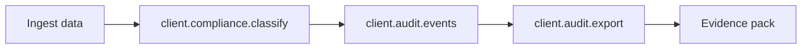

# GDPR

> Process personal data inside AI workflows while staying within the GDPR.
> CRP gives you built-in PII detection, purpose limitation, retention enforcement,
> erasure support, consent provenance, and audit exports from a single SDK.

!!! info "Availability"
    The CRP SDK and CRP Comply are available for self-hosting today.
    The managed SaaS console is on the waitlist at
    [comply.crprotocol.io](mailto:info@crprotocol.io).

## Business value

- **Demonstrate accountability** - every processing activity is logged in `client.audit.events()`.
- **Handle data-subject rights** - access and erasure evidence via `client.audit.export()`.
- **Protect by design** - PII detection, fact minimization, encryption, and retention run automatically.
- **Reduce legal review** - compliance reports are generated as a side effect of normal use.

## GDPR workflow



PII scanning, consent tracking, retention enforcement, and erasure are implemented in the
CRP orchestrator. Their evidence is surfaced through `client.compliance.*` and
`client.audit.*`.

## Article-by-Article Coverage

### Article 5 - Principles

| Principle                              | CRP Implementation                                      |
|----------------------------------------|---------------------------------------------------------|
| **Lawfulness, fairness, transparency** | Transparency declarations, quality reports              |
| **Purpose limitation**                 | Purpose captured in `client.compliance.classify(...)`   |
| **Data minimization**                  | Fact extraction distills raw data to atomic facts       |
| **Accuracy**                           | 3-tier quality gate, cross-encoder reranking            |
| **Storage limitation**                 | Retention policies enforced by the CRP orchestrator     |
| **Integrity and confidentiality**      | AES-256-GCM encryption, HMAC audit trail                |
| **Accountability**                     | Event-sourced fact model, audit trail verification      |

### Article 6 - Lawful Processing

CRP captures the legal basis for processing in the audit trail and governance metadata:

```python
import crp

client = crp.SDKClient()
client.configure(safety_profile="strict")

client.compliance.classify(
    framework="gdpr",
    legal_basis="consent",
    purpose="customer-support-automation",
    data_subject_categories=["customers"],
    personal_data_types=["email", "name"],
)
```

### Article 7 - Conditions for Consent

| Requirement          | CRP Implementation                              |
|----------------------|-------------------------------------------------|
| Demonstrate consent  | Immutable `client.audit.events()` log           |
| Freely given         | Purpose-specific classification records         |
| Withdrawal           | Consent revocation recorded in the audit trail  |

### Article 13/14 - Transparency

| Requirement              | CRP Implementation                          |
|--------------------------|---------------------------------------------|
| Identity of controller   | Session metadata                            |
| Purposes of processing   | Purpose declarations from classification    |
| Recipients of data       | Data lineage in audit events                |
| Retention period         | Retention policy in compliance report       |

### Article 15 - Right of Access

CRP's audit trail enables tracing exactly what personal data was processed and how:

```python
events = client.audit.events(data_subject="user-123")
# Provides full provenance chain from ingest → extraction → envelope → output
```

### Article 17 - Right to Erasure

Retention and erasure are enforced by the CRP orchestrator. Verify the posture through
`client.compliance.report()` and `client.audit.summary()`:

```python
report = client.compliance.report(framework="gdpr")
print(report.retention_policy)
print(report.erasure_status)
```

### Article 25 - Data Protection by Design and Default

CRP implements data protection by design:

| Principle            | Implementation                                              |
|----------------------|-------------------------------------------------------------|
| **By design**        | PII scanning runs on all ingested text                      |
| **By default**       | Fact extraction minimizes data (atomic facts, not raw text) |
| **Encryption by default** | AES-256-GCM on cold state                              |
| **Minimal processing** | Only relevant facts enter the envelope                    |

Inspect storage health with:

```python
client.knowledge.health()
client.storage.overview()
```

### Article 30 - Records of Processing Activities

```python
# Export Article 30 records
records = client.audit.export(format="json", framework="gdpr")
print(f"Activities logged: {records.entry_count}")
```

CRP automatically records:

- Categories of data subjects
- Categories of personal data
- Purposes of processing
- Transfers to third parties (LLM providers)
- Retention periods

### Article 35 - Data Protection Impact Assessment (DPIA)

CRP provides the technical evidence needed for a DPIA:

| DPIA Element                    | CRP Source                                              |
|---------------------------------|---------------------------------------------------------|
| Systematic description          | Protocol specification, architecture docs               |
| Necessity and proportionality   | Quality tier reports, saturation metrics                |
| Risks to data subjects          | PII scan results, compliance classification             |
| Measures to address risks       | Security layers, encryption, RBAC                       |

## PII Scanning

CRP's PII scanner is implemented in the orchestrator and surfaced through
`client.compliance.classify(...)`:

```python
result = client.compliance.classify(
    framework="gdpr",
    text="Contact John at john@example.com",
    check_types=["pii"],
)
print(f"Has PII:    {result.has_pii}")
print(f"PII types:  {result.pii_types_found}")
print(f"Detections: {len(result.detections)}")
```

**Detected PII types**: email addresses, phone numbers, names, addresses,
dates of birth, national IDs, financial data, IP addresses, and more.

!!! info "Advisory, not blocking"
    PII scanning is **advisory** - it detects and reports but does not block
    processing. The application decides how to handle detected PII. This aligns
    with CRP's Output Integrity axiom.
