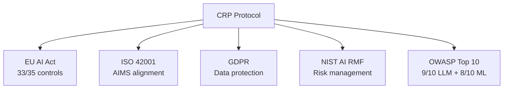

# Compliance & Governance

Get regulator-ready compliance evidence from every AI call without changing your application architecture. CRP is the first AI context protocol with **regulatory compliance as a first-class feature** - not bolted on after the fact.

## Why This Matters

The **EU AI Act** high-risk requirements take effect **August 2026**. Organizations
deploying AI in employment, education, healthcare, law enforcement, or critical
infrastructure must demonstrate compliance. CRP provides the technical foundation.

## Regulatory Coverage



| Framework | CRP Coverage | Key Strength |
|-----------|-------------|--------------|
| [EU AI Act](eu-ai-act.md) | 33/35 technical controls | HMAC audit trail, risk classification |
| [ISO 42001](iso-42001.md) | AIMS-aligned architecture | Event-sourced fact model, quality tiers |
| [GDPR](gdpr.md) | Built-in data protection | PII scanning, consent management, erasure |
| [NIST AI RMF](nist-ai-rmf.md) | 4 core functions mapped | Continuous monitoring, bias detection |
| [Security](security.md) | 8 security layers | Zero-trust, encryption, RBAC |

## Business value

| Compliance task | Traditional approach | With CRP |
|-----------------|----------------------|----------|
| EU AI Act risk classification | Manual legal review | `client.compliance.classify()` in milliseconds |
| Technical documentation | Consultants, weeks | Auto-generated Art. 11 docs from runtime data |
| Record-keeping | Spreadheets / log dumps | HMAC-signed audit chain per call |
| DPIA (GDPR Art. 35) | Manual template filling | Auto-generated from PII/processing evidence |
| Evidence pack for auditors | Months of gathering | One-click export from CRP Comply |

## Built-in Compliance Components

The current CRP Python SDK exposes compliance and audit helpers directly on the
client:

```python
import crp

client = crp.SDKClient()  # auto-detects provider from env vars

# EU AI Act Art. 6 risk classification
risk = client.compliance.classify(
    intended_purpose="Automated contract review",
    processes_personal_data=True,
    makes_automated_decisions=False,
)
print(risk["level"])  # MINIMAL | LIMITED | HIGH | UNACCEPTABLE

# Per-session compliance status across frameworks
report = client.compliance.report()
print(report["score"], report["frameworks"])

# List active technical controls
controls = client.compliance.controls()
print(controls)

# Tamper-evident audit summary and verification
print(client.audit.summary())
valid, broken_at = client.audit.verify()
assert valid
```

For the hosted compliance dashboard, one-click evidence packs, and signed
certificates, see the [CRP Comply product page](../products/comply.md).

## Compliance Demo

The [demo app](https://github.com/AutoCyber-AI/context-relay-protocol/tree/main/examples/demo_app)
includes a full compliance demonstration:

```bash
python -m examples.demo_app.demo compliance --mock
```

This demonstrates risk classification, human oversight levels, audit trail
verification, PII scanning, and compliance report generation.

## Pages in This Section

<div class="grid cards" markdown>

-   **[EU AI Act](eu-ai-act.md)**

    ---

    Article-by-article mapping. 33/35 controls implemented.

-   **[ISO 42001](iso-42001.md)**

    ---

    AI Management System alignment.

-   **[GDPR](gdpr.md)**

    ---

    Data protection by design and default.

-   **[NIST AI RMF](nist-ai-rmf.md)**

    ---

    Risk management framework mapping.

-   **[Security](security.md)**

    ---

    8-layer security architecture.

-   **[CRP Comply](../products/comply.md)**

    ---

    Hosted dashboard, evidence packs, and report generator.

</div>
