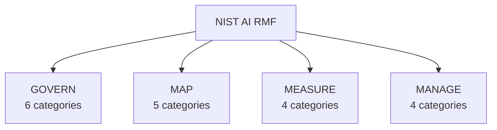

# NIST AI Risk Management Framework

> Operationalize the NIST AI RMF without a separate GRC tool.
> CRP continuously GOVERNs, MAPs, MEASures, and MANAGEs risk as your AI runs,
> capturing evidence automatically so your risk posture is always current.

!!! info "Availability"
    The CRP SDK and CRP Comply are available for self-hosting today.
    The managed SaaS console is on the waitlist at
    [comply.crprotocol.io](mailto:info@crprotocol.io).

## Business value

- **Always-on measurement** - real-time quality scoring replaces periodic audits.
- **Automatic evidence** - every operation is logged in the HMAC audit chain.
- **Faster risk response** - degradations trigger re-grounding, echo detection, and redispatch.
- **Shared vocabulary** - map CRP outputs directly to NIST AI RMF categories and subcategories.

## Framework Structure

The NIST AI RMF defines 4 core functions, 19 categories, and 72 subcategories:



## GOVERN - Policies, Processes, and Accountability

The GOVERN function establishes organizational context for AI risk management.

| Category | Subcategory | CRP Mapping |
|----------|------------|-------------|
| GV-1  | Policies for AI risk management        | Protocol axioms, Elastic License 2.0 |
| GV-1.1| Legal and regulatory requirements      | EU AI Act + GDPR compliance modules  |
| GV-1.2| Trustworthy AI characteristics         | 10 design axioms                     |
| GV-2  | Accountability structures              | RBAC (OBSERVER/OPERATOR/ADMIN)       |
| GV-3  | Workforce diversity and expertise      | Provider-agnostic design enables diverse teams |
| GV-4  | Organizational commitments             | Security specification               |
| GV-5  | Processes for ongoing engagement       | RFC process, governance framework    |
| GV-6  | Policies for third-party AI            | Provider adapter interface           |

## MAP - Context and Risk Identification

The MAP function identifies risks in context.

| Category | Subcategory | CRP Mapping |
|----------|------------|-------------|
| MP-1   | Intended purpose is defined             | Declarative task specification       |
| MP-2   | Interdependencies mapped                | Fact graph with typed relationships  |
| MP-2.1 | Likelihood and magnitude of harm        | `client.compliance.classify(...)`    |
| MP-2.2 | Practices to identify risks             | Quality tier degradation formulas    |
| MP-3   | Benefits compared to risks              | Quality reports with saturation metrics |
| MP-4   | Risks examined over lifecycle           | Session-level quality monitoring     |
| MP-5   | Impacts to individuals                  | PII scanning, processing records     |

## MEASURE - Analysis and Monitoring

The MEASURE function quantifies and monitors AI risks.

| Category | Subcategory | CRP Mapping |
|----------|------------|-------------|
| MS-1   | Appropriate methods and metrics              | Real-time quality scoring per window |
| MS-1.1 | Approaches for measurement                   | Information density, coherence, novelty |
| MS-1.2 | Computational tests and evaluations          | 1,500+ automated tests               |
| MS-2   | AI systems evaluated for trustworthiness     | Quality tiers S/A/B/C/D              |
| MS-2.1 | Test sets representative                     | Live verification suite              |
| MS-2.2 | Evaluations document AI limitations          | Honest degradation reporting per tier |
| MS-2.3 | Relevant AI actors can access results        | Compliance reports, quality reports  |
| MS-3   | Mechanisms for tracking metrics              | Telemetry in quality reports         |
| MS-4   | Measurement feedback                         | Re-grounding on degradation threshold |

## MANAGE - Risk Treatment

The MANAGE function addresses identified risks.

| Category | Subcategory | CRP Mapping |
|----------|------------|-------------|
| MG-1   | Risk treatment plans                    | Automatic mitigations per risk level |
| MG-2   | Risk responses                          | Re-grounding, echo detection, abort + redispatch |
| MG-2.1 | Response deployed quickly               | Real-time quality monitoring, <1ms response |
| MG-2.2 | Mechanisms to supersede decisions       | Human oversight via strict safety profile |
| MG-3   | Pre-deployment validation               | Quality gates, envelope preview      |
| MG-3.1 | Monitoring in deployment                | Session status, telemetry, audit trail |
| MG-4   | Risks managed post-deployment           | CKF cross-session learning           |

## Trustworthy AI Characteristics

NIST defines 7 characteristics of trustworthy AI. CRP's coverage:

| Characteristic       | CRP Implementation                          | Evidence                              |
|----------------------|---------------------------------------------|---------------------------------------|
| **Valid & Reliable** | Quality tiers (S–D), degradation formulas   | Benchmark reports                     |
| **Safe**             | Compliance classification, human oversight  | Risk assessment, oversight checkpoints|
| **Secure & Resilient**| 8 security layers, ~202μs overhead         | OWASP 9/10 LLM, 8/10 ML               |
| **Accountable**      | HMAC audit trail, RBAC                      | Chain verification, 3-role hierarchy  |
| **Transparent**      | Quality reports, envelope preview           | Saturation %, tier, facts included    |
| **Explainable**      | Fact provenance, window DAG                 | Full lineage from ingest to output    |
| **Fair**             | Multi-aspect decomposition                  | Balanced fact selection across topics |
| **Privacy-Enhanced** | PII scanning, consent, erasure, retention   | GDPR coverage                         |

## SDK Evidence Example

```python
import crp

client = crp.SDKClient()
client.configure(safety_profile="strict")

# Map the system and intended purpose
risk = client.compliance.classify(
    framework="nist-ai-rmf",
    purpose="customer-support-routing",
    personal_data=True,
    automated_decisions=True,
)

# Generate evidence for all four functions
report = client.compliance.report(framework="nist-ai-rmf")
audit = client.audit.summary()

print(f"Risk level:    {risk.risk_level}")
print(f"Mapped functions: {report.mapped_functions}")
print(f"Chain valid:   {audit.chain_valid}")
```

## Integration Approach

CRP enables NIST AI RMF compliance through:

1. **Continuous measurement** - Real-time quality scoring, not periodic audits
2. **Automatic recording** - Every operation logged in HMAC chain
3. **Evidence generation** - `client.compliance.report()` produces
   multi-framework compliance evidence
4. **Built-in controls** - Risk classification, human oversight, PII scanning
   are protocol features, not add-ons
