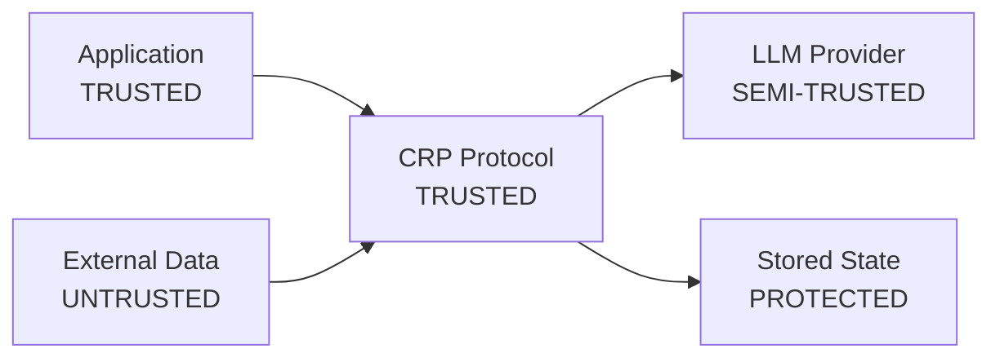

# Security

Get defense-in-depth protection for AI calls with ~202 μs per-window overhead. CRP implements an **8-layer security architecture** that guards inputs, sessions, facts, and outputs without touching the model itself.

!!! info "Availability"
    The CRP SDK and CRP Comply are available for self-hosting today.
    The managed SaaS console is on the waitlist at
    [comply.crprotocol.io](mailto:info@crprotocol.io).

## Business value

- **Reduce attack surface** - validation, binding, integrity, and encryption run automatically.
- **Prove integrity** - verify every fact and audit event with `client.audit.verify()`.
- **Stay provider-agnostic** - security is enforced by CRP, independent of the LLM provider.
- **Quantum-ready posture** - symmetric-only cryptography means no RSA/ECC keys to compromise.

## Design Philosophy

CRP is a **local protocol** - it runs in-process, not over a network. This
eliminates entire attack classes: no MitM, no DNS spoofing, no certificate
attacks, no API key theft in transit.

## Trust Zones



| Zone          | Trust Level  | Protection                                      |
|---------------|--------------|-------------------------------------------------|
| Application   | Trusted      | RBAC boundaries                                 |
| CRP Protocol  | Trusted      | Input validation, process isolation             |
| LLM Provider  | Semi-trusted | Output extraction normalizes data               |
| External Data | Untrusted    | 1-window quarantine, validation                 |
| Stored State  | Protected    | AES-256-GCM encryption                          |

## 8 Security Layers

### Layer 1 - Input Validation (Mandatory)

**Cannot be disabled.** Runs on every input:

- Size limit: 50 MB per ingest
- Unicode NFC normalization
- Null byte and control character stripping
- MIME type validation
- Metadata key limit

### Layer 2 - Injection Detection (Advisory)

Detects prompt injection patterns. **Advisory only** - the governance summary on every response surfaces flags but never blocks:

```python
response = client.complete("...")
print(f"Risk:         {response.crp.risk}")
print(f"Grounded:     {response.crp.grounded}")
print(f"Fabrications: {response.crp.fabrications}")
print(f"Chain valid:  {response.crp.chain_valid}")
```

### Layer 3 - RBAC

Three-role hierarchy with 13 permissions:

| Role      | Permissions                                          |
|-----------|------------------------------------------------------|
| **OBSERVER** | Read session status, read quality reports         |
| **OPERATOR** | Dispatch, ingest, configure, + OBSERVER           |
| **ADMIN**    | Delete facts, manage sessions, + OPERATOR         |

**Rate limiting** (configurable):

| Limit                  | Default   |
|------------------------|-----------|
| Dispatches             | 60/min    |
| Ingest bandwidth       | 100 MB/min|
| Concurrent sessions    | 4         |
| Session expiry         | 24 hours  |

### Layer 4 - Session Binding

TLS-inspired HMAC-SHA256 handshake:

- Per-session nonce generates fresh key
- All operations bound to session
- Zero-config fallback: random 256-bit secret via OS keyring (DPAPI on
  Windows, Keychain on macOS)

### Layer 5 - Fact Integrity

DNSSEC-pattern integrity chain:

- **BLAKE3** hash per fact (~1 μs)
- **HMAC-SHA256** chain signing (~2 μs)
- Parent hashes chained - modifying one fact requires re-signing the
  entire downstream chain
- Cold-load: spot-check 10% sample

```python
# Verify integrity chain
result = client.audit.verify()
print(f"Chain valid: {result.valid}")
```

### Layer 6 - Encryption

| What             | Algorithm     | When        |
|------------------|---------------|-------------|
| Cold state (CKF) | AES-256-GCM   | At rest     |
| Event log        | AES-256-GCM   | At rest     |
| State exports    | AES-256-GCM   | At rest     |
| Key derivation   | HKDF          | On session create |

**Not encrypted**: active warm state, ANN index, model weights (process
memory - OS-level isolation is the defense).

### Layer 7 - Ingest Quarantine

New facts from untrusted sources enter a **1-window quarantine**:

- 0.7× confidence penalty during quarantine
- Cross-reference validation against existing facts
- Batch failure detection: >30% failure threshold flags the entire batch

### Layer 8 - Embedding Defense

Protects against adversarial embedding attacks:

- Protected embedding wrapper
- Anomaly detection on embedding space
- Guards against embedding inversion attacks

## Attack Vector Coverage

| Attack                   | Defense Layers | Status                  |
|--------------------------|----------------|-------------------------|
| Prompt injection         | Layers 2, 7    | Multiple patterns detected |
| Fact poisoning           | Layers 1, 5, 7 | 4-layer defense         |
| Cross-window contamination | Layers 4, 5  | Structurally immune     |
| Unauthorized access      | Layers 3, 4    | RBAC + session binding  |
| State tampering          | Layers 5, 6    | HMAC chain + encryption |
| Embedding inversion      | Layer 8        | Protected embeddings    |
| Unbounded consumption    | Layer 3        | Rate limiting           |

## OWASP Coverage

| Framework                  | Coverage |
|----------------------------|----------|
| OWASP LLM Top 10           | **9/10** |
| OWASP ML Security Top 10   | **8/10** |

## Quantum Resistance

CRP uses **symmetric-only cryptography**:

- HMAC-SHA256 (signing)
- AES-256-GCM (encryption)
- BLAKE3 (hashing)

**Zero asymmetric crypto** → Shor's algorithm has nothing to target.
CRP already provides **128-bit post-quantum security**.

!!! info "Future roadmap"
    CRYSTALS-Kyber and CRYSTALS-Dilithium are on the quantum resistance
    roadmap for future optional asymmetric operations.

## Performance Impact

Total security overhead: **~202 μs per window**

| Layer                | Cost         | Percentage |
|----------------------|--------------|------------|
| Input validation     | ~50 μs       | 0.003%     |
| Injection detection  | ~80 μs       | 0.004%     |
| RBAC check           | ~5 μs        | <0.001%    |
| Session binding      | ~10 μs       | <0.001%    |
| Fact hashing         | ~1 μs/fact   | <0.001%    |
| HMAC chain           | ~2 μs/fact   | <0.001%    |
| Encryption           | ~50 μs       | 0.003%     |

Security is essentially **free** relative to LLM generation time.

## Deployment Security

When deploying CRP Gateway or CRP Comply, set required secrets and endpoints via
environment variables supplied by your secrets manager. The detailed deployment
checklist is shared with Enterprise and white-label customers under NDA.

## Vulnerability Reporting

Report security vulnerabilities via:

- Email: `security@crprotocol.io`
- GitHub Security Advisories (private)

**Response timeline**: 48-hour acknowledgment → 7-day assessment → 30-day
fix or mitigation.
