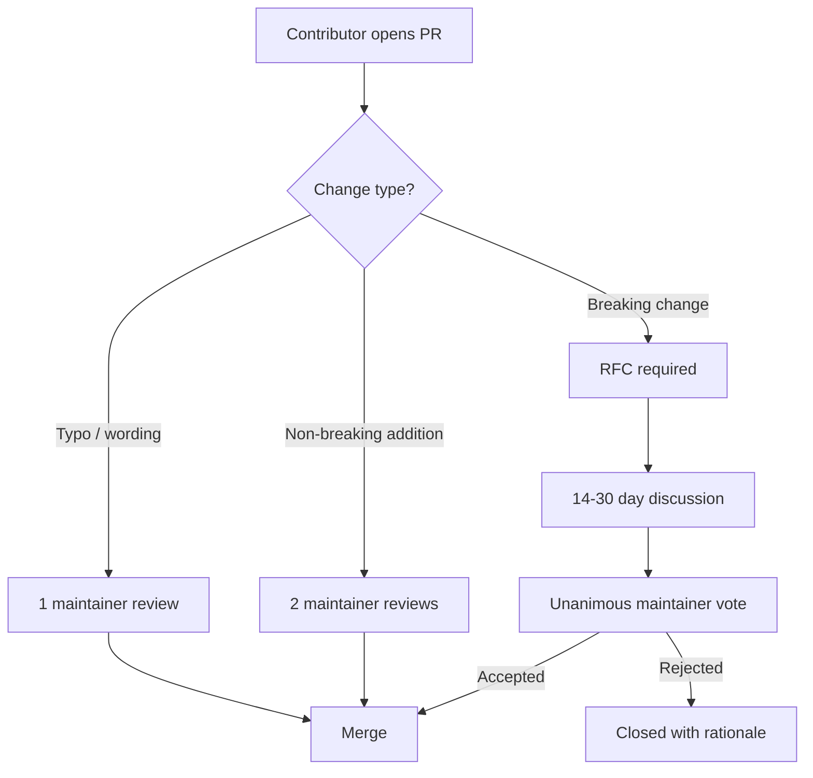

# Licensing & IP Protection

## How CRP Is Licensed

CRP uses a **dual-license model** - not traditional open-source, not closed-source.
The protocol is **source-available** with commercial protection.

```
┌────────────────────────────────────────────────────────────┐
│  SPECIFICATION (specification/, schemas/, rfcs/, examples/) │
│  License: CC BY-SA 4.0                                      │
│  → Read, share, adapt, build upon - even commercially       │
│  → Must attribute + share-alike                             │
├────────────────────────────────────────────────────────────┤
│  SDK CODE (crp/, all source files)                          │
│  License: Elastic License 2.0 (ELv2)                       │
│  → Free for: dev, testing, research, education, personal    │
│  → Free for production use in YOUR applications             │
│  → PROHIBITED: offering CRP as a managed/hosted service     │
│  → No time-based conversion - protection is permanent       │
└────────────────────────────────────────────────────────────┘
```

### What You CAN Do (Free)

| Activity | Allowed? |
|----------|----------|
| Read the source code | ✅ Yes |
| Study how CRP works | ✅ Yes |
| Fork the repository | ✅ Yes |
| Run tests and benchmarks | ✅ Yes |
| Use in development / staging | ✅ Yes |
| Use for research / academic papers | ✅ Yes |
| Use for education / teaching | ✅ Yes |
| Personal projects | ✅ Yes |
| Use CRP in YOUR production application | ✅ Yes |
| Build your own CRP-compatible SDK | ✅ Yes (spec is CC BY-SA 4.0) |
| Submit bug reports and PRs | ✅ Yes |

### What Is NOT Allowed

| Activity | Allowed? |
|----------|----------|
| Offer CRP as a hosted/managed service | ❌ Prohibited |
| Resell CRP features as a service to third parties | ❌ Prohibited |
| Circumvent or remove license key functionality | ❌ Prohibited |
| Remove or obscure licensing/copyright notices | ❌ Prohibited |

!!! success "No Expiry"
    Unlike BSL 1.1, the Elastic License 2.0 does **not** convert to a permissive
    license after a time period. The managed-service restriction is **permanent**.

### Enterprise & White-Label Licensing

For organizations that need to offer CRP as part of a managed service, OEM
embedding, or white-label product:

| Tier | Use Case | Contact |
|------|----------|---------|
| **Enterprise** | Managed-service rights, SLA, priority support | [contact@crprotocol.io](mailto:contact@crprotocol.io) |
| **OEM / White-Label** | Embed CRP under your own brand | [contact@crprotocol.io](mailto:contact@crprotocol.io) |
| **Cloud Provider** | Offer CRP-as-a-Service | [contact@crprotocol.io](mailto:contact@crprotocol.io) |

---

## How Changes Are Protected

Nobody can modify the protocol without review and approval. Here's the multi-layer
protection:

### Layer 1: Branch Protection Rules

The `main` branch is protected with:

- **No direct pushes** - all changes go through Pull Requests
- **Required reviews** - at least 1 maintainer approval (2 for spec changes)
- **CI must pass** - linting, type checking, tests (80%+ coverage), 4 Python versions
- **No force pushes** - history cannot be rewritten
- **No branch deletion** - `main` cannot be deleted

### Layer 2: CODEOWNERS

Every directory has a designated owner. GitHub **requires** approval from the
code owner before a PR can be merged:

| Area | Owner | Required For |
|------|-------|--------------|
| `/specification/` | @Constantinos-uni | All spec changes |
| `/schemas/` | @Constantinos-uni | Schema modifications |
| `/crp/` | @Constantinos-uni | SDK code changes |
| `/rfcs/` | @Constantinos-uni | New RFCs |
| `LICENSE.md` | @Constantinos-uni | License changes |
| `/.github/` | @Constantinos-uni | CI/CD changes |
| `*` (everything else) | @Constantinos-uni | Global fallback |

### Layer 3: RFC Process for Specification Changes

Non-trivial changes require a formal RFC:



### Layer 4: Contributor License Agreement (CLA)

Every contributor certifies that:

1. They created the contribution and have the right to submit it
2. They grant an irrevocable, worldwide, royalty-free license to use their
   contribution under any license terms
3. The contribution is public and the record is permanent

### Layer 5: Automated CI Checks

Every PR triggers:

| Check | What It Does |
|-------|-------------|
| **Ruff lint** | Code style and potential bugs |
| **Mypy type check** | Type safety verification |
| **Pytest (4 Python versions)** | 1,537+ tests, 80%+ coverage required |
| **pip-audit** | Dependency vulnerability scan |
| **Schema validation** | JSON Schema correctness |
| **Link check** | No broken references |

!!! warning "Bottom Line"
    A contributor can **fork**, **propose changes**, and **submit PRs** - but they
    cannot modify anything without passing all CI checks AND getting explicit
    maintainer approval. The maintainer (you) has absolute veto power over every
    change.

---

## Why Not "Open Source"?

Traditional open-source (MIT, Apache 2.0) lets anyone use CRP in production for
free - including competitors who could build a commercial service on top of your
work without contributing back.

**Elastic License 2.0 protects against this - permanently:**

| Scenario | MIT/Apache | ELv2 (CRP) |
|----------|-----------|-------------|
| Competitor forks and sells CRP-as-a-Service | ✅ Allowed | ❌ Prohibited |
| Cloud provider wraps CRP in managed offering | ✅ Allowed | ❌ Prohibited |
| Developer uses CRP in their own product | ✅ Allowed | ✅ Allowed |
| Startup builds app with CRP inside | ✅ Allowed | ✅ Allowed |
| Academic researcher uses CRP | ✅ Allowed | ✅ Allowed |
| Enterprise deploys CRP internally | ✅ Allowed | ✅ Allowed |
| Protection expires? | N/A | **Never** - ELv2 has no expiry |

This is the same model used by **Elasticsearch**, **Kibana**, and **Logstash** (Elastic).

!!! tip "The Key Distinction"
    **Using CRP inside your application** = Allowed (free).<br>
    **Selling CRP itself as a service** = Prohibited (requires enterprise license).

---

## Commercial & Enterprise Licensing

For managed-service rights, OEM embedding, or white-label use:

**AutoCyber AI Pty Ltd**<br>
[crprotocol.io](https://crprotocol.io)<br>
[info@crprotocol.io](mailto:info@crprotocol.io) (general enquiries)<br>
[contact@crprotocol.io](mailto:contact@crprotocol.io) (enterprise & licensing)

---

## Trademark

"**Context Relay Protocol**" is a trademark of Constantinos Vidiniotis.
Trademark application filed with IP Australia (Class 9 - computer software).

Use of the name "Context Relay Protocol" or "CRP" to refer to this project is
welcomed. Use of the name in a way that implies endorsement, affiliation, or
official status without authorization is not permitted.

---

## Setting Up Branch Protection (For Maintainers)

If you haven't configured branch protection on GitHub yet:

1. Go to **Settings → Branches → Branch protection rules**
2. Add rule for `main`:
    - [x] Require a pull request before merging
    - [x] Require approvals (1 minimum, 2 for spec)
    - [x] Require status checks to pass (select: `lint-and-test`)
    - [x] Require conversation resolution before merging
    - [x] Do not allow bypassing the above settings
    - [x] Restrict who can push (only maintainers)
    - [x] Block force pushes
    - [x] Block deletions
3. **Enable CODEOWNERS**: Settings → General → scroll to "Pull Requests" → require CODEOWNERS review
