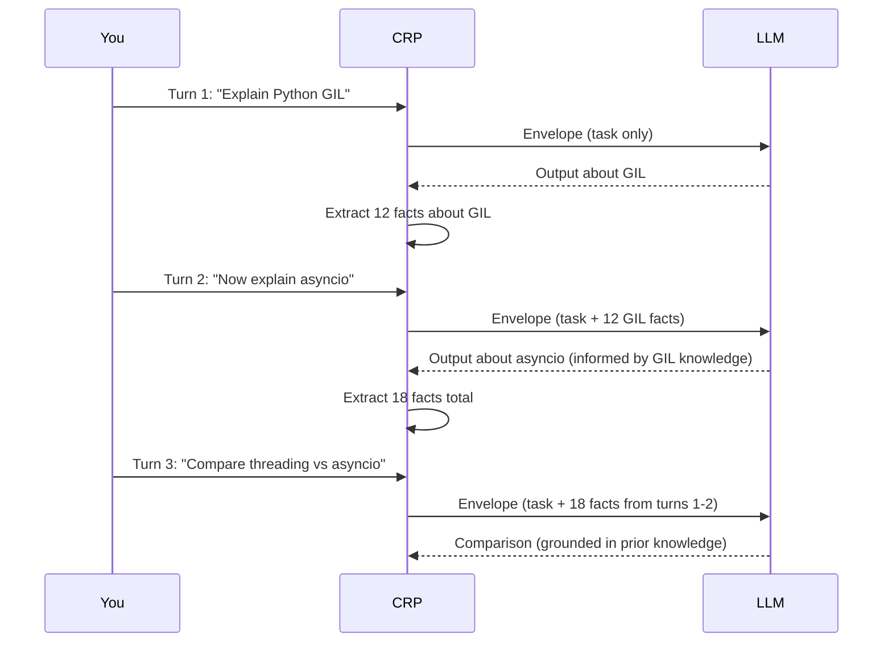

# Multi-Turn Conversations

Build persistent, knowledge-backed conversations. CRP accumulates facts across
turns, so later answers stay grounded in everything the session has already
learned - from prior LLM responses or from documents you ingested.

!!! info "Deployment status"
    Multi-turn sessions work in the self-hosted SDK today. Managed SaaS session
    persistence is on the roadmap.

## How it works



Each turn builds on the last. The model doesn't need to re-explain the GIL
when comparing threading approaches - those facts are already in the envelope.

## Example with `client.ask()`

```python
import crp

client = crp.SDKClient(provider="ollama", model="qwen3-4b")
session = client.session()

# Turn 1: Foundation
r1 = client.ask("Explain the Python GIL in detail", depth="standard")
print(f"Turn 1: {r1.text[:200]}...")
print(f"Risk: {r1.crp.risk}")

# Turn 2: Build on Turn 1
r2 = client.ask("Now explain Python's asyncio library", depth="standard")
print(f"Turn 2: {r2.text[:200]}...")
print(f"Quality: {r2.quality}")

# Turn 3: Leverage all prior knowledge
r3 = client.ask(
    "Compare threading vs asyncio for I/O-bound tasks",
    depth="thorough",
)
print(f"Turn 3: {r3.text[:200]}...")
print(f"Sources: {r3.sources}")
print(f"Risk: {r3.crp.risk}")

# Check session state
s = client.session()
print(f"Session: {s.id}")
print(f"Status: {s.status()}")
print(f"Facts: {s.fact_count}")
print(f"Windows: {s.window_count}")
```

## Multi-turn with document retrieval

Combine ingestion with conversation so the model can cite your documents:

```python
client.ingest("./docs/")

q1 = client.ask("What is CRP's safety policy?", depth="standard")
print(q1.text)
print(q1.sources)

q2 = client.ask("How does the audit chain work?", depth="standard")
print(q2.text)
print(q2.sources)
```

## Fact accumulation

Facts accumulate in the session warm state and are ranked for each new turn:

| Turn | New Facts | Total Facts | Notes |
|------|-----------|-------------|-------|
| 1 | 12 | 12 | Initial extraction |
| 2 | 8 | 20 | Relevant GIL facts carried forward |
| 3 | 6 | 26 | Most relevant prior facts included |

As the fact store grows, the envelope packing algorithm becomes more
selective - only the most relevant facts make it into each envelope.

## Envelope packing

Not all accumulated facts fit in every envelope. CRP's packing algorithm:

1. **Score** each fact by relevance to the current task
2. **Sort** by score (highest first)
3. **Pack** until the envelope token budget is reached
4. **Reserve** space for system prompt, task description, and structural markers

This means Turn 5 might include facts from Turn 1 if they're relevant,
and skip facts from Turn 3 if they're not.

## Preview before asking

Use the CLI preview command to inspect the envelope that would be sent for a
question without calling the LLM:

```bash
python -m crp preview \
  --session-id <session-id> \
  --task "Compare threading vs asyncio"
```

In Python, inspect the session state before the next turn:

```python
s = client.session()
print(f"Facts: {s.fact_count}, Windows: {s.window_count}")
```

## Multi-turn with continuation

Continuation works within each turn. A multi-turn session with continuation
might look like:

| Turn | Task | Windows | Facts Added |
|------|------|---------|-------------|
| 1 | "Explain microservices" | 4 | 45 |
| 2 | "Now cover service mesh" | 3 | 32 |
| 3 | "Compare Istio vs Linkerd" | 2 | 18 |

Turn 3's envelope includes the most relevant facts from all 95 accumulated
facts across 9 total windows.

## Best practices

!!! tip "Topic progression"
    Structure turns to build on each other. "Explain X" → "Now explain Y" →
    "Compare X and Y" leverages fact accumulation maximally.

!!! tip "Check saturation"
    If envelope saturation exceeds 80%, the session is very full. Consider
    starting a new session or ingesting a summary instead.

!!! warning "Session limits"
    Sessions have a configurable maximum lifetime and fact count. Check
    `client.session().status()` periodically to monitor resource usage.
