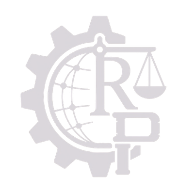

<div class="hero-splash hero-splash--dark" markdown>

{ .hero-logo width="400" height="400" loading="eager" }

<div class="hero-kicker">🎯 The Agentic Positioning Layer for SLM-first AI</div>

<h1 class="hero-headline" markdown>
Position every agent on the right task,<br/>with the right context and tools.
</h1>

<p class="hero-sub">
<strong>MCP exposes tools. A2A connects agents. Context Relay Protocol™ positions every agent.</strong>
One <code>base_url</code> change or a few lines of <code>crp.Agent</code> code turns small local models into capable, governed agents: CRP selects
operations, loads only the 1–3 tools each call needs, carries state forward, streams AG-UI transparency events, and emits
HMAC-signed proof that safety, grounding, and policy controls ran. The evidence the
<strong>EU AI Act</strong>, <strong>AIUC-1</strong>, <strong>ISO 42001</strong>, and
<strong>NIST AI RMF</strong> all demand, generated from live runtime data.
</p>

<div class="hero-buttons">
<a href="/getting-started/quickstart/" class="md-button md-button--primary">Position your agents free in 60 seconds</a>
<a href="/control-evidence/" class="md-button">See the control-evidence mapping</a>
</div>

<div class="hero-stats">
<div class="hero-stat"><span class="num">13-stage</span><span class="label">Safety on every call</span></div>
<div class="hero-stat"><span class="num">&lt;50ms</span><span class="label">Overhead</span></div>
<div class="hero-stat"><span class="num">HMAC</span><span class="label">Signed audit chain</span></div>
<div class="hero-stat"><span class="num">AG-UI</span><span class="label">Transparency stream</span></div>
<div class="hero-stat"><span class="num">crp.Agent</span><span class="label">Declarative SDK</span></div>
</div>

</div>

---

## Controls are easy to claim. CRP proves they operate.

Every major AI assurance framework — **EU AI Act, AIUC-1, ISO/IEC 42001, NIST AI RMF, SOC 2-for-AI** — demands the same three things underneath its own vocabulary:

1. **Controls exist** — you have safety, security, and governance mechanisms.
2. **Controls operate** — they run on every AI call, continuously, not on paper.
3. **You can prove it** — verifiable evidence the controls ran, not assertions.

Most organisations manage #1 and sometimes #2. **The universal failure is #3.** CRP closes that gap: every governed AI call emits signed, tamper-evident evidence that your security and safety controls ran — the proof all of these standards require.

<div class="cta-bar" markdown>
<div class="cta-bar__text">
<div class="cta-bar__title">Different standards. One agentic positioning engine.</div>
<div class="cta-bar__subtitle">See exactly which CRP capabilities produce evidence for which standard.</div>
</div>
<div class="cta-bar__actions">
<a href="/control-evidence/" class="md-button md-button--primary">Control-evidence mapping</a>
<a href="/aiuc-1/" class="md-button">AIUC-1 proof point</a>
</div>
</div>

---

## Outcomes &amp; ROI

<div class="product-grid" markdown>
<div class="product-card">
<h3>📝 Finish long tasks</h3>
<p><strong>11.8× more content completed</strong> without rewriting prompts.</p>
<p>Automatic continuation turns truncated 8-section outputs into 25-section deliverables that actually conclude.</p>
</div>
<div class="product-card">
<h3>⚖️ Cut compliance time</h3>
<p><strong>Evidence packs generated in seconds</strong>, not months.</p>
<p>EU AI Act, ISO 42001, GDPR, and NIST AI RMF reports are built from runtime audit data, not consultant interviews.</p>
</div>
<div class="product-card">
<h3>🛡️ Reduce hallucination risk</h3>
<p><strong>13 DPE signals on every call</strong> in &lt;50 ms.</p>
<p>Fabrications, contradictions, grounding failures, and prompt injections are caught before they reach users.</p>
</div>
<div class="product-card">
<h3>🚀 Deploy faster</h3>
<p><strong>One line of code to governed AI</strong>.</p>
<p>Change <code>base_url</code> or call <code>crp.SDKClient()</code>; no new infrastructure, no provider lock-in.</p>
</div>
</div>

---

## Trusted by teams building with AI

<div class="trust-bar">
<span>AI-native startups</span>
<span>Regulated enterprises</span>
<span>Consulting firms</span>
<span>Security teams</span>
</div>

<p class="text-center text-small text-muted">
Customer case studies and logos are coming soon. <a href="mailto:info@crprotocol.io">Share your story</a>.
</p>

---

## Try it in 5 lines

<div class="code-hero" markdown>

```python title="5 lines to governed AI"
import crp

client = crp.SDKClient()
client.ingest("./docs/")
answer = client.ask("Write a complete deployment guide", depth="thorough")

print(answer.text)
print(answer.quality)                  # S | A | B | C | D
print(answer.sources)                  # cited facts from your documents
print(answer.crp.risk)                 # LOW | MEDIUM | HIGH | CRITICAL
```

</div>

That is the full pipeline: **ingestion → CDR/CDGR retrieval → envelope packing → safety scan → LLM dispatch → continuation → extraction → provenance → source attribution**. No hidden heuristics. Every score is coupled to an enforceable action.

<div class="demo-cta">
  <a href="https://github.com/AutoCyber-AI/context-relay-protocol/tree/main/examples/crp_demos/v4" target="_blank" rel="noopener noreferrer" class="md-button">Run the interactive demo locally →</a>
</div>

---

## What CRP solves

<div class="pain-grid" markdown>
<div class="pain-card">
<h4>Context dies at 8 sections</h4>
<p>Your model stops mid-task. Previous context is lost. There is no continuation.<br/><strong>CRP automatically continues</strong> across windows until the task is done, then stitches outputs into one coherent result.</p>
</div>
<div class="pain-card">
<h4>No safety guardrails</h4>
<p>Every AI call returns raw output. No risk score. No provenance. No audit trail.<br/><strong>CRP runs a 13-stage safety check</strong> on every call in under 50ms and records every event to a tamper-evident chain.</p>
</div>
<div class="pain-card">
<h4>Compliance is manual</h4>
<p>EU AI Act, ISO 42001, GDPR. You hire consultants for months.<br/><strong>CRP generates evidence packs</strong> automatically from runtime data - risk assessments, DPIAs, technical docs, transparency declarations.</p>
</div>
<div class="pain-card">
<h4>Integration is expensive</h4>
<p>Building context management, safety, and compliance from scratch takes quarters.<br/><strong>CRP is one line:</strong> <code>base_url="https://your-gateway.example/v1"</code> or <code>crp.SDKClient()</code>.</p>
</div>
</div>

---

## Explore by topic

<div class="product-grid" markdown>
<div class="product-card">
<h3>🛡️ AI Safety</h3>
<p>Hallucination detection, prompt injection shield, PII scanning, and safety budgets on every call.</p>
<a href="/topics/ai-safety/" class="md-button button--small mt-1">AI Safety</a>
</div>
<div class="product-card">
<h3>⚖️ AI Governance</h3>
<p>Declarative policies, identity headers, human-in-the-loop checkpoints, and tamper-evident audit.</p>
<a href="/topics/ai-governance/" class="md-button button--small mt-1">AI Governance</a>
</div>
<div class="product-card">
<h3>📋 AI Compliance</h3>
<p>Automated EU AI Act, ISO 42001, NIST AI RMF, and GDPR evidence from runtime data.</p>
<a href="/topics/ai-compliance/" class="md-button button--small mt-1">AI Compliance</a>
</div>
<div class="product-card">
<h3>🧠 Context Management</h3>
<p>Unbounded context, automatic continuation, graph-structured CKF, and retrieval for LLMs.</p>
<a href="/topics/context-management/" class="md-button button--small mt-1">Context Management</a>
</div>
<div class="product-card">
<h3>🏅 Control Evidence</h3>
<p>See which CRP capabilities produce signed, tamper-evident evidence for EU AI Act, AIUC-1, ISO 42001, and NIST AI RMF.</p>
<a href="/control-evidence/" class="md-button button--small mt-1">Control-evidence mapping</a>
</div>
<div class="product-card">
<h3>🚀 CRPv5 Roadmap</h3>
<p>What's next: agentic positioning, SLM-first execution, closing certification gaps, and new SDK languages.</p>
<a href="/crpv5-roadmap/" class="md-button button--small mt-1">View Roadmap</a>
</div>
</div>

[:octicons-arrow-right-24: Compare CRP with RAG, MCP & agents](topics/crp-vs-rag-mcp.md)

---

## Capabilities

CRP manages the full context lifecycle - ingestion, extraction, retrieval, packing, dispatch, continuation, safety, provenance, and compliance - in a single protocol layer.

<div class="product-grid" markdown>
<div class="product-card">
<h3>Unbounded context</h3>
<p>Automatic continuation, CSO relay, and re-grounding let tasks exceed any model's output limit without losing coherence.</p>
<a href="/capabilities/" class="md-button button--small mt-1">Explore capabilities</a>
</div>
<div class="product-card">
<h3>6-stage extraction</h3>
<p>Regex → NLP → NER → relations → discourse → LLM-assisted relational. Structured knowledge, not flat chunks.</p>
<a href="/protocol/extraction/" class="md-button button--small mt-1">Extraction protocol</a>
</div>
<div class="product-card">
<h3>13-stage DPE safety</h3>
<p>Fabrication, distortion, contradiction, grounding, and hallucination-risk scoring in under 50 ms on every call.</p>
<a href="/safety/dpe/" class="md-button button--small mt-1">DPE pipeline</a>
</div>
<div class="product-card">
<h3>Knowledge fabric</h3>
<p>Graph-structured CKF with CDR/CDGR retrieval, multi-horizon context, and ephemeral scratch buffers.</p>
<a href="/protocol/ckf/" class="md-button button--small mt-1">CKF protocol</a>
</div>
<div class="product-card">
<h3>Two-sided provenance</h3>
<p>Trace every claim back to its source and every input fact to its upstream origin, signed and tamper-evident.</p>
<a href="/protocol/provenance/" class="md-button button--small mt-1">Provenance</a>
</div>
<div class="product-card">
<h3>Compliance evidence</h3>
<p>EU AI Act, ISO 42001, GDPR, NIST AI RMF evidence packs generated from runtime audit data.</p>
<a href="/compliance/" class="md-button button--small mt-1">Compliance</a>
</div>
<div class="product-card">
<h3>One-line integration</h3>
<p>Drop-in Gateway <code>base_url</code> or native <code>crp.SDKClient()</code> with progressive SDK levels.</p>
<a href="/guides/sdk/" class="md-button button--small mt-1">SDK guide</a>
</div>
<div class="product-card">
<h3>Agent-safe</h3>
<p>Chain budgets, risk accumulators, circuit breakers, and clean MCP/A2A layering.</p>
<a href="/protocol/multi-agent/" class="md-button button--small mt-1">Multi-agent safety</a>
</div>
<div class="product-card">
<h3>🚀 Agent SDK (v6)</h3>
<p>Declarative <code>crp.Agent(tools=[...])</code> with policy, verification, clarification, and AG-UI transparency. Build governed tool-using agents in a handful of lines.</p>
<a href="/crpv6/" class="md-button button--small mt-1">Explore CRPv6</a>
</div>
</div>

[:octicons-arrow-right-24: Read the full capabilities breakdown](capabilities.md)

---

## The business case

<div class="cr-stats" markdown>
<div class="cr-stat"><span class="num">11.8×</span><span class="label">More output</span></div>
<div class="cr-stat"><span class="num">&lt;50ms</span><span class="label">Safety overhead</span></div>
<div class="cr-stat"><span class="num">€35M</span><span class="label">Potential EU AI Act fine avoided</span></div>
<div class="cr-stat"><span class="num">1 line</span><span class="label">Integration</span></div>
</div>

<div class="cr-compare" markdown>
<div class="bad" markdown>

### Cost of unmanaged AI

- Context truncation wastes expensive LLM tokens on repeated prompts.
- Hallucinations damage customer trust and create liability.
- Compliance reviews delay launches by weeks or months.
- Security incidents require forensic log archaeology.

</div>
<div class="good" markdown>

### Value of CRP governance

- Finish tasks in fewer total tokens despite using multiple windows.
- Detect fabrications, injections, and PII before they reach users.
- Ship with EU AI Act / ISO 42001 evidence already generated.
- Reconstruct any answer from tamper-evident audit data in seconds.

</div>
</div>

---

## Three products. One agentic positioning engine.

<div class="product-grid" markdown>
<div class="product-card">
<h3>🌐 CRP Gateway</h3>
<p>The runtime. Routes every AI call through governance + context management.</p>
<p class="text-small text-muted">Managed-cloud waitlist · Self-host & white-label</p>
<a href="/products/gateway/" class="md-button md-button--primary mt-1">Explore Gateway</a>
</div>
<div class="product-card">
<h3>📋 CRP Comply</h3>
<p>The compliance layer. Generates audit-ready deliverables from Gateway evidence.</p>
<p class="text-small text-muted">Managed-cloud waitlist · Self-host & white-label</p>
<a href="/products/comply/" class="md-button md-button--primary mt-1">Explore Comply</a>
</div>
<div class="product-card">
<h3>🔍 CRP Scan</h3>
<p>The scanner. Finds ungoverned AI calls in your codebase and opens remediation PRs.</p>
<p class="text-small text-muted">GitHub Action available · Managed cloud on the roadmap</p>
<a href="/products/scan/" class="md-button md-button--primary mt-1">Explore Scan</a>
</div>
</div>

---

## What's actually shipped

CRP is not a roadmap deck. The open-source SDK, CLI, and Scan action are live, documented, and shipping today:

<div class="product-grid" markdown>
<div class="product-card">
<h3>🐍 Python SDK</h3>
<p><strong>4 progressive levels</strong> from one-line governance to full infrastructure control.</p>
<ul class="product-list">
<li>Drop-in <code>base_url</code> proxy</li>
<li><code>crp.SDKClient()</code> with <code>.complete()</code>, <code>.ask()</code>, <code>.ingest()</code></li>
<li>Depth negotiation: <code>quick</code> · <code>standard</code> · <code>thorough</code> · <code>exhaustive</code></li>
<li><code>@client.tool</code> automatic tool invocation + CKF extraction</li>
<li><code>crp.Agent</code> declarative agent SDK</li>
<li>AG-UI-compatible transparency stream</li>
<li>Safety profiles: <code>balanced</code> · <code>strict</code> · <code>permissive</code> · <code>research</code></li>
<li><code>client.audit.*</code> and <code>client.compliance.*</code> evidence helpers</li>
</ul>
<a href="/guides/sdk/" class="md-button button--small mt-05">SDK Guide</a>
</div>
<div class="product-card">
<h3>🖥️ CRP CLI</h3>
<p><strong>Command-line governance tools</strong> for scanning, validation, and benchmarking.</p>
<ul class="product-list">
<li><code>python -m crp scan</code> -- find ungoverned AI calls</li>
<li><code>python -m crp serve</code> -- HTTP sidecar</li>
<li><code>python -m crp status</code> -- session status</li>
<li><code>python -m crp preview</code> -- envelope preview</li>
</ul>
<a href="/getting-started/cli/" class="md-button button--small mt-05">CLI Guide</a>
</div>
<div class="product-card">
<h3>⚙️ GitHub Action</h3>
<p><strong>Auto-scan every PR</strong> for ungoverned AI calls with SARIF output.</p>
<ul class="product-list">
<li>Marketplace-published composite action</li>
<li>SARIF upload to Security tab</li>
<li>Auto-remediation PRs *(planned)*</li>
<li>VS Code extension *(planned)*</li>
</ul>
<a href="/products/scan/" class="md-button button--small mt-05">Scan Product</a>
</div>
<div class="product-card">
<h3>🌐 Gateway</h3>
<p><strong>OpenAI-compatible proxy</strong> with DPE, safety policy, and audit trails.</p>
<ul class="product-list">
<li>Managed-cloud waitlist; self-host and white-label available</li>
<li>58 CRP headers on every call</li>
<li>HMAC-chained audit events</li>
<li>Redis-backed session store</li>
</ul>
<a href="/products/gateway/" class="md-button button--small mt-05">Gateway Product</a>
</div>
<div class="product-card">
<h3>📋 CRP Comply</h3>
<p><strong>Compliance platform</strong> with real-time dashboard and evidence packs.</p>
<ul class="product-list">
<li>EU AI Act Art. 6 risk classifier</li>
<li>Auto-generated DPIA + tech docs</li>
<li>Tamper-evident audit console</li>
<li>GitHub App for repo scanning</li>
</ul>
<a href="/products/comply/" class="md-button button--small mt-05">Comply Product</a>
</div>
<div class="product-card">
<h3>📚 50 Specs</h3>
<p><strong>Open specifications</strong> defining every protocol layer.</p>
<ul class="product-list">
<li>Core protocol, headers, envelope</li>
<li>Continuation, DPE, safety policy</li>
<li>Session tokens, dispatch, CKF</li>
<li>Conformance, security, zero-CKF</li>
<li>CDR/CDGR, CSO, STL, storage engine</li>
<li>Gateway, Comply, Scan products</li>
</ul>
<a href="/spec/" class="md-button button--small mt-05">Browse Specs</a>
</div>
</div>

---

## Who CRP is for

<div class="who-grid" markdown>
<div class="who-card">
<h4>Developers</h4>
<p>Ship governed AI in one line. Get context quality, safety scoring, and audit trails without building infrastructure.</p>
</div>
<div class="who-card">
<h4>Enterprises</h4>
<p>EU AI Act, ISO 42001, GDPR compliance - auto-generated from real runtime evidence. SSO, data residency, private cloud.</p>
</div>
<div class="who-card">
<h4>CISOs & Compliance Officers</h4>
<p>Real-time risk scoring, tamper-evident audit chains, and regulator-ready evidence packs. Not consultant PDFs.</p>
</div>
<div class="who-card">
<h4>AI Researchers</h4>
<p>Compare strategies (CRP vs RAG vs Injection vs Hierarchical) with built-in benchmarking. Reproduce everything.</p>
</div>
<div class="who-card">
<h4>Startups</h4>
<p>Free tier (100 calls/mo). Starter at $49/mo ($490/yr). Scale when you need SSO and data residency. No seat-based pricing.</p>
</div>
<div class="who-card">
<h4>Regulated Industries</h4>
<p>Healthcare (HIPAA), finance (SOX), public sector. Air-gapped deployment, 7-year retention, signed DPA.</p>
</div>
</div>

[:octicons-arrow-right-24: Read the full "Who is it for" breakdown](who-is-it-for.md)

---

## Before & After

<div class="grid" markdown>

<div markdown>
### ❌ Without CRP
```
Task: "Write a 30-section K8s guide"
→ Output: 592 words, 8/30 sections
→ Truncated mid-sentence
→ No continuation
→ No quality score
→ Context lost between calls
→ No compliance evidence
```
</div>

<div markdown>
### ✅ With CRP
```
Task: "Write a 30-section K8s guide"
→ Output: 6,993 words, 25/30 sections
→ Automatic multi-window continuation
→ Quality tier: A
→ Full provenance DAG
→ Knowledge persists in CKF
→ EU AI Act evidence generated
```
</div>

</div>

**Same model. Same hardware. Same task.** CRP produces 11.8x more content at identical throughput. The difference: CRP finishes the task - and proves it was safe.

---

## Trusted by standards bodies

<div class="trust-bar">
<span>IETF submitted</span>
<span>IANA submitted</span>
<span>IEEE SA submitted</span>
<span>ISO/IEC JTC 1/SC 42</span>
</div>

Aligned with **OWASP Top 10 (2025), ISO/IEC 42001:2023, EU AI Act (2024/1689), ISO/IEC 27001:2022, and NIST AI RMF**.

<div class="cta-bar">
<div class="cta-bar__text">
<div class="cta-bar__title">Ready to govern your AI?</div>
<div class="cta-bar__subtitle">Start free. No credit card. 60-second setup.</div>
</div>
<div class="cta-bar__actions">
<a href="/getting-started/quickstart/" class="md-button md-button--primary">Get Started</a>
<a href="/guides/sdk/" class="md-button">Explore SDK</a>
</div>
</div>

---

## Get started

Choose your path. Every option includes the open SDK, HMAC audit chain, safety profiles, and control-evidence output for EU AI Act, AIUC-1, ISO 42001, and NIST AI RMF.

<div class="hero-buttons">
<a href="/getting-started/quickstart/" class="md-button md-button--primary">Quickstart</a>
<a href="/control-evidence/" class="md-button">Control-evidence mapping</a>
<a href="/guides/sdk/" class="md-button">SDK Guide</a>
<a href="/guides/gateway-railway/" class="md-button">Self-hosting</a>
<a href="/pricing/" class="md-button">View Pricing</a>
</div>
