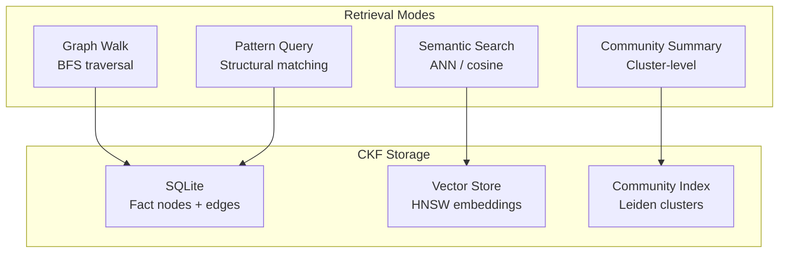

# Contextual Knowledge Fabric (CKF)

<div class="cr-hero" markdown>

## AI that remembers what it learned

The **Contextual Knowledge Fabric (CKF)** is CRP's semantic memory. It stores
facts as a graph, not as flat text, so CRP can retrieve, connect, and reason
across documents, conversations, and tool outputs. The result: answers that are
grounded in everything the system knows, not just the current prompt.

</div>

!!! info "Current SDK status"
    In the current `SDKClient`, CKF facts live in memory for the lifetime of the
    client and are used automatically by `client.ask()`. Persistent cross-session
    CKF storage is on the roadmap.

## Business impact

| Without CKF | With CKF |
|-------------|----------|
| Each call starts from the documents you pass in | Previously ingested facts are available to every call |
| Multi-document reasoning is flat chunk matching | Graph walk connects related facts across sources |
| No memory of prior turns | Conversation history becomes structured, queryable knowledge |
| Sources are filenames | Sources are atomic, attributable facts |

## Architecture



## 4 Retrieval Modes

### 1. Graph Walk

Breadth-first traversal from a seed fact, following typed edges:

```python
# CKF is used automatically during envelope construction.
# Facts from CKF appear in Section 10 (CKF Retrievals) of the envelope.
```

- Starts from facts most relevant to the current task
- Follows `depends_on`, `elaborates`, `cause_effect` edges
- Configurable depth (default: 2 hops)
- Results scored by graph distance + relevance

### 2. Pattern Query

Structural pattern matching against the fact graph:

- Find all facts matching a template pattern
- Supports wildcard nodes and edge types
- Efficient for "find all causes of X" queries

### 3. Semantic Search

ANN (Approximate Nearest Neighbor) vector search:

- Uses shared `all-MiniLM-L6-v2` embeddings
- HNSW index for $O(\log N)$ retrieval
- Cosine similarity scoring
- Fallback when graph structure doesn't capture the relationship

### 4. Community Detection

Leiden algorithm clusters related facts into communities:

- Identifies topic clusters automatically
- Community summaries provide high-level context
- Useful for understanding the "shape" of accumulated knowledge

## Multi-Mode Merge

When multiple retrieval modes return results, CRP merges them:

1. Deduplicate across modes
2. Blend scores (configurable weights per mode)
3. Respect token budget for CKF section of envelope
4. Prioritize facts that appear in multiple modes

## Storage

| Component | Backend | Purpose |
|-----------|---------|---------|
| Facts + edges | SQLite | Durable, ACID-compliant graph storage |
| Embeddings | HNSW index | Fast vector similarity search |
| Communities | In-memory (rebuilt) | Topic clustering |
| Size limit | 500 MB default | Configurable |

### Encryption

CKF data is encrypted at rest with **AES-256-GCM** using HKDF-derived keys.
See [Security](../compliance/security.md) for details.

## Garbage Collection

The CKF includes a garbage collector that manages fact lifecycle:

- **Staleness detection** - Facts not accessed within configurable window
- **Relevance decay** - Facts with zero cross-session references
- **Deduplication** - Merge semantically equivalent facts
- **Compaction** - Rebuild indexes after significant deletions

## Configuration

```python
import crp

client = crp.SDKClient(
    provider="openai",
    model="gpt-4o",
)

client.ingest("./docs/")
print(client.knowledge.search("TLS configuration"))
print(client.storage.overview())
```

## Event System

CKF emits events via a pub/sub bus for observability:

| Event Type | Trigger |
|------------|---------|
| `FACT_STORED` | New fact persisted to CKF |
| `FACT_RETRIEVED` | Fact pulled from CKF into envelope |
| `GC_RUN` | Garbage collection cycle |
| `COMMUNITY_UPDATED` | Community structure changed |
| `INDEX_REBUILT` | HNSW index rebuilt |

!!! info "When does CKF activate?"
    CKF retrieval runs during **envelope construction** (Phase 3 of the
    packing algorithm). Facts from CKF are placed in Section 10 of the
    envelope. CKF is not used if `ckf_enabled=False` (default: True when
    a `ckf_path` is configured).
