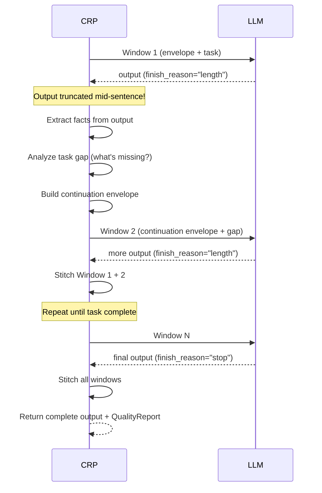

# Continuation & Stitching

<div class="cr-hero" markdown>

## Finish the task, not just the window

Every LLM has a finite output window. Ask for a 30-section guide and you get 8
sections before truncation. CRP **continuation** detects the wall, starts a new
window, and **stitches** the partial outputs into one coherent result. The
business outcome: AI actually completes multi-step work instead of stopping mid-
sentence.

</div>

## Business impact

| Without continuation | With CRP continuation |
|----------------------|------------------------|
| Output truncates mid-task | Automatic multi-window generation |
| Manual prompt engineering to continue | CRP builds continuation envelope automatically |
| Repeated or contradictory sections | Echo detection + style anchors preserve coherence |
| No completion signal | `answer.complete` tells you if the task finished |

## How Continuation Works



## Continuation Triggers

Continuation fires **only** when ALL three conditions are met:

1. **Physical wall hit**: `finish_reason == "length"` (LLM ran out of tokens)
2. **Task unfulfilled**: Gap analysis detects missing content
3. **Positive information flow**: New information is still being produced

### What Does NOT Trigger Continuation

- Arbitrary token budgets
- Configured ceilings or "recommended window sizes"
- Premature EOS (model stops naturally) - this triggers **redispatch**, not continuation

!!! info "Premature EOS"
    If the model stops naturally (`finish_reason="stop"`) but the task has gaps,
    CRP **redispatches** with a refined prompt - not a continuation envelope.
    This distinction matters for quality.

## The Stitch Algorithm

When windows are stitched together, CRP handles overlaps and boundaries
intelligently:

### Step 1: Echo Detection

Check for repeated text between the tail of Window N and head of Window N+1:

- Compare last 2,000 characters of previous window with first 2,000 of next
- Find longest common substring (minimum 20 characters)
- Remove the echo from the new window

### Step 2: Content-Type Boundary Detection

CRP finds the right "seam" based on content type:

| Content Type | Break Point |
|-------------|-------------|
| Prose | Paragraph break |
| Code | Between functions/blocks |
| Markdown | Before headings |
| JSON | Between objects |
| Lists | Between list items |

### Step 3: Semantic Echo Fallback

If no literal echo is found, check for **rephrased** echoes:

- Compute embedding similarity between tail/head segments
- If similarity > 0.85, it's a paraphrase - truncate the repeat
- This catches cases where the model restates the same idea differently

### Step 4: Post-Stitch Validation

After stitching, CRP validates:

- No duplicate sentences
- Bracket/parenthesis integrity maintained
- Heading hierarchy preserved
- List numbering remains sequential

## Continuation Envelope

The continuation envelope is different from the initial envelope. It contains:

| Component | Purpose |
|-----------|---------|
| **Extracted facts** | Key facts from the truncated output |
| **Structural state** | Open code blocks, list position, section headers still in progress |
| **Task gap** | What items from the original task are still missing |
| **Style anchor** | Last natural paragraph for voice consistency |
| **Voice profile** | Sentence length, vocabulary level, tone markers |
| **Document map** | Running TOC with completion % per section |

!!! warning "Not raw text overlap"
    CRP does NOT carry forward raw text from the previous window. It carries
    **extracted facts** and **structural state**. This is key to quality
    preservation - raw text wastes tokens, facts are compressed.

## Long-Chain Coherence (>5 Windows)

For extended generations, CRP employs additional coherence mechanisms:

### Voice Profile

Extracted from Window 1 and maintained across all windows:

- Average sentence length
- Vocabulary level (academic, technical, conversational)
- Tone markers (formal, informal, technical)
- Formatting patterns (heading style, list style)
- 2 exemplar paragraphs for style reference

### Progressive Document Map

A running table of contents that tracks:

```
Section 1: Introduction          [COMPLETE, 342 words]
Section 2: Architecture          [COMPLETE, 518 words]
Section 3: Networking            [IN PROGRESS, 127 words]
Section 4: Security              [NOT STARTED]
...
```

This helps the model know what's done and what's needed.

### Re-Grounding

When cumulative degradation exceeds **15%**, CRP triggers re-grounding:

1. Re-extract facts from ALL accumulated raw output
2. Rebuild the warm state from scratch
3. Correct any drift in the fact graph
4. Resume generation with refreshed, accurate context

Cost: ~10–50 ms. Triggered by measured degradation, not on a fixed schedule.

## Termination

Continuation stops when ANY of these is true:

| Condition | Meaning |
|-----------|---------|
| `gap_is_zero` | All task items fulfilled |
| `all_signals_dead` | No new information being produced |
| `count >= max_continuations` | Safety limit reached |
| `finish_reason == "stop"` | Model completed naturally |

## Real-World Example

With a 4K context model and 2,048 token generation limit:

| | Direct LLM | CRP |
|---|---|---|
| Words | 592 | 6,993 |
| Sections (of 30) | 8 | 25 |
| Truncated? | Yes | No |
| Conclusion? | No | Yes |
| Windows | 1 | 9 |
| Quality tier | - | A |

CRP takes 12x longer but produces 12x more content at the **same throughput**
(4.9 words/sec both methods). The difference: CRP finishes the task.

See [Benchmarks](../testing/benchmarks.md) for full results.
