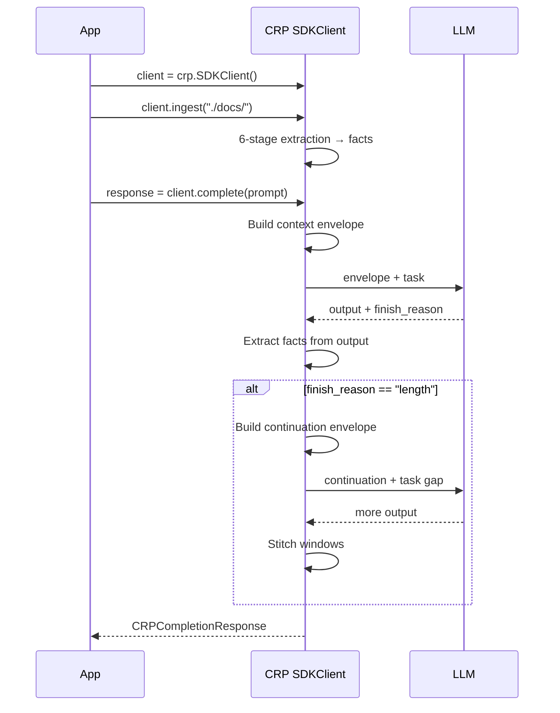
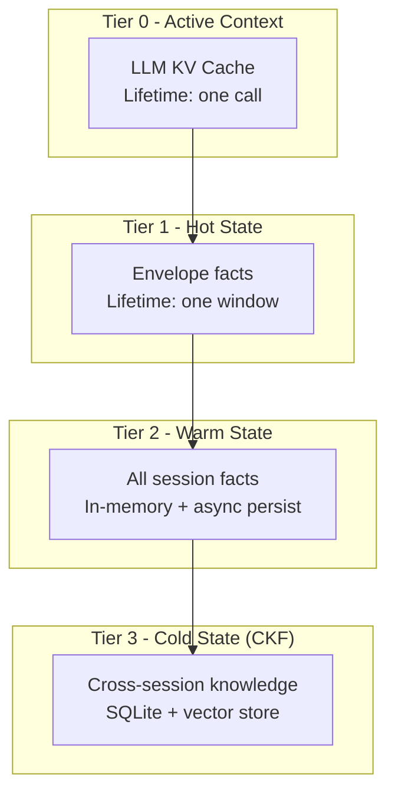

# Core Protocol

> CRP is built on **10 design axioms** that guarantee every LLM call gets a focused,
> relevant, and bounded context window - while the session as a whole retains unbounded
> state across turns.

Every implementation decision traces back to these principles.

## Design Axioms

| # | Axiom | Meaning |
|---|-------|---------|
| 1 | **Task Isolation** | Every LLM operation gets its own context window |
| 2 | **Maximum Context Saturation** | Envelope fills ALL remaining space: $E = C - S - T - G$ |
| 3 | **Zero Interpretation Overhead** | Pre-digested facts, not raw data |
| 4 | **Model Ignorance** | The LLM doesn't know CRP exists - no protocol metadata leaks |
| 5 | **Unbounded Capacity** | Throughput = $N \times C$, with honest quality tier degradation |
| 6 | **Portability** | Language, model, and framework independent |
| 7 | **Window Provenance** | DAG tracking of all window lineage |
| 8 | **Hardware-Adaptive** | Self-configures to VRAM / RAM / CPU |
| 9 | **Output Integrity** | `complete()`/`ask()` return unmodified LLM output; extraction is read-only |
| 10 | **LLM Amplification** | CRP amplifies the LLM, never replaces it |

## Session Lifecycle



### TaskIntent

Every `complete()` or `ask()` call creates a `TaskIntent` internally - CRP's
declarative task specification. All fields are optional with sensible defaults:

```python
import crp

client = crp.SDKClient()

# Single-turn call with governance summary
response = client.complete(
    "Write a Kubernetes networking guide.",
    system="You are a technical writer.",
)
print(response.text)
print(response.crp.risk)       # LOW | MEDIUM | HIGH | CRITICAL
print(response.crp.grounded)   # True | False
```

### Window DAG

CRP tracks every generation window in a **Directed Acyclic Graph** (DAG):

- **Continuation**: Window A → Window B (extend output)
- **Fan-out**: Window A → [B₁, B₂, B₃] (parallel dispatch)
- **Fan-in**: [B₁, B₂, B₃] → Window C (merge results)

## Four-Tier Memory Hierarchy

CRP manages context across 4 memory tiers with different lifetimes:



| Tier | Name | Lifetime | Storage | Size |
|------|------|----------|---------|------|
| 0 | Active Context | One LLM call | KV cache | Model context window |
| 1 | Hot State | One window | App memory | Adaptive |
| 2 | Warm State | One session | Memory + async disk | MB scale |
| 3 | Cold State (CKF) | Cross-session | SQLite + vectors | Up to 500 MB |

!!! info "Performance"
    Warm state hot path is **in-memory only**. Persistence is async with batch
    flush every 5 windows. This means zero I/O latency on the critical path.

## Orchestration Flow

For each `complete()`/`ask()` call, CRP follows this pipeline:

1. **Receive TaskIntent** - Parse system prompt, task input, and kwargs
2. **Construct Envelope** - Query warm/cold state, rank facts, pack envelope
3. **Assemble Window** - Create window metadata in the DAG
4. **Dispatch to LLM** - Send envelope + task via provider adapter
5. **Run Extraction** - 6-stage pipeline on LLM output
6. **Measure Info Flow** - Calculate quality score $Q(t, w)$
7. **Check Continuation** - If truncated AND task unfulfilled → continue
8. **Update DAG** - Record window relationships and provenance
9. **Return Output** - Stitched text + `CRPCompletionResponse`/`CRPAskResponse`

## Configuration

```python
import crp

client = crp.SDKClient(
    provider="openai",       # or "anthropic", "ollama", etc.
    model="gpt-4o",
)

# Runtime overrides (Layer 5 of the unified config hierarchy)
client.configure(
    context.windows.max=10,   # forwarded to core orchestrator
    knowledge.auto_ingest=True,
    knowledge.embedding_model="all-MiniLM-L6-v2",
)
```

See [Providers](../getting-started/providers.md) for provider-specific configuration.
