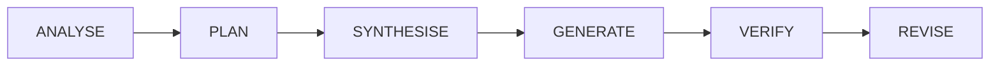

# Dispatch Strategies

> CRP provides multiple dispatch strategies so the same session can serve quick
> answers, deep research, tool-augmented queries, streamed UIs, and long-form
> generation - all through the current `crp.SDKClient()` API.

All strategies benefit from the 6-stage extraction pipeline, quality tier assessment,
and HMAC-chained audit trail. The legacy method names (`dispatch()`,
`dispatch_with_tools()`, etc.) have been unified into `complete()`, `ask()`,
`@client.tool`, and depth-controlled queries.

## Strategy Overview

| # | Strategy | SDK Pattern | Spec Section |
|---|----------|-------------|--------------|
| 1 | PUSH | `client.complete()` / `client.ask()` | §6 |
| 2 | PULL | `@client.tool` + `client.ask()` | §20 |
| 3 | Verify-then-Refine | `client.ask(depth="thorough")` | §21.1 |
| 4 | Index-then-Detail | `client.ask()` with progressive retrieval | §21.2 |
| 5 | Real-time Context Injection | Streaming iterator over `client.ask()` | §21.3 |
| 6 | Cognitive Engine | `client.ask(depth="exhaustive")` / STL | §22 |
| 7 | Streaming | Iterator over tokens/events | §6.10.5 |
| 8 | Batch | Shared session, multiple calls | §6.6 |
| 9 | Hierarchical | Continuation manager / map-reduce | §14 |

## 1. PUSH - Default

The default strategy. CRP pre-loads the context envelope with the most relevant
facts from the warm store, then dispatches the full envelope + task to the LLM.

```python
import crp

client = crp.SDKClient()
client.ingest("./docs/")

response = client.complete(
    "Write a guide to Kubernetes networking.",
    system="You are a technical writer.",
)
print(response.text)
print(response.crp.risk)
```

**Best for**: General tasks where CRP has domain knowledge ingested.

**How it works**:

1. Query warm store for facts relevant to the task
2. Pack facts into context envelope (respecting token budget)
3. Send envelope + task to LLM
4. If output truncated (`finish_reason="length"`), extract facts and continue
5. Stitch windows together, assess quality

## 2. PULL - Tool-mediated

Instead of pre-loading context, the LLM is given CRP context tools
(`retrieve_facts`, `search_by_keyword`). The LLM requests context **on demand**.

```python
import crp

client = crp.SDKClient()

@client.tool
def get_facts(query: str) -> list[dict]:
    """Return relevant facts for the query."""
    return [{"fact": "CRP uses CKF graphs."}]

response = client.ask(
    "What CNI plugins are available for Kubernetes?",
    depth="standard",
)
print(response.text)
```

**Best for**: Tasks where the LLM knows what it needs better than CRP does.

!!! note "Note"
    Requires a provider that supports tool/function calling (OpenAI, Anthropic).

## 3. Verify-then-Refine

Two-pass strategy. Pass 1: generate with a shallow envelope. CRP analyzes output
against the knowledge base, finds contradictions and unsupported claims. Pass 2+:
model refines with precision corrections.

```python
import crp

client = crp.SDKClient()
client.ingest("./docs/rbac_policy.md")

response = client.ask(
    "Describe Kubernetes RBAC best practices.",
    depth="thorough",
)
print(response.text)
print(response.crp.grounded)
```

**Best for**: Fact-checking, high-accuracy requirements, hallucination reduction.

## 4. Index-then-Detail

Builds a compact INDEX of available facts (~10% token cost). Sends task + index.
Detects which entries were referenced. Expands referenced entries to full detail.

```python
import crp

client = crp.SDKClient()
client.ingest("./docs/")

response = client.ask(
    "Explain horizontal pod autoscaling.",
    depth="standard",
)
print(response.sources)   # documents actually used
```

**Best for**: Large knowledge bases where not all context is relevant.

## 5. Real-time Context Injection

Streams generation while CRP fact-matches against the warm store. If relevant NEW
facts are found, they are injected into subsequent context windows.

```python
import crp

client = crp.SDKClient()
client.ingest("./docs/")

response = client.ask(
    "How does Kubernetes service mesh work?",
    depth="standard",
)
# Inspect which sources were pulled in as the answer developed.
print(response.sources)
```

**Best for**: Dynamic, exploration-style tasks.

## 6. Cognitive Engine

The Semantic Task Layer (STL) decomposes complex tasks into operations
(RETRIEVE, COMPARE, ANALYSE, SYNTHESISE, GENERATE, VERIFY, CLARIFY, REVISE) and
runs a cognitive loop.



```python
import crp

client = crp.SDKClient()
client.ingest("./docs/security/")

response = client.ask(
    "Design a Kubernetes security hardening strategy.",
    depth="exhaustive",
)
print(response.text)
print(response.how_it_was_built)
print(response.open_questions)
```

**Best for**: Complex multi-step tasks requiring autonomous reasoning.

## 7. Streaming

Yields tokens or events in real-time for live UIs.

The high-level `crp.SDKClient()` API currently returns complete responses via
`complete()` and `ask()`. Streaming events are available at the orchestrator
level through the async dispatch stream API:

```python
import asyncio
import crp

client = crp.SDKClient()
orchestrator = client._ensure_orchestrator()

async def stream():
    async for event in orchestrator.async_dispatch_stream(
        system_prompt="You are a technical writer.",
        task_input="Explain etcd in Kubernetes.",
    ):
        if event.event_type == "token":
            print(event.data, end="", flush=True)
        elif event.event_type == "done":
            break

asyncio.run(stream())
```

**Event types**: `token`, `extraction`, `continuation`, `window_complete`, `done`, `error`

**Best for**: Real-time UIs, chatbots, interactive applications.

## 8. Batch Processing

Multiple tasks run through the same session. Facts accumulate across tasks.

```python
import crp

client = crp.SDKClient()
client.ingest("./docs/")

tasks = [
    "Explain ConfigMaps.",
    "Explain Secrets.",
    "Compare ConfigMaps vs Secrets.",
]
results = [client.ask(t) for t in tasks]
# Each result is a CRPAskResponse with .text, .quality, and .crp metadata.
```

**Best for**: Processing multiple related tasks, report generation.

## 9. Hierarchical

Segments large input into chunks, dispatches each through the LLM, then
iteratively reduces the syntheses. In the SDK this is driven by the
continuation manager via `depth="exhaustive"`.

```python
import crp

client = crp.SDKClient()
client.ingest("./very_long_document.md")

response = client.ask(
    "Summarize key findings",
    depth="exhaustive",
)
print(response.text)
print(response.complete)
```

**Best for**: Analyzing documents that exceed context windows.

## Choosing a Strategy

```mermaid
graph TD
    A{What's your use case?} --> B{Do you have domain knowledge?}
    B -->|Yes| C{How much?}
    B -->|No| D[complete / ask]
    C -->|Small KB| D
    C -->|Large KB| E{Need high accuracy?}
    E -->|Yes| F[ask depth=thorough]
    E -->|No| G{LLM should pull context?}
    G -->|Yes| H[@client.tool]
    G -->|No| I{Real-time UI?}
    I -->|Yes| J[async_dispatch_stream]
    I -->|No| K{Complex reasoning?}
    K -->|Yes| L[ask depth=exhaustive]
    K -->|No| D
    A --> M{Multiple tasks?}
    M -->|Yes| N[batch ask]
    A --> O{Large document?}
    O -->|Yes| P[ask depth=exhaustive]
```
