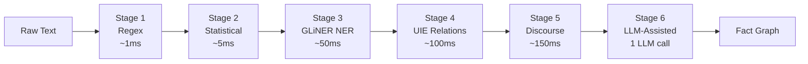
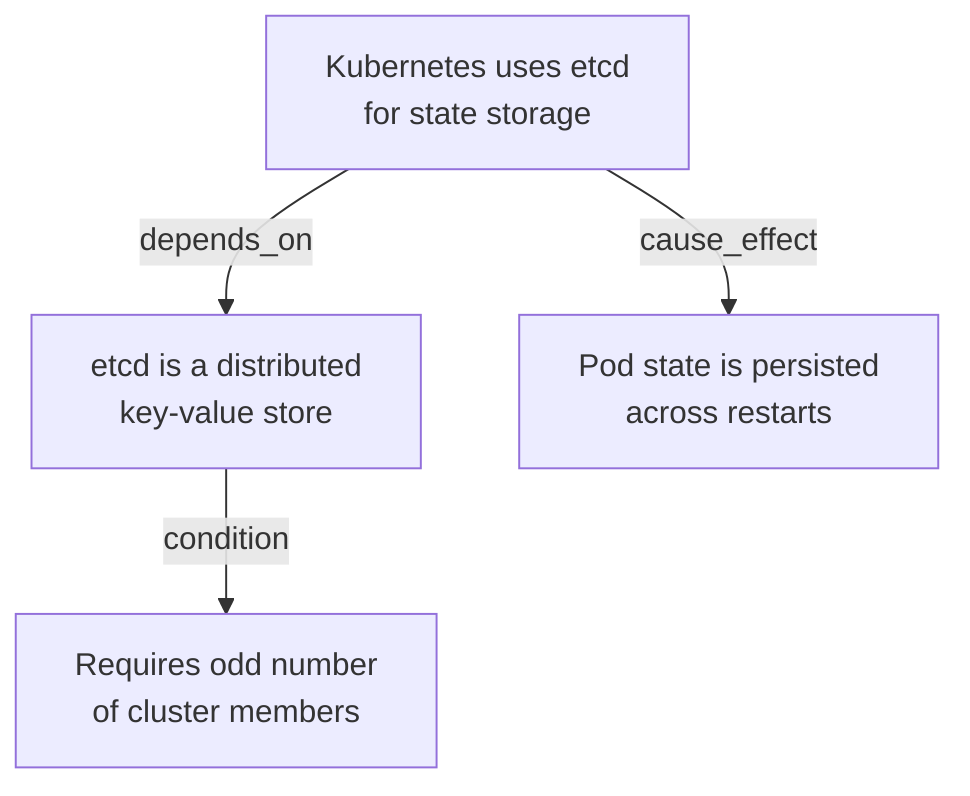

# Extraction Pipeline

<div class="cr-hero" markdown>

## Turn raw text into structured, traceable facts

CRP's 6-stage graduated extraction pipeline converts documents and LLM output
into atomic facts. Each stage adds analytical depth at increasing computational
cost, so simple content is fast and complex content gets the depth it needs.

</div>

<span class="cr-badge cr-badge-live">Self-hosted today</span>
<span class="cr-badge cr-roadmap">Managed-cloud waitlist for Gateway and Comply; more endpoints on the roadmap</span>

## Pipeline Overview



## Stages

### Stage 1 - Regex Extraction (~1 ms)

Pattern-based extraction of structured data:

- Key-value pairs (`key: value`)
- Definitions (`X is defined as Y`)
- Numeric facts, dates, URLs
- Code blocks and inline code
- List items and enumerations

**Always runs.** Near-zero cost.

### Stage 2 - Statistical NLP (~5 ms)

TextRank-based extraction of important sentences:

- Sentence importance scoring
- Noun phrase extraction
- Term frequency analysis
- Co-occurrence patterns

**Always runs.** Catches facts that regex misses.

### Stage 3 - GLiNER Named Entity Recognition (~50 ms)

Neural NER using GLiNER models:

- Person, organization, location entities
- Technical terms, software names
- Domain-specific entities
- Entity linking and deduplication

**Runs when** Stage 2 yield is low.

### Stage 4 - UIE Relational Extraction (~100 ms)

Universal Information Extraction for relationships:

- Subject-predicate-object triples
- Cause-effect relationships
- Dependency chains
- Temporal sequences

**Runs when** Stage 3 yield is low.

### Stage 5 - Discourse Structure (~150 ms)

Identifies document-level patterns:

- Argument structure
- Rhetorical relations
- Topic boundaries
- Logical flow

**Runs for** reasoning-dense content.

### Stage 6 - LLM-Assisted Relational (~1 LLM call)

Uses the LLM itself to extract complex relationships:

- Multi-hop reasoning chains
- Implicit relationships
- Domain-specific ontology mapping

**Off by default.** Enable via configuration.

## From the SDK

```python
import crp

client = crp.SDKClient()

# Ingest a directory; extraction and fact-graph construction run automatically.
client.ingest("./docs/")

# Ask against the extracted facts.
answer = client.ask("What are the deployment steps?", depth="thorough")
print(answer.text)
print(answer.quality)
print(answer.sources)
```

## Content Complexity Routing

CRP automatically detects content type and selects appropriate stages:

| Content Type | Stages Used | Example |
|-------------|-------------|---------|
| ENTITY_RICH | 1 → 4 | API documentation, reference material |
| REASONING_DENSE | 1 → 6 | Research papers, analysis |
| NARRATIVE | 1 → 5 | Reports, articles, guides |

## Quality Gate

Every extracted fact passes a **3-tier quality gate**:

1. **Structural validation** - Well-formed, complete, no truncation
2. **Confidence scoring** - Statistical confidence meets threshold
3. **Anomaly detection** - Outliers flagged for review

Facts that fail validation are discarded or demoted.

## Fact Graph

Extracted facts are stored as nodes in a typed graph:



### Edge Types

| Type | Meaning |
|------|---------|
| `depends_on` | Fact A requires Fact B |
| `cause_effect` | Fact A causes Fact B |
| `condition` | Fact A is conditional on Fact B |
| `contradicts` | Fact A conflicts with Fact B |
| `supersedes` | Fact A replaces Fact B |
| `elaborates` | Fact A adds detail to Fact B |

## Event-Sourced Fact Model

Facts use an **append-only event log** - nothing is deleted, only superseded:

- Full temporal query support (what did we know at window N?)
- Complete audit trail for compliance
- State reconstruction from any point
- Automatic snapshots every 50 windows

## Singleton Model Registry

CRP shares model instances across subsystems:

- **One** `all-MiniLM-L6-v2` instance (80 MB) shared by envelope builder,
  CKF, and extraction
- Process-wide singleton - no duplicate loading
- Lazy initialization on first use

## Direct API

For manual use outside the SDK convenience layer:

```python
from crp.extraction import ExtractionPipeline, detect_content_complexity

pipeline = ExtractionPipeline()
result = pipeline.run(
    raw_text="Kubernetes is an open-source container orchestration...",
    source_label="k8s-docs",
)
print(f"Facts extracted: {result.facts_extracted}")
print(f"Fact IDs: {result.fact_ids}")
```
