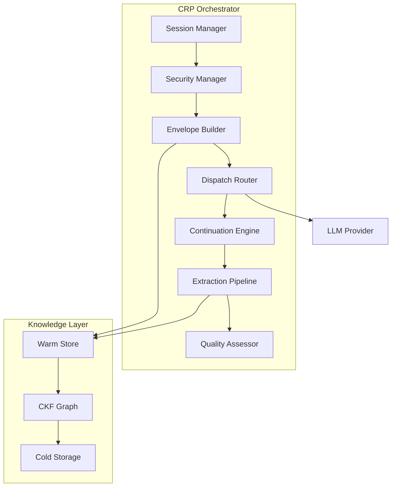

# Protocol Specification

> The Context Relay Protocol (CRP) gives every LLM call its own curated context window,
> so applications can reason over far more content than a single model invocation
> could otherwise hold - without losing facts, state, or auditability across turns.

CRP is a formal, language-neutral protocol for managing context across LLM invocations.
This section covers the protocol's architecture, design decisions, and the patterns the
SDK exposes through `crp.SDKClient`.

!!! info "Specification Version"
    CRP **v5.1.0** - the current shipping version. The canonical specifications live in
    [`SPECS_5_06_2026_CRP_v4/specs/`](https://github.com/AutoCyber-AI/context-relay-protocol/tree/main/SPECS_5_06_2026_CRP_v4/specs). The older
    `specification/` directory contains earlier research drafts and is retained for
    historical reference.

## Protocol Architecture

## Core Concepts

| Concept | Description |
|---------|-------------|
| **Session** | A stateful interaction with accumulated knowledge |
| **Window** | A single LLM invocation within a session |
| **Envelope** | The context payload packed into each window |
| **Fact** | An atomic unit of extracted knowledge |
| **Warm Store** | In-session fact storage with rapid retrieval |
| **CKF** | Contextual Knowledge Fabric - graph-structured persistent storage |
| **Quality Tier** | Output quality assessment: S, A, B, C, D |
| **Depth** | Query thoroughness: `quick`, `standard`, `thorough`, `exhaustive` |
| **Safety Surface** | Unified registry of safety rules and coverage maps |

## Design Principles

1. **Axiom 9: Zero Output Modification** - CRP NEVER modifies LLM output. The stitched
   result is exactly what the LLM generated, concatenated without alteration.

2. **Provider Agnostic** - CRP works with any LLM through a standard adapter interface.
   No vendor lock-in. The SDK auto-detects OpenAI, Anthropic, and Ollama providers.

3. **Honest Quality Reporting** - Quality tiers reflect actual output quality. CRP does
   not inflate scores.

4. **Security by Default** - Every call runs through injection detection, PII scanning,
   and HMAC-chained audit logging. Results are surfaced in `response.crp`.

## Sections

-   [**Core Protocol**](core.md)

    Session lifecycle, configuration, and orchestration.

-   [**Context Envelope**](envelope.md)

    How CRP packs facts into the context window.

-   [**Dispatch Strategies**](dispatch-strategies.md)

    PUSH, PULL, streaming, batch, and hierarchical patterns with current SDK examples.

-   [**Extraction Pipeline**](extraction.md)

    6-stage fact extraction from LLM output.

-   [**Contextual Knowledge Fabric**](ckf.md)

    Graph-structured knowledge storage and retrieval.

-   [**Quality Tiers**](quality-tiers.md)

    S/A/B/C/D output quality assessment and how to read it from the SDK.

