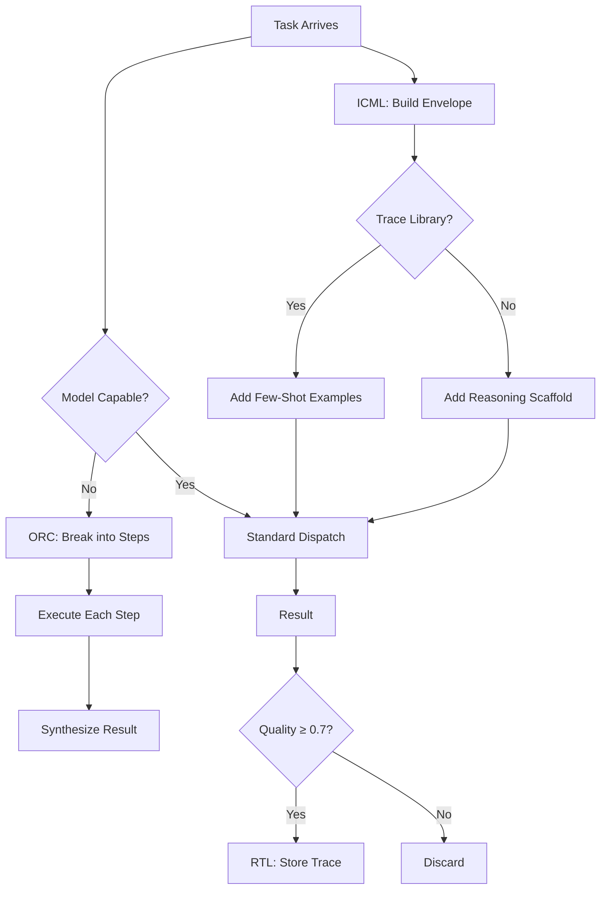

# Meta-Learning

<div class="cr-hero" markdown>

## Help small models punch above their weight

CRP includes three meta-learning mechanisms that improve model output without
retraining. By decomposing hard tasks, injecting reasoning scaffolds, and reusing
successful traces, CRP lets smaller, cheaper models compete with much larger
ones - and helps every model improve over time.

</div>

<span class="cr-badge cr-badge-live">Self-hosted today</span>
<span class="cr-badge cr-roadmap">Managed-cloud waitlist for Gateway and Comply; more endpoints on the roadmap</span>

## The Problem

Small models (0.5B–4B parameters) struggle with complex tasks:

- They forget instructions mid-generation
- They produce shallow, generic outputs
- They don't break problems into steps

CRP's meta-learning addresses this by providing **external scaffolding**
that compensates for model limitations.

## Three Mechanisms



## ORC: Orchestrated Reasoning Chains

ORC decomposes complex tasks into micro-steps when the model can't handle
them in one shot.

### When ORC Activates

All three conditions must be true:

| Condition | Check |
|-----------|-------|
| Resource pressure | Must be < HIGH (won't add overhead under pressure) |
| Model capability < task complexity | Model needs help |
| Probe quality < 0.7 | Initial attempt was poor |

If the model can handle it alone, ORC stays out of the way.

### How ORC Works

1. **Decompose** - Split the task into 3–10 micro-steps based on task type
2. **Execute** - Dispatch each step individually (each gets its own envelope)
3. **Synthesize** - Combine step outputs into a coherent final answer
4. **Retry** - If a step fails, retry with heavier scaffolding

### Scaffold Levels

| Level | Name | What It Does |
|-------|------|-------------|
| 0 | None | No scaffolding |
| 1 | Light | Key factors to consider |
| 2 | Medium | Step-by-step template |
| 3 | Heavy | 5-step structural template with explicit output format |

### Example

A 2B model asked to "Compare React, Vue, and Angular":

<div class="cr-compare" markdown>
<div class="bad" markdown>

### Without ORC

Produces a shallow 3-paragraph summary missing key dimensions.

</div>
<div class="good" markdown>

### With ORC

1. Step 1: "List the core architecture of React" → focused output
2. Step 2: "List the core architecture of Vue" → focused output
3. Step 3: "List the core architecture of Angular" → focused output
4. Step 4: "Compare these architectures on performance, learning curve, ecosystem" → structured comparison
5. Synthesis: Combine into coherent comparison article

</div>
</div>

Each step gets the model's full attention on a manageable subtask.

## ICML: In-Context Meta-Learning

ICML enriches the dispatch envelope with reasoning scaffolds and few-shot
examples from the trace library.

### Adaptive Scaffolding

The scaffold level adapts to model capability:

| Model Capability | Scaffold | What's Added |
|-----------------|----------|-------------|
| ≤ 1 (0.5B–1B) | Heavy | 5-step template: "1. Identify key concepts, 2. List relevant facts, 3. Organize by theme, 4. Draft response, 5. Review for completeness" |
| ≤ 2 (2B–7B) | Light | Key factors prompt: "Consider these factors: ..." |
| > 2 (7B+) | None | Model doesn't need scaffolding |

### Few-Shot Examples

If the trace library has similar past tasks with quality ≥ 0.7:

1. Retrieve top-3 matching traces (by word overlap)
2. Include their step descriptions as examples in the envelope
3. Model sees "here's how a similar task was solved before"

### Metacognitive Envelope

The final envelope combines:

```
Base Envelope (facts, task, system prompt)
  + Reasoning Scaffold (if model needs it)
  + Few-Shot Traces (if available)
  = Metacognitive Envelope
```

## RTL: Reasoning Template Library

RTL stores successful reasoning traces for future reuse.

### Storage Criteria

A trace is stored only if:

- Quality score ≥ 0.7 (configurable via `rtl_min_quality_for_storage`)
- The trace is complete (all steps executed)

### Trace Structure

```python
ReasoningTrace(
    trace_id="abc-123",
    task_type="comparison",
    task_summary="Compare React, Vue, Angular",
    steps=[
        ReasoningStep(
            step_description="Analyze React architecture",
            system_prompt_template="...",
            expected_output_format="bullet_points",
            scaffold_level=1
        ),
        # ...
    ],
    model_class="2B-7B",
    quality_score=0.82,
    usage_count=0
)
```

### Retrieval

When a new task arrives, RTL retrieves traces by word overlap:

1. Tokenize task description
2. Compare against stored trace summaries
3. Return top-k matches (default: 3)
4. Increment `usage_count` on retrieved traces

### Curation

Every `curation_interval` (default: 5) requests, the library prunes:

- Traces with quality below threshold
- Traces that haven't been used

## From the SDK

```python
import crp

client = crp.SDKClient()

# Choose depth to control how much reasoning scaffolding is applied.
client.configure(depth="thorough")

# For weak local models, use a stricter meta-learning profile.
answer = client.ask("Compare React, Vue, and Angular", depth="thorough")
print(answer.quality)
print(answer.how_it_was_built)   # STL / ORC operation sequence
print(answer.open_questions)
```

## Advanced Configuration

```python
from crp.advanced.meta_learning import MetaLearningEngine, MetaLearningConfig

config = MetaLearningConfig(
    enabled=True,
    orc_enabled=True,
    orc_max_steps=10,
    orc_min_model_capability=1,
    icml_enabled=True,
    icml_max_examples=3,
    rtl_enabled=True,
    rtl_min_quality_for_storage=0.7,
    scaffold_level="auto",       # "auto"|"none"|"light"|"heavy"
    curation_interval=5
)

engine = MetaLearningEngine(
    dispatch_fn=my_dispatch_function,
    model_capability=2,           # 0=tiny, 1=small, 2=medium, 3=large
    config=config
)
```

### Model Capability Levels

| Level | Parameter Range | Examples |
|-------|----------------|---------|
| 0 | < 0.5B | TinyLlama |
| 1 | 0.5B – 1B | Phi-2, Qwen-0.5B |
| 2 | 2B – 7B | Qwen3-4B, Llama-3.1-8B |
| 3 | 7B+ | Llama-3.1-70B, GPT-4 |

## Research Foundations

Meta-learning in CRP is grounded in:

- **MAML** (Finn 2017) - Learning to learn with few examples
- **ICL as Implicit Gradient Descent** (Dai 2023) - In-context learning IS learning
- **STaR** (Zelikman 2022) - Self-taught reasoning via bootstrapping
- **Distilling Step-by-Step** (Hsieh 2023) - 770M model outperforming 540B with scaffolding

The key insight: you don't need a bigger model if you give a smaller model
better structure. CRP's meta-learning provides that structure automatically.

See [Research Foundations](research.md) for the full academic basis.
