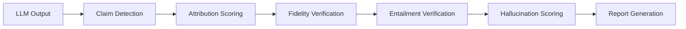

# Provenance & Hallucination Detection

<div class="cr-hero" markdown>

## Trace every claim back to its source - automatically

CRP's **Decision Provenance Engine (DPE)** is a 13-module pipeline that traces
every claim in the LLM's output back to its source facts, detects
hallucinations, contradictions, fabrications, and distortions, and produces
audit-ready reports. The result: higher trust, fewer mistakes, and compliance
evidence generated as a side effect of normal use.

</div>

<span class="cr-badge cr-badge-live">Self-hosted today</span>
<span class="cr-badge cr-roadmap">Managed-cloud waitlist for Gateway and Comply; more endpoints on the roadmap</span>

## Why Provenance Matters

LLMs generate plausible-sounding text, but they routinely:

- **Fabricate** entities, statistics, and citations that don't exist
- **Distort** source facts (change numbers, flip negations, broaden scope)
- **Omit** critical information the context provided
- **Contradict** themselves across long outputs
- **Hallucinate** confident claims with zero grounding

CRP's provenance engine catches all of these automatically.

## From the SDK

```python
import crp

client = crp.SDKClient()
client.ingest("./docs/")

answer = client.ask("What are our redundancy requirements?", depth="standard")

print(answer.text)
print(answer.quality)            # S | A | B | C | D
print(answer.crp.risk)           # LOW | MEDIUM | HIGH | CRITICAL
print(answer.crp.grounded)       # True | False
print(answer.crp.fabrications)   # count of invented entities
print(answer.sources)            # [{title, doc_id, used_facts}]
```

## Pipeline Overview



For direct engine access, the full pipeline runs in
`DecisionProvenanceEngine.analyse()`:

```python
from crp.provenance import DecisionProvenanceEngine

engine = DecisionProvenanceEngine()
report = engine.analyse(
    output_text=result.output,
    facts=result.facts_extracted,
    task_intent=task
)
```

## Stage 1: Claim Detection

Splits the LLM output into individual sentences and classifies each:

| Claim Type | Description | Example |
|-----------|-------------|---------|
| `FACTUAL_CLAIM` | Verifiable assertion | "Python 3.12 added f-string nesting" |
| `OPINION` | Subjective judgment | "React is the best framework" |
| `PROCEDURAL` | Instructions/steps | "Run `pip install crprotocol`" |
| `HEDGE` | Qualified statement | "It may improve performance" |
| `CONNECTIVE` | Structural text | "As mentioned above..." |

Only `FACTUAL_CLAIM` entries proceed to attribution scoring. Classification
uses pattern-based heuristics - no LLM call, runs in <5ms.

## Stage 2: Attribution Scoring

Each factual claim is scored against ALL envelope facts using two signals:

1. **Semantic similarity** - Dense embeddings (sentence-transformers, all-MiniLM-L6-v2,
   384-dim) or hash-projected bag-of-words fallback
2. **Lexical overlap** - Jaccard similarity on word sets

The composite score determines the attribution type:

| Attribution Type | Meaning | Composite Score |
|-----------------|---------|----------------|
| `CONTEXT_GROUNDED` | Claim supported by envelope facts | ≥ similarity threshold |
| `MIXED` | Partial support | Between thresholds |
| `PARAMETRIC` | From model's training data only | Below threshold |
| `UNCERTAIN` | Cannot determine | Inconclusive |

!!! tip "Aiming for CONTEXT_GROUNDED"
    High `CONTEXT_GROUNDED` percentages indicate the model is using the
    envelope facts you provided. Low scores mean the model is relying on its
    training data - which may be outdated or wrong.

## Stage 3: Fidelity Verification

Four parallel checks catch different failure modes:

### Distortion Detection

Catches when context-grounded claims **subtly misrepresent** their source:

| Distortion Type | Example |
|----------------|---------|
| `NUMBER_CHANGED` | Fact: "99.9% uptime" → Claim: "99.99% uptime" |
| `NEGATION_FLIP` | Fact: "does not support X" → Claim: "supports X" |
| `QUALIFIER_DROPPED` | Fact: "may improve by 10%" → Claim: "improves by 10%" |
| `QUALIFIER_ADDED` | Fact: "improves by 10%" → Claim: "only improves by 10%" |
| `SCOPE_CHANGED` | Fact: "in Python 3.12" → Claim: "in all Python versions" |
| `ENTITY_SUBSTITUTED` | Fact: "PostgreSQL" → Claim: "MySQL" |
| `SEMANTIC_DRIFT` | Embedding similarity drops below threshold |

### Fabrication Detection

Catches **invented entities** not present in any source fact:

- Extracts: percentages, numbers, dates, proper nouns, citations
- Cross-references against ALL facts using word-boundary regex
- Any entity with zero matches → fabrication alert

### Contradiction Detection

Three signals for self-contradictions:

1. **Negation conflicts** - "X is fast" then later "X is not fast"
2. **Number conflicts** - "costs $10" then later "costs $50"
3. **Semantic conflicts** - Embedding similarity on opposing claims

Checks both intra-window and cross-window contradictions.

### Omission Analysis

Detects important facts the model **silently ignored**:

- Ranks each fact by relevance to the task
- Facts with high relevance and zero coverage → omission
- Severity levels: `CRITICAL` / `HIGH` / `MEDIUM` / `LOW` (quartile-based)

## Stage 4: Entailment Verification

ML-powered Natural Language Inference using a cross-encoder model:

```
Premise (fact):     "TLS 1.3 reduces handshake to 1-RTT"
Hypothesis (claim): "TLS 1.3 greatly improves handshake speed"
Result:             ENTAILED ✓
```

Three outcomes:

| Result | Meaning |
|--------|---------|
| `ENTAILED` | Claim logically follows from fact |
| `NEUTRAL` | Claim is unrelated to fact |
| `CONTRADICTION` | Claim opposes the fact |

Catches meaning-level drift that regex can't detect:

- Specificity loss ("1-RTT" → "improved")
- Causation inflation ("correlates with" → "causes")
- Scope generalisation ("in Python" → "in all languages")

Graceful degradation: falls back to heuristic when the ML model is unavailable.

## Stage 5: Hallucination Risk Scoring

Fuses all signals into ONE risk score per claim:

| Signal | Weight |
|--------|--------|
| Attribution | 0.30 |
| Fidelity | 0.25 |
| Entailment | 0.30 |
| Specificity | 0.15 |

Risk levels:

<div class="cr-stats" markdown>
<div class="cr-stat"><span class="num">LOW</span><span class="label">&lt; 0.25</span></div>
<div class="cr-stat"><span class="num">MEDIUM</span><span class="label">0.25 – 0.50</span></div>
<div class="cr-stat"><span class="num">HIGH</span><span class="label">0.50 – 0.75</span></div>
<div class="cr-stat"><span class="num">CRITICAL</span><span class="label">≥ 0.75</span></div>
</div>

## Stage 6: Report Generation

Two output formats:

### Markdown Report

Structured for human review, follows EU AI Act Article 12 format:

- Attribution table with grounding percentages
- Fidelity verification results
- Entailment analysis
- Hallucination risk assessment per claim
- Omissions list with severity

### JSON Report

Machine-readable for CI/CD pipelines:

```python
report = engine.analyse(output_text, facts, task_intent)

# Access programmatically
print(report.grounding_percentage)     # 0.87
print(report.hallucination_count)       # 2
print(report.critical_fabrications)     # []
print(report.omitted_facts)            # [Fact(...), ...]
```

## Provenance Chain

Every claim gets a full chain:

```
Claim → Attribution → Source Fact → Window → Envelope → Task
```

This allows tracing any claim back to its origin - which window produced it,
what facts were in the envelope at the time, and what the original task was.

## Integration with Quality Tiers

Hallucination risk feeds directly into [Quality Tiers](quality-tiers.md):

| Tier | Max Hallucination Risk |
|------|----------------------|
| S | < 0.10 |
| A | < 0.25 |
| B | < 0.50 |
| C | < 0.75 |
| D | ≥ 0.75 |

## EU AI Act Compliance

The DPE was designed with EU AI Act Article 12 in mind:

- Full traceability from output to source
- Automated risk scoring
- Human-readable audit reports
- Machine-readable JSON for regulatory submission
- Omission detection (what the model chose to ignore)

See [EU AI Act Compliance](../compliance/eu-ai-act.md) for full regulatory details.
