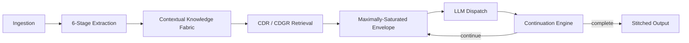

# Context Management for LLMs

**Context management** is the practice of selecting, organising, preserving, and delivering the right information to a language model at the right time. Good context management improves accuracy, reduces hallucinations, lowers token costs, and lets long tasks finish without truncation.

Context Relay Protocol (CRP) treats context management as a **first-class protocol concern**. It extracts structured facts, stores them in a graph-structured knowledge fabric, packs the most relevant facts into each window, and continues generation automatically when the model hits its output limit.

---

## Why native context windows are not enough

| Limitation | Why it matters |
|---|---|
| **Finite output length** | Long documents, codebases, and analyses truncate mid-task |
| **Lost in the middle** | Important facts buried deep in long prompts are ignored |
| **No continuation** | The model stops; the application must manually restart |
| **Flat retrieval** | RAG returns chunks but does not reason across them |
| **No cross-session memory** | Every session starts from zero |
| **Growing token cost** | Re-sending full history is $O(N^2)$ |

A larger context window helps, but it does not solve retrieval quality, attention bias, continuation, provenance, or cross-session memory.

---

## CRP context management pipeline



### 1. Ingestion

Documents, URLs, code, and tool outputs are ingested with structure-aware chunking and protected spans. See [Data Ingestion](../guides/ingestion.md).

### 2. Extraction

CRP extracts atomic facts through six graduated stages:

1. Regex
2. Statistical NLP
3. GLiNER NER
4. UIE relations
5. RST discourse
6. LLM-assisted relational

Simple content is fast (~10 ms); complex content gets the depth it needs. See [Extraction Pipeline](../protocol/extraction.md).

### 3. Contextual Knowledge Fabric (CKF)

The [CKF](../protocol/ckf.md) is a persistent knowledge graph with four retrieval modes:

- Graph walk (BFS)
- Pattern query (structural matching)
- Semantic search (HNSW ANN)
- Community summary (Leiden clustering)

### 4. Coverage-Differential Retrieval (CDR/CDGR)

CRP ranks facts by novelty relative to what the session already knows. Redundant context is suppressed, and graph edges bridge disconnected documents. See [CDR](../spec/CRP-SPEC-024-coverage-differential-retrieval.md) and [CDGR](../spec/CRP-SPEC-025-graph-retrieval.md).

### 5. Maximally-saturated envelope

The envelope fills all remaining context tokens with scored, relevant facts:

```text
E = C - S - T - G
```

Where `C` is context size, `S` is system prompt, `T` is task, and `G` is generation reserve. Saturation typically reaches **0.994**.

### 6. Automatic continuation

When the model returns `finish_reason="length"`, CRP detects remaining gaps, dispatches a fresh window with a rebuilt envelope and Cognitive State Object, and stitches outputs into a coherent result. Benchmarks show **11.8× more completed content**.

[:octicons-arrow-right-24: Continuation protocol](../protocol/continuation.md)

---

## Context Management comparison

| Capability | CRP | RAG | MemGPT | Native long context |
|---|---|---|---|---|
| Extraction | 6-stage structured | Chunk + embed | LLM-managed | None |
| Knowledge store | Graph + vector + SQL | Vector DB | Archival memory | Prompt only |
| Continuation | Automatic | No | Manual | No |
| Quality scoring | S/A/B/C/D tiers | No | No | No |
| Provenance | Full DAG | Document source | No | No |
| Cross-session memory | Yes | Sometimes | Yes | No |

---

## Frequently asked questions about context management

<script type="application/ld+json">
{
  "@context": "https://schema.org",
  "@type": "FAQPage",
  "mainEntity": [
    {
      "@type": "Question",
      "name": "What is context management in LLMs?",
      "acceptedAnswer": {
        "@type": "Answer",
        "text": "Context management is the process of selecting, organizing, preserving, and delivering the most relevant information to a language model for each call, so outputs are accurate, coherent, and cost-efficient."
      }
    },
    {
      "@type": "Question",
      "name": "Does CRP replace RAG?",
      "acceptedAnswer": {
        "@type": "Answer",
        "text": "No. CRP complements RAG. RAG retrieves documents; CRP extracts facts, manages continuation, scores quality, and maintains cross-session knowledge. CRP can use RAG as one of its context sources."
      }
    },
    {
      "@type": "Question",
      "name": "Can CRP handle tasks longer than the model context window?",
      "acceptedAnswer": {
        "@type": "Answer",
        "text": "Yes. CRP automatically continues generation across multiple dedicated windows and stitches the results into one coherent output, independent of the model's output limit."
      }
    }
  ]
}
</script>

### What is context management in LLMs?

Context management is the process of selecting, organizing, preserving, and delivering the most relevant information to a language model for each call, so outputs are accurate, coherent, and cost-efficient.

### Does CRP replace RAG?

No. CRP complements RAG. RAG retrieves documents; CRP extracts facts, manages continuation, scores quality, and maintains cross-session knowledge. CRP can use RAG as one of its context sources.

### Can CRP handle tasks longer than the model context window?

Yes. CRP automatically continues generation across multiple dedicated windows and stitches the results into one coherent output, independent of the model's output limit.

---

## See also

- [Context Envelope](../protocol/envelope.md)
- [Contextual Knowledge Fabric](../protocol/ckf.md)
- [Continuation & Stitching](../protocol/continuation.md)
- [CRP vs RAG, MCP & Agents](crp-vs-rag-mcp.md)
- [SDK Context Management](../sdk/context-management.md)
