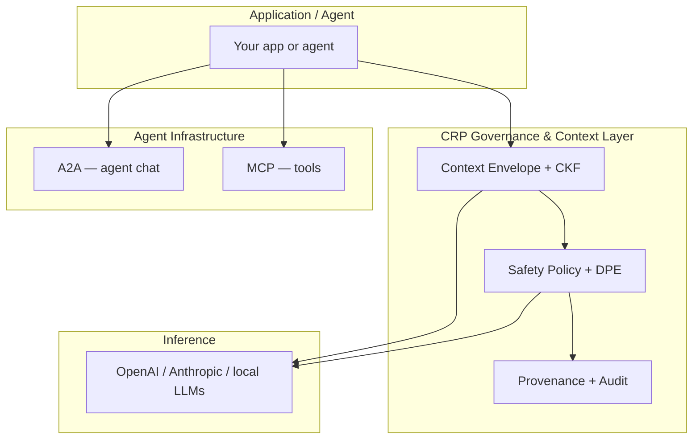

# CRP vs RAG, MCP, LangChain & MemGPT

CRP is not a replacement for the tools you already use. It is a **governance and context layer** that sits beneath or alongside them, making every AI call safer, continuous, and auditable.

---

## The stack

| Layer | Technology | Role |
|---|---|---|
| **Agent communication** | A2A | How agents talk to each other |
| **Tool access** | MCP | How agents discover and call tools |
| **Governance & context** | **CRP** | **How every AI call is grounded, governed, and continued** |
| **Inference** | OpenAI, Anthropic, local models | Where generation happens |

---

## High-level comparison

| | CRP | RAG | MemGPT/Letta | LangChain/LlamaIndex | MCP | A2A |
|---|---|---|---|---|---|---|
| **Context lifecycle** | Full pipeline | Retrieval only | Virtual paging | Chain-based | None | None |
| **Output continuation** | Automatic | No | No | Manual | No | No |
| **Structured extraction** | 6-stage | Chunk embedding | LLM-managed | Manual | No | No |
| **Quality scoring** | S/A/B/C/D | No | No | No | No | No |
| **Provenance** | Full DAG | Document source | No | No | No | No |
| **Hallucination detection** | 13-stage DPE | No | No | No | No | No |
| **Cross-session memory** | CKF graph+vector | Vector DB | Archival storage | Manual | No | No |
| **Safety enforcement** | Protocol headers | No | No | No | No | No |
| **Compliance evidence** | Runtime export | No | No | No | No | No |
| **In-window overhead** | Zero | Low | High | Medium | Very high (schemas) | Varies |

---

## CRP and RAG

**RAG retrieves relevant documents.** It answers "what source material might help?"

**CRP turns source material into structured knowledge and manages the entire call.** It answers:

- Which facts are most relevant right now?
- Has the model already seen this fact?
- Did the output actually use the facts?
- Is the output hallucinated, contradictory, or fabricated?
- How do we continue if the output truncates?
- Where is the audit trail?

**Use RAG for document retrieval. Use CRP to make every retrieval actionable, scored, and auditable.**

[:octicons-arrow-right-24: Context management guide](context-management.md)

---

## CRP and MCP

**MCP gives agents tools.** It standardises how an agent discovers and calls external functions.

**CRP governs the AI calls that use those tools.** It adds:

- Safety headers on every tool-planning and tool-result call
- Context-source manifests so tool outputs are attributed
- Safety budgets across multi-step agent loops
- Audit trails for every decision

CRP also avoids the protocol-token explosion of sending full tool schemas in every window. Schemas are placed only in tool-selection windows, cutting agent-token overhead by ~90%.

[:octicons-arrow-right-24: Tools & Agents SDK](../sdk/tools-and-agents.md)

---

## CRP and A2A

**A2A lets agents exchange messages.** It does not standardise risk state or context continuity.

**CRP headers propagate across A2A hops.** A downstream agent receives the same safety budget, chain ID, grounding score, and policy hash as the upstream agent, so governance is preserved end-to-end.

[:octicons-arrow-right-24: Multi-Agent Safety](../protocol/multi-agent.md)

---

## CRP and LangChain / LlamaIndex

LangChain and LlamaIndex are orchestration frameworks. They make it easier to chain prompts, retrievers, and tools.

CRP does not replace them. It provides the **protocol contract** underneath:

- A standard envelope format
- Standard safety headers
- Standard audit events
- Standard compliance mappings

Teams can keep their LangChain/LlamaIndex application logic and route calls through the CRP Gateway.

---

## When to use each

| If you need... | Use |
|---|---|
| Document retrieval | RAG |
| Agent tool calling | MCP |
| Agent-to-agent messaging | A2A |
| Prompt chaining & orchestration | LangChain / LlamaIndex |
| Long-term virtual memory | MemGPT / Letta |
| Safety, governance, compliance, continuation, provenance | **CRP** |

---

## CRP is the governance layer

Think of CRP as the **TLS of AI calls**:

- TLS encrypts and authenticates every HTTP request without changing the application.
- CRP **governs and contextualises every AI call** without changing the model.

One `base_url` change gives you:

- Unbounded context and continuation
- Hallucination and injection detection
- Tamper-evident audit trails
- EU AI Act / ISO 42001 evidence

[:octicons-arrow-right-24: Why CRP?](../why-crp.md)
