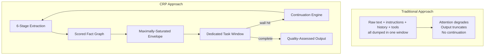

---
hide:
  - toc
seo_title: Why CRP? — Agentic Positioning for SLM-first AI
description: CRP is the agentic positioning layer for SLM-first AI. MCP exposes tools, A2A connects agents, CRP positions every agent on the right task with the right context and tools.
---

# Why CRP?

## The Context Problem Nobody Has Solved

Every AI application faces the same fundamental limitation: **LLMs have finite context and finite output.** Ask for a comprehensive document and it truncates. Build a multi-turn agent and context degrades. Deploy to production and there's no audit trail.

Existing solutions each solve one piece:

- **RAG** retrieves documents but doesn't manage output or continuation
- **MemGPT/Letta** pages memory but burns tokens on self-management
- **LangChain/LlamaIndex** chains prompts but has no structured context lifecycle
- **MCP** exposes tools but doesn't decide which agent uses them, when, or with what context
- **A2A** connects agents but doesn't position them on the right task with the right tools
- **CRP** is the positioning layer: it selects operations, loads only the tools each call needs, carries state forward, and proves every step

**CRP is the first protocol that manages the complete context lifecycle** - ingestion, extraction, packing, dispatch, continuation, quality assessment, and cross-session persistence - as a single, coherent system.

---

## The business case

!!! danger "Risk avoidance"
    EU AI Act fines reach **€35 million or 7% of global turnover**. CRP implements **33/35 technical controls** across Articles 9–17 and generates the evidence trail regulators expect - before an audit starts.

!!! success "Time-to-market"
    Compliance reports, DPIAs, and technical documentation are generated **from runtime audit data**, not six-month consulting engagements. Ship governed AI without delaying launches.

!!! tip "Output quality"
    The same model and hardware produce **11.8× more completed output** with CRP. Tasks that truncate at section 8 finish at section 25, with a quality tier and provenance to prove it.

---

## What changes the week you adopt CRP

| Before CRP | After CRP |
|------------|-----------|
| Outputs truncate mid-task | Tasks finish via automatic multi-window continuation |
| Compliance is manual and reactive | Evidence packs are generated automatically from runtime data |
| No risk signal on LLM calls | Every call is scored: LOW / MEDIUM / HIGH / CRITICAL |
| No audit trail | HMAC-chained, tamper-evident session logs |
| Vendor lock-in to one model | Model-agnostic governance across OpenAI, Anthropic, local, and custom endpoints |
| Context lost between calls | CKF persists scored facts across sessions and machines |
| Safety code scattered in app logic | Safety Policy enforced at the protocol / Gateway boundary |

---

## How CRP Manages Context

### The Core Insight

Instead of cramming everything into one massive context window and hoping for the best, CRP uses **dedicated, optimized windows** where every token earns its place:



### The 10 Axioms

Every design decision in CRP flows from 10 non-negotiable axioms:

| # | Axiom | What It Means |
|---|-------|---------------|
| 1 | **Task Isolation** | Every LLM call gets its own dedicated window. No cross-task contamination |
| 2 | **Maximum Context Saturation** | Fill every available token with scored, relevant facts: $E = C - S - T - G$ |
| 3 | **Zero Interpretation Overhead** | Pre-digested facts, not raw data. The LLM acts immediately, doesn't parse |
| 4 | **Model Ignorance** | The LLM never knows CRP exists. All intelligence lives in the orchestrator |
| 5 | **Unbounded Capacity** | Total throughput = $N_{windows} \times C_{tokens}$. No hard ceiling |
| 6 | **Portability** | Works with any model, any provider, any application. Zero lock-in |
| 7 | **Window Provenance** | Every fact is a node in a DAG. Full lineage from output back to source |
| 8 | **Hardware-Adaptive** | Adapts to available VRAM, RAM, and CPU. No hardcoded assumptions |
| 9 | **Output Integrity** | CRP NEVER modifies LLM output. Extraction is read-only |
| 10 | **LLM Amplification** | CRP amplifies the LLM, never replaces it. The LLM does all thinking |

---

## CRP vs Everything Else

### Detailed Comparison

| | CRP | RAG | MemGPT | LangChain | MCP | A2A |
|---|---|---|---|---|---|---|
| **Context management** | Full lifecycle | Retrieval only | Virtual paging | Chain-based | None | None |
| **Output continuation** | Automatic multi-window | No | No | Manual chains | No | No |
| **Knowledge extraction** | 6-stage pipeline | Chunk embedding | LLM-managed | Manual | No | No |
| **Quality assessment** | S/A/B/C/D tiers | No | No | No | No | No |
| **Provenance tracking** | Full DAG lineage | Document source | No | No | No | No |
| **Hallucination detection** | 6-signal DPE | No | No | No | No | No |
| **Cross-session memory** | CKF (graph + vector + SQL) | Vector DB | Archival storage | Manual | No | No |
| **In-window overhead** | **Zero** | Low (chunks) | High (paging) | Medium | Very High (schemas) | Varies |
| **Model coupling** | Any model | Any model | Needs function calling | Any model | Any model | Any model |
| **Control evidence** | HMAC-signed proof for EU AI Act, AIUC-1, ISO 42001, NIST | No | No | No | No | No |
| **AI agent safety (AIUC-1)** | 80%+ requirements covered | No | No | No | No | No |
| **Compliance** | 33/35 EU AI Act controls | No | No | No | No | No |
| **Meta-learning** | ORC + ICML + RTL | No | No | No | No | No |

### The Token Efficiency Gap

MCP in a typical 20-step agentic loop with 50 tools:

$$20 \text{ steps} \times 10{,}000 \text{ schema tokens} = 200{,}000 \text{ tokens on tool definitions alone}$$

CRP puts tool schemas only in tool-selection windows → **~90% fewer protocol tokens**, ~70% lower cloud API cost.

### Why Not Just Use a 128K Context Window?

Even with infinite context, CRP adds irreplaceable value:

| Value | Why Native Context Can't Provide It |
|-------|-------------------------------------|
| **Context quality** | CRP scores and ranks facts. Raw text has no ranking |
| **Attention optimization** | Critical facts at the start, not buried at position 50K |
| **Cost efficiency** | $O(N)$ total tokens vs $O(N^2)$ for growing context |
| **Cross-session knowledge** | Persists across sessions, machines, and time |
| **Structured knowledge** | Typed fact graph, not flat text |
| **Observability** | Full provenance for every claim |
| **Reasoning amplification** | Small models gain multi-step ability |

> "Retrieval can significantly improve the performance of LLMs **regardless of their extended context window sizes**" - Xu et al., ICLR 2024

---

## The 10 Innovations

### 1. Chained Generation Windows

Instead of one truncated output, CRP produces multiple high-quality segments across dedicated windows. Each window gets fresh attention, a re-injected system prompt, and an extraction-built envelope carrying full semantic state.

!!! success "Result"
    11.8x more content from the same model. [See benchmarks →](testing/benchmarks.md)

### 2. 6-Stage Graduated Extraction

Not text chunking - **structured knowledge extraction**: regex → statistical NLP → GLiNER NER → UIE relations → RST discourse → LLM-assisted relational. Stages self-gate based on content complexity.

### 3. Maximally-Saturated Context Envelopes

The old approach: a ~100 token baton between windows. CRP fills the **entire remaining context** with semantically scored, priority-packed, DAG-tracked atomic facts. Multi-phase scoring: bi-encoder → cross-encoder → graph-aware packing.

### 4. Contextual Knowledge Fabric (CKF)

4-mode retrieval: graph walk + pattern query + semantic fallback + community summaries (Leiden detection). Not flat vectors - a **typed knowledge graph** with temporal history and event sourcing.

### 5. Multi-Signal Completion Detection

Four independent signals: fact flow, structural flow, vocabulary novelty, structural completion - weighted by content type. No arbitrary "max iterations."

### 6. Zero In-Window Protocol Overhead

The LLM receives system prompt + scored facts + task. No protocol metadata, no memory management instructions, no function call schemas. **The model never knows CRP exists.**

### 7. Reasoning Amplification (Meta-Learning)

ORC, ICML, and RTL enable small models (2B–7B) to perform multi-step reasoning. A 770M model with CRP scaffolding outperforms a 540B model on structured tasks (Hsieh et al., 2023).

### 8. Security as Architecture

8-layer defense-in-depth, every control < 1ms: HMAC-SHA256 session binding (~2μs), BLAKE3 fact integrity (~5μs), AES-256-GCM encryption, quantum-resistant symmetric crypto. Security is structural, not bolted on.

### 9. Agentic Cognitive Architecture

The LLM operates **inside** CRP as its cognitive engine - task analysis, strategy routing, fact synthesis, output evaluation, and memory curation. Single `_cognitive_call()` bottleneck for budget control.

### 10. Two-Sided Provenance *(new in 2.1)*

CRP already classifies every model **output** as `CONTEXT_GROUNDED | PARAMETRIC | MIXED | UNCERTAIN`. Version 2.1 adds the symmetric **input-side** primitive: every fact entering the envelope can carry a `ContextSource` record - what kind of upstream (RAG / vector DB / database / MCP tool / function call / web search / user turn / file upload / agent memory / parametric), where it was retrieved, what region it lives in, whether it contains personal data.

Customers sign a `ContextManifest` declaring their intended sources; observed sources outside the declaration surface as `CONTEXT_ATTESTATION_MISMATCH` audit events. This is the foundation auditors ask for under **ISO/IEC 42001 §4 (Context)**, **EU AI Act Art. 10 (Data governance)**, **GDPR Art. 30 (Records of Processing)**, and **NIST AI RMF MAP-4**.

See [Protocol → Context Sources](protocol/context-sources.md) for the full API.

---

## Where CRP Sits in the AI Stack

```
┌─────────────────────────────────────────────┐
│  Layer 3:  A2A                              │
│  Agent-to-Agent Communication               │
│  "How agents talk to each other"            │
├─────────────────────────────────────────────┤
│  Layer 2:  MCP                              │
│  Model Context Protocol                     │
│  "How agents access tools"                  │
├─────────────────────────────────────────────┤
│  Layer 1:  CRP  ◀── THE FOUNDATION         │
│  Context Relay Protocol                     │
│  "How each agent manages its own context"   │
│  Unbounded context · Unbounded generation   │
│  Amplified reasoning · Full provenance      │
└─────────────────────────────────────────────┘
```

MCP gives agents tools. A2A lets agents talk. **CRP gives every agent the context foundation both protocols assume but neither provides.**

---

## Benefits

### For developers
- **One-line integration**: change `base_url` or call `crp.SDKClient()` to get governed, audited LLM calls.
- **Zero-config provider detection**: auto-discovers OpenAI, Anthropic, Ollama, LM Studio, or custom endpoints.
- **Progressive disclosure**: start with `client.ask()`; unlock depth, tools, safety profiles, and audit only when needed.
- **Local-first**: runs entirely on Ollama / LM Studio at $0 marginal cost.
- **Honest quality signal**: `answer.quality` (S/A/B/C/D) and `answer.complete` remove guesswork.

### For enterprises & compliance officers
- **Control evidence for every major framework**: signed, tamper-evident proof that controls operate for EU AI Act, AIUC-1, ISO 42001, NIST AI RMF, and SOC 2-for-AI.
- **AIUC-1 aligned**: 80%+ of AIUC-1 requirements covered out of the box, with a clear roadmap to accredited certification.
- **EU AI Act readiness**: 33/35 technical controls implemented across Articles 9–17.
- **Evidence from reality, not paperwork**: risk assessments, DPIAs, and conformity packs are generated from cryptographic audit trails of actual system behavior.
- **Multi-framework coverage**: EU AI Act, ISO 42001, GDPR, NIST AI RMF, SOC 2, HIPAA, ISO 27001.
- **Data residency & SSO**: Scale/Enterprise tiers with air-gapped deployment options.
- **7-year audit retention** and signed DPAs in Enterprise.

### For safety engineers
- **Observable, not opaque**: every call returns `risk`, `grounded`, `fabrications`, `pii_detected`, `injection_detected`, `compliant`, and `chain_valid`.
- **Enforceable policy**: Safety Policy header acts like CSP for AI; halts, redacts, warns, or checkpoints based on deterministic rules.
- **Sub-50 ms safety overhead**: 13 DPE stages plus policy evaluation fit within a strict latency budget.
- **Tamper-evident chain**: HMAC-SHA256 + BLAKE3 makes post-hoc alteration detectable.
- **Black-box governance**: CRP governs inputs and outputs without inspecting model weights.

### For product teams
- **Finish tasks**: automatic continuation turns truncated 8-section outputs into 25-section completed documents.
- **Reduce hallucination liability**: fabrication counts, grounding scores, and contradiction detection surface problems before users see them.
- **Faster compliance launches**: compliance evidence is a byproduct of normal operation, not a 6-month consulting engagement.
- **Cost efficiency**: ~70 % lower cloud API cost vs. naive MCP agent loops due to O(N) envelope scaling and tool-schema isolation.
- **Quality transparency**: degradation is reported honestly, not hidden.

---

## Key differentiators

1. **Zero in-window protocol overhead.** CRP never puts protocol metadata, memory-management instructions, or function schemas inside the LLM's window. The model never knows CRP exists.
2. **O(N) token scaling vs. O(N²) native context growth.** CRP envelopes scale linearly; growing native context quadratically inflates cost.
3. **Two-sided provenance.** CRP traces both output claims *and* input facts to their upstream source kind, with signed `ContextManifest` attestation.
4. **Quantum-resistant posture today.** Symmetric-only cryptography (HMAC-SHA256, AES-256-GCM, BLAKE3) means zero RSA/ECC keys for Shor's algorithm to target.
5. **2,796 automated tests** and a public conformance suite with three verifiable levels.
6. **Agentic positioning layer above MCP and A2A.** MCP exposes tools, A2A connects agents; CRP positions every agent on the right task, with the right context and tools, at the right time.
7. **Reasoning amplification for small models.** ORC + ICML + RTL scaffolding can let a 770M model outperform a 540B model on structured tasks.
8. **Elastic License 2.0 + open specification.** Free to use; specs submitted to IETF, IANA, IEEE SA, and ISO/IEC JTC 1/SC 42.
9. **Four-tier memory hierarchy** (active context / hot state / warm state / cold CKF) with async persistence and in-memory hot path.
10. **Agentic positioning + control-evidence layer** — positions every agent on the right task and emits HMAC-signed, tamper-evident proof that safety and security controls operate on every call, for EU AI Act, AIUC-1, ISO 42001, NIST AI RMF, and SOC 2-for-AI.
11. **Re-grounding triggered by measured degradation**, not a fixed schedule - an honest, adaptive quality preservation mechanism.
11. **HTTP sidecar for inter-LLM knowledge sharing** - structured fact sharing across different models/applications without API-key sharing or LLM-to-LLM chat.
12. **Context-source enforcement pipeline** with manifest ledger, key rotation, provider hooks, and SIEM forwarding.
13. **Honest boundaries** — we publish what CRP covers today, what it produces as evidence, and what requires accredited partner attestation.

---

## The business case

CRP moves AI from a prototype tool to a production system you can trust and
audit.

| Business risk | Traditional AI stack | CRP |
|---------------|----------------------|-----|
| Output truncation | Rewrite prompts, lose context, ship incomplete work | Automatic continuation finishes the task |
| Hallucinations | Manual review or hope | DPE flags fabrications and grounding failures on every call |
| PII / injection exposure | Reactive incident response | Detected and halted at the protocol layer |
| Compliance deadlines | Consultants, static PDFs, delayed launches | Runtime-generated evidence packs |
| Audit requests | Days of log searching | Session reconstruction in seconds |

**Bottom line:** CRP lets you ship faster, stay compliant, and reduce the
operational risk of putting LLMs in production.

---

## Proof: Real Numbers

| Metric | Without CRP | With CRP | Multiplier |
|--------|------------|----------|-----------|
| Words produced | 592 | 6,993 | **11.8x** |
| Sections completed | 8/30 | 25/30 | **3.1x** |
| Task completed? | No | **Yes** | - |
| Quality tier | - | **A** | - |
| Protocol overhead | - | **6.1%** | - |
| Throughput | 4.9 w/s | 4.9 w/s | **Same** |

Same model, same hardware, same task. CRP takes 12x longer but produces 12x more content at identical throughput. The difference: **CRP finishes the task.**

[See full benchmark results →](testing/benchmarks.md){ .md-button }
[Try the demo app →](guides/demo-app.md){ .md-button .md-button--primary }

---

## Get started in 5 lines

```python
import crp

client = crp.SDKClient()
client.ingest("./docs/")
answer = client.ask("Summarise every requirement", depth="thorough")

print(answer.text)
print(answer.quality)
print(answer.sources)
print(answer.crp.risk)
```

[:octicons-arrow-right-24: Read the SDK guide](guides/sdk.md)
